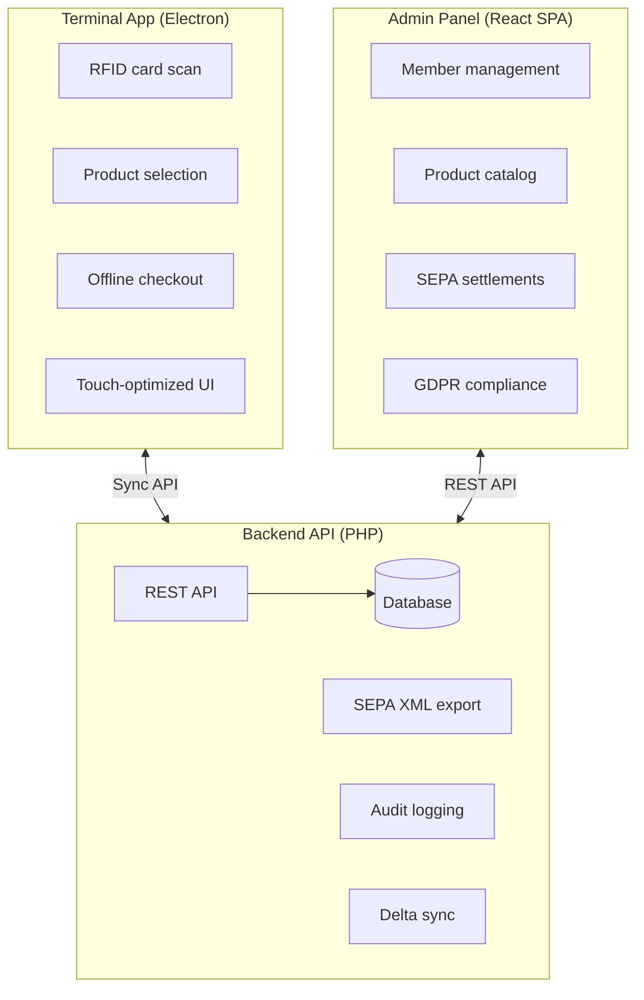

<p align="center">
  
</p>

<h1 align="center">Club Bar</h1>

<p align="center">
  <strong>Open-source POS system for member-managed bars and clubs</strong>
</p>

Club Bar is a complete point-of-sale solution designed for sports clubs, community centers, and member organizations that operate their own bar or canteen. Built with privacy, offline capability, and SEPA settlement in mind.

---

## Why Club Bar?

| Challenge | Solution |
|-----------|----------|
| Unreliable network at venue | **Offline-first** — Terminal works without internet |
| Manual billing is error-prone | **RFID identification** — Tap card, select products, done |
| Spreadsheet accounting chaos | **Automated SEPA settlement** — Generate bank-ready XML |
| GDPR compliance concerns | **Privacy by design** — Anonymization workflows built-in |
| Complex software requirements | **Simple deployment** — PHP backend, SQLite/MySQL |

---

## System Components



---

## Key Features

### For Members
- **Tap & Go** — RFID/NFC card identification
- **Personal tab** — View outstanding balance anytime
- **Multilingual** — UI in member's preferred language

### For Administrators
- **Member management** — CRUD, RFID assignment, GDPR export/anonymization
- **Product catalog** — Categories, multilingual names, prices in cents
- **Settlement workflow** — Preview, finalize, export SEPA XML or CSV
- **Audit trail** — Complete history of all administrative actions

### Technical Highlights
- **Offline-first architecture** — Terminal caches data locally, syncs when connected
- **Immutable transactions** — Append-only ledger, corrections via reverse entries
- **Idempotent sync** — Client-generated UUIDs prevent duplicates
- **SEPA Direct Debit** — pain.008.001.02 XML generation with mandate handling

---

## Documentation

| Document | Description |
|----------|-------------|
| [CLAUDE.md](./CLAUDE.md) | Developer guide and project conventions |
| [ADRs](./adr/) | Architecture Decision Records (22 decisions) |
| [Use Cases](./use-cases/) | Functional requirements by domain |
| [API Specs](./api/) | OpenAPI 3.0 specifications |
| [Data Model](./docs/) | Entity-Relationship diagrams |

---

## Project Status

- [x] Architecture Decision Records (22 ADRs)
- [x] Use Cases (50+ functional requirements)
- [x] OpenAPI Specifications (Admin + Terminal APIs)
- [x] Data Model (Backend + Terminal ERMs)
- [x] UI Prototypes (Terminal + Admin)
- [x] Technology Stack Documentation
- [x] Docker Compose Setup
- [ ] Backend Implementation
- [ ] Terminal Implementation
- [ ] Admin Panel Implementation
- [ ] Test Suite

---

## Quick Start

```bash
# Clone the repository
git clone https://github.com/your-org/clubbar.git
cd clubbar

# Install backend dependencies
cd backend && composer install && cd ..

# Start with Docker
docker compose up -d

# Verify backend is running
curl http://localhost:8080/api/health
```

### Services

| Service | URL | Description |
|---------|-----|-------------|
| `database` | `localhost:3306` | MariaDB 10.11 |
| `backend` | `localhost:8080` | PHP 8.3 |
| `admin-frontend` | `localhost:5173` | React SPA (Apache) |
| `terminal-frontend` | `localhost:5174` | React + Vite dev server |

---

## Technology Stack

| Component | Technologies |
|-----------|--------------|
| **Terminal** | Electron, React, TypeScript, SQLite, Drizzle ORM |
| **Admin Panel** | React, TypeScript, Vite, Zustand, TanStack Table |
| **Backend** | PHP 8.3, MariaDB, PDO |
| **Database** | SQLite (dev), MySQL/MariaDB (production) |
| **Testing** | PHPUnit, Vitest, Playwright |

---

## Contributing

We welcome contributions! Please read:

1. [CLAUDE.md](./CLAUDE.md) — Project conventions and guidelines
2. [ADRs](./adr/) — Understand architectural decisions before proposing changes
3. [Use Cases](./use-cases/) — Reference when implementing features

### Development Approach

- **TDD** — Write tests before implementation ([ADR-0022](./adr/0022-test-strategy-and-automation.md))
- **Milestones** — Planned approach over tackling everything at once
- **ADRs are binding** — Don't change without discussion

---

## License

License to be determined. See [LICENSE](./LICENSE) for details.

---

## Acknowledgments

Built for sports clubs and member organizations that need a simple, privacy-respecting way to manage their bar.

*"Club Bar"* — Your members. Your bar. Your system.
