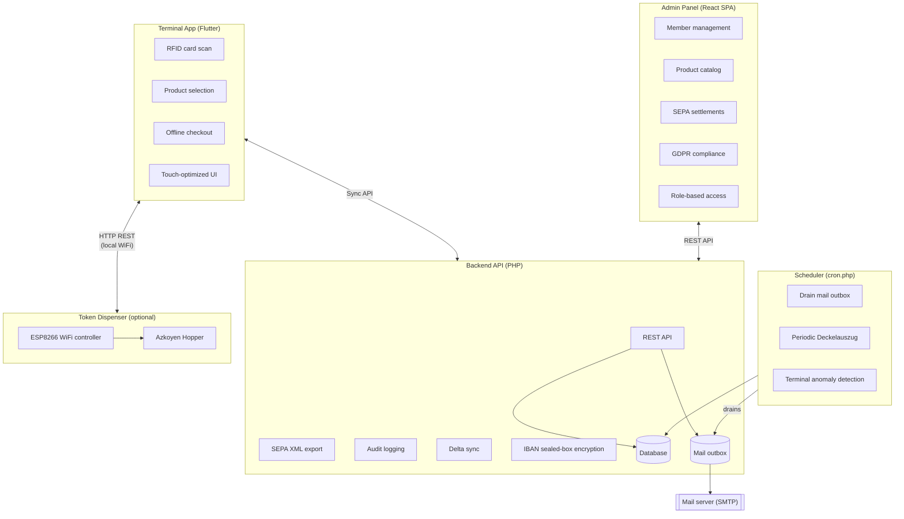

  

<h1 align="center">Club Bar</h1>

  <strong>Open-source POS system for member-managed bars and clubs</strong>

Club Bar is a complete point-of-sale solution designed for sports clubs, community centers, and member organizations that operate their own bar or canteen. Built with privacy, offline capability, and SEPA settlement in mind.

---

## Why Club Bar?

| Challenge | Solution |
|-----------|----------|
| Unreliable network at venue | **Offline-first** — Terminal works without internet |
| Manual billing is error-prone | **RFID identification** — Tap card, select products, done |
| One admin account, one blast radius | **Role-based access** — Treasurer, bar steward, and full admin see only what their office needs |
| Spreadsheet accounting chaos | **Automated SEPA settlement** — Generate bank-ready XML |
| GDPR compliance concerns | **Privacy by design** — Anonymization workflows built-in |
| Expensive POS hardware | **Commodity hardware** — Runs on any tablet or Raspberry Pi with a USB RFID reader |
| Recurring SaaS fees | **Self-hosted & free** — No subscriptions, no vendor lock-in, your data stays yours |
| Complex software requirements | **Simple deployment** — PHP backend, MariaDB |
| Serving alcohol to a minor | **Jugendschutz enforced at the tap** — the terminal refuses, offline, from the member's date of birth |
| A tab that quietly runs away | **Deckel limits** — a club default plus a per-member override, checked at checkout |

---

## System Components

See [Role-Based Admin Access](./docs/role-based-access.md),
[Security Concept](./docs/security-concept.md), and
[Notifications & the Mail Outbox](./docs/notifications-and-mail.md) for how
the pieces above enforce access control, protect data at rest, and deliver
mail reliably.

---

## Demo

### Terminal App

<video src="https://github.com/user-attachments/assets/750e723f-fc46-4e20-a06f-1b9375203ac2" width="100%" autoplay muted loop playsinline></video>

> Terminal walkthrough: RFID card scan, multilingual product browsing (German → English), category selection (Drinks, Snacks, Sauna), shopping cart, and checkout.

### Admin Panel

<video src="https://github.com/user-attachments/assets/d3c429ca-b116-44dc-8490-2c0cb2331de8" width="100%" autoplay muted loop playsinline></video>

> Admin Panel walkthrough: dashboard, member & product management, journal, settlements, SEPA export, reports, settings, and audit log.

---

## Key Features

### For Members
- **Tap & Go** — RFID/NFC card identification
- **Personal tab** — the *Deckel*, viewable at the terminal any time
- **Multilingual** — UI in member's preferred language
- **Periodic Deckelauszug** — a statement of the open tab, emailed on a fixed calendar boundary ([ADR-0039](./adr/0039-periodic-deckel-statement.md))

### For Administrators
- **Member management** — CRUD, RFID assignment, GDPR export/anonymization
- **Role-based access** — `admin`, `Kassenwart` (treasurer), and `Getränkewart` (bar steward) accounts each see only the office they hold. See [Role-Based Admin Access](./docs/role-based-access.md)
- **Product catalog** — Categories, multilingual names, prices in cents, and a per-product minimum age
- **Credit limits** — one club-wide ceiling on a member's Deckel, overridable per member; empty means *follow the club*, `0` means *no ceiling* ([ADR-0047](./adr/0047-configurable-credit-limits.md))
- **Settlement workflow** — Preview, finalize, export SEPA XML or CSV. A settlement records what actually happened to the money: `direct_debit`, `bank_transfer` (the member already paid) or `write_off`
- **Corrections are Stornos** — a booking is never edited or deleted; it is negated by a storno that names it, and no money amount is ever typed in anywhere ([ADR-0028](./adr/0028-legal-constraints-on-money-handling.md))
- **Instance branding** — club name, logo and colours, configured per installation ([ADR-0034](./adr/0034-instance-branding-configuration.md))
- **Dashboard & reports** — live KPIs, terminal status and system alerts; revenue by period, member ranking and terminal activity, each exportable as CSV
- **Journal** — the full transaction ledger, searchable and filterable, with storno from the row
- **Excluded from collection** — a standing view of who SEPA cannot collect from (credit balance, collection hold after a bank return, or no mandate) so the Kassenwart can contact them directly
- **Audit trail** — Complete history of all administrative actions
- **Reliable email notifications** — SEPA pre-notifications, cancellations, the periodic Deckelauszug, and security alerts, queued and retried so a slow host or a timed-out request never loses one. See [Notifications & the Mail Outbox](./docs/notifications-and-mail.md)

### Technical Highlights
- **Offline-first architecture** — Terminal caches data locally, syncs when connected
- **Immutable transactions** — Append-only ledger; corrections are stornos, never edits ([ADR-0004](./adr/0004-immutable-transaction-storage.md))
- **Jugendschutz offline** — the age limit lives on the product, the birth date on the member, and the refusal happens at checkout with no network ([ADR-0045](./adr/0045-age-restricted-products.md))
- **Idempotent sync** — Client-generated UUIDs prevent duplicates
- **SEPA Direct Debit** — pain.008.001.08 XML generation with mandate handling
- **Tiered admin roles** — Default-deny, fail-closed authorization enforced on every backend route ([ADR-0044](./adr/0044-tiered-admin-roles.md))

### Optional: Token Dispenser Integration

Club Bar supports an optional hardware integration with a physical token dispenser for venues that use coin-operated equipment (saunas, laundromats, arcades). The terminal can trigger token dispensing as part of the checkout flow — members tap their RFID card, select a token product, and tokens are dispensed automatically.

**How it works:**
- An **[ESP8266 microcontroller](https://github.com/dgloeckner/remote-token-dispenser)** (Wemos D1 Mini) drives an **Azkoyen Hopper U-II** industrial token dispenser over GPIO with optocoupler isolation
- The terminal communicates with the ESP8266 via **HTTP REST over local WiFi** — no cloud dependency
- **Dispense-first, pay-after** model — tokens are physically dispensed before the transaction is recorded, eliminating complex refund scenarios
- **Crash-resilient** — the ESP8266 persists state to flash memory; survives power loss mid-transaction with exact token counts
- **Idempotent** — client-controlled transaction IDs prevent double-dispensing on retries
- **Jam detection** — watchdog timer monitors token pulses and halts on mechanical issues

Products that require dispensing are flagged with `requires_dispenser` in the product catalog. The dispenser is configured entirely on the terminal side via `config.json` — no backend changes needed. See the [Terminal Installation Guide](./terminal-frontend/INSTALL.md#7-optional-token-dispenser) for deployment details and the [remote-token-dispenser](https://github.com/dgloeckner/remote-token-dispenser) repository for firmware, hardware schematics, and a Go-based mock for development.

---

## Documentation

| Document | Description |
|----------|-------------|
| [CLAUDE.md](./CLAUDE.md) | Developer guide and project conventions |
| [ADRs](./adr/) | Architecture Decision Records (47 decisions) |
| [Use Cases](./use-cases/README.md) | Functional requirements by domain (67 use cases with status) |
| [API Specs](./api/) | OpenAPI 3.0 specifications |
| [Data Model](./docs/) | Entity-Relationship diagrams |
| [Role-Based Admin Access](./docs/role-based-access.md) | `admin` / `Kassenwart` / `Getränkewart` roles, authorization flow, diagrams |
| [Security Concept](./docs/security-concept.md) | Defense-in-depth overview — transport, auth, authorization, encryption at rest, monitoring |
| [Backups](./docs/backup.md) | Encrypted, off-site backups with no complex dependencies — nightly dump, sealed-box encryption, key custody, restore |
| [Notifications & the Mail Outbox](./docs/notifications-and-mail.md) | Reliable email delivery on shared hosting — queueing, retries, the periodic Deckelauszug |
| [Deployment Guide](./docs/deployment.md) | Production deployment, backups, and security |
| [Terminal Install](./terminal-frontend/INSTALL.md) | Terminal app deployment on Raspberry Pi |
| [Token Dispenser](https://github.com/dgloeckner/remote-token-dispenser) | Optional hardware integration — ESP8266 firmware, schematics, mock server |

---

## Deployment

For production deployment instructions, see the **[Deployment Guide](./docs/deployment.md)**. It covers:

- **Self-hosted package** -- upload ZIP to shared hosting, run the graphical web installer
- **Security hardening** -- HTTPS, database access
- **Automated encrypted backups** -- see [Backups](./docs/backup.md): a nightly job dumps, seals, and pushes the database off the host, with no server-side decryption key
- **Monitoring** -- health endpoint polling and application logs
- **Upgrading and rollback** -- step-by-step procedures

For terminal app deployment on Raspberry Pi or Linux, see the **[Terminal Installation Guide](./terminal-frontend/INSTALL.md)**.

---

## Security

Club Bar layers transport security, strong authentication, role-based
authorization, encryption at rest, and audit logging / anomaly detection —
no single layer is trusted to carry the whole system.

| Layer | Mechanism |
|---|---|
| Transport | HTTPS required in production, HSTS, CSP |
| Authentication | Mandatory TOTP 2FA for admins; 256-bit bearer tokens for terminals |
| Authorization | Role-based access (`admin` / `Kassenwart` / `Getränkewart`), fail-closed on every request |
| Data at rest | IBANs encrypted with a libsodium sealed box — the server holds only the public key, never a decryptable copy |
| Backups | Nightly database dumps sealed with the same sealed-box construction to a set of recipient keys the server cannot decrypt — see [Backups](./docs/backup.md) |
| Monitoring | Append-only audit log, terminal credential anomaly detection, an announced (never silent) token-issuance flow |

See the **[Security Concept](./docs/security-concept.md)** for the full
picture with diagrams — including admin/terminal authentication details,
2FA recovery, and the built-in security self-check — and the
**[Admin Lockout Runbook](./docs/runbook-admin-lockout.md)** if an admin
account becomes unusable.

---

## Development Setup

For local development using Docker Compose, see **[DEV_SETUP.md](./DEV_SETUP.md)**.

---

## Technology Stack

| Component | Technologies |
|-----------|--------------|
| **Terminal** | Flutter, Dart, Drift (SQLite), Provider |
| **Admin Panel** | React, TypeScript, Vite, Emotion, Recharts |
| **Backend** | PHP 8.3, MariaDB, PDO |
| **Testing** | PHPUnit, Vitest, Playwright, Flutter integration_test |

---

## Contributing

We welcome contributions! Please read:

1. [CLAUDE.md](./CLAUDE.md) — Project conventions and guidelines
2. [ADRs](./adr/) — Understand architectural decisions before proposing changes
3. [Use Cases](./use-cases/) — Reference when implementing features

### Development Approach

- **TDD** — Write tests before implementation ([ADR-0022](./adr/0022-test-strategy-and-automation.md))
- **Milestones** — Planned approach over tackling everything at once
- **ADRs are binding** — Don't change without discussion

---

## License

Apache-2.0. See [LICENSE](./LICENSE) for details.

---

## Acknowledgments

Built for sports clubs and member organizations that need a simple, privacy-respecting way to manage their bar.

*"Club Bar"* — Your members. Your bar. Your system.
