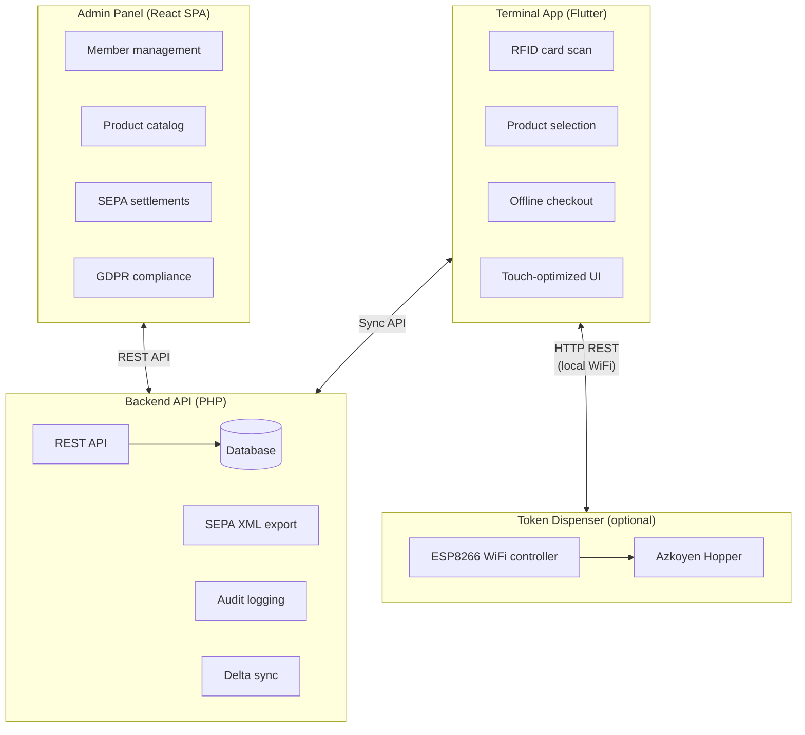

  

<h1 align="center">Club Bar</h1>

  <strong>Open-source POS system for member-managed bars and clubs</strong>

Club Bar is a complete point-of-sale solution designed for sports clubs, community centers, and member organizations that operate their own bar or canteen. Built with privacy, offline capability, and SEPA settlement in mind.

---

## Why Club Bar?

| Challenge | Solution |
|-----------|----------|
| Unreliable network at venue | **Offline-first** — Terminal works without internet |
| Manual billing is error-prone | **RFID identification** — Tap card, select products, done |
| Tedious member onboarding | **Scan & extract** — Upload a signed SEPA form, AI reads the fields, admin just confirms |
| Spreadsheet accounting chaos | **Automated SEPA settlement** — Generate bank-ready XML |
| GDPR compliance concerns | **Privacy by design** — Anonymization workflows built-in |
| Expensive POS hardware | **Commodity hardware** — Runs on any tablet or Raspberry Pi with a USB RFID reader |
| Recurring SaaS fees | **Self-hosted & free** — No subscriptions, no vendor lock-in, your data stays yours |
| Complex software requirements | **Simple deployment** — PHP backend, SQLite/MySQL |

---

## System Components

---

## Demo

### Terminal App

<video src="https://github.com/user-attachments/assets/750e723f-fc46-4e20-a06f-1b9375203ac2" width="100%" autoplay muted loop playsinline></video>

> Terminal walkthrough: RFID card scan, multilingual product browsing (German → English), category selection (Drinks, Snacks, Sauna), shopping cart, and checkout.

### Admin Panel

<video src="https://github.com/user-attachments/assets/d3c429ca-b116-44dc-8490-2c0cb2331de8" width="100%" autoplay muted loop playsinline></video>

> Admin Panel walkthrough: dashboard, member & product management, journal, settlements, SEPA export, reports, settings, and audit log.

---

## Key Features

### For Members
- **Tap & Go** — RFID/NFC card identification
- **Personal tab** — View outstanding balance anytime
- **Multilingual** — UI in member's preferred language

### For Administrators
- **Member management** — CRUD, RFID assignment, GDPR export/anonymization
- **Scan-to-onboard** — Upload a signed SEPA mandate form and let AI extract member data (name, IBAN, mandate date) automatically. Supports **Anthropic (Claude)** and **OpenAI (GPT-4o)** as LLM providers — just set an API key in `.env` and go
- **Product catalog** — Categories, multilingual names, prices in cents
- **Settlement workflow** — Preview, finalize, export SEPA XML or CSV
- **Audit trail** — Complete history of all administrative actions

### Technical Highlights
- **Offline-first architecture** — Terminal caches data locally, syncs when connected
- **Immutable transactions** — Append-only ledger, corrections via reverse entries
- **Idempotent sync** — Client-generated UUIDs prevent duplicates
- **SEPA Direct Debit** — pain.008.001.02 XML generation with mandate handling
- **LLM-powered data extraction** — Scanned SEPA mandate forms are read by vision AI (Anthropic Claude or OpenAI GPT-4o) to extract IBAN, name, and mandate date with per-field confidence scores

### Optional: Token Dispenser Integration

Club Bar supports an optional hardware integration with a physical token dispenser for venues that use coin-operated equipment (saunas, laundromats, arcades). The terminal can trigger token dispensing as part of the checkout flow — members tap their RFID card, select a token product, and tokens are dispensed automatically.

**How it works:**
- An **[ESP8266 microcontroller](https://github.com/dgloeckner/remote-token-dispenser)** (Wemos D1 Mini) drives an **Azkoyen Hopper U-II** industrial token dispenser over GPIO with optocoupler isolation
- The terminal communicates with the ESP8266 via **HTTP REST over local WiFi** — no cloud dependency
- **Dispense-first, pay-after** model — tokens are physically dispensed before the transaction is recorded, eliminating complex refund scenarios
- **Crash-resilient** — the ESP8266 persists state to flash memory; survives power loss mid-transaction with exact token counts
- **Idempotent** — client-controlled transaction IDs prevent double-dispensing on retries
- **Jam detection** — watchdog timer monitors token pulses and halts on mechanical issues

Products that require dispensing are flagged with `requires_dispenser` in the product catalog. The dispenser is configured entirely on the terminal side via `config.json` — no backend changes needed. See the [Terminal Installation Guide](./terminal-frontend/INSTALL.md#7-optional-token-dispenser) for deployment details and the [remote-token-dispenser](https://github.com/dgloeckner/remote-token-dispenser) repository for firmware, hardware schematics, and a Go-based mock for development.

---

## Documentation

| Document | Description |
|----------|-------------|
| [CLAUDE.md](./CLAUDE.md) | Developer guide and project conventions |
| [ADRs](./adr/) | Architecture Decision Records (22 decisions) |
| [Use Cases](./use-cases/README.md) | Functional requirements by domain (64 use cases with status) |
| [API Specs](./api/) | OpenAPI 3.0 specifications |
| [Data Model](./docs/) | Entity-Relationship diagrams |
| [Deployment Guide](./docs/deployment.md) | Production deployment, backups, and security |
| [Terminal Install](./terminal-frontend/INSTALL.md) | Terminal app deployment on Raspberry Pi |
| [Token Dispenser](https://github.com/dgloeckner/remote-token-dispenser) | Optional hardware integration — ESP8266 firmware, schematics, mock server |

---

## Deployment

For production deployment instructions, see the **[Deployment Guide](./docs/deployment.md)**. It covers:

- **Self-hosted package** -- upload ZIP to shared hosting, run the graphical web installer
- **Security hardening** -- HTTPS, database access
- **Database backups** -- automated daily backups with 30-day retention
- **Monitoring** -- health endpoint polling and application logs
- **Upgrading and rollback** -- step-by-step procedures

For terminal app deployment on Raspberry Pi or Linux, see the **[Terminal Installation Guide](./terminal-frontend/INSTALL.md)**.

---

## Security

### Admin Panel

- **Mandatory two-factor authentication (TOTP)** — Every admin account must enroll a TOTP authenticator app on first login. 2FA cannot be bypassed.
- **Back up your TOTP secret** — During enrollment, a manual backup key is shown below the QR code. Store it in a password manager. Without it, losing access to your authenticator app requires direct database recovery.
- **Use HTTPS in production** — Admin credentials and session cookies must be transmitted over TLS. See the [Deployment Guide](./docs/deployment.md) for certificate setup.
- **Sessions expire** — Admin sessions time out after 2 hours of inactivity.

### Terminal

- **Bearer token authentication** — Each terminal authenticates with a unique, revocable API token. Tokens can be rotated from the Admin Panel without affecting other terminals.
- **Network isolation** — The terminal and the optional token dispenser communicate over local WiFi only; no internet access is required after initial setup.
- **Physical security** — RFID cards are member identifiers. Keep the terminal in a supervised area — an unattended, unlocked terminal allows transactions on any tapped card.

### Recommended Authenticator Apps

| App | Platform | Notes |
|-----|----------|-------|
| [Aegis](https://getaegis.app/) | Android | Open source, encrypted local backups |
| [Raivo OTP](https://raivo-otp.com/) | iOS | Open source, iCloud backup |
| [Google Authenticator](https://support.google.com/accounts/answer/1066447) | Android & iOS | Simple, widely used |
| [Authy](https://authy.com/) | Android & iOS | Multi-device sync |

---

## Development Setup

For local development using Docker Compose, see **[DEV_SETUP.md](./DEV_SETUP.md)**.

---

## Technology Stack

| Component | Technologies |
|-----------|--------------|
| **Terminal** | Flutter, Dart, Drift (SQLite), Provider |
| **Admin Panel** | React, TypeScript, Vite, Emotion, Recharts |
| **Backend** | PHP 8.3, MariaDB, PDO |
| **Testing** | PHPUnit, Vitest, Playwright, Flutter integration_test |

---

## Contributing

We welcome contributions! Please read:

1. [CLAUDE.md](./CLAUDE.md) — Project conventions and guidelines
2. [ADRs](./adr/) — Understand architectural decisions before proposing changes
3. [Use Cases](./use-cases/) — Reference when implementing features

### Development Approach

- **TDD** — Write tests before implementation ([ADR-0022](./adr/0022-test-strategy-and-automation.md))
- **Milestones** — Planned approach over tackling everything at once
- **ADRs are binding** — Don't change without discussion

---

## License

Apache-2.0. See [LICENSE](./LICENSE) for details.

---

## Acknowledgments

Built for sports clubs and member organizations that need a simple, privacy-respecting way to manage their bar.

*"Club Bar"* — Your members. Your bar. Your system.
