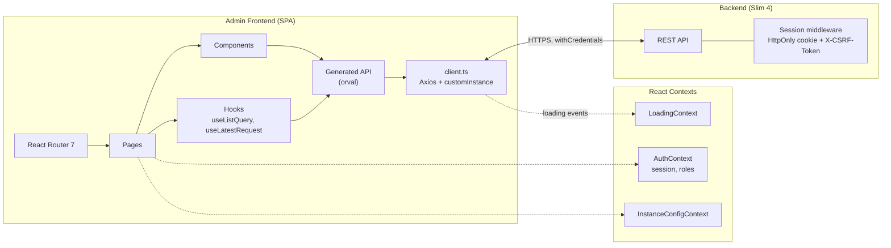
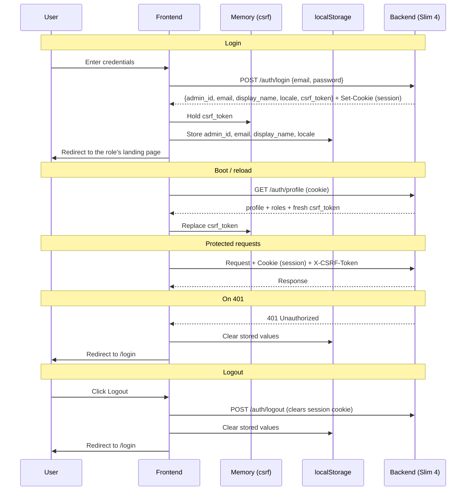

# Admin Frontend – Technology Stack and Architecture

This file describes the stack that is installed. Every library named below
appears in `package.json`; nothing in `package.json` is left unmentioned. When
a dependency is added or removed, this file changes in the same commit — the
convention in `CLAUDE.md` ("do not introduce new frameworks or libraries
without updating the spec") is only worth anything if the document can be
trusted as an inventory.

## Technologies

| Layer | Technology | Responsibility |
|-------|------------|----------------|
| **UI Framework** | React 19 | Components, rendering, state |
| **Language** | TypeScript 5.9 | End-to-end type safety |
| **Routing** | React Router 7 (`react-router-dom`) | Client-side navigation |
| **State Management** | React hooks + three contexts | No state library — see below |
| **List state** | `useListQuery` | Page, page size, sort, filters, search, debounce, request abort (`patterns/table-implementation.md`) |
| **Request lifecycle** | `useLatestRequest` | Cancels superseded requests, guards stale responses (`patterns/data-fetching.md`) |
| **HTTP Client** | Axios 1 | Sole transport, reached through the `customInstance` orval mutator |
| **API Code Gen** | orval 8 | Typed functions + types generated from `api/admin.yaml` |
| **Auth** | HttpOnly session cookie + `X-CSRF-Token` | CSRF token in memory only (#109) |
| **Styling** | Inline styles + `src/styles/design-system.ts` | No CSS framework, no CSS-in-JS runtime |
| **Charts** | Recharts 3 | One page only — `ReportsPage`, lazy-loaded (#655) |
| **i18n** | i18next 26 + react-i18next 17 | UI strings, `de`/`en` |
| **Build** | Vite 8 | Dev server, bundling |
| **Unit tests** | Vitest 4 (+ jsdom, @testing-library/react) | `src/utils/**` and `src/hooks/**` (#166) |
| **E2E tests** | Playwright | Pages and interactive components, from `/e2etests` |
| **Lint/format** | ESLint 8, Prettier 3 | `npm run lint`, `npm run format` |

### Things this stack deliberately does not use

Named here because their absence is a decision, and because every one of them
appeared in an earlier version of this file:

| Not used | What is used instead |
|----------|----------------------|
| A state library | React hooks; three contexts (`AuthContext`, `LoadingContext`, `InstanceConfigContext`) for the cross-cutting values |
| A table library | Hand-rolled tables over `useListQuery` and the shared controls — `patterns/table-implementation.md` |
| A form/validation library | Controlled inputs; the backend is the validator, and `utils/apiErrors.ts` renders what it returns |
| A CSS framework | Inline styles against the design-system tokens |
| `<input type="date">` | The shared date field — typed entry, popover on desktop, bottom sheet on mobile (ADR-0045, `patterns/date-field.md`) |

---

## Architecture Layers

| Layer | Responsibility |
|-------|----------------|
| **API Generated** (`src/api/generated/`) | orval-generated functions + TS interfaces from `api/admin.yaml`. Never edited by hand |
| **API Client** (`src/api/client.ts`) | The one Axios instance: CSRF header, loading pub/sub, 401 handling, `downloadFile`/`downloadBlob`, and the `customInstance` mutator every generated call goes through |
| **Auth Session** (`src/auth/session.ts`) | Side effects around the generated auth calls — CSRF handoff, locale switch, and the non-secret profile values kept in `localStorage` |
| **Contexts** (`src/context/`) | `AuthContext` (session + roles), `LoadingContext` (global indicator), `InstanceConfigContext` (club-level settings) |
| **Hooks** (`src/hooks/`) | The reusable logic seams — `useListQuery`, `useLatestRequest`, `useBreakpoint`, `useFormatters` and friends. Unit-tested to ~100% |
| **Utils** (`src/utils/`) | Pure functions: role rules (`adminRoles.ts`, ADR-0044), date handling, API error mapping. Unit-tested |
| **Routes** (`src/pages/`) | One page component per route, wired in `src/App.tsx` |
| **Components** (`src/components/`) | Reusable UI — see `patterns/components.md` before writing a new one |
| **Layouts** (`src/components/layout/`) | `MainLayout`: sidebar, header, loading indicator |

---

## Architecture Diagram



---

## Components in Detail

### 1. API Client (Axios) — `src/api/client.ts`

| Feature | Description |
|---------|-------------|
| **Base URL** | `/api` (relative, proxied to the backend) |
| **Credentials** | `withCredentials: true` — the session cookie is the auth |
| **Interceptor (Request)** | Attaches `X-CSRF-Token` to mutating requests |
| **CSRF storage** | In memory only (#109). It belongs to the PHP session, not to storage that outlives it and stays readable to any script that achieves XSS. The backend reissues it on every `/auth/profile` response |
| **Interceptor (Response)** | 401 → clear stored profile values + redirect to `/login` |
| **Loading State** | Pub/sub `onLoadingStateChange()`, consumed by `LoadingContext` and rendered by `LoadingIndicator` |
| **Downloads** | `downloadFile(url, fallback)` for a URL (honours `Content-Disposition`), `downloadBlob(blob, filename)` when a generated call already returned the blob. Pages never build `<a download>` elements |
| **orval Mutator** | `customInstance<T>()`, used by every generated function |

### 2. Generated API Client — `src/api/generated/`

Generated by orval 8 from `api/admin.yaml` in `tags-split` mode, with
`client: 'axios'` and the mutator above.

| Concept | Description |
|---------|-------------|
| **Factory pattern** | `getMembers()`, `getProducts()`, … return objects with typed methods |
| **Type exports** | All request/response types re-exported from `src/api/generated/index.ts` |
| **Cancellation** | Every generated call takes a `signal`; passing one is required — see `patterns/data-fetching.md` |
| **Regenerate** | `npm run generate` (runs `orval --config orval.config.ts`); also runs automatically as a `postinstall` hook on every `npm install`/`npm ci` |
| **Single source of truth** | The OAS spec `api/admin.yaml` — edit the spec, regenerate, never edit generated files |
| **Not committed** | `src/api/generated/` is git-ignored (matches `terminal-frontend/lib/generated/`), so a stale committed client can never disagree with the spec (#725) |

### 3. Charts (Recharts) — `src/pages/ReportsPage.tsx`

Recharts is imported in exactly one file. It arrives with a Redux stack of its
own and a dozen d3 packages — about 103 KB gzipped — so the route is loaded
with `React.lazy()` and rendered inside a `<Suspense>` boundary. The chunk is
fetched when someone opens Reports and never on any other page (#655).

Two charts, both `BarChart`, both from the `recharts` primitives
(`BarChart`, `Bar`, `XAxis`, `YAxis`, `Tooltip`, `CartesianGrid`,
`ResponsiveContainer`):

| Chart | Data |
|-------|------|
| **Revenue or consumption by group** | Whatever `groupBy` selects — category, product, member, day, week, month or year |
| **Transactions by hour** | Hourly distribution over the selected range |

---

## API Code Generation (orval)

```bash
# Regenerate the typed API client from api/admin.yaml
npm run generate
```

orval reads `api/admin.yaml` and produces:

- `src/api/generated/{tag}/{tag}.ts` — factory functions per OAS tag
- `src/api/generated/*.ts` — TypeScript interfaces for all schemas
- `src/api/generated/index.ts` — barrel re-export of all types

**Important**: never edit files in `src/api/generated/` — they are overwritten
on the next `npm run generate`, and the directory itself is git-ignored:
`npm install`/`npm ci` regenerate it via `postinstall`, so there is nothing to
commit and nothing that can drift from `api/admin.yaml` unnoticed.

---

## Auth Flow

The session lives in an HttpOnly cookie the frontend cannot read. What
`localStorage` holds is the non-secret profile used to paint the header
before the first request returns; the CSRF token is not among it, and the
roles are not either — they are read back from the server on every boot so a
role revoked mid-session is gone the next time the panel starts (ADR-0044).



---

## Deployment

The admin frontend is a static SPA, built for shared Apache hosting.

| Option | Description |
|--------|-------------|
| **Apache (mass hoster)** | Build → upload `dist/` to the web root |
| **With the backend** | `scripts/build-package.sh` assembles the SPA and the Slim backend into one `dist/package/` tree |
| **Docker** | The `admin-frontend` service in `docker-compose.yml` serves the build for local development and E2E |

```bash
# Build
npm run build

# Output in dist/ → copy to the Apache document root
```

**SPA routing**: configure Apache `FallbackResource /index.html`, or `.htaccess`
rewrite rules, so every path serves `index.html`.

---

## Difference from Terminal Frontend

| Aspect | Terminal | Admin |
|--------|----------|-------|
| **Stack** | Flutter (Dart), see `terminal-frontend/` | React SPA in the browser |
| **Database** | Local SQLite via drift | None — the REST API is the store |
| **Auth** | Terminal token | Admin session cookie (HttpOnly) + CSRF |
| **Target Device** | Raspberry Pi touch terminal | Desktop/laptop, with a mobile layout |
| **Offline** | Yes — offline-first, syncs when connected | No |
