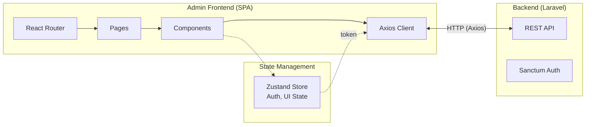
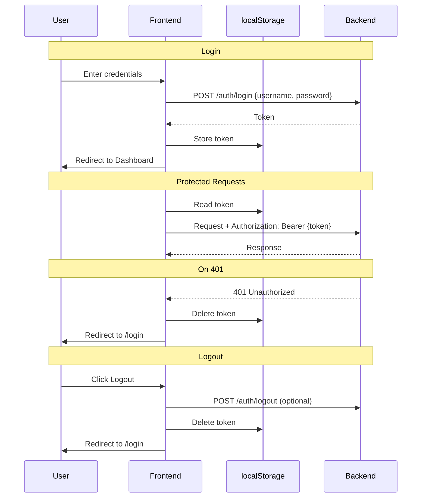

# Admin Frontend – Technology Stack and Architecture

## Technologies

| Layer | Technology | Responsibility |
|-------|------------|----------------|
| **UI Framework** | React 18 | Components, State, Rendering |
| **Language** | TypeScript | End-to-end type safety |
| **Routing** | React Router 6 | Client-side navigation |
| **State Management** | Zustand | Client state (auth, UI preferences) |
| **HTTP Client** | Axios | API communication |
| **Auth** | Token (Bearer) | Sanctum-compatible |
| **Styling** | CSS-in-JS (inline styles) | Custom design system, touch-optimized dark theme |
| **Charts** | Recharts | Revenue reports, Statistics |
| **Tables** | TanStack Table | Sorting, Filtering, Pagination |
| **Forms** | React Hook Form + Zod | Validation |
| **Build** | Vite | Dev server, Bundling |

---

## Architecture Layers

| Layer | Responsibility |
|-------|----------------|
| **API Types** | Generated from OpenAPI |
| **API Client** | Axios instance with Auth header |
| **Stores** | Zustand stores (auth, UI state) |
| **Routes** | Page components |
| **Components** | Reusable UI |
| **Layouts** | Sidebar, Header |

---

## Architecture Diagram



---

## Components in Detail

### 1. API Client (Axios)

| Feature | Description |
|---------|-------------|
| **Base URL** | From environment |
| **Interceptor (Request)** | Attach Bearer token |
| **Interceptor (Response)** | 401 → Logout |
| **Error Handling** | Toast notifications |

### 2. Charts (Recharts)

| Chart | Usage | Type |
|-------|-------|------|
| **Revenue/Month** | Dashboard, Reports | BarChart |
| **Revenue/Category** | Reports | PieChart |
| **Transactions/Day** | Dashboard | LineChart |
| **Top Products** | Reports | BarChart (horizontal) |

---

## API Types from OpenAPI

```bash
# Generate types from backend OpenAPI spec
npx openapi-typescript ../backend/openapi/api.yaml -o src/api/types.ts
```

Result: Typed API interfaces automatically synchronized with backend.

---

## Auth Flow



---

## Deployment

| Option | Description |
|--------|-------------|
| **Static Hosting** | Build → nginx / Apache / S3 |
| **With Backend** | Deploy to Laravel `public/` |
| **Docker** | Multi-stage build |

```bash
# Build
npm run build

# Output in dist/ → copy to web server
```

---

## Difference from Terminal Frontend

| Aspect | Terminal | Admin |
|--------|----------|-------|
| **Runtime** | Electron | Browser (SPA) |
| **Database** | SQLite local | REST API |
| **Auth** | None (local) | Token (Sanctum) |
| **Target Device** | Raspberry Pi Touch | Desktop/Laptop |
| **Offline** | Yes | No |
