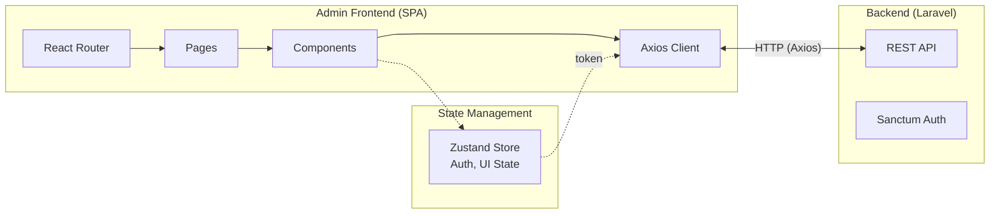
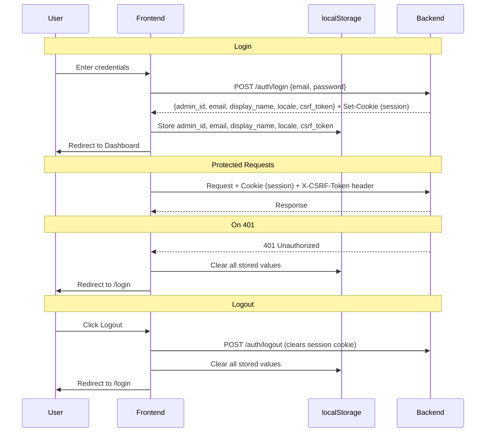

# Admin Frontend – Technology Stack and Architecture

## Technologies

| Layer | Technology | Responsibility |
|-------|------------|----------------|
| **UI Framework** | React 18 | Components, State, Rendering |
| **Language** | TypeScript | End-to-end type safety |
| **Routing** | React Router 6 | Client-side navigation |
| **State Management** | Zustand | Client state (auth, UI preferences) |
| **HTTP Client** | Axios | API communication |
| **API Code Gen** | orval v8 | Generated typed functions + TypeScript types from `api/admin.yaml` |
| **Auth** | Cookie (session) | HttpOnly secure cookie; CSRF token via `X-CSRF-Token` header |
| **Styling** | CSS-in-JS (inline styles) | Custom design system, touch-optimized dark theme |
| **Charts** | Recharts | Revenue reports, Statistics |
| **Tables** | TanStack Table | Sorting, Filtering, Pagination |
| **Forms** | React Hook Form + Zod | Validation |
| **Build** | Vite | Dev server, Bundling |

---

## Architecture Layers

| Layer | Responsibility |
|-------|----------------|
| **API Generated** | orval-generated typed functions + TS interfaces from `api/admin.yaml` (`src/api/generated/`) |
| **API Client** | Axios instance with CSRF header, loading state, 401 redirect (`src/api/client.ts`) |
| **Auth Session** | localStorage-backed session helpers wrapping generated auth functions (`src/auth/session.ts`) |
| **Stores** | Zustand stores (auth, UI state) |
| **Routes** | Page components |
| **Components** | Reusable UI |
| **Layouts** | Sidebar, Header |

---

## Architecture Diagram



---

## Components in Detail

### 1. API Client (Axios) — `src/api/client.ts`

| Feature | Description |
|---------|-------------|
| **Base URL** | `/api` (relative, proxied to backend) |
| **Interceptor (Request)** | Attach `X-CSRF-Token` header for mutating requests |
| **Interceptor (Response)** | 401 → clear localStorage + redirect to `/login` |
| **Loading State** | Pub/sub `onLoadingStateChange()` for global loading indicator |
| **File Download** | `downloadFile(url, filename)` helper for blob downloads |
| **orval Mutator** | `customInstance<T>()` used by all generated functions |

### 2. Generated API Client — `src/api/generated/`

Generated by orval v8 from `api/admin.yaml` using `tags-split` mode.

| Concept | Description |
|---------|-------------|
| **Factory pattern** | `getMembers()`, `getProducts()`, etc. return objects with typed methods |
| **Type exports** | All request/response types re-exported from `src/api/generated/index.ts` |
| **Regenerate** | `npm run generate` (runs `orval --config orval.config.ts`) |
| **Single source of truth** | OAS spec `api/admin.yaml` — edit the spec, regenerate, never edit generated files |

### 2. Charts (Recharts)

| Chart | Usage | Type |
|-------|-------|------|
| **Revenue/Month** | Dashboard, Reports | BarChart |
| **Revenue/Category** | Reports | PieChart |
| **Transactions/Day** | Dashboard | LineChart |
| **Top Products** | Reports | BarChart (horizontal) |

---

## API Code Generation (orval)

```bash
# Regenerate typed API client from api/admin.yaml
npm run generate
```

orval reads `api/admin.yaml` and produces:
- `src/api/generated/{tag}/{tag}.ts` — factory functions per OAS tag
- `src/api/generated/*.ts` — TypeScript interfaces for all schemas
- `src/api/generated/index.ts` — barrel re-export of all types

**Important**: Never edit files in `src/api/generated/` — they are overwritten on next `npm run generate`.

---

## Auth Flow



---

## Deployment

The admin frontend is a static SPA, designed for Apache hosting (mass hoster compatible).

| Option | Description |
|--------|-------------|
| **Apache (Mass Hoster)** | Build → upload `dist/` to web root |
| **With Backend** | Deploy to Laravel `public/` |
| **Docker** | Multi-stage build (Node → Apache) |

```bash
# Build
npm run build

# Output in dist/ → copy to Apache document root
```

**SPA Routing**: Configure Apache `FallbackResource /index.html` or `.htaccess` rewrite rules to route all paths to `index.html`.

---

## Difference from Terminal Frontend

| Aspect | Terminal | Admin |
|--------|----------|-------|
| **Runtime** | Electron | Browser (SPA) |
| **Database** | SQLite local | REST API |
| **Auth** | None (local) | Cookie-based session (HttpOnly) |
| **Target Device** | Raspberry Pi Touch | Desktop/Laptop |
| **Offline** | Yes | No |
