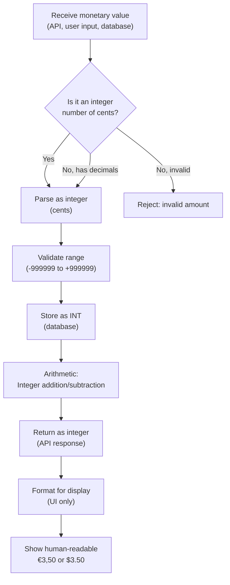

# ADR-0001: Store Monetary Values as Integer Cents

**Status**: Accepted

**Date**: 2025-01-23

**Deciders**: Architecture Team

---

## Context

The Ruderbar system manages financial transactions for member accounts, product purchases, and settlements. Monetary values must be stored, transmitted, and calculated reliably across multiple components (terminal, backend, database, API).

Key concerns:
- **Precision**: Currency calculations require exact decimal representation (e.g., €3.50, not 3.5000000001)
- **Reliability**: Floating-point arithmetic in databases and programming languages introduces rounding errors
- **Consistency**: Data must be consistent across terminal (SQLite), backend (PHP/MariaDB), and API payloads
- **Simplicity**: Development teams should not need specialized decimal libraries or complex conversion logic
- **Compatibility**: Solution must work across JavaScript/Node.js (terminal), PHP (backend), and JSON (API)

## Decision

**All monetary values are stored and transmitted as integer cents (smallest currency unit).**

Examples:
- €3.50 → `350` cents
- €0.99 → `99` cents
- €100.00 → `10000` cents
- Negative amounts (refunds): `-350` cents

### Storage and Arithmetic

**Database Schema**: All monetary columns use `INT` type (never `DECIMAL`, `FLOAT`, or `VARCHAR`)

| Table | Column | Type | Example |
|-------|--------|------|---------|
| transactions | amount_cents | INT | 350 (€3.50) |
| products | price_cents | INT | 350 (€3.50) |
| settlements | amount_cents | INT | -500 (−€5.00) |

**Arithmetic**: Integer addition/subtraction is exact; no rounding errors

**Pseudocode**:
```
// Receiving from API
amount_cents = parseInt(request.amount_cents)
validate: -999999 <= amount_cents <= 999999

// Calculating total
total_cents = 0
foreach transaction in batch:
  total_cents += transaction.amount_cents  // Safe integer arithmetic

// Returning to API
response.amount_cents = total_cents         // Sent as integer
```

**Display (UI only)**: Format cents for human reading

```
formatCents(350) = "€3,50" (German locale)
formatCents(350) = "$3.50" (US locale)
```

### Monetary Value Decision Flow



### Validation Rules

- **Range**: -999,999 to +999,999 cents (−€9,999.99 to +€9,999.99)
- **Type**: Integer only; reject decimal input (3.5 → invalid)
- **Required**: No null/undefined; all monetary fields mandatory
- **Display**: Always format before showing to user (€3.50, never raw 350)

---

## Consequences

### Positive

✅ **Eliminates floating-point errors**: No rounding surprises in calculations
✅ **Simple arithmetic**: Integer addition/subtraction is exact across all platforms
✅ **Database efficiency**: `INT` column is smaller and faster than `DECIMAL` or `VARCHAR`
✅ **JSON compatibility**: Integers serialize/deserialize reliably in JSON; no precision loss
✅ **Cross-platform consistency**: PHP, JavaScript, SQLite, MariaDB all handle integers identically
✅ **Easy auditing**: Audit logs show exact integer values (no "rounded" ambiguity)
✅ **No library dependencies**: No need for BigDecimal, Decimal.js, or bcmath (reduces complexity)
✅ **Clear validation**: Invalid amounts are immediately obvious (3.5 is rejected; 350 accepted)

### Negative

❌ **Display complexity**: Developers must remember to format cents for UI (€3.50, not 350)
❌ **API contract**: All API consumers must convert cents to/from display format
❌ **Currency conversion**: Multi-currency support (if needed) becomes more complex (no inherent currency info)
❌ **Rounding on import**: External data (CSV, bank transfers) must be converted to cents with rounding policy defined

### Mitigations

1. **Formatting helpers**: Provide utility functions in all codebases
   - PHP: `formatCents($cents, $locale)`
   - JavaScript: `formatCents(cents, locale)`
   - Python: `format_cents(cents, locale)` (if backend extends)

2. **API documentation**: OpenAPI spec clearly notes "amount in cents"

3. **Code review checklist**: Catch cents/euros confusion in pull requests
   - "No raw cents in UI strings"
   - "All monetary fields validated as integers"

4. **Rounding policy document**: Define how external data is converted to cents (round, truncate, error if non-integer)

---

## Alternatives Considered

### Alternative 1: Floating-Point (FLOAT/DOUBLE)
```php
price_cents: 3.50  // NOT USED
```
**Rejected**: Floating-point arithmetic introduces rounding errors. Example:
```javascript
0.1 + 0.2 === 0.3  // false! (0.30000000000000004)
```
Cannot be trusted for financial calculations.

### Alternative 2: Decimal/Numeric (DECIMAL(10,2))
```sql
price_cents DECIMAL(10, 2)
```
**Rejected**: More complex in code; requires library support in some languages; slower than INT; DECIMAL not natively supported in JavaScript/JSON.

### Alternative 3: String-Based (VARCHAR)
```sql
amount VARCHAR(20)  -- "3.50"
```
**Rejected**: Requires parsing before calculations; inefficient for aggregations in database; no type safety.

### Alternative 4: Separate Integer and Decimal Parts
```php
amount_euros: 3
amount_cents_remainder: 50
```
**Rejected**: More complex; error-prone; unnecessary when single INT suffices.

---

## Related Decisions

- [ADR-0002: API Response Format](./0002-api-response-format.md) (when created)
- Database schema migration: See `/backend/migrations/0001-initial-schema.sql`

---

## References

- ["The Problem with Floating-Point Arithmetic"](https://0.30000000000000004.com/) - Floating-point precision issues
- ["Working with Money"](https://martinfowler.com/eaaDev/pricing.html) - Martin Fowler on money patterns
- ISO 4217 - Currency codes and minor units (cents/pennies/etc.)
- Common practice: Stripe, PayPal, Square (all use integer cents)

