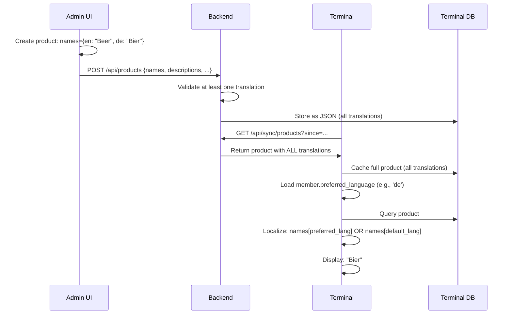

# ADR-0002: Product Internationalization (i18n) Strategy

**Status**: Accepted

**Date**: 2025-01-23

**Deciders**: Architecture Team

---

## Context

The Member Bar system is designed for open-source use in international organizations. Products (beverages, snacks, services) are created and managed via the Admin UI. Organizations need to support products in multiple languages, with each terminal operator viewing products in their preferred language.

Key requirements:
- **Admin UI**: Create products in multiple languages via a single product form
- **Terminal**: Display products in operator's preferred language (persisted in user record)
- **API**: Simple, language-agnostic sync (always return all translations)
- **Backend configuration**: Organization specifies enabled languages and default language
- **Graceful fallback**: If translation missing, display backend default language
- **Flexibility**: Support any number of languages (not hardcoded to 2-3)
- **Backward compatibility**: Existing single-language products should continue to work
- **User preference**: Store language preference persistently (not just in browser localStorage)
- **Simplicity**: Language selection is display-time concern, not API concern

---

## Decision

**Products store translatable fields (name, description) as JSON dictionaries, keyed by ISO 639-1 language codes. User language preference is persisted in user data. API responses are language-agnostic (always include all translations). Frontend handles localization at display time based on user preference and backend configuration.**

### Key Principles

1. **Backend configuration**: Organization defines enabled languages and default language
2. **API is language-agnostic**: `/sync/products` always returns all translations (no `?language=` parameter)
3. **User preference persisted**: Stored in user record (not ephemeral browser state)
4. **Display-time localization**: Frontend applies language preference when rendering
5. **Graceful fallback**: Missing translation → backend default language → any available language

### Database Schema

#### Products Table

```sql
CREATE TABLE products (
  id BINARY(16) PRIMARY KEY,

  -- Translatable fields (JSON structure)
  names JSON NOT NULL,                -- {"en": "Pilsner 0.5L", "de": "Pils 0,5L"}
  descriptions JSON,                  -- {"en": "German lager", "de": "Deutsches Lagerbier"}

  -- Non-translatable fields
  category VARCHAR(50) NOT NULL,      -- beverages, snacks, services (not translated)
  price_cents INT NOT NULL,
  is_active BOOLEAN DEFAULT TRUE,

  -- Metadata
  created_at DATETIME DEFAULT NOW(),
  updated_at DATETIME DEFAULT NOW() ON UPDATE NOW(),

  -- Indexes for querying
  INDEX idx_is_active (is_active),
  INDEX idx_category (category)
);
```

**Example record:**
```sql
INSERT INTO products VALUES (
  UNHEX('987f6543e21a11d3b456426614174999'),
  JSON_OBJECT('en', 'Pilsner 0.5L', 'de', 'Pils 0,5L'),
  JSON_OBJECT('en', 'German lager beer', 'de', 'Deutsches Lagerbier'),
  'beverages',
  350,
  TRUE,
  NOW(),
  NOW()
);
```

#### Members Table (User Preference)

```sql
ALTER TABLE members ADD COLUMN preferred_language VARCHAR(10) DEFAULT 'en';

-- Example: Member prefers German
UPDATE members SET preferred_language = 'de' WHERE id = '...';
```

#### Backend Configuration

```php
// config/languages.php or environment variables
return [
    'enabled_languages' => ['en', 'de', 'fr'],    // Organization's supported languages
    'default_language' => 'en',                   // Fallback if translation missing
];
```

### Admin UI Implementation

Admin panel provides language tabs in product form:

| Feature | Requirement |
|---------|------------|
| Language tabs | One tab per enabled language; allows editing translations |
| Name field | Required, at least one language must have text |
| Description field | Optional, can be empty for some languages |
| Copy utility | Quick action to copy translations from one language to another |
| Validation feedback | Warn if translation missing (⚠️ icon on tab) |
| Language list | Pulled from backend config (enabled_languages) |

### Product i18n Display Workflow



### API Response Format

`GET /api/sync/products` returns all translations (language-agnostic):

```json
{
  "products": [
    {
      "id": "uuid",
      "names": {"en": "Pilsner 0.5L", "de": "Pils 0,5L"},
      "descriptions": {"en": "German lager", "de": "Deutsches Lagerbier"},
      "category": "beverages",
      "price_cents": 350,
      "is_active": true,
      "created_at": "2025-01-01T00:00:00Z",
      "updated_at": "2025-01-10T10:15:30Z"
    }
  ]
}
```

### Terminal Display Logic

Frontend applies localization at display time:

**Pseudocode:**
```
GetLocalizedName(product, userLanguage, defaultLanguage):
  if product.names[userLanguage] exists:
    return product.names[userLanguage]
  else if product.names[defaultLanguage] exists:
    return product.names[defaultLanguage]
  else:
    return any available translation
```

**User preference storage**: Persisted in `member.preferred_language` field (not ephemeral browser storage). Terminal reads this during member sync; applies to all product displays.

**Operator language settings** (optional): Allow terminal operator to change language via Settings menu → Language selector. Update persists via `PATCH /api/members/{id} {preferred_language: 'fr'}`.

---

## Consequences

### Positive

✅ **Simple API**: Language-agnostic; no query parameters needed for sync
✅ **Flexible**: Supports any number of languages without schema changes
✅ **User preference persisted**: Language choice saved in user record (not ephemeral)
✅ **JSON avoids complex joins**: Simpler than separate translation tables
✅ **Terminal-efficient**: All translations cached locally for offline display
✅ **Admin-friendly**: Single product edit form with language tabs
✅ **Backend-configured**: Organization controls enabled languages and default
✅ **Backward compatible**: Single-language products work (e.g., `{"en": "Pilsner"}`)
✅ **Display-time localization**: Frontend handles language selection (simple, predictable)
✅ **Graceful degradation**: Missing translations fall back to backend default, then any available

### Negative

❌ **Frontend complexity**: Terminal must implement display-time localization logic
❌ **Larger API payload**: All translations sent (not filtered by language)
❌ **Data validation overhead**: Admin UI must validate at least one translation exists
❌ **User preference management**: Preferred language stored per user (adds field to schema)
❌ **Incomplete translations**: Risk of products with missing translations (process can mitigate)

### Mitigations

1. **UI/UX**: Highlight missing translations in product form
   ```
   ⚠️ Name missing in: [Français]
   ```

2. **Helper functions**: Provide utility for name/description lookup
   ```javascript
   // Terminal: getLocalizedString(product.names, preferredLang, fallbackLang)
   // PHP: getLocalizedString($product['names'], $language, 'en')
   ```

3. **Validation**: Admin UI prevents saving products without at least one language
4. **Documentation**: Clear examples for admin/developer on translation workflows
5. **API documentation**: Explicitly document fallback behavior

---

## Alternatives Considered

### Alternative 1: API Language Parameter (`?language=de`)
Backend returns localized product names based on query parameter.

**Pros**:
- Reduces API payload (only requested language returned)
- Simple frontend display logic

**Cons**:
- Adds complexity to API endpoint (language validation, localization logic)
- Terminal must make separate requests for each language
- Offline language switching requires cache of all translations anyway

**Rejected**: Additional API complexity not justified. Frontend caching all translations anyway; simpler to localize at display time.

### Alternative 2: Separate Translation Table
```sql
CREATE TABLE product_translations (
  product_id BINARY(16),
  language VARCHAR(5),
  name VARCHAR(255),
  description TEXT,
  PRIMARY KEY (product_id, language)
);
```

**Pros**: Normalized; standard database design
**Cons**: Requires JOIN on every product query; more complex API response; terminal sync becomes multi-query
**Rejected**: Additional complexity not justified for typical 5-20 languages per organization

### Alternative 3: Platform-Level i18n (External Service)
Use a service like Crowdin or Phrase for translations.

**Pros**: Professional translation workflows
**Cons**: External dependency; cost; overkill for small organizations; adds network latency
**Rejected**: Not appropriate for open-source self-hosted system

### Alternative 4: Admin UI Only i18n (hardcoded to 2 languages)
Support DE/EN in database, other languages via front-end translation files.

**Pros**: Simpler database schema
**Cons**: Inflexible; product names not translatable for 3rd language; mismatch between data and UI
**Rejected**: Defeats purpose of product i18n

### Alternative 5: No Persisted User Preference
Store language preference only in browser localStorage/app state (not in user record).

**Pros**:
- Simpler user data model
- No additional user table field

**Cons**:
- Preference lost after terminal restart or session change
- Multi-terminal deployments: different terminals show different languages for same user
- Admin has no way to set organization language defaults

**Rejected**: User preference should persist across sessions and terminals

---

## Implementation Notes

**Backend Configuration**: Store enabled languages and default language in `config/languages.php` or environment variables. Admin UI reads this to display language tabs.

**Terminal**: No language parameter in `/sync/products` endpoint. API returns all translations; frontend localizes at display time based on `member.preferred_language`.

**JSON Storage**: MariaDB/MySQL JSON type supports querying; use `JSON_EXTRACT(names, '$.en')` for database queries if needed, but prefer application-level extraction.

**Fallback Strategy**: Terminal must implement graceful fallback (user language → default language → any available). Document this clearly for frontend developers.

---

## Related Decisions

- [ADR-0001: Monetary Values as Integer Cents](./0001-monetary-values-as-integer-cents.md)
- Terminal API spec: `/docs/api/terminal.yaml` (to be updated with language parameter)
- Admin API spec: `/docs/api/admin.yaml` (to be created)

---

## References

- ISO 639-1: Language codes (https://en.wikipedia.org/wiki/ISO_639-1)
- MariaDB JSON documentation: https://mariadb.com/docs/
- i18next: https://www.i18next.com/ (reference for i18n patterns)
- Internationalization best practices: https://www.w3.org/International/

