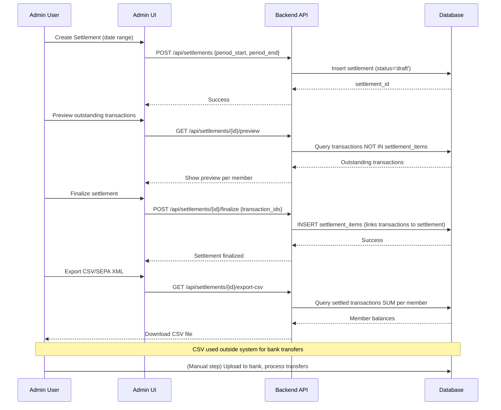

# ADR-0004: Immutable Storage of Purchase Transactions

**Status**: Accepted

**Date**: 2025-01-23

**Deciders**: Architecture Team

---

## Context

The Member Bar system records financial transactions (purchases, corrections) across multiple terminals and a backend database. Transactions form the foundation of:

- **Member accounting**: Calculate outstanding balance (open amount owed)
- **Audit trails**: Full history for compliance and dispute resolution
- **Synchronization**: Offline terminal sync to backend without conflicts
- **Settlement reporting**: Generate accounting records and bank export CSVs
- **GDPR compliance**: Retention of transaction records for 10 years (per tax law § 147 AO)

Key requirements and constraints:

1. **Audit & Compliance**: Must retain complete history; never lose data
2. **Offline-first sync**: Multiple terminals may create transactions offline; no real-time conflict resolution
3. **Idempotency**: Same transaction uploaded twice should not create duplicates
4. **Corrections needed**: Admin/system must handle user errors (wrong amount, wrong product)
5. **Conflict-free**: Distributed system; no complex merge logic needed
6. **Eventually consistent**: Terminal and backend may be temporarily out of sync
7. **Settlement workflow**: Admin marks outstanding transactions as "paid" (settled), generates CSV for bank processing

### Problem Without Immutability

If transactions are mutable (UPDATE/DELETE allowed):

```sql
-- Member scans card, purchases Pils for €3.50
INSERT INTO transactions (id, member_id, product_id, amount_cents, created_at)
VALUES ('uuid1', 'member123', 'product456', 350, NOW());

-- Admin realizes wrong amount, updates
UPDATE transactions SET amount_cents = 380 WHERE id = 'uuid1';  -- PROBLEM!

-- Issues:
-- 1. Audit trail lost: what was the original amount?
-- 2. Sync conflict: terminal uploaded uuid1 with 350, backend changed to 380
-- 3. Compliance risk: tax records show different amounts over time
-- 4. Settlement confusion: which version was settled?
-- 5. No history: can't prove what actually happened
```

---

## Decision

**Purchase transactions are immutable and append-only. Once created, they are never modified or deleted. Corrections are made via reverse transactions (negative amounts). Settlement marks transactions as "paid" without modifying them; CSV exports enable external bank processing.**

### Core Principles

1. **Append-only transactions**: Only INSERT allowed; no UPDATE or DELETE on transactions table
2. **Corrections via reverse transactions**: Error detected → create new transaction with negative amount (never modify original)
3. **Immutable history**: Complete audit trail preserved; nothing lost or hidden
4. **UUID-based identity**: Each transaction has permanent, unique identifier
5. **Timestamp immutable**: created_at never changes; reflects actual time transaction occurred
6. **Settlement is separate**: Settlement marks transactions as "settled" via flag/status, doesn't create transaction records
7. **External bank processing**: CSV export used for actual bank transfers; system doesn't track bank confirmations

### Database Schema

#### Transactions Table (Immutable)

```sql
CREATE TABLE transactions (
  id BINARY(16) PRIMARY KEY,
  member_id BINARY(16) NOT NULL,
  product_id BINARY(16),                    -- NULL for manual entries/corrections
  amount_cents INT NOT NULL,                -- Positive: purchase, Negative: correction/refund
  created_at DATETIME NOT NULL,             -- Immutable: actual transaction time
  notes VARCHAR(500),                       -- Optional: reason for correction
  transaction_type ENUM(
    'purchase',                             -- Normal product purchase (positive amount)
    'manual_credit',                        -- Manual balance adjustment (positive)
    'manual_debit',                         -- Manual balance adjustment (negative)
    'reversal'                              -- Correction/reversal of previous transaction (negative)
  ) NOT NULL,

  -- Audit fields (immutable)
  created_by_terminal_id BINARY(16),        -- Which terminal created this
  created_by_admin_id BINARY(16),           -- Which admin (if manual entry)
  related_transaction_id BINARY(16),        -- If reversal: points to corrected transaction

  -- Sync status (terminal-only; not relevant to backend)
  synced BOOLEAN DEFAULT FALSE,

  -- Constraints
  FOREIGN KEY (member_id) REFERENCES members(id),
  FOREIGN KEY (product_id) REFERENCES products(id),
  FOREIGN KEY (related_transaction_id) REFERENCES transactions(id),
  INDEX idx_member_id (member_id),
  INDEX idx_created_at (created_at),
  INDEX idx_transaction_type (transaction_type)
) ENGINE=InnoDB;

-- IMPORTANT: No UPDATE or DELETE operations allowed on this table
-- Corrections are made via new rows (reversals), not modifications
```

#### Settlements Table (Settlement Workflow Tracking)

```sql
CREATE TABLE settlements (
  id BINARY(16) PRIMARY KEY,
  settlement_date DATE NOT NULL,            -- Date settlement was created
  created_by_admin_id BINARY(16) NOT NULL,  -- Which admin created settlement
  settlement_period_start DATE,             -- Optional: accounting period start
  settlement_period_end DATE,               -- Optional: accounting period end
  notes VARCHAR(500),                       -- Optional: description of settlement
  status ENUM(
    'draft',                                -- Settlement created but not finalized
    'finalized',                            -- Settlement finalized; CSV generated
    'exported',                             -- CSV exported for bank processing
    'cancelled'                             -- Settlement cancelled (undo)
  ) DEFAULT 'draft',
  created_at DATETIME DEFAULT NOW(),
  updated_at DATETIME DEFAULT NOW() ON UPDATE NOW(),

  INDEX idx_status (status),
  INDEX idx_settlement_date (settlement_date),
  FOREIGN KEY (created_by_admin_id) REFERENCES admin_users(id)
) ENGINE=InnoDB;

-- Tracks which transactions belong to which settlement
CREATE TABLE settlement_items (
  id INT AUTO_INCREMENT PRIMARY KEY,
  settlement_id BINARY(16) NOT NULL,
  transaction_id BINARY(16) NOT NULL,
  -- When settlement is created/finalized, these transactions are marked as "settled"

  FOREIGN KEY (settlement_id) REFERENCES settlements(id) ON DELETE CASCADE,
  FOREIGN KEY (transaction_id) REFERENCES transactions(id),
  UNIQUE KEY unique_settlement_transaction (settlement_id, transaction_id),
  INDEX idx_settlement_id (settlement_id),
  INDEX idx_transaction_id (transaction_id)
) ENGINE=InnoDB;
```

#### View: Outstanding Balance (Calculated)

```sql
-- Calculate member balance (open/unpaid amounts)
-- Excludes transactions marked as settled
CREATE VIEW member_outstanding_balance AS
SELECT
  m.id as member_id,
  m.first_name,
  m.last_name,
  SUM(CASE WHEN t.amount_cents > 0 THEN t.amount_cents ELSE 0 END) as total_purchases_cents,
  SUM(CASE WHEN t.amount_cents < 0 THEN t.amount_cents ELSE 0 END) as total_credits_cents,
  SUM(t.amount_cents) as balance_cents
FROM members m
LEFT JOIN transactions t ON m.id = t.member_id
LEFT JOIN settlement_items si ON t.id = si.transaction_id
WHERE si.transaction_id IS NULL  -- Exclude settled transactions
  AND m.is_active = TRUE
  AND (m.deleted_at IS NULL OR m.deleted_at > NOW())  -- Exclude anonymized members
GROUP BY m.id, m.first_name, m.last_name;
```

### Settlement Workflow Sequence

The settlement workflow marks transactions as settled without modifying them. Settlement is a pure accounting operation:



**Settlement States:**
- `draft`: Created, not yet finalized (can modify)
- `finalized`: Transactions marked as settled; ready for export
- `exported`: CSV/SEPA export generated; settlement complete
- `cancelled`: Settlement cancelled; transactions unmarked (admin can re-settle)

**Query Examples (Pseudocode):**

Outstanding balance (unpaid transactions):
```
SELECT member_id, SUM(amount_cents)
FROM transactions
WHERE id NOT IN (SELECT transaction_id FROM settlement_items)
GROUP BY member_id
```

Settled transactions (historical):
```
SELECT t.member_id, s.settlement_date, SUM(t.amount_cents)
FROM settlement_items si
JOIN transactions t ON si.transaction_id = t.id
JOIN settlements s ON si.settlement_id = s.id
WHERE s.status IN ('finalized', 'exported')
GROUP BY t.member_id, s.settlement_date
```

**CSV Export Format:**
```
First Name,Last Name,IBAN,BIC,Amount EUR
"Max","Mustermann","DE89370400440532013000","COBADEFFXXX","47.50"
"Anna","Schmidt","DE89370400440532013001","COBADEFFXXX","82.30"
```

External bank processing (outside system): CSV imported into bank software; transfers processed; no confirmation loop in this system.

### Correcting a Transaction (Immutable Pattern)

Error correction requires creating new reversal transaction (never modify original):

**Scenario**: Member charged €5.00 instead of €3.50

**Approach:**
1. Create reversal transaction: amount_cents = -500, transaction_type = 'reversal', related_transaction_id = original_id
2. Create corrected transaction: amount_cents = 350, transaction_type = 'purchase', notes = 'Correction'
3. Result: Member balance = 500 - 500 + 350 = 350 cents (€3.50)
4. Audit trail preserved: All three transactions visible; linked via related_transaction_id

---

## Consequences

### Positive

✅ **Complete audit trail**: Every purchase and correction recorded; nothing hidden
✅ **Conflict-free sync**: No UPDATE/DELETE conflicts between terminals
✅ **Immutable source**: Transactions never modified; basis for settlement is reliable
✅ **Settlement flexible**: Can create multiple settlements; mark different subsets of transactions
✅ **Idempotent**: Retry same transaction safely (INSERT IGNORE)
✅ **GDPR-compliant**: Retains transaction history for 10 years (tax law § 147 AO)
✅ **Dispute resolution**: Full evidence of purchases and corrections
✅ **Compliance-ready**: Complete history for audits
✅ **Easy corrections**: Reversals clearly link to originals (related_transaction_id)
✅ **Separate concerns**: Transactions immutable; settlement is accounting operation

### Negative

❌ **Storage overhead**: Corrections add rows (reversal + corrected); tables grow over time
❌ **Query complexity**: Balance calculation requires SUM with settlement_items JOIN
❌ **Admin workflow**: Corrections require understanding "reversal" concept
❌ **CSV-dependent**: Settlement relies on manual external bank processing (no confirmation loop)
❌ **Manual CSV handling**: Error-prone if CSV manually edited or duplicated

### Mitigations

1. **Storage**: Database compression; archive old data per retention policy
2. **Query complexity**: Use indexed views and materialized balance tables
3. **Admin education**: Clear UI for correction workflow (label "reverse & correct")
4. **CSV safety**:
   - Validate CSV before export
   - Include checksums or transaction counts
   - Version filename (settlement_YYYYMMDD_v1.csv)
   - Keep audit log of exports
   - Require confirmation before finalization

---

## Alternatives Considered

### Alternative 1: Track Settlement Transactions

Create new "settlement" transaction type that records when payment is made.

```sql
INSERT INTO transactions (type='settlement', amount_cents=-balance, ...)
```

**Pros**: Settlement is explicit in transaction log

**Cons**:
- Creates noise (artificial transactions for accounting action)
- Doubles row count during settlement
- Confuses payment tracking (which transaction is "real"?)
- Harder to modify settlement if needed

**Rejected**: Settlement is administrative, not transactional. Separate table cleaner.

### Alternative 2: Direct Member Balance Table

Track member balance in separate denormalized table, update on settlement.

```sql
CREATE TABLE member_balance (
  member_id ...,
  outstanding_cents INT,
  last_settled_date DATE
);

-- On settlement:
UPDATE member_balance SET outstanding_cents = 0, last_settled_date = NOW();
```

**Pros**: Fast balance lookups

**Cons**:
- Loses transactional source (can't recalculate from transactions)
- Settlement undoable only with history
- Audit trail fragmented (balance and transactions separate)
- Difficult to verify correctness

**Rejected**: SUM query sufficient; transaction-sourced balance more reliable.

### Alternative 3: Bank Confirmation Tracking

Track actual bank payment confirmations in system.

```sql
CREATE TABLE bank_confirmations (
  settlement_id ...,
  member_id ...,
  bank_reference ...,
  status ('pending', 'completed', 'failed'),
  ...
);
```

**Pros**: Complete payment tracking in system

**Cons**:
- Requires integration with bank API/processes
- Not applicable to small orgs using manual bank processing
- Adds scope beyond offline-first design
- Many deployments won't have bank API access

**Rejected**: Out of scope; system design is offline-first. Bank processing external.

### Alternative 4: Soft Delete on Settlement

Mark transactions as "deleted" when settled (deleted_at field).

```sql
UPDATE transactions SET deleted_at = NOW() WHERE id IN (...);
```

**Pros**: Transactions "disappear" from UI after settlement

**Cons**:
- Not truly immutable (logically deleted)
- GDPR deletion must still purge row
- Query complexity (WHERE deleted_at IS NULL everywhere)
- Easy to forget WHERE clause; show wrong data

**Rejected**: Violates immutability principle.

---

## Implementation Notes

**Database Schema**: Transactions table must have NO UPDATE/DELETE triggers or procedures. Settlement workflow uses settlement_items table to link transactions to settlements (read-only join).

**API Endpoints:**
- `POST /api/sync/transactions`: Terminal batch upload; use INSERT IGNORE for idempotency
- `POST /api/settlements`: Create settlement (draft)
- `POST /api/settlements/{id}/finalize`: Finalize (mark transactions as settled)
- `GET /api/settlements/{id}/export-csv`: Generate CSV
- `POST /api/settlements/{id}/cancel`: Undo (delete settlement_items rows)

**Admin UI Settlement Workflow:**
- Date range selection
- Preview of outstanding transactions per member
- Checkboxes to select transactions
- Confirmation before finalize
- CSV/SEPA export download

---

## Related Decisions

- [ADR-0001: Monetary Values as Integer Cents](./0001-monetary-values-as-integer-cents.md) - Transaction amounts stored as integer cents
- [ADR-0002: Product Internationalization](./0002-product-internationalization.md) - Products in transactions
- [ADR-0003: GZIP Compression](./0003-gzip-compression-http.md) - Transaction sync payloads compressed

---

## References

- **Accounting Standards**:
  - German tax law [§ 147 Aufbewahrungspflicht](https://www.gesetze-im-internet.de/ao_1977/__147.html) - 10-year retention of transaction records
  - [GAAP: General Accepted Accounting Principles](https://www.investopedia.com/terms/g/gaap.asp) - requires complete transaction history

- **GDPR**:
  - [Art. 16 Right to Rectification](https://gdpr-info.eu/art-16-gdpr/) - right to correct inaccurate data
  - [Art. 17 Right to Erasure](https://gdpr-info.eu/art-17-gdpr/) - right to delete data (with exceptions for accounting)

- **Software Patterns**:
  - [Event Sourcing](https://www.martinfowler.com/eaaDev/EventSourcing.html) - immutable event logs
  - [CQRS](https://www.martinfowler.com/bliki/CQRS.html) - Command Query Responsibility Segregation

---

## Post-Implementation Monitoring

- Monitor transaction table growth
- Verify no UPDATE/DELETE operations (query logs)
- Track reversal frequency (correction rate)
- Measure settlement workflow time
- Test CSV export accuracy
- Verify audit trail completeness
- Compliance verification: can reconstruct full history
- User feedback: settlement workflow clarity
