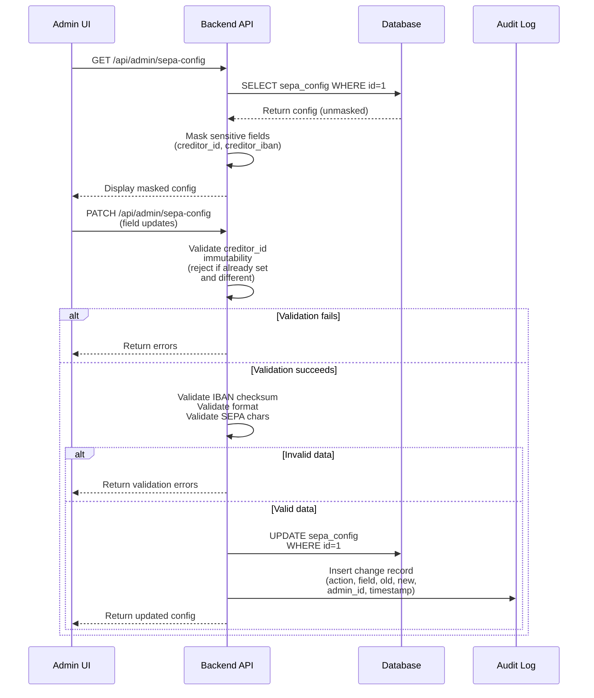

# ADR-0007: Organization-Level SEPA Configuration Storage

**Status**: Accepted

**Date**: 2025-01-23

**Deciders**: Architecture Team

---

## Context

SEPA Direct Debit exports require organization-level information that applies to all settlements:

- **Gläubiger-ID (Creditor ID)**: Unique 18-character identifier assigned by the Bundesbank
- **Organization name**: Must match bank records (max 70 characters per SEPA standard)
- **Organization IBAN**: The organization's bank account for receiving payments
- **Address fields**: Street, city, postal code, country code (for SEPA XML)

These settings are:

1. **Immutable per settlement**: Once set, they apply to all future settlements until changed
2. **Admin-configurable**: Can be updated via admin panel
3. **Required for SEPA export**: Missing or invalid settings should prevent settlement
4. **Audit-sensitive**: Changes should be logged (who changed what, when)
5. **Deployment-specific**: Different organizations/deployments have different IDs

### Storage Options

Three viable approaches:

1. **Dedicated `sepa_config` table**: Single row, all SEPA settings
2. **Generic `settings` table**: Key-value store for all org settings
3. **Environment variables**: Configuration in `.env` file (no database)

---

## Decision

**Organization SEPA settings are stored in a dedicated `sepa_config` table with a single row. This table is admin-configurable via API and UI. Settings are cached in application (with short TTL) to avoid repeated database queries. Changes are audit-logged.**

### Core Principles

1. **Single-row configuration table**: Explicit design for organization-wide settings
2. **Admin-editable via UI**: Form in settings panel to manage SEPA data
3. **Immutable Gläubiger-ID**: Once set, cannot be changed (business requirement)
4. **Validation on save**: IBAN checksum, Gläubiger-ID format, character length limits
5. **Audit logging**: All changes tracked with before/after values
6. **Fallback defaults**: System has sensible defaults (allow override)

### Database Schema

#### SEPA Configuration Table

```sql
CREATE TABLE sepa_config (
  id INT PRIMARY KEY DEFAULT 1,  -- Single row

  -- Creditor Identification
  creditor_id VARCHAR(35) NOT NULL UNIQUE,
    -- Gläubiger-ID (German: Creditor ID)
    -- Format: Country code (2) + ZZZ + Bank code + unique ref = 18 chars total
    -- Example: DE98ZZZ09999999999
    -- Immutable after first set (business requirement)

  creditor_name VARCHAR(70) NOT NULL,
    -- Organization name for SEPA (max 70 chars per SEPA standard)
    -- Example: FRGS Frankfurter Rudergesellschaft Sachsenhausen

  creditor_iban VARCHAR(34) NOT NULL,
    -- Organization's bank account for receiving payments
    -- Example: DE89370400440532013000
    -- Validated on save (checksum)

  creditor_address_street VARCHAR(70) NOT NULL,
    -- Street and house number
    -- Example: Mainufer 34

  creditor_address_city VARCHAR(70) NOT NULL,
    -- Postal code and city
    -- Example: 60311 Frankfurt am Main

  creditor_address_country VARCHAR(2) NOT NULL DEFAULT 'DE',
    -- ISO 3166-1 country code
    -- Example: DE

  -- Metadata
  created_at DATETIME NOT NULL DEFAULT NOW(),
  updated_at DATETIME NOT NULL DEFAULT NOW() ON UPDATE NOW(),
  updated_by_admin_id BINARY(16),
    -- Admin who last modified (for audit trail)

  -- Constraint: prevent accidental insertion of multiple rows
  CONSTRAINT single_row CHECK (id = 1)
) ENGINE=InnoDB;

-- Insert default/empty row (admins fill in later)
INSERT INTO sepa_config (id, creditor_id, creditor_name, creditor_iban,
  creditor_address_street, creditor_address_city)
VALUES (1, '', '', '', '', '')
ON DUPLICATE KEY UPDATE id = 1;
```

#### Audit Logging

```sql
-- Existing audit_log table tracks changes
-- SEPA config changes logged with:
-- - action: 'update'
-- - entity_type: 'sepa_config'
-- - entity_id: 1 (the single row)
-- - changes_json: { 'field_name': { 'old': '...', 'new': '...' } }
-- - admin_user_id: who made the change
-- - created_at: when
```

### API Architecture

**Endpoints**:
- `GET /api/admin/sepa-config` - Retrieve SEPA configuration (with masked sensitive fields)
- `PATCH /api/admin/sepa-config` - Update configuration (admin-only; creditor_id is immutable after set)

**Key constraints**:
- Admin authorization required
- Creditor ID validation: Format check (2-letter country code + 3 alphanumeric + 10+ digits)
- IBAN validation: Checksum validation (mod-97)
- Character set validation: SEPA-compliant Latin characters only
- Sensitive field masking: creditor_id (first 6 + last 4 chars), creditor_iban (show last 4 chars only)
- Audit logging: Track all changes with before/after values (masked)

### SEPA Configuration Workflow



### Admin UI Requirements

Admin panel provides form in Settings → SEPA Configuration with:

- **Display mode**: Show current config with fields (creditor_id, name, IBAN, address, country)
- **Edit mode**: Form fields for editing each setting
- **creditor_id field**: Disabled after first set (immutable); shows help link to Bundesbank
- **creditor_name field**: Max 70 characters; real-time character count
- **creditor_iban field**: Real-time IBAN validation (mod-97 checksum)
- **Address fields**: Street, city/postal code, country dropdown (defaults to DE)
- **Validation feedback**: Show errors inline for invalid formats
- **Success notification**: Confirm save with toast message
- **Edit/Cancel buttons**: Toggle between view and edit modes

---

## Consequences

### Positive

✅ **Explicit design**: Dedicated table makes SEPA settings intent clear
✅ **Single row guarantee**: `CHECK (id = 1)` prevents accidental duplication
✅ **Immutable creditor_id**: Once set, can't accidentally change (business requirement)
✅ **Admin UI control**: Non-technical admins can update settings
✅ **Audit trail**: All changes logged with before/after values
✅ **Validation**: Format/length checks before save prevent bank rejections
✅ **Masking**: Sensitive data masked in logs and API responses

### Negative

❌ **Inflexible schema**: Adding new SEPA fields requires ALTER TABLE
❌ **Single row limitation**: Doesn't support multi-organization deployments
❌ **Immutability enforcement**: Requires application logic (can't rely on DB alone)
❌ **Address parsing**: No structured address fields (street vs city separation)

### Mitigations

1. **Schema planning**: Anticipate future SEPA fields (COR1 support, contact info, etc.)
2. **Multi-tenant consideration**: If needed later, add organization_id; create separate tables
3. **Validation**: Comprehensive input validation + DB constraints
4. **Address fields**: Separate street, number, postal code, city if needed later

---

## Alternatives Considered

### Alternative 1: Generic Settings Table (Key-Value)

```sql
CREATE TABLE settings (
  key VARCHAR(100) PRIMARY KEY,
  value JSON,
  updated_at DATETIME
);

INSERT INTO settings VALUES
  ('sepa_creditor_id', '"DE98ZZZ..."', NOW()),
  ('sepa_creditor_name', '"FRGS..."', NOW()),
  ...
```

**Pros**: Flexible for adding any setting later
**Cons**:
- Less explicit (type checking harder)
- No schema validation
- Complex queries (JOINs for related settings)
- Harder to reason about relationships

**Rejected**: Too flexible; SEPA settings are cohesive and need validation.

### Alternative 2: Environment Variables Only

```bash
# .env file
SEPA_CREDITOR_ID=DE98ZZZ09999999999
SEPA_CREDITOR_NAME="FRGS Frankfurter Rudergesellschaft"
SEPA_CREDITOR_IBAN=DE89370400440532013000
```

**Pros**: Simple, no database changes needed
**Cons**:
- Can't update without redeployment
- Admin UI can't modify (must edit .env directly)
- No audit trail
- Not suitable for multi-organization setups
- Secrets in version control risk

**Rejected**: Admins need to manage SEPA config without code deployment.

### Alternative 3: Multiple Rows with Organization ID

```sql
CREATE TABLE sepa_config (
  id INT PRIMARY KEY AUTO_INCREMENT,
  organization_id BINARY(16) NOT NULL,
  creditor_id VARCHAR(35) NOT NULL,
  ...
  UNIQUE KEY unique_org (organization_id)
);
```

**Pros**: Supports multi-tenant/multi-organization deployments
**Cons**: Over-engineered for single-org use case; adds complexity
- Need organization context in every query
- Migration path unclear
- Rare requirement for small deployments

**Rejected**: Single-organization design sufficient; can add tenancy later if needed.

### Alternative 4: Store Raw JSON

```sql
CREATE TABLE sepa_config (
  id INT PRIMARY KEY DEFAULT 1,
  config JSON NOT NULL
);

INSERT INTO sepa_config VALUES (1, JSON_OBJECT(
  'creditor_id', 'DE98ZZZ...',
  'creditor_name', 'FRGS...',
  ...
));
```

**Pros**: Flexible schema
**Cons**:
- Type validation harder
- No automatic escaping/masking
- Complex to update individual fields
- Schema evolution unclear

**Rejected**: Structured columns better for validation and audit trail.

---

## Related Decisions

- [ADR-0005: IBAN Storage and Validation](./0005-iban-storage-and-validation.md) - Member IBAN validation
- [ADR-0006: SEPA Mandate Reference Strategy](./0006-sepa-mandate-reference-strategy.md) - Mandate fields
- [ADR-0008: SEPA XML Export Format Selection](./0008-sepa-xml-export-format-selection.md) - Uses creditor config for XML
- [ADR-0009: Settlement Lead Times and Bank Working Days](./0009-settlement-lead-times-bank-working-days.md) - Validation before export

---

## References

- **SEPA Standards**:
  - [EPC SEPA Rulebook](https://www.europeanpaymentscouncil.eu/) - Official rules
  - [Bundesbank Creditor ID Application](https://www.glaeubiger-id.bundesbank.de) - Apply for Gläubiger-ID

- **Configuration Management**:
  - Single-row pattern for global settings
  - Application-level caching best practices

---

## Post-Implementation Monitoring

- [ ] Verify creditor-ID immutability enforced
- [ ] Monitor SEPA config changes (audit log)
- [ ] Verify masking in logs (no plaintext sensitive data)
- [ ] User feedback: Is config UI intuitive?
- [ ] Settlement generation: Are exports using correct config?
- [ ] Bank acceptance: No rejections due to config data?
