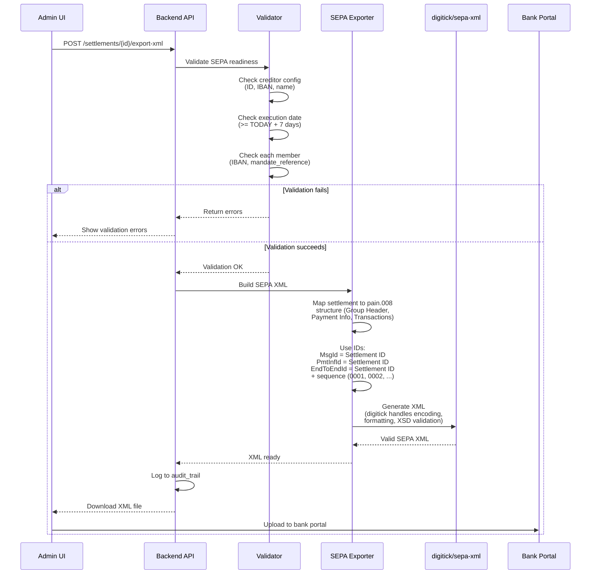

# ADR-0008: SEPA XML Export Format Selection

**Status**: Accepted (amended 2026-08-04: format raised from pain.008.001.02 to pain.008.001.08; amended 2026-08-05: IBAN-only agents documented as `Othr/Id = NOTPROVIDED`, see issue #12)

**Date**: 2025-01-23

**Deciders**: Architecture Team

---

## Context

The Club Bar system needs to export settlement data in SEPA Direct Debit format for bank processing. Two primary export formats exist:

1. **CSV**: Human-readable, manual control, import into bank tools
2. **SEPA XML**: Direct upload to online banking, automated processing

For SEPA XML, multiple ISO 20022 versions exist:

| Version | Format | Use Case | Status |
|---------|--------|----------|--------|
| **pain.008.001.02** | SEPA Core Direct Debit (ISO 20022 2009) | Legacy EU SEPA | Superseded (EPC rulebooks until 2023) |
| **pain.008.002.02** / **pain.008.003.02** | German DK variants | Legacy German banking | Superseded |
| **pain.008.001.08** | SEPA Core Direct Debit (ISO 20022 2019) | Standard EU SEPA | ✅ Current standard (EPC 2023 rulebook, DK/EBICS since Nov 2025) |
| **pain.008.001.09+** | SEPA Core Direct Debit (later ISO releases) | Not EPC/DK-selected | May be rejected by banks |

Additionally, SEPA Direct Debit has two schemes:

- **CORE**: Standard scheme (most common, all EU banks support)
- **COR1**: Express scheme (1 business day, limited bank support)

### Bank Support Reality

- **EPC 2023 rulebook / Deutsche Kreditwirtschaft (EBICS)**: pain.008.001.08 + CORE is the required customer-to-bank format since November 2025
- **Most EU banks**: accept pain.008.001.08 + CORE; legacy pain.008.001.02 acceptance is being phased out

---

## Decision

**Use ISO 20022 pain.008.001.08 (SEPA Core Direct Debit, ISO 20022 2019 release) for XML export. Always use RCUR (recurring) sequence type for all collections. CORE scheme (2 business day lead time) with RCUR is pragmatic for small organizations; most banks accept RCUR for initial collections. Exports are generated on-demand, validated against XSD schema, and include comprehensive error reporting.**

### Core Principles

1. **pain.008.001.08 standard**: Required by EPC 2023 rulebook and Deutsche Kreditwirtschaft (EBICS) since November 2025
2. **CORE scheme only**: Meets standard requirements; COR1 can be added later
3. **Always RCUR sequence type**: Simplified; all collections treated as recurring
4. **Minimal debtor information**: Only debtor name and IBAN; no address data (privacy-first)
5. **IBAN-only agent identification**: Club Bar collects no agent BICs. `CdtrAgt` and `DbtrAgt` are both mandatory (1..1) in pain.008.001.08 and therefore cannot be omitted; the missing BIC is encoded as `Othr/Id = NOTPROVIDED` per the EPC/DK implementation guidelines. It must **not** be written to `BICFI`: the literal satisfies the `BICFIDec2014Identifier` pattern by accident (`NOTP`-`RO`-`VI`-`DED`), so it passes XSD validation while declaring a non-existent Romanian institution — which bank-side validators that resolve BICs against a directory will reject
6. **XSD validation**: All generated XML validated against official SEPA schema
7. **Pragmatic ID generation**: Settlement ID used as base for all SEPA identifiers; all identifiers respect the ISO 20022 35-character maximum
   - Message ID = stored `sepa_message_id` (e.g., `SEPA-7f499732c4fe`)
   - Payment Info ID = `PMT-` + first 16 hex chars of settlement UUID (e.g., `PMT-401f7c9dbf504925`)
   - End-to-End ID = Payment Info ID + sequence (e.g., `PMT-401f7c9dbf504925-1`)
8. **Human-readable IDs**: Audit trail clarity; easy to trace transactions to settlements
9. **Comprehensive error handling**: Detailed validation errors before export
10. **UTF-8 encoding**: Mandatory for XML; charset declared in header

### XML Structure (pain.008.001.08)

```xml
<?xml version="1.0" encoding="UTF-8"?>
<Document xmlns="urn:iso:std:iso:20022:tech:xsd:pain.008.001.08"
          xmlns:xsi="http://www.w3.org/2001/XMLSchema-instance"
          xsi:schemaLocation="urn:iso:std:iso:20022:tech:xsd:pain.008.001.08
                              pain.008.001.08.xsd">
  <CstmrDrctDbtInitn>
    <!-- Group Header (applies to entire file) -->
    <GrpHdr>
      <MsgId>SEPA-7f499732c4fe</MsgId>                        <!-- Message ID = sepa_message_id -->
      <CreDtTm>2025-01-23T14:30:00Z</CreDtTm>                <!-- Creation timestamp (UTC) -->
      <NbOfTxs>2</NbOfTxs>                                   <!-- Total transaction count -->
      <CtrlSum>37.50</CtrlSum>                                <!-- Total amount in EUR -->
      <InitgPty>                                              <!-- Initiating Party (Organization) -->
        <Nm>Sportverein Beispiel e.V.</Nm>
      </InitgPty>
    </GrpHdr>

    <!-- Payment Information (can have multiple, but Club Bar uses single PmtInf) -->
    <PmtInf>
      <PmtInfId>PMT-401f7c9dbf504925</PmtInfId>              <!-- PMT- + first 16 hex of settlement UUID -->
      <PmtMtd>DD</PmtMtd>                                    <!-- Payment Method = Direct Debit -->
      <NbOfTxs>2</NbOfTxs>                                   <!-- Transaction count in this batch -->
      <CtrlSum>37.50</CtrlSum>                                <!-- Sum of transactions in batch -->

      <PmtTpInf>                                              <!-- Payment Type Info -->
        <SvcLvl>
          <Cd>SEPA</Cd>                                       <!-- Service Level = SEPA -->
        </SvcLvl>
        <LclInstrm>
          <Cd>CORE</Cd>                                       <!-- Local Instrument = CORE (standard) -->
        </LclInstrm>
        <SeqTp>RCUR</SeqTp>                                   <!-- Sequence Type: always RCUR -->
      </PmtTpInf>

      <ReqdColltnDt>2025-01-31</ReqdColltnDt>                <!-- Requested Collection Date (execution date) -->

      <!-- Creditor (Organization) -->
      <Cdtr>
        <Nm>Sportverein Beispiel e.V.</Nm>
        <PstlAdr>
          <Ctry>DE</Ctry>
          <AdrLine>Mainufer 34, 60311 Frankfurt am Main</AdrLine>
        </PstlAdr>
      </Cdtr>

      <!-- Creditor Account -->
      <CdtrAcct>
        <Id>
          <IBAN>DE89370400440532013000</IBAN>
        </Id>
        <Ccy>EUR</Ccy>                                        <!-- Currency = EUR -->
      </CdtrAcct>

      <!-- Creditor Agent (Organization's Bank) - IBAN-only, no BIC collected -->
      <CdtrAgt>
        <FinInstnId>
          <Othr>
            <Id>NOTPROVIDED</Id>                              <!-- IBAN-only: bank derives the agent from the IBAN -->
          </Othr>
        </FinInstnId>
      </CdtrAgt>

      <!-- Creditor Scheme Identification (Gläubiger-ID) -->
      <CdtrSchmeId>
        <Id>
          <PrvtId>
            <Othr>
              <Id>DE98ZZZ09999999999</Id>                     <!-- Gläubiger-ID -->
              <Issr>DE</Issr>
            </Othr>
          </PrvtId>
        </Id>
      </CdtrSchmeId>

      <!-- Direct Debit Transaction Information (repeated for each member) -->
      <DrctDbtTxInf>
        <PmtId>
          <EndToEndId>PMT-401f7c9dbf504925-1</EndToEndId>    <!-- Payment Info ID + sequence -->
        </PmtId>

        <InstdAmt Ccy="EUR">25.50</InstdAmt>                 <!-- Instruction Amount -->

        <!-- Direct Debit Transaction -->
        <DrctDbtTx>
          <MndtRltdInf>
            <MndtId>550e8400e29b41d4a716446655440000</MndtId><!-- Mandate Reference (from member record) -->
          </MndtRltdInf>
        </DrctDbtTx>

        <!-- Debtor Agent (Member's Bank) - mandatory (1..1), IBAN-only -->
        <DbtrAgt>
          <FinInstnId>
            <Othr>
              <Id>NOTPROVIDED</Id>
            </Othr>
          </FinInstnId>
        </DbtrAgt>

        <!-- Debtor (Member) - Minimal information only -->
        <Dbtr>
          <Nm>Max Mustermann</Nm>
        </Dbtr>

        <!-- Debtor Account (Member's IBAN) -->
        <DbtrAcct>
          <Id>
            <IBAN>DE89370400440532013001</IBAN>               <!-- Member's IBAN -->
          </Id>
        </DbtrAcct>

        <!-- Remittance Information (Purpose) -->
        <RmtInf>
          <Ustrd>Club Bar Abrechnung Jan 2025</Ustrd>             <!-- Unstructured purpose text -->
        </RmtInf>
      </DrctDbtTxInf>

      <!-- Second transaction (another member) -->
      <DrctDbtTxInf>
        <PmtId>
          <EndToEndId>PMT-401f7c9dbf504925-2</EndToEndId>    <!-- incremented sequence -->
        </PmtId>

        <InstdAmt Ccy="EUR">12.00</InstdAmt>

        <DrctDbtTx>
          <MndtRltdInf>
            <MndtId>8a1c9012f45c48d9b872336e50f41c8e</MndtId>
          </MndtRltdInf>
        </DrctDbtTx>

        <DbtrAgt>
          <FinInstnId>
            <Othr>
              <Id>NOTPROVIDED</Id>
            </Othr>
          </FinInstnId>
        </DbtrAgt>

        <Dbtr>
          <Nm>Erika Müller</Nm>
        </Dbtr>

        <DbtrAcct>
          <Id>
            <IBAN>DE89370400440532013002</IBAN>
          </Id>
        </DbtrAcct>

        <RmtInf>
          <Ustrd>Club Bar Abrechnung Jan 2025</Ustrd>
        </RmtInf>
      </DrctDbtTxInf>
    </PmtInf>
  </CstmrDrctDbtInitn>
</Document>
```

### Data Flow Diagram: SEPA XML Export

The following sequence shows how settlement data flows through validation and XML generation:



### Backend Architecture

**Library**: Use `digitick/sepa-xml` Composer package for SEPA XML generation (pain.008.001.08 format).

**Key responsibility areas**:
- **Validation**: Check SEPA config completeness, member IBAN/mandate data, execution date constraints
- **ID Mapping**: Use settlement ID as base for all SEPA identifiers (simple, human-readable, traceable)
- **Data Transformation**: Map transaction data to pain.008 XML elements (creditor, debtor, amounts, dates)
- **XSD Validation**: Leverage digitick library's built-in validation against pain.008.001.08 schema

### ID Generation Strategy

Pragmatic approach: Use the settlement's stored identifiers as base for all SEPA identifiers. All IDs must respect the ISO 20022 35-character maximum — a raw settlement UUID with prefix exceeds it, so UUIDs are hyphen-stripped and truncated.

**Derived IDs**:
- **Message ID (MsgId)**: = stored `sepa_message_id` (e.g., `SEPA-7f499732c4fe`); fallback `MSG-` + first 31 hex chars of settlement UUID
- **Payment Info ID (PmtInfId)**: = `PMT-` + first 16 hex chars of settlement UUID (e.g., `PMT-401f7c9dbf504925`)
- **End-to-End ID (EndToEndId)**: = Payment Info ID + sequence (e.g., `PMT-401f7c9dbf504925-1`, `PMT-401f7c9dbf504925-2`)

### Pre-Export Validation Checklist

Before generating SEPA XML, validate:

**SEPA Configuration**:
- ✓ Creditor ID (Gläubiger-ID) is set
- ✓ Creditor IBAN is set and valid
- ✓ Creditor name is set
- ✓ Organization country/address is set

**Settlement Data**:
- ✓ Execution date is set
- ✓ Execution date is in future (>= TODAY + 7 calendar days)
- ✓ Settlement has at least one transaction

**Per Member**:
- ✓ IBAN is present
- ✓ IBAN is valid (mod-97 checksum)
- ✓ Mandate reference is present
- ✓ Member name is present and non-empty

**Character Encoding**:
- ✓ Member names contain only SEPA-allowed characters (Latin-1)
- ✓ Sanitize umlauts/accents where necessary

---

## Consequences

### Positive

✅ **Industry standard**: pain.008.001.08 widely supported by all EU banks
✅ **CORE scheme**: Meets standard 2-business-day requirement with RCUR
✅ **Simplified RCUR**: Always use RCUR (no FRST/RCUR logic); pragmatic for small orgs
✅ **Library-based**: digitick/sepa-xml handles XSD validation automatically
✅ **Tested & maintained**: Community-maintained library, proven in production
✅ **Reduced custom code**: No need to implement XML generation from scratch
✅ **Reduced complexity**: No mandate date tracking; only mandate_reference needed
✅ **Pragmatic ID strategy**: Settlement ID as base for all SEPA identifiers (simple, traceable, human-readable)
✅ **Easy audit trail**: Settlement IDs directly link transactions to settlement exports
✅ **UTF-8 support**: Library handles proper character encoding
✅ **No schema management**: Library includes and validates against XSD

### Negative

❌ **External dependency**: Requires digitick/sepa-xml package (must be maintained in composer.json)
❌ **XML verbosity**: Large file format (verbose compared to CSV)
❌ **Character handling**: Must sanitize member names for Latin-only SEPA compliance

### Mitigations

1. **Dependency management**: Use Composer for dependency tracking and updates
2. **Regular updates**: Keep digitick/sepa-xml updated with security patches
3. **Name sanitization**: Implement sanitization layer before passing to library
4. **Testing**: Comprehensive tests with digitick library to verify bank compatibility
5. **Error handling**: Catch and log digitick exceptions with actionable messages

---

## Alternatives Considered

### Alternative 1: Use pain.008.002.02

Newer version with updated format.

**Pros**: More recent standard, better spec
**Cons**:
- Limited bank support (especially German banks)
- Requires schema update
- Migration path unclear
- No functional advantage for Club Bar

**Rejected**: pain.008.001.08 has broader support.

### Alternative 2: Use pain.008.003.02

Latest ISO 20022 2018 version.

**Pros**: ISO 20022 latest standard
**Cons**:
- Very limited bank support
- Few banks accept it yet
- May cause rejection

**Rejected**: Premature adoption; stick with proven standard.

### Alternative 3: Use DLV (Datei-Lieferdienste-Vektor)

German-specific format for bank uploads.

**Pros**: Some German banks prefer it
**Cons**:
- Less standardized than SEPA XML
- Limited to Germany
- Not portable to other EU banks
- More complex than SEPA

**Rejected**: SEPA XML more portable and standard.

### Alternative 4: Only CSV, No XML

Skip XML; generate only CSV for manual import.

**Pros**: Simpler, no schema management
**Cons**:
- Manual upload to bank portal (more error-prone)
- No direct banking integration
- Slower processing
- Higher manual effort

**Rejected**: XML automation is a key benefit for admins.

### Alternative 5: Custom XML Generation (SimpleXML/DOMDocument)

Build SEPA XML manually using PHP's SimpleXML or DOMDocument.

**Pros**:
- No external dependencies
- Full control over XML structure

**Cons**:
- Requires implementing SEPA XML generation from scratch
- Must handle XSD validation manually
- More code to maintain and test
- Higher risk of non-compliance with SEPA standards
- No community support for bug fixes
- Difficult to extend to other SEPA formats (COR1, pain.008.003.02)

**Rejected**: digitick/sepa-xml is tested, maintained, and proven. Custom XML generation introduces unnecessary complexity and maintenance burden.

---

## Related Decisions

- [ADR-0004: Immutable Transaction Storage](./0004-immutable-transaction-storage.md) - Settlement workflow
- [ADR-0006: SEPA Mandate Reference Strategy](./0006-sepa-mandate-reference-strategy.md) - Mandate reference in XML
- [ADR-0007: Organization SEPA Configuration](./0007-organization-sepa-configuration-storage.md) - Creditor info in XML
- [ADR-0009: Settlement Lead Times](./0009-settlement-lead-times-bank-working-days.md) - Execution date validation
- [ADR-0005: IBAN Storage and Validation](./0005-iban-storage-and-validation.md) - Member IBAN validation

---

## References

- **SEPA Standards**:
  - [EPC SEPA Rulebook](https://www.europeanpaymentscouncil.eu/) - Official specification
  - [pain.008.001.08 XSD Schema](https://www.iso20022.org/) - XML schema (obtain from EPC)

- **ISO 20022**:
  - [ISO 20022 Standard](https://www.iso20022.org/) - XML message format

- **Implementation Guides**:
  - [German Banking Association Guide](https://www.die-deutsche-boerse.de/) - Bank-specific requirements
  - [SEPA Direct Debit Implementation](https://www.ecb.europa.eu/paym/retpaym/governance/shared/pdf/recommendations_sepa_direct_debit.pdf)

---

## Post-Implementation Monitoring

- [ ] Track XML generation errors (validation failures)
- [ ] Monitor bank acceptance (any rejections?) — in particular, confirm a real bank file check accepts the `Othr/Id = NOTPROVIDED` agent encoding (issue #12)
- [ ] Verify XSD validation catches errors before export
- [ ] Check SEPA character encoding (names with umlauts)
- [ ] Verify RCUR sequence type consistently used in all exports
- [ ] Verify ID patterns correct (Message/Payment Info = Settlement ID, End-to-End = Settlement ID + sequence)
- [ ] Verify End-to-End IDs sequential and unique per settlement
- [ ] Bank processing success rate
- [ ] Audit trail: Link transactions to settlement ID via End-to-End ID
- [ ] User feedback: Is XML export reliable?
- [ ] Audit log: Track all XML exports with settlement IDs
