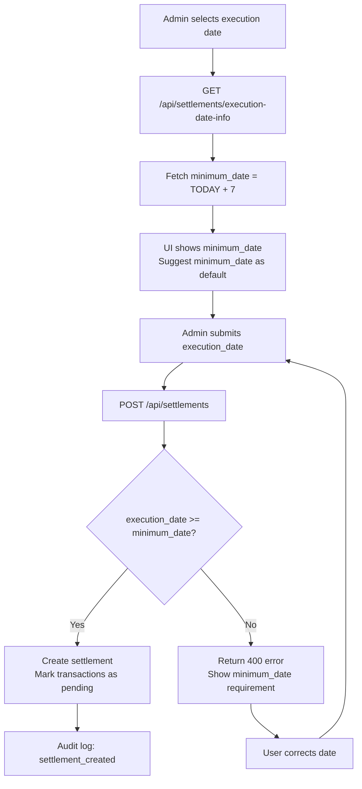

# ADR-0009: Settlement Lead Times

**Status**: Accepted

**Date**: 2025-01-23

---

## Context

SEPA Direct Debit transfers require advance notice before collection. The system uses **RCUR (recurring)** sequence type, which technically requires 2 business days notice.

**Challenge**: Complex business day calculation requires:
- Holiday calendar management
- Regional holiday variants
- Weekend exclusions
- Complex validation logic
- Database tables for holiday management

**Pragmatic approach**: Use a fixed lead time of **7 calendar days** instead of calculating business days. This eliminates holiday calendar complexity entirely while providing sufficient buffer for most organizations.

---

## Decision

**Settlement execution dates must be at least 7 calendar days in the future (TODAY + 7 days minimum). No holiday calendar or business day calculations required. Simple date validation only.**

### Core Principles

1. **Fixed 7-day minimum lead time**: Execution date ≥ TODAY + 7 calendar days
2. **Calendar days, not business days**: Simpler, no holiday management
3. **No date comparison: Must be future date (≥ TODAY + 7)
4. **No holiday management**: Eliminates bank_holidays table and related logic
5. **Simple validation**: Single rule, stateless, easy to understand

### Validation Algorithm

**Pseudocode: Settlement Execution Date Validation**

```
Function ValidateExecutionDate(executionDate):
  minDate = TODAY + 7 days
  if executionDate < minDate:
    return [false, "Earliest allowed date: " + minDate]
  else:
    return [true, "Valid"]

Function GetMinimumExecutionDate():
  return TODAY + 7 days
```

### Data Structures

#### Settlement Record

| Column | Type | Description |
|--------|------|-------------|
| id | UUID | Unique settlement identifier |
| period_start | DATE | Start of transaction period included in settlement |
| period_end | DATE | End of transaction period |
| sepa_execution_date | DATE | Date bank executes debit collections (must be ≥ TODAY + 7) |
| created_at | DATETIME | Settlement creation timestamp |
| finalized_at | DATETIME | Settlement finalization timestamp (when marked complete) |

#### API Endpoint Response

```json
{
  "minimum_date": "2025-02-01",
  "lead_time_days": 7,
  "rule": "execution_date >= today + 7 calendar days"
}
```

### Mermaid Diagram: Settlement Execution Date Validation Flow



---

## Consequences

### Positive

✅ **Drastically simpler**: No holiday calendar, no regional logic, no complex calculations
✅ **No database overhead**: Eliminates bank_holidays table entirely
✅ **Safe buffer**: 7 calendar days provides ample lead time for SEPA processing (≈ 5 business days)
✅ **Pragmatic**: Covers real-world use cases (member bar settlements typically not on weekends)
✅ **Maintainability**: Single validation rule, easy to understand and audit
✅ **No dependencies**: No external holiday services or complex algorithms
✅ **Predictable**: Same rule for all regions and organizations
✅ **Reduced code**: Minimal validation code vs. business day calculator with holiday rules

### Negative

❌ **Less precise**: May require longer lead time than SEPA minimum (2 business days)
❌ **Calendar days, not business days**: 7 calendar days > 2 business days (acceptable for small orgs)
❌ **No flexibility**: Same 7-day rule regardless of organization needs

### Mitigations

1. **Sufficient buffer**: 7 calendar days ≈ 5 business days on average (exceeds SEPA 2-day requirement)
2. **Pragmatic for small organizations**: Weekend settlements rare for member-run bars/clubs
3. **Future adjustment**: If needed, can lower to 5 days (still ≈ 3-4 business days)
4. **User communication**: Admin UI clearly shows 7-day rule and minimum date

---

## Alternatives Considered

### Alternative 1: Business Day Calculation with Holiday Calendar

Track weekends and German holidays; require 2 business days.

**Pros**: More precise, exact SEPA compliance
**Cons**:
- Complex code (BusinessDayCalculator class)
- Holiday database maintenance required
- Regional holiday variants add complexity
- Easter date calculation needed (Gauss algorithm)
- External holiday sync (future enhancement)

**Rejected**: Over-engineered for small organizations. Fixed 7-day rule sufficient.

### Alternative 2: No Lead Time (Execute Immediately)

Allow settlements any time.

**Pros**: Maximum flexibility
**Cons**:
- Bank rejection risk (insufficient SEPA notice)
- Compliance issues
- No time for admin review

**Rejected**: Insufficient notice creates bank processing issues.

### Alternative 3: Fixed Execution Date (e.g., always 15th of month)

All settlements execute on same calendar date.

**Pros**: Simple, predictable
**Cons**:
- Not flexible per settlement
- Doesn't match organization preferences
- May fall on weekend

**Rejected**: Admin needs per-settlement control.

### Alternative 4: 3-Day Lead Time (Calendar Days)

Shorter buffer.

**Pros**: More frequent settlements
**Cons**:
- Closer to SEPA minimum (2 business days)
- Less margin for error
- May cause bank rejections

**Rejected**: 7 days provides safer buffer.

### Alternative 5: 14-Day Lead Time (Calendar Days)

Longer buffer.

**Pros**: Very conservative, very safe
**Cons**:
- Much longer settlement cycle
- May not match business needs
- Excessive for small organizations

**Rejected**: 7 days sufficient; 14 days excessive.

---

## Related Decisions

- [ADR-0004: Immutable Transaction Storage](./0004-immutable-transaction-storage.md) - Settlement workflow
- [ADR-0008: SEPA XML Export Format](./0008-sepa-xml-export-format-selection.md) - Execution date in XML
- [ADR-0006: SEPA Mandate Reference Strategy](./0006-sepa-mandate-reference-strategy.md) - RCUR sequence type (no FRST)

---

## References

- **SEPA Standards**:
  - RCUR (recurring) sequence type requires 2 business days notice minimum
  - 7 calendar days ≈ 5 business days on average (exceeds SEPA minimum)
  - [EPC SEPA Rulebook](https://www.europeanpaymentscouncil.eu/) - Direct Debit rules

- **Date Format**:
  - ISO 8601: YYYY-MM-DD
