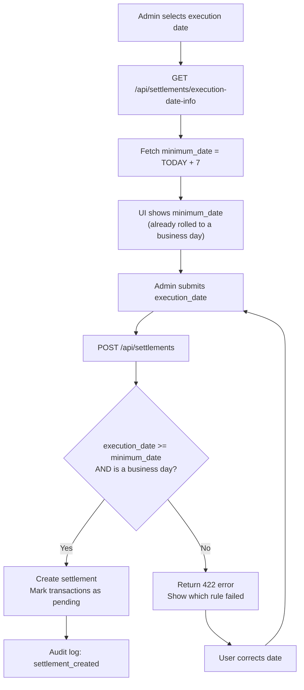

# ADR-0009: Settlement Lead Times

**Status**: Accepted (amended 2026-08-10)

**Date**: 2025-01-23

**Amendment 2026-08-05 (issue #11)**: the execution date must additionally fall
on a TARGET2 business day. The original decision allowed weekends and bank
holidays, which produced an invalid `ReqdColltnDt` in the SEPA export. See
"Amendment: Bank Business Days" below; Alternative 1 is now partially adopted.

**Amendment 2026-08-10 (issue #113)**: this ADR contradicted itself. The
decision below has always said the lead time is measured from **TODAY**, but the
pseudo-code said `executionDate < settlementDate + 7 days`, and the
implementation followed the pseudo-code — against a `settlement_date` that
arrived in the request body. A caller who backdated that field could have the
bank collect tomorrow, with no SEPA pre-notification period at all. The
pseudo-code is corrected below, and `settlement_date` is removed from the
request: it is the day the server created the settlement, and it is not an input
to any rule. See "Amendment: The Anchor Is the Server's Today".

---

## Context

SEPA Direct Debit transfers require advance notice before collection. The system uses **RCUR (recurring)** sequence type, which technically requires 2 business days notice.

**Challenge**: Complex business day calculation requires:
- Holiday calendar management
- Regional holiday variants
- Weekend exclusions
- Complex validation logic
- Database tables for holiday management

**Pragmatic approach**: Use a fixed lead time of **7 calendar days** instead of calculating business days. This eliminates holiday calendar complexity entirely while providing sufficient buffer for most organizations.

---

## Decision

**Settlement execution dates must be at least 7 calendar days in the future (TODAY + 7 days minimum) and must fall on a TARGET2 bank business day. No holiday calendar table required — the six TARGET2 closing days are computed, not stored.**

### Core Principles

1. **Fixed 7-day minimum lead time**: Execution date ≥ TODAY + 7 calendar days
2. **Calendar days for the lead time**: The buffer is counted in calendar days, not business days
3. **Business day for the date itself**: The chosen date must be Mon–Fri and not a TARGET2 closing day
4. **No holiday management**: No bank_holidays table; the closing days are derived from the year
5. **Stateless validation**: Both rules are pure functions of the input dates

### Amendment: Bank Business Days

SEPA requires `ReqdColltnDt` to be a day on which TARGET2 settles. The original
rule permitted any calendar date, so a weekend date passed validation and was
written verbatim into the export. Banks either shift such a date silently or
reject the file (stricter portal validators do the latter).

**TARGET2 closing days** — the complete set, unchanged since the ECB fixed it in 2002:

| Day | Determination |
|-----|---------------|
| 1 January | Fixed |
| Good Friday | Easter Sunday − 2 days |
| Easter Monday | Easter Sunday + 1 day |
| 1 May | Fixed |
| 25 December | Fixed |
| 26 December | Fixed |

Easter is computed with the Anonymous Gregorian (Meeus/Jones/Butcher) algorithm.
Regional and national holidays are deliberately excluded: TARGET2 governs SEPA
settlement, and local closures do not move the collection date.

**Rejection, not correction**: an invalid `execution_date` is rejected with 422
rather than silently rolled forward. Rewriting a caller-supplied date would make
the stored settlement differ from the request with no trace in the audit log.
Clients that need a valid date ask for one (see the endpoint below).

### Amendment: The Anchor Is the Server's Today

The lead time exists to guarantee the SEPA pre-notification period. A period
counted from a date the caller chose is not a guarantee — the caller can move
it. So the anchor is the one date the caller does not control:

1. **The anchor is the server's current date.** `execution_date >= today + 7`,
   where `today` is read from the server clock at validation time.
2. **`settlement_date` is not a request field.** It records the day the server
   created the settlement. Nothing reads it as a rule input. A `settlement_date`
   in a request body is ignored rather than rejected, matching how
   `settlement_type`/`manual_reason` were retired in ruling #163.
3. **One clock for suggestion and validation.** `GET /admin/settlements/execution-date-info`
   and the creation endpoints read the same anchor, so what the server suggests
   is by construction what the server accepts.

Point 3 also closes a second, non-malicious symptom of the same root cause. The
suggested `minimum_date` came from the server (UTC), while a browser built its
`settlement_date` from the local clock; between 22:00 and 24:00 CEST the browser
was already on the next calendar day, and the lead-time check rejected the very
pair the server had just proposed. An admin in Germany could not create a
settlement for two hours every evening. Issue #194 patched the client half by
publishing `today` on `ExecutionDateInfo` and having the UI use it; removing the
field from the request retires the class of bug rather than the instance.

### Validation Algorithm

**Pseudocode: Settlement Execution Date Validation**

```
Function IsBusinessDay(date):
  if date is Saturday or Sunday:
    return false
  return date not in Target2Holidays(year of date)

Function Target2Holidays(year):
  easter = EasterSunday(year)          // Anonymous Gregorian algorithm
  return [Jan 1, easter - 2, easter + 1, May 1, Dec 25, Dec 26]

Function NextBusinessDay(date):
  while not IsBusinessDay(date):       // may advance up to 4 days at Easter
    date = date + 1 day
  return date

Function ValidateExecutionDate(executionDate):
  // TODAY is the server's calendar day. There is no second parameter: no
  // caller-supplied date takes part in this rule (issue #113).
  if executionDate < TODAY + 7 days:
    return [false, "execution_date must be at least 7 days from today - <TODAY + 7> or later"]
  if not IsBusinessDay(executionDate):
    return [false, "execution_date must be a bank business day"]
  return [true, "Valid"]

Function GetMinimumExecutionDate():
  return NextBusinessDay(TODAY + 7 days)   // same TODAY as above, by construction
```

The frontend must **not** reimplement this. `GET /admin/settlements/execution-date-info`
is the single source of truth, so the Easter computation exists in one language only.

### Data Structures

#### Settlement Record

| Column | Type | Description |
|--------|------|-------------|
| id | UUID | Unique settlement identifier |
| period_start | DATE | Start of transaction period included in settlement |
| period_end | DATE | End of transaction period |
| sepa_execution_date | DATE | Date bank executes debit collections (must be ≥ TODAY + 7, measured on the server) |
| created_at | DATETIME | Settlement creation timestamp |
| finalized_at | DATETIME | Settlement finalization timestamp (when marked complete) |

#### API Endpoint Response

`GET /admin/settlements/execution-date-info`:

```json
{
  "today": "2026-08-05",
  "minimum_date": "2026-08-12",
  "lead_time_days": 7,
  "rule": "execution_date >= today + 7 calendar days, rolled to the next bank business day (Mon-Fri, excluding TARGET2 closing days)"
}
```

`today` is the anchor `minimum_date` was derived from, published so the UI can
state which "today" the rule means. It is informational — the server re-reads
its own clock at validation time either way.

### Mermaid Diagram: Settlement Execution Date Validation Flow



---

## Consequences

### Positive

✅ **Valid SEPA dates**: `ReqdColltnDt` is always a TARGET2 settlement day, so no bank shifts the date and no portal validator rejects the file
✅ **Still no holiday calendar**: No regional logic, no external sync, no maintenance of holiday data
✅ **No database overhead**: Eliminates bank_holidays table entirely
✅ **Safe buffer**: 7 calendar days provides ample lead time for SEPA processing (≈ 5 business days)
✅ **Pragmatic**: Covers real-world use cases (member bar settlements typically not on weekends)
✅ **Maintainability**: Single validation rule, easy to understand and audit
✅ **No dependencies**: No external holiday services or complex algorithms
✅ **Predictable**: Same rule for all regions and organizations
✅ **Not negotiable by the caller**: the anchor is the server clock, so no request can shorten the pre-notification period (issue #113)
✅ **Reduced code**: Minimal validation code vs. business day calculator with holiday rules

### Negative

❌ **Less precise**: May require longer lead time than SEPA minimum (2 business days)
❌ **Calendar days, not business days**: 7 calendar days > 2 business days (acceptable for small orgs)
❌ **No flexibility**: Same 7-day rule regardless of organization needs
❌ **Effective lead time varies**: Good Friday through Easter Monday is four consecutive closing days, so the suggested minimum can land at TODAY + 11
❌ **Easter algorithm to maintain**: ~10 lines of date arithmetic that must stay correct; pinned by unit tests against known Easter dates

### Mitigations

1. **Sufficient buffer**: 7 calendar days ≈ 5 business days on average (exceeds SEPA 2-day requirement)
2. **Pragmatic for small organizations**: Weekend settlements rare for member-run bars/clubs
3. **Future adjustment**: If needed, can lower to 5 days (still ≈ 3-4 business days)
4. **User communication**: Admin UI clearly shows 7-day rule and minimum date

---

## Alternatives Considered

### Alternative 1: Business Day Calculation with Holiday Calendar

Track weekends and German holidays; require 2 business days.

**Pros**: More precise, exact SEPA compliance
**Cons**:
- Complex code (BusinessDayCalculator class)
- Holiday database maintenance required
- Regional holiday variants add complexity
- Easter date calculation needed
- External holiday sync (future enhancement)

**Partially adopted (2026-08-05, issue #11)**. The original rejection was too
broad: it discarded the weekend and holiday *check* along with the calendar
*infrastructure*. What is now adopted is the stateless half — a business-day
check against the six computed TARGET2 closing days, including the Easter
calculation. What remains rejected is the stateful half: no bank_holidays table,
no regional variants, no external sync, and the lead time itself is still
counted in calendar days rather than business days.

### Alternative 2: No Lead Time (Execute Immediately)

Allow settlements any time.

**Pros**: Maximum flexibility
**Cons**:
- Bank rejection risk (insufficient SEPA notice)
- Compliance issues
- No time for admin review

**Rejected**: Insufficient notice creates bank processing issues.

### Alternative 3: Fixed Execution Date (e.g., always 15th of month)

All settlements execute on same calendar date.

**Pros**: Simple, predictable
**Cons**:
- Not flexible per settlement
- Doesn't match organization preferences
- May fall on a weekend or closing day

**Rejected**: Admin needs per-settlement control.

### Alternative 4: 3-Day Lead Time (Calendar Days)

Shorter buffer.

**Pros**: More frequent settlements
**Cons**:
- Closer to SEPA minimum (2 business days)
- Less margin for error
- May cause bank rejections

**Rejected**: 7 days provides safer buffer.

### Alternative 5: 14-Day Lead Time (Calendar Days)

Longer buffer.

**Pros**: Very conservative, very safe
**Cons**:
- Much longer settlement cycle
- May not match business needs
- Excessive for small organizations

**Rejected**: 7 days sufficient; 14 days excessive.

---

## Related Decisions

- [ADR-0004: Immutable Transaction Storage](./0004-immutable-transaction-storage.md) - Settlement workflow
- [ADR-0008: SEPA XML Export Format](./0008-sepa-xml-export-format-selection.md) - Execution date in XML
- [ADR-0006: SEPA Mandate Reference Strategy](./0006-sepa-mandate-reference-strategy.md) - RCUR sequence type (no FRST)

---

## References

- **SEPA Standards**:
  - RCUR (recurring) sequence type requires 2 business days notice minimum
  - 7 calendar days ≈ 5 business days on average (exceeds SEPA minimum)
  - `ReqdColltnDt` must be a TARGET2 settlement day
  - [EPC SEPA Rulebook](https://www.europeanpaymentscouncil.eu/) - Direct Debit rules

- **TARGET2 calendar**:
  - Six closing days: 1 January, Good Friday, Easter Monday, 1 May, 25 December, 26 December
  - Unchanged since the ECB fixed the calendar in 2002
  - Easter: Anonymous Gregorian (Meeus/Jones/Butcher) algorithm

- **Date Format**:
  - ISO 8601: YYYY-MM-DD
