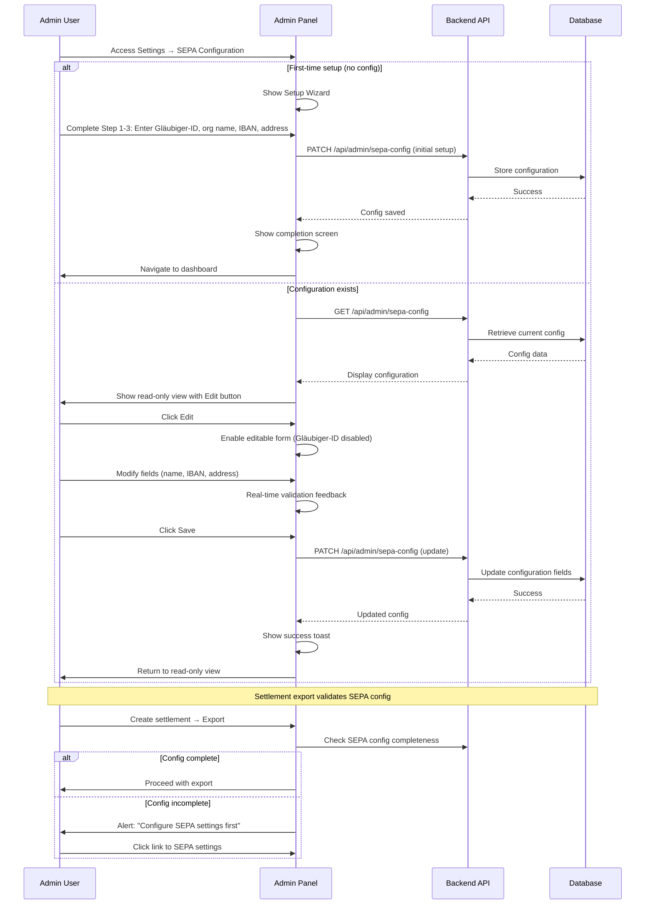

# ADR-0011: SEPA Configuration Management in Admin Frontend

**Status**: Accepted

**Date**: 2025-01-23

---

## Context

The admin panel requires a user interface for managing organization-level SEPA configuration (Gläubiger-ID, organization name, IBAN, address). This configuration is required for generating SEPA XML exports during settlement workflows.

Key requirements:
- **First-time setup**: Guide new organizations through initial SEPA configuration
- **Edit capability**: Allow admins to update mutable fields (name, IBAN, address)
- **Immutability enforcement**: Prevent changes to Gläubiger-ID after initial setup (per ADR-0007)
- **Validation**: Real-time feedback for IBAN checksums and format requirements
- **Settlement integration**: Block SEPA export if configuration is incomplete

---

## Decision

**The admin panel provides a dedicated SEPA Configuration page with a setup wizard for first-time configuration and a form-based edit interface for updates. The Gläubiger-ID field is visually disabled after initial setup to enforce immutability. Settlement export validates configuration completeness before proceeding.**

---

## Implementation

### SEPA Configuration Panel Features

The admin panel provides a dedicated settings page for SEPA configuration management. The interface must support the following workflows:

| Feature | Type | Requirement | Validation |
|---------|------|-------------|-----------|
| Gläubiger-ID | Text | Required, immutable after initial set | Format: 2 letters + 3 alphanumeric + 10+ digits (e.g., DE98ZZZ09999999999) |
| Organization Name | Text | Required, mutable | Max 70 characters, Latin letters + numbers + basic punctuation |
| Organization IBAN | Text | Required, mutable | Must pass IBAN checksum validation (mod-97 algorithm) |
| Street Address | Text | Required, mutable | Max 255 characters |
| City/Postal Code | Text | Required, mutable | Max 255 characters |
| Country | Dropdown | Required, mutable | SEPA-participating country (DE, AT, CH, etc.) |
| Last Updated | Display | Metadata | Shows timestamp and admin who last modified |

### UX Requirements

1. **Initial Setup Wizard**: Multi-step guided flow for organizations without SEPA configuration
   - Step 1: Welcome and prerequisites (Gläubiger-ID application)
   - Step 2: Instructions for obtaining Gläubiger-ID
   - Step 3: Configuration form
   - Step 4: Confirmation

2. **Read-Only View**: Display current configuration with edit button

3. **Edit Mode**: Form with real-time validation feedback

4. **Immutability Enforcement**: Gläubiger-ID field visually disabled after initial set; lock icon clarifies why

5. **Help Text**: Each field includes contextual help and links (e.g., Bundesbank Gläubiger-ID application)

6. **Error Handling**: Clear error messages on validation failure and API errors

7. **Success Feedback**: Toast notifications on successful save; indication of changed fields

8. **Settlement Integration**: Settlement export requires valid SEPA configuration; alert if incomplete

### Admin SEPA Configuration Workflow



---

## Consequences

### Positive

✅ **User-friendly setup**: Wizard guides admins step-by-step through initial configuration
✅ **Clear immutability**: Visual affordance (disabled input) makes creditor_id immutable
✅ **Real-time feedback**: Validation errors shown as user types (better UX than form submission)
✅ **Helpful documentation**: Links to Bundesbank and SEPA rules embedded in UI
✅ **Prevents data loss**: Confirmation dialogs and clear "what changed" feedback
✅ **Accessible layout**: Form grouped logically (creditor vs address)
✅ **Integration**: Settlement export requires valid config (prevents bank rejection)

### Negative

❌ **Client-side validation**: Duplicate validation logic (also in backend)
❌ **State management**: Multiple components accessing shared SEPA config
❌ **Offline unavailable**: Admin panel requires network (unlike terminal)

### Mitigations

1. **Validation duplication**: Use shared validation library (separate module) for client/server
2. **State management**: Use Zustand/Redux store for SEPA config (single source of truth in frontend)
3. **Network resilience**: Show cached config if API fails; alert user that changes not saved

---

## Alternatives Considered

### Alternative 1: Minimal Admin UI (Just Read-Only Display)

```jsx
function SEPAConfigPanel() {
  return (
    <div>
      <h2>SEPA Configuration (Read-Only)</h2>
      <Alert>To update SEPA settings, contact your system administrator</Alert>
      <DisplayCurrentConfig />
    </div>
  );
}
```

**Pros**: Simplest implementation; prevents accidental changes
**Cons**:
- Admins can't update bank account details without technical help
- Reduces self-service capability
- No onboarding experience for first-time setup

**Rejected**: Admins need autonomy to update SEPA settings (address, bank account changes).

### Alternative 2: Backend Admin Endpoint Only (No UI)

Configuration manageable only via:
- Direct API calls (curl/Postman)
- Backend configuration file

**Pros**: Minimal frontend code
**Cons**:
- Non-technical admins can't use
- Error-prone (no validation UX)
- No audit trail visibility
- Difficult to debug issues

**Rejected**: Admin panel must provide accessible interface for administrators.

### Alternative 3: Inline Editing (No Modal/Page)

Display config inline with "edit" buttons next to each field:
- Click field → becomes editable input
- Click checkmark → save that field
- Click X → cancel

**Pros**: Quick edits, no page navigation
**Cons**:
- No clear form boundaries
- Partial saves confusing ("which fields changed?")
- Harder to validate cross-field dependencies
- Less clear about immutable fields

**Rejected**: Form approach better for validation and user understanding.

### Alternative 4: All Fields Mutable (No Immutability)

Allow creditor_id to be changed via UI without restriction.

**Pros**: Simpler logic (no immutability checks)
**Cons**:
- Violates SEPA business requirement
- Accidental changes break settlements
- Audit trail shows changes but can't be prevented
- Confusing for admins

**Rejected**: creditor_id must be immutable per SEPA rules and ADR-0007.

---

## Implementation Notes

The Admin Panel uses React with Mantine 7 components. Key implementation considerations:

- Use React Hook Form for form state management with Zod for validation
- Store SEPA config in application state (Zustand/Redux) to avoid duplicate requests
- IBAN validation: Implement mod-97 checksum algorithm client-side; backend also validates
- Wizard should guide admins step-by-step; allow backing up but disable skipping
- Settlement export validation: Check `creditor_id` is set before allowing SEPA XML generation
- Add to Admin Menu under Settings → SEPA Configuration (or General/Organization Settings)

---

## Related Decisions

- [ADR-0007: Organization-Level SEPA Configuration Storage](./0007-organization-sepa-configuration-storage.md) - Backend storage model
- [ADR-0005: IBAN Storage and Validation](./0005-iban-storage-and-validation.md) - IBAN validation patterns
- [ADR-0006: SEPA Mandate Reference Strategy](./0006-sepa-mandate-reference-strategy.md) - Uses creditor config
- [ADR-0008: SEPA XML Export Format Selection](./0008-sepa-xml-export-format-selection.md) - XML generation uses config
- [ADR-0009: Settlement Lead Times and Bank Working Days](./0009-settlement-lead-times-bank-working-days.md) - Pre-export validation

---

## References

- **Admin Panel Architecture**: Mantine 7 component library, React Hook Form for validation
- **SEPA Standards**: EPC SEPA Rulebook (configuration requirements)
- **Bundesbank**: [Gläubiger-ID Application](https://www.glaeubiger-id.bundesbank.de)
- **UX Patterns**: Wizard patterns, immutability affordances

---

## Post-Implementation Monitoring

- Track admin setup completion rate (% of organizations completing SEPA config)
- Monitor form submission errors (which fields most problematic?)
- Gather feedback: Is UI intuitive for non-technical admins?
- Track configuration change frequency (should be rare)
- Test with real admins: Can they complete setup without support?
- Bank acceptance: Do exports succeed on first attempt?
