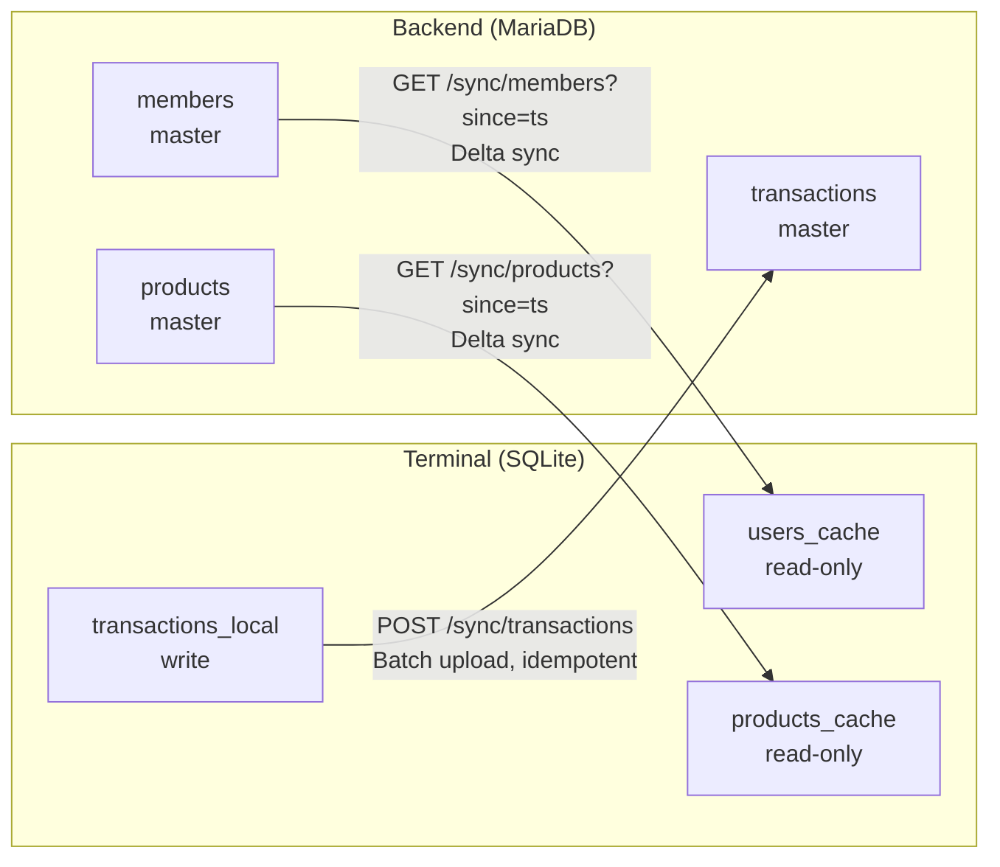
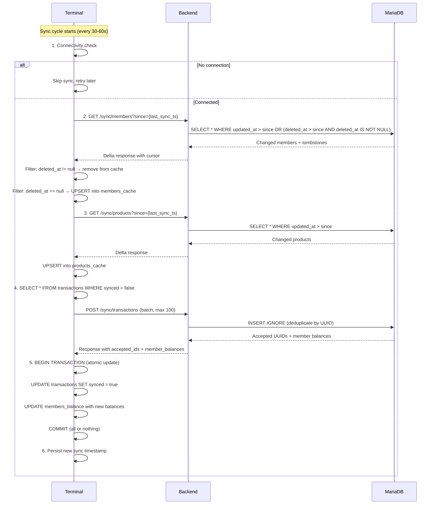

# ADR-0012: Eventual Consistency and Frontend Caching Strategy

**Status**: Accepted

**Date**: 2025-01-23

---

## Context

The Ruderbar system operates across multiple components: Electron-based terminals (potentially multiple), a PHP backend, and a MariaDB database. Terminals must function in environments with unreliable or intermittent network connectivity (community centers, clubs, remote locations).

Key constraints and requirements:

1. **Offline operation**: Terminals must process transactions without network connectivity
2. **Multi-terminal deployment**: Multiple terminals may operate simultaneously
3. **Bandwidth efficiency**: Sync should minimize data transfer (limited/metered connections)
4. **Conflict avoidance**: System must handle concurrent operations without complex merge logic
5. **Data integrity**: Financial transactions must never be lost or duplicated
6. **Audit compliance**: Complete transaction history required for accounting/tax purposes
7. **Shared hosting**: Backend runs on standard PHP hosting without WebSockets or background workers

---

## Decision

**The system uses an eventually consistent architecture where terminals maintain a local SQLite cache of master data (members, products) and queue transactions locally. Periodic delta synchronization reconciles state with the backend. Conflicts are avoided through single-writer patterns and append-only transaction storage.**

### Core Principles

1. **Eventually consistent**: Frontend operates on local data; short-term inconsistencies are accepted
2. **Offline-first**: Terminal is fully functional without network; syncs when connectivity is available
3. **Single writer per entity type**: Members/products are read-only on terminals (backend is authoritative)
4. **Append-only transactions**: No updates or deletes; corrections via reverse transactions
5. **Idempotent sync**: Client-generated UUIDs enable safe retry without duplication
6. **Data minimization**: Terminals cache only operationally necessary fields

### Data Flow Directions



### Cached Data (Terminal)

| Entity | Direction | Cache Type | Fields Stored |
|--------|-----------|------------|---------------|
| Members | Backend → Terminal | Read-only | id, card_uid, first_name, last_name, preferred_language, is_active, deleted_at |
| Products | Backend → Terminal | Read-only | id, names (JSON), prices_cents, category, is_active |
| Transactions | Terminal → Backend | Write queue | id, member_id, product_id, amount_cents, created_at, synced (flag) |
| Member Balances | Backend → Terminal | Read-only | member_id, balance_cents, last_updated_at |

**Not cached on terminal** (sensitive data remains backend-only):
- IBAN, BIC, mandate_reference
- Full contact details
- Audit logs
- Complete transaction history (fetched on-demand via [ADR-0024](./0024-transaction-history-retrieval-terminal.md))

### Synchronization Cycle



**See [ADR-0023: Terminal Balance State Management](./0023-terminal-balance-state-management.md) for details on step 5 balance update.**

### Delta Sync Protocol Implementation

#### Timestamp Protocol

**Client-Server Protocol:**
- Clients send `since` parameter in **milliseconds** (Unix timestamp * 1000)
- Backend repositories convert to seconds only when needed for SQL `DATE()` function
- Responses include `cursor` field (milliseconds) representing "all changes before this timestamp have been processed"

**Cursor Semantics:**
```
cursor = timestamp of last item in result set (if results exist)
         OR input `since` value (if no results)
```

**Rationale for returning input cursor when no results:**

Race condition scenario if cursor advances to "current time":
```
1. Client queries at T1 (e.g., 10:00:00.000)
2. Backend executes query (takes 50ms)
3. New item created at T1+25ms (10:00:00.025) - after query started
4. Backend returns cursor = T2 (10:00:00.050) - current time
5. Client next sync uses since = T2
6. Item created at T1+25ms is LOST (between T1 and T2, not captured)
```

Solution: Return input cursor when no results:
```
1. Client queries at T1 (10:00:00.000)
2. Backend finds no results (no items modified after T1)
3. Backend returns cursor = T1 (input value)
4. New item created at T1+25ms (10:00:00.025)
5. Client next sync uses since = T1
6. Item is captured (created after T1)
```

**Performance impact**: Negligible. Index seeks on `(updated_at, deleted_at)` are O(log n), cheap even when re-checking the same time window.

#### Query Operator Choice

**Use `>` (strictly greater than), not `>=` (greater or equal):**

```sql
-- CORRECT: Only items strictly after cursor
WHERE updated_at > ? OR (deleted_at > ? AND deleted_at IS NOT NULL)

-- WRONG: Re-syncs items at exact cursor timestamp infinitely
WHERE updated_at >= ? OR (deleted_at >= ? AND deleted_at IS NOT NULL)
```

**Rationale:**
- Cursor represents "all changes up to and including this timestamp have been processed"
- Using `>=` would re-sync the last item from previous batch in every subsequent sync
- With `>`, items at exact cursor timestamp are excluded (already processed)

#### Deletion Protocol (Tombstones)

**Backend Schema:**
```sql
ALTER TABLE members ADD COLUMN deleted_at DATETIME DEFAULT NULL;
ALTER TABLE members ADD COLUMN deleted_by_admin_id VARCHAR(36) DEFAULT NULL;
ALTER TABLE categories ADD COLUMN deleted_at DATETIME DEFAULT NULL;
ALTER TABLE categories ADD COLUMN deleted_by_admin_id VARCHAR(36) DEFAULT NULL;
ALTER TABLE products ADD COLUMN deleted_at DATETIME DEFAULT NULL;
ALTER TABLE products ADD COLUMN deleted_by_admin_id VARCHAR(36) DEFAULT NULL;

CREATE INDEX idx_members_sync_combined ON members(updated_at, deleted_at);
CREATE INDEX idx_categories_sync_combined ON categories(updated_at, deleted_at);
CREATE INDEX idx_products_sync_combined ON products(updated_at, deleted_at);
```

**Sync Query Pattern:**
```php
public function findModifiedSince(int $sinceTimestamp): array
{
    $sinceSeconds = (int) ($sinceTimestamp / 1000);
    $sinceDate = date('Y-m-d H:i:s', $sinceSeconds);

    // Use > (not >=) to avoid re-syncing items at exact cursor
    $stmt = $this->db->prepare(
        'SELECT * FROM members
         WHERE updated_at > ? OR (deleted_at > ? AND deleted_at IS NOT NULL)
         ORDER BY COALESCE(updated_at, deleted_at) ASC'
    );
    $stmt->execute([$sinceDate, $sinceDate]);
    return $stmt->fetchAll();
}
```

**Service Layer Cursor Logic:**
```php
public function syncSince(int $since): SyncResultDto
{
    $rows = $this->membersRepository->findModifiedSince($since);
    $members = array_map(fn($row) => MemberDto::fromRow($row), $rows);

    // When no changes: return input cursor to avoid race condition
    // (items created during query execution won't be lost)
    $cursor = !empty($rows)
        ? SyncResultDto::dateToTimestamp(end($rows)['updated_at'])
        : $since;  // NOT microtime(true) * 1000

    return new SyncResultDto(items: $members, cursor: $cursor, hasMore: false);
}
```

**Terminal DTOs:**
```dart
// member_dto.dart, category_dto.dart, product_dto.dart
final String? deletedAt;
bool get isDeleted => deletedAt != null;

// fromJson
deletedAt: json['deleted_at'] as String?,

// toJson
'deleted_at': deletedAt,
```

**Terminal Sync Service:**
```dart
// Filter tombstones (deleted items) and remove from local cache
final deletedMembers = response.members.where((m) => m.deletedAt != null).toList();
final activeMembers = response.members.where((m) => m.deletedAt == null).toList();

// Remove deleted members from local cache
for (final deleted in deletedMembers) {
    await _membersRepo.deleteById(deleted.id);
}

// Upsert active members
await _membersRepo.upsertMembers(activeMembers);
```

**Why soft delete (tombstones) instead of hard delete:**
- Terminals must learn about deletions during sync
- Hard deletes (SQL DELETE) provide no mechanism for sync notification
- Tombstones appear in delta sync results (deleted_at > since)
- Terminal receives deleted items and removes them from local cache
- Audit trail preserved (who deleted, when)

### Conflict Avoidance Strategy

| Entity | Strategy | Rationale |
|--------|----------|-----------|
| Members | Single writer (backend only) | Terminal is read-only; no conflicts possible |
| Products | Single writer (backend only) | Terminal is read-only; no conflicts possible |
| Transactions | Append-only + UUID deduplication | No updates/deletes; idempotent inserts |

### Robustness and Error Handling

| Scenario | Behavior |
|----------|----------|
| Network unreachable | Local operation continues; transactions queued |
| Sync interrupted mid-cycle | Retry in next cycle; partial state acceptable |
| Duplicate transaction sent | Backend deduplicates via UUID (INSERT IGNORE) |
| Response lost after upload | Terminal resends; backend ignores duplicate |
| Terminal restart | Sync state persisted in SQLite; resumes cleanly |
| Member updated while offline | Terminal shows stale data until next sync |
| Member deleted while offline | RFID scan returns "Unknown member" after sync |

### Sync Intervals (Configurable)

| Data Type | Recommended Interval | Rationale |
|-----------|---------------------|-----------|
| Members/Products | 60 seconds | Master data changes infrequently |
| Transactions | 30 seconds | Financial data should sync promptly |
| Connectivity check | Before each sync | Avoid unnecessary timeout waits |

### Offline Capabilities

**Fully functional offline:**
- RFID card scanning and member lookup
- Product selection and display
- Transaction recording
- Balance display (local transactions only)

**Requires connectivity:**
- New member recognition (not yet synced)
- Price/product updates (until sync)
- Member status changes (blocked, deleted)
- Accurate cumulative balance (backend aggregation)

---

## Consequences

### Positive

- **High availability**: Terminal operates indefinitely without network
- **Simple conflict resolution**: No merge conflicts due to single-writer + append-only patterns
- **Safe retries**: Idempotent sync operations prevent data corruption
- **Bandwidth efficient**: Delta sync transfers only changed records
- **Audit-friendly**: Append-only transactions provide complete history
- **Hosting compatible**: Works on shared hosting without WebSockets or workers

### Negative

- **Temporary inconsistency**: Terminal may show stale member/product data (up to sync interval)
- **Delayed visibility**: Transactions not visible in admin panel until synced
- **Balance discrepancy**: Member's displayed balance excludes unsynced transactions from other terminals
- **No real-time updates**: Price changes require sync cycle to propagate

### Mitigations

1. **Stale data**: Display "Last synced: X minutes ago" indicator; warn after extended offline periods
2. **Balance accuracy**: Show "Local balance" disclaimer; full balance requires backend query
3. **Offline warning**: Alert after 1 hour offline; prominent warning after 24 hours

---

## Alternatives Considered

### Alternative 1: Real-Time Sync (WebSockets)

Maintain persistent WebSocket connection for instant updates.

**Pros**: Immediate consistency; real-time balance updates
**Cons**:
- Requires WebSocket-capable hosting (not shared hosting compatible)
- Complex reconnection logic
- Higher bandwidth usage
- Single point of failure if connection drops

**Rejected**: Incompatible with shared hosting constraint; adds complexity without proportional benefit for low-frequency updates.

### Alternative 2: Full Sync (No Delta)

Download complete member/product lists on each sync cycle.

**Pros**: Simpler implementation; guaranteed consistency
**Cons**:
- Bandwidth inefficient (transfers unchanged data)
- Slower sync cycles (larger payloads)
- Poor performance with large member bases

**Rejected**: Delta sync provides 90%+ bandwidth reduction for typical usage patterns.

### Alternative 3: Optimistic Locking with Conflict Resolution

Allow terminals to update members/products; resolve conflicts on sync.

**Pros**: More flexible; terminals can correct data
**Cons**:
- Complex merge logic required
- Conflict resolution UI needed
- Risk of data loss or corruption
- Audit trail complexity

**Rejected**: Single-writer pattern eliminates conflict scenarios entirely; admin panel handles all master data changes.

### Alternative 4: Synchronous API Calls (No Local Cache)

Query backend for every operation; no local storage.

**Pros**: Always consistent; no cache invalidation concerns
**Cons**:
- Non-functional offline
- High latency for every operation
- Network dependency for basic functions
- Poor user experience

**Rejected**: Violates offline-first requirement; unacceptable for unreliable network environments.

---

## Related Decisions

- [ADR-0004: Immutable Transaction Storage](./0004-immutable-transaction-storage.md) - Append-only pattern enables conflict-free sync
- [ADR-0003: GZIP Compression for HTTP](./0003-gzip-compression-http.md) - Reduces sync payload sizes by ~85%
- [ADR-0023: Terminal Balance State Management](./0023-terminal-balance-state-management.md) - Member balances cached locally and updated during sync
- [ADR-0024: Transaction History Retrieval in Terminal](./0024-transaction-history-retrieval-terminal.md) - On-demand transaction history fetching (separate from sync cycle)

---

## References

- **Offline-First Design**: [Offline First Community](https://offlinefirst.org/)
- **Eventual Consistency**: [CAP Theorem](https://en.wikipedia.org/wiki/CAP_theorem)
- **Idempotency Patterns**: [Idempotent REST APIs](https://restfulapi.net/idempotent-rest-apis/)
- **SQLite in Electron**: [better-sqlite3](https://github.com/WiseLibs/better-sqlite3)

---

## Post-Implementation Monitoring

- Track sync failure rates and retry patterns
- Monitor average sync cycle duration
- Measure offline operation duration distribution
- Alert on terminals offline > 24 hours
- Track transaction upload latency (creation to sync)
- Monitor cache hit rates for member/product lookups
