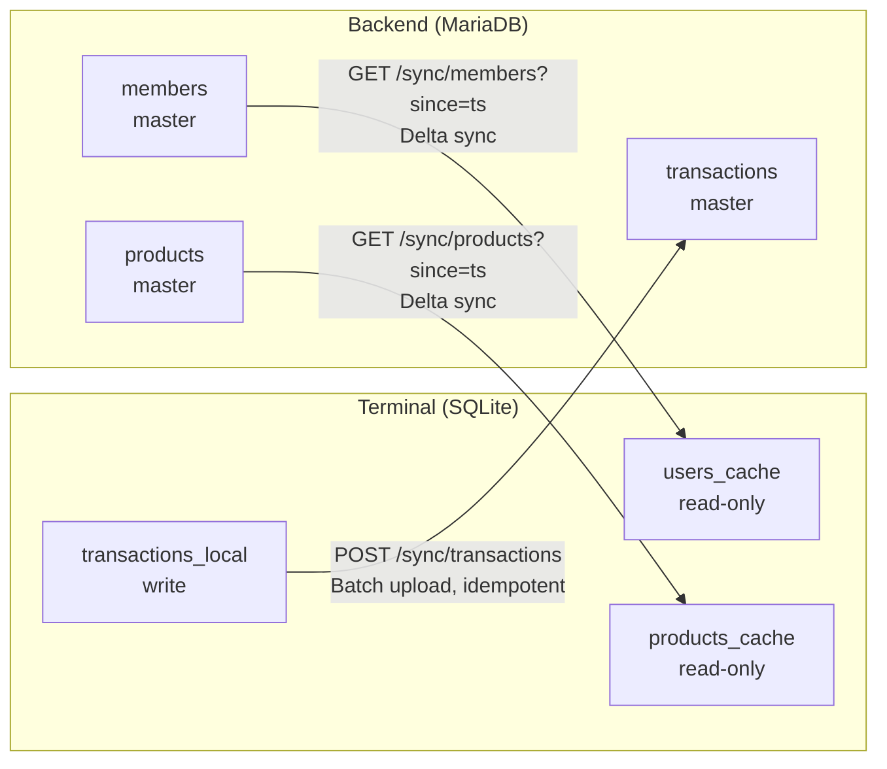
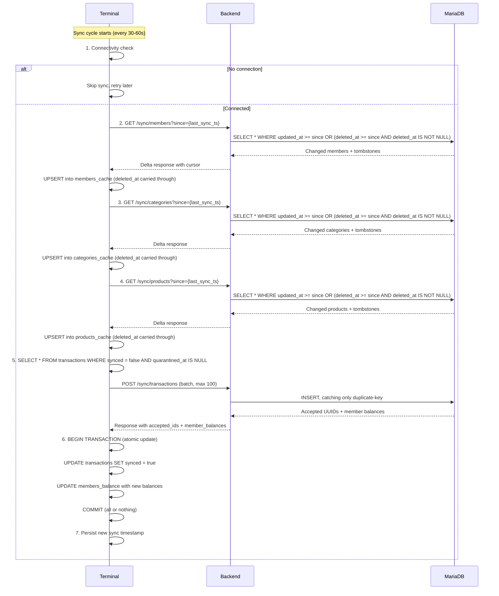

# ADR-0012: Eventual Consistency and Frontend Caching Strategy

**Status**: Accepted

**Date**: 2025-01-23

---

## Context

The Club Bar system operates across multiple components: Electron-based terminals (potentially multiple), a PHP backend, and a MariaDB database. Terminals must function in environments with unreliable or intermittent network connectivity (community centers, clubs, remote locations).

Key constraints and requirements:

1. **Offline operation**: Terminals must process transactions without network connectivity
2. **Multi-terminal deployment**: Multiple terminals may operate simultaneously
3. **Bandwidth efficiency**: Sync should minimize data transfer (limited/metered connections)
4. **Conflict avoidance**: System must handle concurrent operations without complex merge logic
5. **Data integrity**: Financial transactions must never be lost or duplicated
6. **Audit compliance**: Complete transaction history required for accounting/tax purposes
7. **Shared hosting**: Backend runs on standard PHP hosting without WebSockets or background workers

---

## Decision

**The system uses an eventually consistent architecture where terminals maintain a local SQLite cache of master data (members, products) and queue transactions locally. Periodic delta synchronization reconciles state with the backend. Conflicts are avoided through single-writer patterns and append-only transaction storage.**

### Core Principles

1. **Eventually consistent**: Frontend operates on local data; short-term inconsistencies are accepted
2. **Offline-first**: Terminal is fully functional without network; syncs when connectivity is available
3. **Single writer per entity type**: Members/products are read-only on terminals (backend is authoritative)
4. **Append-only transactions**: No updates or deletes; corrections via reverse transactions
5. **Idempotent sync**: Client-generated UUIDs enable safe retry without duplication
6. **Data minimization**: Terminals cache only operationally necessary fields

### Data Flow Directions



### Cached Data (Terminal)

| Entity | Direction | Cache Type | Fields Stored |
|--------|-----------|------------|---------------|
| Members | Backend → Terminal | Read-only | id, card_uid, first_name, last_name, preferred_language, is_active, deleted_at |
| Categories | Backend → Terminal | Read-only | id, names (JSON), icon_name, is_active, deleted_at |
| Products | Backend → Terminal | Read-only | id, names (JSON), prices_cents, category, is_active, deleted_at |
| Transactions | Terminal → Backend | Write queue | id, member_id, product_id, amount_cents, created_at, synced (flag) |
| Member Balances | Backend → Terminal | Read-only | member_id, balance_cents, last_updated_at |

> **Amended 2026-08-13.** The Products row omitted `deleted_at` and Categories had no row at all, contradicting the Deletion Protocol below, which has always required the column on all three tables. The omission was not only editorial: `api/terminal.yaml` declared `deleted_at` on `Member` alone, and since the terminal's Dart client is generated from that spec, `Category` and `Product` had no such field to carry — so a deleted product stayed on sale at the bar indefinitely. See [#414](https://github.com/dgloeckner/clubbar/pull/414).

**Not cached on terminal** (sensitive data remains backend-only):
- IBAN, BIC, mandate_reference
- Full contact details
- Audit logs
- Complete transaction history (fetched on-demand via [ADR-0024](./0024-transaction-history-retrieval-terminal.md))

### Synchronization Cycle



> **Amended 2026-08-13.** The diagram showed products with a plain upsert and no
> tombstone step, and omitted categories entirely. All three now take the same
> path — and it is a **plain upsert with `deleted_at` carried through**, not the
> filter-and-delete the members step used to describe.
>
> A deletion is applied as a *flag*, never as a row removal. The terminal sets
> `PRAGMA foreign_keys = ON`, and `transactions_local` references
> `members_cache` and `products_cache` with no `ON DELETE` clause, while synced
> transactions are retained indefinitely. Deleting a cached row is therefore
> refused by SQLite, and the throw escapes the sync cycle: the members step used
> to do exactly this, so a single anonymized member who had ever bought a drink
> at that terminal stopped members, categories, products *and* the transaction
> upload, on every cycle, permanently.
>
> Keeping the row is not merely a workaround. Transaction history and the
> quarantine banner resolve product and member names through these caches, and a
> sale queued before the deletion must keep a referent it can still be uploaded
> and explained under — which it is, because the server judges a row on whether
> it can be stored, not on whether the product still exists
> ([ADR-0033](./0033-terminal-sync-contract.md) §1).
>
> Two smaller corrections in the same pass: the upload queue also excludes
> quarantined rows (ADR-0033 §4), and the server-side insert is a plain `INSERT`
> catching only the duplicate-key case — `INSERT IGNORE` is prohibited, since it
> made a discarded row indistinguishable from a stored one (ADR-0033 §5).

**See [ADR-0023: Terminal Balance State Management](./0023-terminal-balance-state-management.md) for details on step 5 balance update.**

### Delta Sync Protocol Implementation

> **Amended 2026-08-08.** The original decision made the delta window's lower bound **exclusive** (`> cursor`) to stop an item at the cursor from re-syncing forever. `TIMESTAMP` has second precision, so that rule silently dropped every row written later in the cursor's own second — permanently, since no later sync looks at that second again. See [#84](https://github.com/dgloeckner/clubbar/issues/84). The bound is now **inclusive**, and the anti-loop guarantee moved to the cursor rule instead: the cursor only steps past a second once that second is over. Amended text is marked inline.

#### Timestamp Protocol

**Client-Server Protocol:**
- Clients send `since` parameter in **milliseconds** (Unix timestamp * 1000)
- Backend repositories truncate to whole seconds for the SQL comparison, since the columns store nothing finer
- Responses include `cursor` field (milliseconds) meaning "every change *before* this second has been delivered" — amended 2026-08-08: the cursor's own second is explicitly **not** claimed as processed, which is what makes the inclusive bound below safe

**Cursor Semantics** (amended 2026-08-08):
```
no rows returned  → cursor = input `since` value
rows returned     → latest = newest updated_at/deleted_at across all returned rows
                    latest second already over at query time → cursor = latest + 1 second
                    query ran inside that second            → cursor = latest
cursor never moves backwards below the input `since`
```

The newest timestamp is taken across **both** columns of **every** returned row, not from the last row's `updated_at`: both columns are nullable, and a tombstone may carry only `deleted_at`.

"Query time" is the second in which the query was **issued**, captured before it runs. Taking it afterwards would let a write land in that second after the snapshot but before the comparison, and be stepped over.

**Rationale for returning input cursor when no results:**

Race condition scenario if cursor advances to "current time":
```
1. Client queries at T1 (e.g., 10:00:00.000)
2. Backend executes query (takes 50ms)
3. New item created at T1+25ms (10:00:00.025) - after query started
4. Backend returns cursor = T2 (10:00:00.050) - current time
5. Client next sync uses since = T2
6. Item created at T1+25ms is LOST (between T1 and T2, not captured)
```

Solution: Return input cursor when no results:
```
1. Client queries at T1 (10:00:00.000)
2. Backend finds no results (no items modified after T1)
3. Backend returns cursor = T1 (input value)
4. New item created at T1+25ms (10:00:00.025)
5. Client next sync uses since = T1
6. Item is captured (created after T1)
```

**Performance impact**: Negligible. Index seeks on `(updated_at, deleted_at)` are O(log n), cheap even when re-checking the same time window.

#### Query Operator Choice (amended 2026-08-08)

**Use `>=` (greater or equal), not `>` (strictly greater than):**

```sql
-- CORRECT: the cursor's own second is still in the window
WHERE updated_at >= ? OR (deleted_at >= ? AND deleted_at IS NOT NULL)

-- WRONG: loses every row written later in the cursor's own second, for good
WHERE updated_at > ? OR (deleted_at > ? AND deleted_at IS NOT NULL)
```

**Rationale:**

`TIMESTAMP` resolves to whole seconds, so a cursor cannot distinguish two writes inside one second:

| Time | Event | Stored `updated_at` |
|------|-------|---------------------|
| 12:00:00.2 | Member A updated | `12:00:00` |
| 12:00:00.5 | Terminal syncs, receives A, stores cursor `12:00:00` | — |
| 12:00:00.8 | Member B updated | `12:00:00` |

With `>`, every later sync asks for `> 12:00:00` and B is never delivered to that terminal. Nothing heals it: the row is only picked up if some unrelated later edit moves its timestamp. For products this means a terminal selling at a stale price indefinitely.

The original objection to `>=` — that the boundary row re-syncs forever — is answered by the cursor rule above rather than by the operator. The cursor holds inside an open second and steps past it once it is over, so the boundary second repeats at most until it closes, not indefinitely.

**Why a repeat is acceptable and a miss is not:**
- Sync payloads are keyed by `id` and applied as upserts on the terminal, so re-delivering a row is a no-op
- A missed price or membership change is silent and unbounded in time

**Rejected alternatives:** holding the cursor a fixed second back (same effect, but re-sends a full second on every poll even when idle) and adding a monotonic version/sequence column (removes the precision problem outright, but requires a schema change and a new write path on every table; reconsider if sub-second ordering is ever needed for another reason).

#### Deletion Protocol (Tombstones)

**Backend Schema:**
```sql
ALTER TABLE members ADD COLUMN deleted_at DATETIME DEFAULT NULL;
ALTER TABLE members ADD COLUMN deleted_by_admin_id VARCHAR(36) DEFAULT NULL;
ALTER TABLE categories ADD COLUMN deleted_at DATETIME DEFAULT NULL;
ALTER TABLE categories ADD COLUMN deleted_by_admin_id VARCHAR(36) DEFAULT NULL;
ALTER TABLE products ADD COLUMN deleted_at DATETIME DEFAULT NULL;
ALTER TABLE products ADD COLUMN deleted_by_admin_id VARCHAR(36) DEFAULT NULL;

CREATE INDEX idx_members_sync_combined ON members(updated_at, deleted_at);
CREATE INDEX idx_categories_sync_combined ON categories(updated_at, deleted_at);
CREATE INDEX idx_products_sync_combined ON products(updated_at, deleted_at);
```

**Sync Query Pattern** (amended 2026-08-08) — the lower bound is the cursor truncated to whole seconds, applied inclusively to both columns, ordered by whichever of the two is newer:

```
findModifiedSince(sinceMs):
    bound = truncate sinceMs to seconds, as a MySQL datetime
    SELECT * FROM <table>
     WHERE updated_at >= bound OR (deleted_at >= bound AND deleted_at IS NOT NULL)
     ORDER BY COALESCE(updated_at, deleted_at) ASC
```

**Service Layer Cursor Logic** (amended 2026-08-08) — the same rule for every syncable entity, so it lives in one shared helper (`App\Shared\Sync\SyncCursor`) rather than being restated per module:

```
syncSince(since):
    queriedAt = current second          # before the query, not after
    rows      = findModifiedSince(since)
    cursor    = SyncCursor::next(rows, since, queriedAt)   # see Cursor Semantics above
    return { items: map(rows), cursor, hasMore: false }
```

**Terminal DTOs:**
```dart
// member_dto.dart, category_dto.dart, product_dto.dart
final String? deletedAt;
bool get isDeleted => deletedAt != null;

// fromJson
deletedAt: json['deleted_at'] as String?,

// toJson
'deleted_at': deletedAt,
```

**Terminal Sync Service** (amended 2026-08-13) — a tombstone arrives in the same delta as any other change and carries every field, so the ordinary upsert applies it. There is no separate delete path, for any of the three entities:

```dart
// Tombstones included: deletedAt is written through to the cache row.
await _membersRepo.upsertMembers(response.members);
await _productsRepo.upsertCategories(response.categories);
await _productsRepo.upsertProducts(response.products);
```

Read paths then exclude tombstoned rows — the product grid filters
`deletedAt.isNull()`, a tombstoned member's card scans as unknown — while
history and quarantine displays keep resolving names through the retained row.

A tombstoned member additionally gives up their `card_uid`. The column is
`UNIQUE`, so a dead row holding a released card would block whoever the club
hands it to next, permanently.

**Why the terminal flags rather than deletes** (amended 2026-08-13):
- `transactions_local` references `members_cache` and `products_cache` under
  `PRAGMA foreign_keys = ON`, with no `ON DELETE` clause, and local transactions
  are never pruned — so SQLite *refuses* the delete and the throw escapes the
  sync cycle
- Transaction history and the quarantine banner resolve names through these
  caches; an evicted row leaves the terminal unable to say what a sale was for
- A sale queued before the deletion keeps a referent it can still be uploaded
  and explained under

**Why soft delete (tombstones) instead of hard delete, on the backend:**
- Terminals must learn about deletions during sync
- Hard deletes (SQL DELETE) provide no mechanism for sync notification
- Tombstones appear in delta sync results (deleted_at >= since)
- Past transactions still resolve their product's name through the retained row
- Audit trail preserved (who deleted, when)

### Conflict Avoidance Strategy

| Entity | Strategy | Rationale |
|--------|----------|-----------|
| Members | Single writer (backend only) | Terminal is read-only; no conflicts possible |
| Products | Single writer (backend only) | Terminal is read-only; no conflicts possible |
| Transactions | Append-only + UUID deduplication | No updates/deletes; idempotent inserts |

### Robustness and Error Handling

| Scenario | Behavior |
|----------|----------|
| Network unreachable | Local operation continues; transactions queued |
| Sync interrupted mid-cycle | Retry in next cycle; partial state acceptable |
| Duplicate transaction sent | Backend deduplicates via UUID (INSERT IGNORE) |
| Response lost after upload | Terminal resends; backend ignores duplicate |
| Terminal restart | Sync state persisted in SQLite; resumes cleanly |
| Member updated while offline | Terminal shows stale data until next sync |
| Member deleted while offline | RFID scan returns "Unknown member" after sync |

### Sync Intervals (Configurable)

| Data Type | Recommended Interval | Rationale |
|-----------|---------------------|-----------|
| Members/Products | 60 seconds | Master data changes infrequently |
| Transactions | 30 seconds | Financial data should sync promptly |
| Connectivity check | Before each sync | Avoid unnecessary timeout waits |

### Offline Capabilities

**Fully functional offline:**
- RFID card scanning and member lookup
- Product selection and display
- Transaction recording
- Balance display (local transactions only)

**Requires connectivity:**
- New member recognition (not yet synced)
- Price/product updates (until sync)
- Member status changes (blocked, deleted)
- Accurate cumulative balance (backend aggregation)

---

## Consequences

### Positive

- **High availability**: Terminal operates indefinitely without network
- **Simple conflict resolution**: No merge conflicts due to single-writer + append-only patterns
- **Safe retries**: Idempotent sync operations prevent data corruption
- **Bandwidth efficient**: Delta sync transfers only changed records
- **Audit-friendly**: Append-only transactions provide complete history
- **Hosting compatible**: Works on shared hosting without WebSockets or workers

### Negative

- **Temporary inconsistency**: Terminal may show stale member/product data (up to sync interval)
- **Delayed visibility**: Transactions not visible in admin panel until synced
- **Balance discrepancy**: Member's displayed balance excludes unsynced transactions from other terminals
- **No real-time updates**: Price changes require sync cycle to propagate
- **Boundary re-delivery** (amended 2026-08-08): a terminal polling inside the newest second of a delta receives that second's rows again on its next poll

### Mitigations

1. **Stale data**: Display "Last synced: X minutes ago" indicator; warn after extended offline periods
2. **Balance accuracy**: Show "Local balance" disclaimer; full balance requires backend query
3. **Offline warning**: Alert after 1 hour offline; prominent warning after 24 hours
4. **Boundary re-delivery**: bounded to one second's worth of rows and to the lifetime of that second; payloads are upserts keyed by `id`, so a repeat leaves the terminal's cache unchanged

---

## Alternatives Considered

### Alternative 1: Real-Time Sync (WebSockets)

Maintain persistent WebSocket connection for instant updates.

**Pros**: Immediate consistency; real-time balance updates
**Cons**:
- Requires WebSocket-capable hosting (not shared hosting compatible)
- Complex reconnection logic
- Higher bandwidth usage
- Single point of failure if connection drops

**Rejected**: Incompatible with shared hosting constraint; adds complexity without proportional benefit for low-frequency updates.

### Alternative 2: Full Sync (No Delta)

Download complete member/product lists on each sync cycle.

**Pros**: Simpler implementation; guaranteed consistency
**Cons**:
- Bandwidth inefficient (transfers unchanged data)
- Slower sync cycles (larger payloads)
- Poor performance with large member bases

**Rejected**: Delta sync provides 90%+ bandwidth reduction for typical usage patterns.

### Alternative 3: Optimistic Locking with Conflict Resolution

Allow terminals to update members/products; resolve conflicts on sync.

**Pros**: More flexible; terminals can correct data
**Cons**:
- Complex merge logic required
- Conflict resolution UI needed
- Risk of data loss or corruption
- Audit trail complexity

**Rejected**: Single-writer pattern eliminates conflict scenarios entirely; admin panel handles all master data changes.

### Alternative 4: Synchronous API Calls (No Local Cache)

Query backend for every operation; no local storage.

**Pros**: Always consistent; no cache invalidation concerns
**Cons**:
- Non-functional offline
- High latency for every operation
- Network dependency for basic functions
- Poor user experience

**Rejected**: Violates offline-first requirement; unacceptable for unreliable network environments.

---

## Related Decisions

- [ADR-0004: Immutable Transaction Storage](./0004-immutable-transaction-storage.md) - Append-only pattern enables conflict-free sync
- [ADR-0003: GZIP Compression for HTTP](./0003-gzip-compression-http.md) - Reduces sync payload sizes by ~85%
- [ADR-0023: Terminal Balance State Management](./0023-terminal-balance-state-management.md) - Member balances cached locally and updated during sync
- [ADR-0024: Transaction History Retrieval in Terminal](./0024-transaction-history-retrieval-terminal.md) - On-demand transaction history fetching (separate from sync cycle)

---

## References

- **Offline-First Design**: [Offline First Community](https://offlinefirst.org/)
- **Eventual Consistency**: [CAP Theorem](https://en.wikipedia.org/wiki/CAP_theorem)
- **Idempotency Patterns**: [Idempotent REST APIs](https://restfulapi.net/idempotent-rest-apis/)
- **SQLite in Electron**: [better-sqlite3](https://github.com/WiseLibs/better-sqlite3)

---

## Post-Implementation Monitoring

- Track sync failure rates and retry patterns
- Monitor average sync cycle duration
- Measure offline operation duration distribution
- Alert on terminals offline > 24 hours
- Track transaction upload latency (creation to sync)
- Monitor cache hit rates for member/product lookups
