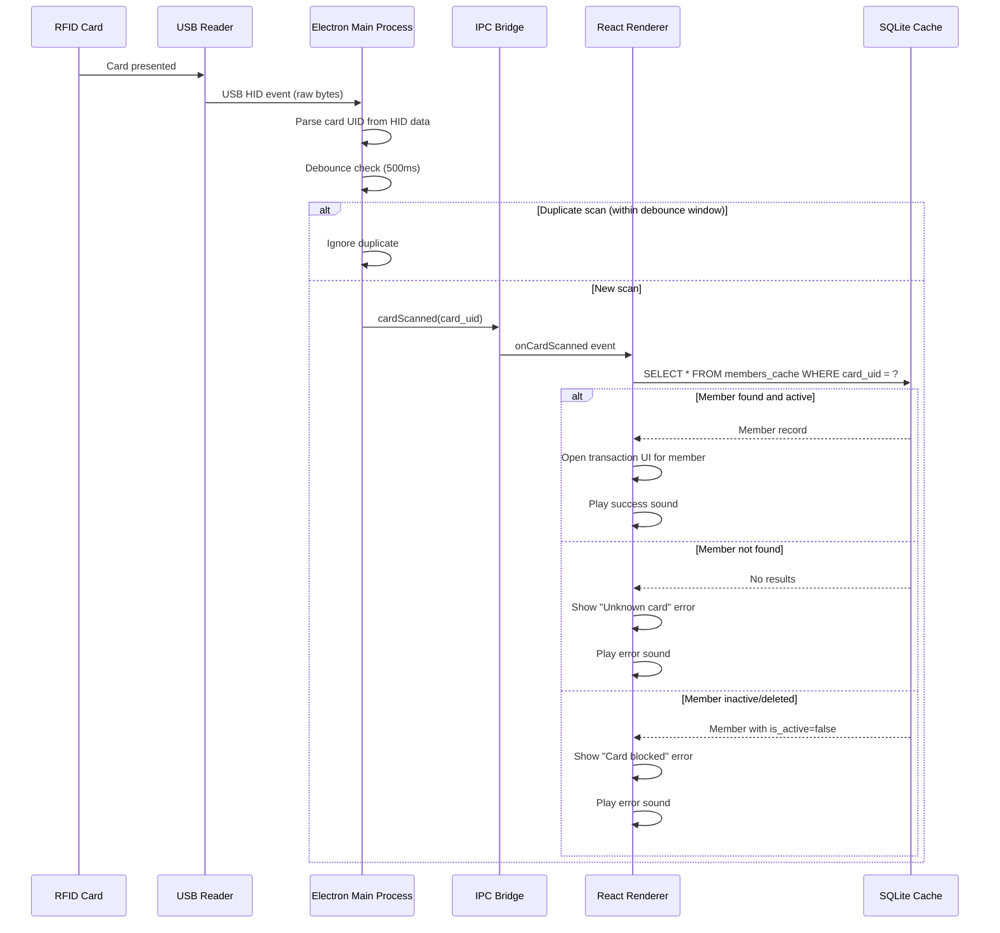
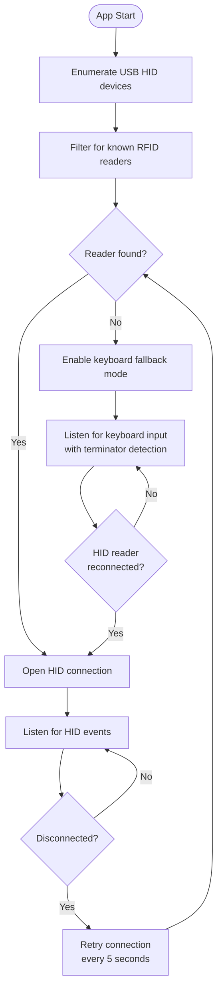

# ADR-0014: Robust RFID Scanning Integration

**Status**: Accepted

**Date**: 2025-01-23

---

## Context

The terminal application identifies members via RFID/NFC cards. Each member is assigned a card with a unique identifier (card_uid). When a card is scanned, the terminal looks up the member in the local cache and initiates the transaction workflow.

Key requirements:

1. **Hardware flexibility**: Support various USB RFID/NFC readers (Mifare, NFC, etc.)
2. **Reliability**: Handle reader disconnections, malformed reads, and rapid successive scans
3. **Performance**: Instant member lookup from local SQLite cache
4. **Security**: RFID serves as identification only, not authentication
5. **User feedback**: Clear visual/audio feedback for successful and failed scans
6. **Offline operation**: Card scanning must work without network connectivity

### Hardware Landscape

Common USB RFID/NFC readers operate in one of two modes:

| Mode | Behavior | Pros | Cons |
|------|----------|------|------|
| **Keyboard emulation** | Reader types card UID as keystrokes | Universal compatibility; no drivers | Captures keyboard focus; slower |
| **HID raw mode** | Reader sends binary data via USB HID | Faster; doesn't steal focus | Requires node-hid; device-specific parsing |

---

## Decision

**The terminal uses node-hid in the Electron main process to communicate with USB RFID readers in HID raw mode. Card UIDs are transmitted to the React renderer via IPC. Member lookup is performed against the local SQLite cache. Keyboard emulation mode is supported as fallback.**

### Core Principles

1. **Main process handles hardware**: All USB/HID communication in Electron main process (Node.js context)
2. **Secure IPC bridge**: Card events passed to renderer via contextBridge (no direct node-hid access in renderer)
3. **Local-first lookup**: Member resolution uses SQLite cache; no network required
4. **Graceful degradation**: Fallback to keyboard emulation if HID mode fails
5. **Debouncing**: Prevent duplicate scans from rapid card taps
6. **Identification, not authentication**: Card UID identifies member; terminal is pre-authorized via API token

### Architecture

### Electron Process Separation

| Responsibility | Process | Technology |
|----------------|---------|------------|
| USB device enumeration | Main | node-hid |
| HID event handling | Main | node-hid |
| Card UID parsing | Main | Custom parser per reader type |
| Debouncing | Main | Timer-based (500ms default) |
| IPC communication | Main ↔ Renderer | contextBridge, ipcMain/ipcRenderer |
| Member lookup | Renderer | better-sqlite3 via preload |
| UI feedback | Renderer | React + Mantine |
| Audio feedback | Renderer | Web Audio API |

### Card UID Handling

| Aspect | Specification |
|--------|---------------|
| Format | Hexadecimal string, uppercase (e.g., `A1B2C3D4`) |
| Length | 4-10 bytes depending on card type (8-20 hex chars) |
| Storage | VARCHAR(20) in database; indexed for fast lookup |
| Comparison | Case-insensitive (normalize to uppercase) |
| Uniqueness | Enforced at database level (UNIQUE constraint) |

### Reader Connection Management

### Error Handling

| Scenario | Behavior | User Feedback |
|----------|----------|---------------|
| Unknown card UID | Log scan attempt; do not create member | "Unknown card" message; error sound |
| Inactive member | Reject transaction | "Card blocked" message; error sound |
| Reader disconnected | Switch to keyboard fallback; retry HID | Status indicator shows "Reader disconnected" |
| Malformed HID data | Discard; log warning | None (silent failure) |
| Rapid duplicate scans | Debounce (500ms window) | None (ignore duplicates) |
| Multiple readers connected | Use first matching reader | None (automatic selection) |

### Keyboard Fallback Mode

When HID mode is unavailable, the terminal accepts keyboard input:

| Aspect | Specification |
|--------|---------------|
| Trigger | No HID reader detected; HID connection lost |
| Input capture | Global keyboard listener in renderer |
| Terminator | Enter key (reader sends UID + Enter) |
| Timeout | 100ms between keystrokes; reset buffer on timeout |
| Security | Only active when HID unavailable |

### Supported Reader Types

The system is designed to work with standard USB HID RFID/NFC readers:

| Reader Type | Card Technology | UID Length |
|-------------|-----------------|------------|
| Mifare Classic | 13.56 MHz | 4 or 7 bytes |
| Mifare DESFire | 13.56 MHz | 7 bytes |
| NFC (ISO 14443) | 13.56 MHz | 4, 7, or 10 bytes |
| EM4100 | 125 kHz | 5 bytes |

**Note**: Specific reader models may require custom HID parsing logic. The architecture supports pluggable parsers.

### Security Considerations

| Aspect | Design |
|--------|--------|
| **RFID is not authentication** | Card UID identifies member; does not authorize actions |
| **Terminal authorization** | Terminal itself is authorized via API token (Bearer header) |
| **No card secrets** | System uses UID only; no cryptographic card features |
| **Physical security** | Terminal assumed to be in trusted environment (member bar) |
| **Card cloning risk** | Accepted; social trust model (members know each other) |
| **Lost card** | Admin deactivates member or assigns new card_uid |

---

## Consequences

### Positive

- **Instant identification**: SQLite lookup is sub-millisecond
- **Offline capable**: No network required for card scanning
- **Hardware agnostic**: Works with most USB RFID/NFC readers
- **Resilient**: Automatic reconnection and keyboard fallback
- **Simple UX**: Tap card → immediate feedback

### Negative

- **No card security**: UID can be cloned (Mifare Classic vulnerability)
- **Reader-specific parsing**: Some readers may need custom HID parsers
- **Main process complexity**: Hardware handling adds complexity to main process

### Mitigations

1. **Card cloning**: Accept as known limitation; social trust model appropriate for member bars
2. **Parser maintenance**: Document HID protocol for common readers; community contributions welcome
3. **Complexity**: Isolate HID logic in dedicated module; comprehensive unit tests

---

## Alternatives Considered

### Alternative 1: Keyboard Emulation Only

Use only keyboard emulation mode; no node-hid.

**Pros**: Simpler implementation; universal reader compatibility
**Cons**:
- Reader steals keyboard focus (problematic for UI)
- Slower than HID mode
- Cannot detect reader disconnection
- Security risk (any keyboard input accepted)

**Rejected**: HID mode provides better UX and reliability; keyboard is fallback only.

### Alternative 2: Serial Port Communication

Use USB-to-serial readers with serialport library.

**Pros**: Well-documented protocol for some readers
**Cons**:
- Fewer reader options
- Additional driver requirements
- Platform-specific configuration

**Rejected**: HID is more universal and driver-free.

### Alternative 3: WebUSB in Renderer

Use WebUSB API directly in Electron renderer.

**Pros**: No IPC complexity; web-standard API
**Cons**:
- Limited device support in Electron
- Security sandbox restrictions
- Less reliable than node-hid

**Rejected**: node-hid in main process is more reliable for production use.

### Alternative 4: External Reader Service

Run separate background service for reader communication.

**Pros**: Isolates hardware complexity; language-agnostic
**Cons**:
- Additional deployment complexity
- IPC overhead between processes
- Harder to package with Electron

**Rejected**: Integrated node-hid is simpler for single-application deployment.

---

## Related Decisions

- [ADR-0012: Eventual Consistency and Frontend Caching](./0012-eventual-consistency-frontend-caching.md) - Member cache enables offline card lookup

---

## References

- **node-hid**: [GitHub - node-hid](https://github.com/node-hid/node-hid)
- **Electron IPC**: [Electron contextBridge](https://www.electronjs.org/docs/latest/api/context-bridge)
- **Mifare UID**: [NXP Mifare Documentation](https://www.nxp.com/products/rfid-nfc/mifare-hf:MC_53422)
- **USB HID Specification**: [USB HID Usage Tables](https://usb.org/document-library/hid-usage-tables-15)

---

## Post-Implementation Monitoring

- Track reader disconnection frequency and duration
- Monitor fallback mode activation rate
- Log unknown card scan attempts (potential new member onboarding)
- Measure card-to-UI latency (target: < 100ms)
- Test with multiple reader models during QA
