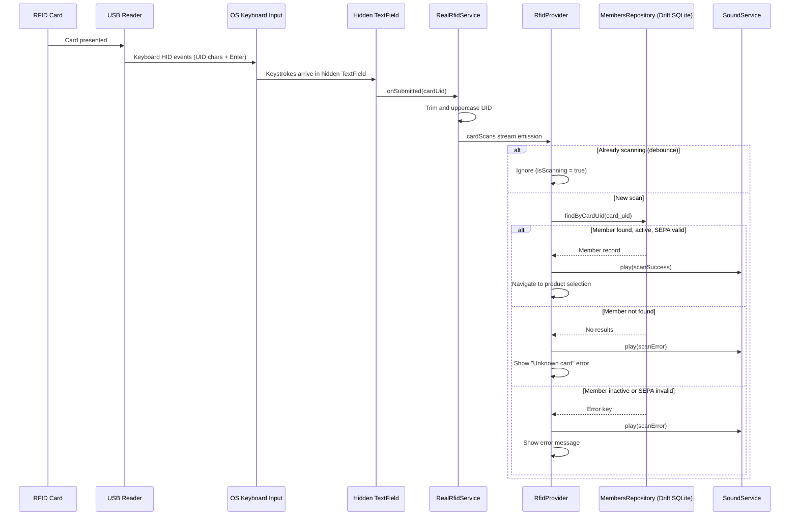
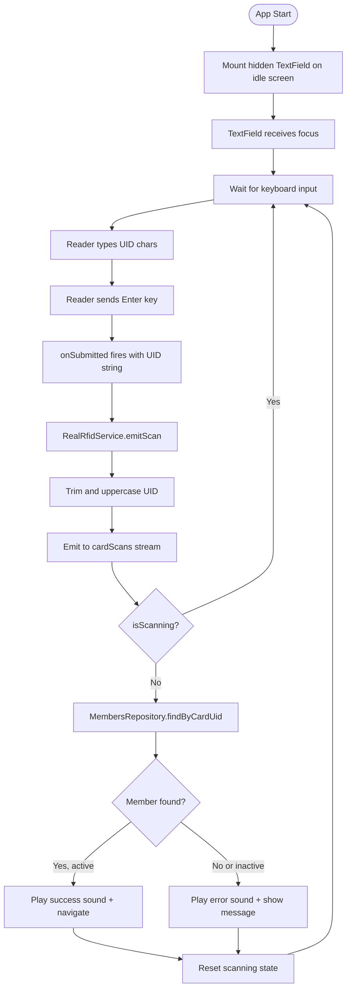

# ADR-0014: Robust RFID Scanning Integration

**Status**: Accepted (Revised)

**Date**: 2025-01-23 (Revised: 2026-03-07)

---

## Context

The terminal application identifies members via RFID/NFC cards. Each member is assigned a card with a unique identifier (card_uid). When a card is scanned, the terminal looks up the member in the local cache and initiates the transaction workflow.

Key requirements:

1. **Hardware flexibility**: Support various USB RFID/NFC readers (Mifare, NFC, etc.)
2. **Reliability**: Handle malformed reads and rapid successive scans
3. **Performance**: Instant member lookup from local SQLite cache
4. **Security**: RFID serves as identification only, not authentication
5. **User feedback**: Clear visual/audio feedback for successful and failed scans
6. **Offline operation**: Card scanning must work without network connectivity

### Hardware Landscape

Common USB RFID/NFC readers operate in one of two modes:

| Mode | Behavior | Pros | Cons |
|------|----------|------|------|
| **Keyboard emulation** | Reader types card UID as keystrokes followed by Enter | Universal compatibility; no drivers; no native dependencies | Requires hidden input field to capture keystrokes |
| **HID raw mode** | Reader sends binary data via USB HID | Faster; doesn't steal focus | Requires native USB library; device-specific parsing |

---

## Decision

**The terminal uses keyboard emulation mode as the primary RFID input method in a Flutter desktop application. RFID readers operating in keyboard emulation mode type the card UID as keystrokes followed by Enter. The Flutter app captures these via a hidden TextField whose `onSubmitted` callback emits the UID to an `RfidService` stream. Member lookup is performed against the local Drift SQLite cache.**

### Core Principles

1. **Keyboard emulation as primary**: USB RFID readers in keyboard emulation mode provide universal compatibility without native dependencies
2. **Stream-based architecture**: Card UIDs flow through a Dart `StreamController` for clean decoupling between input capture and business logic
3. **Local-first lookup**: Member resolution uses Drift SQLite cache; no network required
4. **Debounce via scanning state**: The `RfidProvider` prevents duplicate scans by tracking an `_isScanning` flag
5. **Identification, not authentication**: Card UID identifies member; terminal is pre-authorized via API token
6. **Sound feedback**: `SoundService` plays distinct sounds for success and error outcomes

### Architecture

### Flutter Architecture

| Responsibility | Component | Technology |
|----------------|-----------|------------|
| Keyboard input capture | Hidden `TextField` widget | Flutter `onSubmitted` callback |
| UID stream management | `RealRfidService` | Dart `StreamController<String>.broadcast()` |
| Card UID normalization | `RealRfidService.emitScan()` | `trim().toUpperCase()` |
| Member lookup | `MembersRepository` | Drift ORM (SQLite) |
| Scan state and navigation | `RfidProvider` | `ChangeNotifier` (Provider pattern) |
| Audio feedback | `SoundService` | `audioplayers` package |
| Mock/demo scanning | `MockRfidService` | Simulated card detection for development |

### Card UID Handling

| Aspect | Specification |
|--------|---------------|
| Format | Hexadecimal string, uppercase (e.g., `A1B2C3D4`) |
| Length | 4-10 bytes depending on card type (8-20 hex chars) |
| Storage | VARCHAR(20) in database; indexed for fast lookup |
| Comparison | Case-insensitive (normalize to uppercase) |
| Uniqueness | Enforced at database level (UNIQUE constraint) |

### Reader Input Flow

### Error Handling

| Scenario | Behavior | User Feedback |
|----------|----------|---------------|
| Unknown card UID | Log scan attempt; do not create member | "Unknown card" message; error sound |
| Inactive member | Reject transaction | "Card blocked" message; error sound |
| SEPA data invalid | Reject transaction | SEPA error message; error sound |
| Malformed input | Empty/whitespace UIDs discarded by `emitScan()` | None (silent discard) |
| Rapid duplicate scans | Blocked by `_isScanning` flag | None (ignore while processing) |
| Database error | Catch exception; set error state | Database error message; error sound |

### Supported Reader Types

The system is designed to work with standard USB HID RFID/NFC readers in keyboard emulation mode:

| Reader Type | Card Technology | UID Length |
|-------------|-----------------|------------|
| Mifare Classic | 13.56 MHz | 4 or 7 bytes |
| Mifare DESFire | 13.56 MHz | 7 bytes |
| NFC (ISO 14443) | 13.56 MHz | 4, 7, or 10 bytes |
| EM4100 | 125 kHz | 5 bytes |

**Note**: Any USB reader that supports keyboard emulation mode will work without additional configuration. The reader must be configured to output the card UID as hexadecimal characters followed by Enter.

### Security Considerations

| Aspect | Design |
|--------|--------|
| **RFID is not authentication** | Card UID identifies member; does not authorize actions |
| **Terminal authorization** | Terminal itself is authorized via API token (Bearer header) |
| **No card secrets** | System uses UID only; no cryptographic card features |
| **Physical security** | Terminal assumed to be in trusted environment (member bar) |
| **Card cloning risk** | Accepted; social trust model (members know each other) |
| **Lost card** | Admin deactivates member or assigns new card_uid |

---

## Consequences

### Positive

- **Instant identification**: Drift SQLite lookup is sub-millisecond
- **Offline capable**: No network required for card scanning
- **Universal reader compatibility**: Any USB RFID reader with keyboard emulation mode works out of the box
- **No native dependencies**: No platform-specific USB libraries needed
- **Simple UX**: Tap card, immediate feedback
- **Cross-platform**: Flutter desktop app runs on macOS, Linux, and Windows

### Negative

- **No card security**: UID can be cloned (Mifare Classic vulnerability)
- **Hidden TextField approach**: Requires careful focus management to ensure the hidden input field captures keystrokes
- **No reader status detection**: Cannot distinguish "no reader connected" from "reader connected, no card scanned"

### Mitigations

1. **Card cloning**: Accept as known limitation; social trust model appropriate for member bars
2. **Focus management**: Hidden TextField is mounted on the idle screen and auto-focused; re-focus logic handles edge cases
3. **Reader status**: Provide manual "test scan" button for operators to verify reader is working

---

## Alternatives Considered

### Alternative 1: Electron + node-hid (HID Raw Mode) — Original ADR Design

The original version of this ADR specified an Electron-based terminal using `node-hid` in the main process to communicate with USB RFID readers in HID raw mode, with card events passed to the React renderer via `contextBridge` IPC.

**Pros**: Faster than keyboard emulation; doesn't require keyboard focus; can detect reader disconnection
**Cons**:
- Requires native `node-hid` dependency (platform-specific compilation)
- Reader-specific HID parsing logic needed for each reader model
- Electron main process complexity (USB enumeration, reconnection logic)
- Terminal was ultimately built in Flutter, not Electron

**Rejected**: The terminal was implemented as a Flutter desktop app for cross-platform support and offline-first capabilities. Keyboard emulation provides universal reader compatibility without native USB dependencies, making it the natural primary approach for a Flutter app.

### Alternative 2: Serial Port Communication

Use USB-to-serial readers with a serial port library.

**Pros**: Well-documented protocol for some readers
**Cons**:
- Fewer reader options
- Additional driver requirements
- Platform-specific configuration

**Rejected**: Keyboard emulation is more universal and driver-free.

### Alternative 3: Flutter Platform Channels to Native USB

Use Flutter platform channels to invoke native USB HID APIs per platform.

**Pros**: Direct hardware access; reader status detection
**Cons**:
- Requires platform-specific native code (Swift/Kotlin/C++)
- Significant maintenance burden for three desktop platforms
- Complex build setup for native dependencies

**Rejected**: Keyboard emulation avoids all native code complexity while supporting the same readers.

### Alternative 4: External Reader Service

Run separate background service for reader communication.

**Pros**: Isolates hardware complexity; language-agnostic
**Cons**:
- Additional deployment complexity
- IPC overhead between processes
- Harder to package and distribute

**Rejected**: Integrated keyboard capture is simpler for single-application deployment.

---

## Related Decisions

- [ADR-0012: Eventual Consistency and Frontend Caching](./0012-eventual-consistency-frontend-caching.md) - Member cache enables offline card lookup

---

## References

- **Flutter KeyboardListener**: [Flutter RawKeyboardListener](https://api.flutter.dev/flutter/widgets/RawKeyboardListener-class.html)
- **Drift ORM**: [Drift — Reactive persistence library for Flutter & Dart](https://drift.simonbinder.eu/)
- **Mifare UID**: [NXP Mifare Documentation](https://www.nxp.com/products/rfid-nfc/mifare-hf:MC_53422)
- **USB HID Specification**: [USB HID Usage Tables](https://usb.org/document-library/hid-usage-tables-15)

---

## Post-Implementation Monitoring

- Log unknown card scan attempts (potential new member onboarding)
- Measure card-to-UI latency (target: < 100ms)
- Test with multiple reader models during QA
- Monitor focus loss on hidden TextField (edge case for reliability)
- Track error rates by error type (unknown card, inactive, SEPA invalid)

---

## Technology Change Note

The original version of this ADR (2025-01-23) specified an Electron-based terminal using `node-hid` for HID raw mode communication with RFID readers, `contextBridge` IPC for card events, `better-sqlite3` for member lookup, React/Mantine for UI, and Web Audio API for sound feedback. The terminal was subsequently implemented as a Flutter desktop application (see `terminal-frontend/`), using Drift ORM for SQLite, Provider for state management, and `audioplayers` for sound. This made keyboard emulation the natural primary RFID input method, as Flutter does not have a `node-hid` equivalent and keyboard emulation provides universal reader compatibility without native dependencies. This ADR was revised on 2026-03-07 to reflect the implemented architecture.
