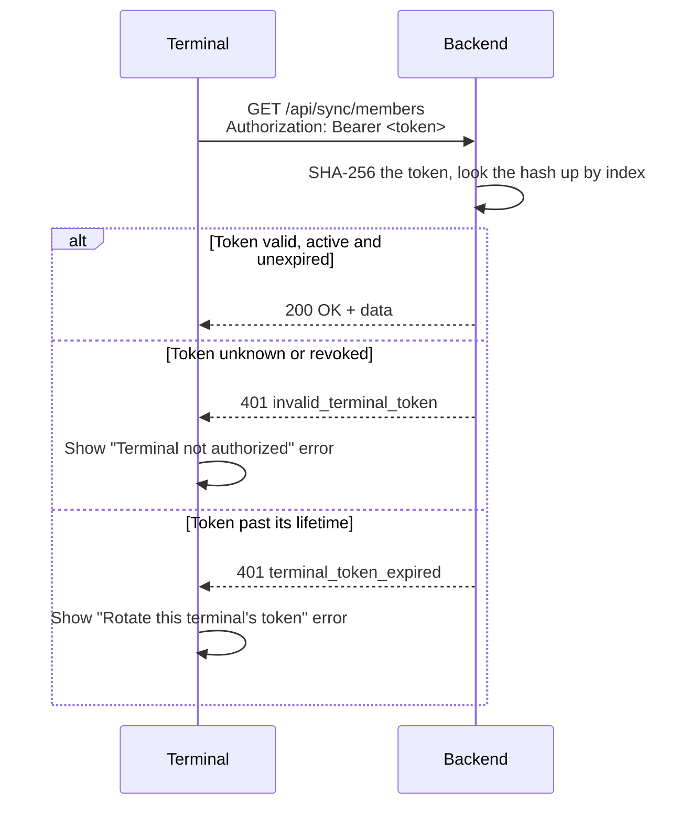
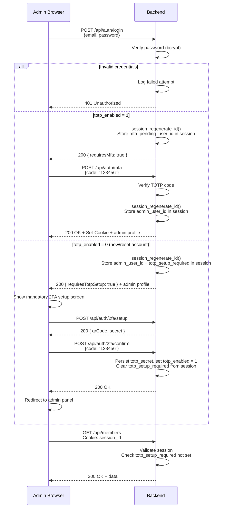

# ADR-0015: Authentication and Authorization Strategy

**Status**: Accepted (amended 2026-08-09 and 2026-08-15)
**Date**: 2025-01-23

> **Amended 2026-08-09.** Two facts about terminal tokens stated here were wrong or have since changed; the *decision* — device-level Bearer authentication, one token per terminal, revocable — is unaffected. Amended text is marked inline; the reasoning is in the [Amendment](#amendment-2026-08-09--how-a-terminal-token-is-hashed-and-how-long-it-lives) section.
>
> **Amended 2026-08-15.** Self-service credential changes now carry a step-up credential, and any credential change ends the account's other sessions. Both are additions to the admin-panel section below; see also the [ADR-0026 amendment](./0026-mandatory-totp-two-factor-authentication.md#amendment-2026-08-15--a-reset-now-ends-the-targets-sessions) for why the session behaviour changed.

## Context

The Club Bar system has two distinct client types with different security requirements:

1. **Terminal Application** (Electron): Unattended kiosk device at bar location
2. **Admin Panel** (React SPA): Management interface for administrators

Each requires appropriate authentication mechanisms that balance security with usability. Additionally, members interact with terminals via RFID cards, which must be clearly distinguished from authentication.

### Key Constraints

- Terminals operate unattended (no operator login)
- Multiple terminals may exist per deployment
- Admin users need session-based authentication
- RFID cards identify members but do not authenticate them
- Backend runs on shared hosting (no WebSockets, limited background processes)

## Decision

### Core Principles

1. **Separation of Identification and Authentication**: RFID identifies members; it does not authenticate them or grant system access
2. **Device-level Terminal Authentication**: Terminals authenticate as devices, not users
3. **Session-based Admin Authentication**: Admin panel uses traditional session cookies
4. **No Member Authentication**: Members never log in; they are identified by RFID for billing purposes only

### Terminal Authentication

Terminals authenticate using pre-shared API tokens (Bearer tokens):

```
Authorization: Bearer <terminal-api-token>
```

| Aspect | Decision |
|--------|----------|
| Token Format | 64-character hex string (256 bits entropy) |
| Token Storage | Stored in terminal's local config (outside app bundle) |
| Token Scope | One token per terminal device |
| Token Lifetime | **AMENDED 2026-08-09**: bounded — `API_TOKEN_TTL_DAYS` (default 90) from issue, enforced server-side; no automatic refresh, an admin rotates it |
| Revocation | Admin can revoke token; terminal receives 401 on next sync |

**Token Generation:**
- Generated server-side using cryptographically secure random generator
- Displayed once to admin during terminal pairing; never stored in plaintext server-side
- **AMENDED 2026-08-09**: stored as a **SHA-256** hash in the `terminals` table, not bcrypt

### RFID Identification (Not Authentication)

RFID card scans identify which member is making a purchase. This is **not authentication**:

| Aspect | RFID Identification |
|--------|---------------------|
| Purpose | Link purchase to member account |
| Trust Model | Low-trust; anyone with card can make purchases |
| Security | Physical possession of card is "authorization" |
| No Secrets | Card UID is not cryptographic; visible on card |
| Accountability | Audit trail links transactions to member UUID |

**Rationale**: This is a trusted environment (members of an organization). The goal is convenience and accountability, not security against malicious actors. Similar to a tab at a member bar.

### Admin Panel Authentication

Session-based authentication with secure cookies and mandatory TOTP second factor:

| Aspect | Decision |
|--------|----------|
| Credential | Email + password + TOTP code (mandatory) |
| Password Storage | bcrypt with cost factor 12+ |
| Second Factor | TOTP (RFC 6238) via authenticator app; mandatory for all admin users |
| Session Storage | Server-side (PHP sessions in database or files) |
| Session ID | Regenerated on login and after MFA verification (prevent fixation) |
| Cookie Attributes | `HttpOnly`, `Secure`, `SameSite=Lax` |
| Session Lifetime | 2 hours idle timeout; 24 hours absolute |
| Multi-device | Allowed; sessions tracked per device |
| Credential change | **Added 2026-08-15**: ends every other session on the account, via `admin_users.credentials_changed_at` compared against the session's own `authenticated_at` |

See [ADR-0026](./0026-mandatory-totp-two-factor-authentication.md) for the TOTP implementation decision.

### Self-service credential changes

**Added 2026-08-15.** An admin changing their own password, or their own email
address, re-proves who they are at the moment of the change: their own password
plus their own fresh TOTP code — the same step-up credential ADR-0036 requires
for cross-account actions.

| Aspect | Decision |
|--------|----------|
| Password change | Always step-up |
| Email change | Step-up, but only when the address actually moves (compared case-insensitively, as `admin_users.email` is UNIQUE under a `_ci` collation) |
| Display name, locale | No credential — these are not identity |
| Effect on other sessions | Ended (see [ADR-0026](./0026-mandatory-totp-two-factor-authentication.md) amendment); the acting session survives |
| Old address | Notified best-effort via the outbox (ADR-0038); never a gate |

The email is the login identifier, so moving it is a change to who can sign in —
a quieter account takeover than the peer resets that were already gated. The
conditionality on the email actually changing is load-bearing rather than a
nicety: the same endpoint carries the language switch, and gating every profile
write would demand a password to change locale.

Deliberately **not** an email-verification link. The outbox is drained by a
scheduler rather than sent inline, and an installation with no `mail.dsn`
discards mail at the transport — so a link-based hard gate would make the email
unchangeable on exactly the installations least able to notice why.

### Admin Authorization

All admin users have full access: CRUD all entities, settlements, GDPR workflows, user management, audit log. Access is controlled by `is_active` flag and mandatory 2FA enrollment (`totp_enabled`) on the admin user account.

New admin accounts cannot access any admin functionality until TOTP enrollment is complete. The `AdminSessionAuth` middleware enforces this: authenticated sessions with `totp_enabled = 0` are blocked from all endpoints except `/api/auth/2fa/setup` and `/api/auth/2fa/confirm`.

### Authentication Flow Diagrams

**Terminal Sync Request:**



**Admin Login Flow:**



### API Endpoint Protection

| Endpoint Pattern | Auth Required |
|------------------|---------------|
| `POST /api/auth/login` | None |
| `GET /api/sync/*` | Bearer token (Terminal) |
| `POST /api/sync/transactions` | Bearer token (Terminal) |
| `GET /api/members` | Session (Admin) |
| `POST /api/members` | Session (Admin) |
| `POST /api/members/{id}/anonymize` | Session (Admin) |
| `GET /api/audit-log` | Session (Admin) |
| `GET /api/admin-users` | Session (Admin) |

## Consequences

### Positive

- **Simple terminal deployment**: No user credentials to manage per terminal
- **Clear trust model**: RFID identification is explicit about being low-trust
- **Standard patterns**: Session-based auth is well-understood and supported
- **Revocable access**: Terminals can be deauthorized instantly
- **Audit trail**: All admin actions logged with user identity

### Negative

- **Token rotation is manual**: No automatic token refresh; requires admin intervention
- **Token expiry is an unannounced outage**: nothing warns before `token_expires_at` arrives, so the first symptom of an aged-out token is a bar that cannot sell (amended 2026-08-09)
- **Session state**: Server must store session data (minor complexity)
- **Mandatory 2FA adds onboarding friction**: New admins must install an authenticator app before first access

### Mitigations

- Token rotation documented in admin guide
- Rate limiting on login endpoint prevents brute force (see ADR-0017)
- Session timeout limits exposure window
- TOTP is widely supported (Google Authenticator, Bitwarden, 1Password, Aegis, etc.); onboarding friction is low

## Amendment 2026-08-09 — how a terminal token is hashed, and how long it lives

Two statements about terminal tokens were corrected above. Neither changes the decision this ADR records; both were facts about the mechanism that were either never true or have since been superseded.

### 1. The hash is SHA-256, not bcrypt

This ADR said bcrypt, and so did Pattern 012, `backend/technologies.md` and the patterns index. The code has never agreed since the change landed, and the discrepancy survived long enough to be quoted back as a security property in three places.

A slow hash exists because passwords are guessable: a human picks them, so an attacker holding the hash can run a dictionary. A terminal token is picked by nobody — it is 256 bits from `random_bytes()`, and no hardware makes that search feasible. Slow hashing therefore buys nothing here, and costs something real: a bcrypt hash cannot be looked up by value, so verifying a token meant loading every terminal and comparing one at a time. SHA-256 makes it a single indexed read.

Constant-time comparison is preserved — `hash_equals()` on the SHA-256 path, `password_verify()` on the legacy one. Terminals enrolled before the change still carry bcrypt hashes and still authenticate; `TokenService::verifyToken()` detects the format.

### 2. The lifetime is bounded

"Long-lived; rotated manually" described a token that never expired on its own, so a token lifted from a decommissioned or stolen device stayed valid until an admin noticed that one terminal. Since [#106](https://github.com/dgloeckner/clubbar/issues/106) a token carries `token_expires_at`, set at issue from `API_TOKEN_TTL_DAYS` (default 90).

The check lives in `TerminalsRepository::findByTokenHash()`, not in the middleware, so no caller can authenticate a terminal around it, and it fails closed: a row holding a token hash with no expiry does not authenticate. An expired token answers `terminal_token_expired` rather than the generic `invalid_terminal_token`, because a terminal that simply aged out is a different operational problem from one that was never enrolled, and the operator needs to be told which.

Rotation is still manual — there is no refresh mechanism, and this ADR's "token rotation is manual" consequence stands.

## Alternatives Considered

### JWT Tokens for Admin Panel

**Rejected**: Adds complexity (refresh tokens, blacklisting) without benefit. Session-based auth is simpler for a single-server deployment and provides immediate revocation.

### OAuth/OIDC for Admin Authentication

**Rejected**: Overkill for a self-hosted, single-organization system. Adds external dependency and configuration complexity.

### RFID as Authentication

**Rejected**: RFID card UIDs are not secrets. They can be cloned and are visible on the card. Using them for authentication would create false security assumptions.

### Per-User Terminal Login

**Rejected**: Terminals are shared devices at bar locations. Requiring operator login adds friction without meaningful security benefit in the trust model.

## Related Decisions

- [ADR-0014](./0014-rfid-scanning-integration.md): RFID Scanning Integration
- [ADR-0016](./0016-transport-security.md): Transport Security (HTTPS/TLS)
- [ADR-0017](./0017-input-validation-injection-prevention.md): Input Validation and Injection Prevention
- [ADR-0025](./0025-session-fixation-protection.md): Session Fixation Protection
- [ADR-0026](./0026-mandatory-totp-two-factor-authentication.md): Mandatory TOTP Two-Factor Authentication

## References

- [OWASP Authentication Cheat Sheet](https://cheatsheetseries.owasp.org/cheatsheets/Authentication_Cheat_Sheet.html)
- [OWASP Session Management Cheat Sheet](https://cheatsheetseries.owasp.org/cheatsheets/Session_Management_Cheat_Sheet.html)
- [PHP Session Security](https://www.php.net/manual/en/session.security.php)
