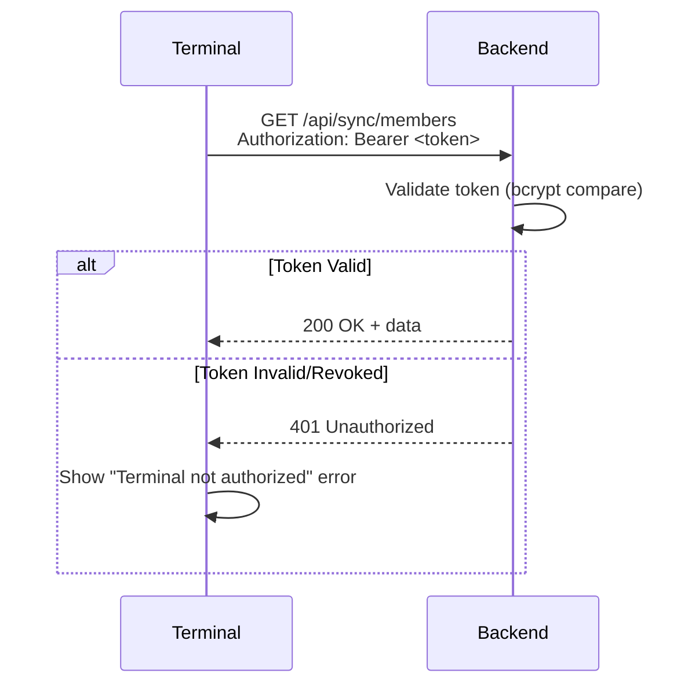
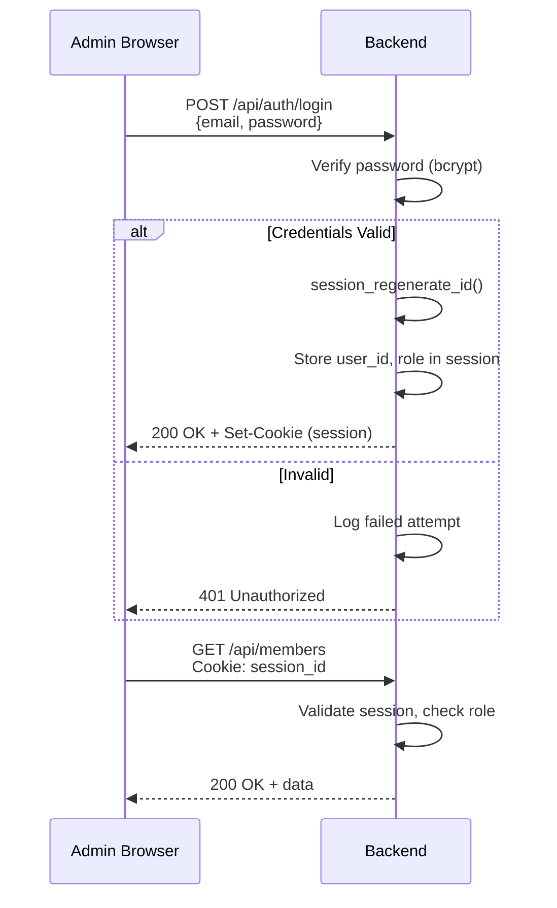

# ADR-0015: Authentication and Authorization Strategy

**Status**: Accepted
**Date**: 2025-01-23

## Context

The Member Bar system has two distinct client types with different security requirements:

1. **Terminal Application** (Electron): Unattended kiosk device at bar location
2. **Admin Panel** (React SPA): Management interface for administrators

Each requires appropriate authentication mechanisms that balance security with usability. Additionally, members interact with terminals via RFID cards, which must be clearly distinguished from authentication.

### Key Constraints

- Terminals operate unattended (no operator login)
- Multiple terminals may exist per deployment
- Admin users need session-based authentication
- RFID cards identify members but do not authenticate them
- Backend runs on shared hosting (no WebSockets, limited background processes)

## Decision

### Core Principles

1. **Separation of Identification and Authentication**: RFID identifies members; it does not authenticate them or grant system access
2. **Device-level Terminal Authentication**: Terminals authenticate as devices, not users
3. **Session-based Admin Authentication**: Admin panel uses traditional session cookies
4. **No Member Authentication**: Members never log in; they are identified by RFID for billing purposes only

### Terminal Authentication

Terminals authenticate using pre-shared API tokens (Bearer tokens):

```
Authorization: Bearer <terminal-api-token>
```

| Aspect | Decision |
|--------|----------|
| Token Format | 64-character hex string (256 bits entropy) |
| Token Storage | Stored in terminal's local config (outside app bundle) |
| Token Scope | One token per terminal device |
| Token Lifetime | Long-lived; rotated manually via admin panel |
| Revocation | Admin can revoke token; terminal receives 401 on next sync |

**Token Generation:**
- Generated server-side using cryptographically secure random generator
- Displayed once to admin during terminal pairing; never stored in plaintext server-side
- Stored as bcrypt hash in `terminals` table for validation

### RFID Identification (Not Authentication)

RFID card scans identify which member is making a purchase. This is **not authentication**:

| Aspect | RFID Identification |
|--------|---------------------|
| Purpose | Link purchase to member account |
| Trust Model | Low-trust; anyone with card can make purchases |
| Security | Physical possession of card is "authorization" |
| No Secrets | Card UID is not cryptographic; visible on card |
| Accountability | Audit trail links transactions to member UUID |

**Rationale**: This is a trusted environment (members of an organization). The goal is convenience and accountability, not security against malicious actors. Similar to a tab at a member bar.

### Admin Panel Authentication

Session-based authentication with secure cookies:

| Aspect | Decision |
|--------|----------|
| Credential | Email + password |
| Password Storage | bcrypt with cost factor 12+ |
| Session Storage | Server-side (PHP sessions in database or files) |
| Session ID | Regenerated on login (prevent fixation) |
| Cookie Attributes | `HttpOnly`, `Secure`, `SameSite=Lax` |
| Session Lifetime | 2 hours idle timeout; 24 hours absolute |
| Multi-device | Allowed; sessions tracked per device |

### Admin Authorization

All admin users have full access: CRUD all entities, settlements, GDPR workflows, user management, audit log. Access is controlled by `is_active` flag on the admin user account.

### Authentication Flow Diagrams

**Terminal Sync Request:**



**Admin Login Flow:**



### API Endpoint Protection

| Endpoint Pattern | Auth Required |
|------------------|---------------|
| `POST /api/auth/login` | None |
| `GET /api/sync/*` | Bearer token (Terminal) |
| `POST /api/sync/transactions` | Bearer token (Terminal) |
| `GET /api/members` | Session (Admin) |
| `POST /api/members` | Session (Admin) |
| `POST /api/members/{id}/anonymize` | Session (Admin) |
| `GET /api/audit-log` | Session (Admin) |
| `GET /api/admin-users` | Session (Admin) |

## Consequences

### Positive

- **Simple terminal deployment**: No user credentials to manage per terminal
- **Clear trust model**: RFID identification is explicit about being low-trust
- **Standard patterns**: Session-based auth is well-understood and supported
- **Revocable access**: Terminals can be deauthorized instantly
- **Audit trail**: All admin actions logged with user identity

### Negative

- **Token rotation is manual**: No automatic token refresh; requires admin intervention
- **No MFA**: Single-factor authentication for admin panel
- **Session state**: Server must store session data (minor complexity)

### Mitigations

- Token rotation documented in admin guide
- Rate limiting on login endpoint prevents brute force (see ADR-0017)
- Session timeout limits exposure window

## Alternatives Considered

### JWT Tokens for Admin Panel

**Rejected**: Adds complexity (refresh tokens, blacklisting) without benefit. Session-based auth is simpler for a single-server deployment and provides immediate revocation.

### OAuth/OIDC for Admin Authentication

**Rejected**: Overkill for a self-hosted, single-organization system. Adds external dependency and configuration complexity.

### RFID as Authentication

**Rejected**: RFID card UIDs are not secrets. They can be cloned and are visible on the card. Using them for authentication would create false security assumptions.

### Per-User Terminal Login

**Rejected**: Terminals are shared devices at bar locations. Requiring operator login adds friction without meaningful security benefit in the trust model.

## Related Decisions

- [ADR-0014](./0014-rfid-scanning-integration.md): RFID Scanning Integration
- [ADR-0016](./0016-transport-security.md): Transport Security (HTTPS/TLS)
- [ADR-0017](./0017-input-validation-injection-prevention.md): Input Validation and Injection Prevention

## References

- [OWASP Authentication Cheat Sheet](https://cheatsheetseries.owasp.org/cheatsheets/Authentication_Cheat_Sheet.html)
- [OWASP Session Management Cheat Sheet](https://cheatsheetseries.owasp.org/cheatsheets/Session_Management_Cheat_Sheet.html)
- [PHP Session Security](https://www.php.net/manual/en/session.security.php)
