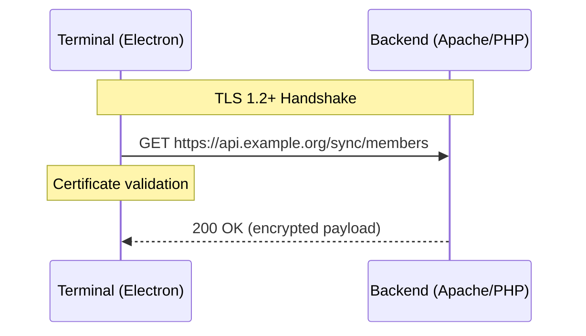

# ADR-0016: Transport Security (HTTPS and TLS)

**Status**: Accepted
**Date**: 2025-01-23

## Context

The Member Bar system transmits sensitive data between components:

- **Terminal ↔ Backend**: Member identifiers, transaction data, API tokens
- **Admin Browser ↔ Backend**: Member personal data, IBAN/banking info, session cookies

This data must be protected in transit against eavesdropping and tampering. The system is deployed on shared hosting (Ionos) with standard TLS support.

### Threat Model

| Threat | Impact | Likelihood |
|--------|--------|------------|
| Eavesdropping on network | API tokens stolen, member data exposed | Medium (public WiFi, network sniffing) |
| Man-in-the-middle attack | Transactions manipulated, credentials stolen | Low-Medium |
| Session hijacking via cookie theft | Admin account compromise | Medium |
| Downgrade attack | Bypass encryption | Low |

## Decision

### Core Principles

1. **HTTPS Everywhere**: All communication uses HTTPS; HTTP is not supported
2. **Modern TLS Only**: TLS 1.2+ required; older protocols rejected
3. **Secure Cookie Attributes**: All session cookies use security flags
4. **No Mixed Content**: All resources loaded over HTTPS

### TLS Configuration

| Aspect | Requirement |
|--------|-------------|
| Minimum Version | TLS 1.2 |
| Recommended Version | TLS 1.3 |
| Cipher Suites | Forward secrecy preferred (ECDHE) |
| Certificate | Valid, trusted CA (Let's Encrypt or hosting provider) |
| HSTS | Enabled with 1-year max-age |

**Apache Configuration (`.htaccess` or `httpd.conf`):**

```apache
# Redirect HTTP to HTTPS
RewriteEngine On
RewriteCond %{HTTPS} off
RewriteRule ^ https://%{HTTP_HOST}%{REQUEST_URI} [L,R=301]

# HSTS Header (1 year)
Header always set Strict-Transport-Security "max-age=31536000; includeSubDomains"
```

**Note**: On Ionos shared hosting, TLS termination is handled by the hosting platform. Configuration focuses on enforcing HTTPS and setting security headers.

### Cookie Security Attributes

All session and authentication cookies use:

| Attribute | Value | Purpose |
|-----------|-------|---------|
| `Secure` | true | Cookie only sent over HTTPS |
| `HttpOnly` | true | Cookie inaccessible to JavaScript (XSS mitigation) |
| `SameSite` | `Lax` | CSRF protection; cookie sent on same-site and top-level navigation |
| `Path` | `/` | Cookie valid for entire domain |

**PHP Session Configuration:**

```php
// In config or session initialization
ini_set('session.cookie_secure', '1');      // Secure flag
ini_set('session.cookie_httponly', '1');    // HttpOnly flag
ini_set('session.cookie_samesite', 'Lax');  // SameSite attribute
ini_set('session.use_strict_mode', '1');    // Reject uninitialized session IDs
ini_set('session.use_only_cookies', '1');   // No session ID in URL
```

### Terminal API Communication

Terminals communicate with backend exclusively over HTTPS:



**Terminal Configuration:**
- Backend URL must use `https://` scheme
- Electron's Node.js validates server certificates by default
- Self-signed certificates not supported in production

### Security Headers

Backend responses include security headers:

| Header | Value | Purpose |
|--------|-------|---------|
| `Strict-Transport-Security` | `max-age=31536000; includeSubDomains` | Enforce HTTPS for 1 year |
| `X-Content-Type-Options` | `nosniff` | Prevent MIME type sniffing |
| `X-Frame-Options` | `DENY` | Prevent clickjacking |
| `Content-Security-Policy` | See below | Restrict resource loading |

**Content Security Policy (Admin Panel):**

```
Content-Security-Policy: default-src 'self'; script-src 'self'; style-src 'self' 'unsafe-inline'; img-src 'self' data:; font-src 'self'; connect-src 'self'; frame-ancestors 'none'
```

### Certificate Management

| Environment | Certificate Source |
|-------------|-------------------|
| Production | Hosting provider (Ionos) or Let's Encrypt |
| Development | mkcert for local HTTPS (optional) |
| Docker Dev | HTTP acceptable (localhost only) |

**Note**: Let's Encrypt certificates auto-renew. If using hosting provider certificates, renewal is typically automatic.

## Consequences

### Positive

- **Data confidentiality**: All sensitive data encrypted in transit
- **Integrity**: TLS prevents tampering with requests/responses
- **Authentication**: Server certificate validates backend identity
- **Session security**: Cookies protected against theft
- **Compliance**: HTTPS is required for GDPR data processing

### Negative

- **No HTTP fallback**: System unusable if TLS misconfigured
- **Certificate dependency**: Expired/invalid certificate blocks all access
- **Development friction**: Local HTTPS setup requires extra steps

### Mitigations

- Certificate expiry monitoring (hosting provider typically handles)
- Clear error messages when TLS validation fails
- Docker dev environment allows HTTP for localhost

## Alternatives Considered

### Allow HTTP for Internal Networks

**Rejected**: Creates deployment complexity (different configs for internal/external). HTTPS overhead is negligible; consistency is simpler.

### Client Certificate Authentication

**Rejected**: Adds significant complexity (PKI, certificate distribution). Bearer tokens are sufficient for terminal authentication.

### TLS 1.3 Only

**Rejected**: TLS 1.2 still widely supported and secure. Some older hosting environments may not support 1.3. Allow both with preference for 1.3.

## Related Decisions

- [ADR-0015](./0015-authentication-and-authorization-strategy.md): Authentication and Authorization Strategy
- [ADR-0003](./0003-gzip-compression-http.md): GZIP Compression for HTTP (works with HTTPS)

## References

- [OWASP Transport Layer Security Cheat Sheet](https://cheatsheetseries.owasp.org/cheatsheets/Transport_Layer_Security_Cheat_Sheet.html)
- [Mozilla SSL Configuration Generator](https://ssl-config.mozilla.org/)
- [HSTS Preload](https://hstspreload.org/)
- [Content Security Policy Reference](https://content-security-policy.com/)
