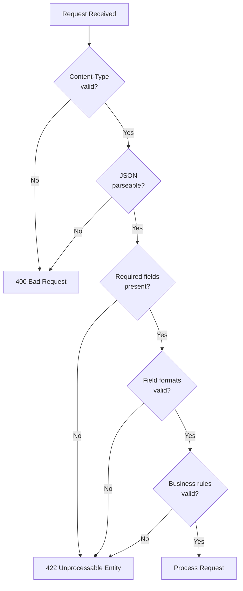

# ADR-0017: Input Validation and Injection Prevention

**Status**: Accepted
**Date**: 2025-01-23

## Context

The Ruderbar system accepts input from multiple sources:

- **Terminal**: Transaction data, RFID card UIDs, sync requests
- **Admin Panel**: Member data, product data, SEPA configuration, search queries
- **URL Parameters**: Filters, pagination, delta sync timestamps

All input must be validated and sanitized to prevent injection attacks. The system uses:
- PHP backend with MariaDB
- React frontend (Admin Panel and Terminal)

### OWASP Top 10 Relevance

| OWASP Category | Applicability |
|----------------|---------------|
| A03:2021 - Injection | SQL injection, command injection |
| A07:2021 - XSS | Cross-site scripting in admin panel |
| A01:2021 - Broken Access Control | Authorization bypass via input manipulation |

## Decision

### Core Principles

1. **Validate Early, Reject Invalid**: Check input at API boundary; reject before processing
2. **Parameterized Queries Only**: No string concatenation in SQL
3. **Output Encoding by Default**: React escapes; backend escapes for non-React contexts
4. **Allowlisting Over Denylisting**: Define what's allowed, not what's forbidden
5. **Defense in Depth**: Multiple layers of protection

### SQL Injection Prevention

**Mandatory**: All database queries use prepared statements with bound parameters.

| Approach | Status |
|----------|--------|
| Prepared statements (PDO) | Required |
| String concatenation | Forbidden |
| Stored procedures | Allowed (with parameters) |
| ORM query builders | Allowed (uses parameters internally) |

**Correct Pattern (PDO):**

```php
$stmt = $pdo->prepare('SELECT * FROM members WHERE id = :id');
$stmt->execute(['id' => $memberId]);
```

**Forbidden Pattern:**

```php
// NEVER DO THIS
$query = "SELECT * FROM members WHERE id = '$memberId'";
```

**With Medoo:**

```php
// Medoo automatically uses prepared statements
$member = $db->get('members', '*', ['id' => $memberId]);
```

### XSS Prevention

**Frontend (React):**
React escapes values by default. XSS is prevented unless explicitly bypassed.

| Method | Safety |
|--------|--------|
| `{variable}` in JSX | Safe (auto-escaped) |
| `dangerouslySetInnerHTML` | Forbidden without sanitization |
| `href="javascript:..."` | Forbidden |

**Backend (Non-React contexts):**
For any HTML output (error pages, emails):

```php
htmlspecialchars($value, ENT_QUOTES, 'UTF-8');
```

**Content Security Policy:**
Header restricts script execution (see ADR-0016):

```
Content-Security-Policy: default-src 'self'; script-src 'self'
```

### CSRF Protection

**For Session-Based Requests (Admin Panel):**

| Method | Protection |
|--------|------------|
| GET requests | No state changes allowed |
| POST/PUT/DELETE | CSRF token required |
| Cookie attribute | `SameSite=Lax` (see ADR-0016) |

**Implementation:**

1. Server generates CSRF token and stores in session
2. Token sent to frontend in response (meta tag or cookie)
3. Frontend includes token in `X-CSRF-Token` header for state-changing requests
4. Backend validates token matches session

```php
// Generate token on session start
$_SESSION['csrf_token'] = bin2hex(random_bytes(32));

// Validate on POST/PUT/DELETE
if ($_SERVER['REQUEST_METHOD'] !== 'GET') {
    $token = $_SERVER['HTTP_X_CSRF_TOKEN'] ?? '';
    if (!hash_equals($_SESSION['csrf_token'], $token)) {
        http_response_code(403);
        exit('CSRF validation failed');
    }
}
```

**For Terminal API:**
Bearer token authentication provides CSRF protection (token not in cookies).

### Input Validation Rules

**General Patterns:**

| Input Type | Validation |
|------------|------------|
| UUID | Regex: `/^[0-9a-f]{8}-[0-9a-f]{4}-4[0-9a-f]{3}-[89ab][0-9a-f]{3}-[0-9a-f]{12}$/i` |
| Email | `filter_var($email, FILTER_VALIDATE_EMAIL)` |
| IBAN | Length 15-34, alphanumeric, checksum validation (see ADR-0005) |
| Integer cents | Cast to int, range check (0 to reasonable max) |
| Timestamp | ISO 8601 format, reasonable date range |
| Names | Non-empty string, max length 100, trim whitespace |
| Card UID | Hex string, 8-20 characters |

**Validation Flow:**



### Rate Limiting

**Login Endpoint Protection:**

| Threshold | Action |
|-----------|--------|
| 5 failed attempts per IP per 15 min | Temporary block (15 min) |
| 10 failed attempts per account per hour | Account lockout (30 min) |
| Successful login | Reset counters |

**Implementation:**
Track attempts in database or cache:

```sql
CREATE TABLE login_attempts (
    id INT AUTO_INCREMENT PRIMARY KEY,
    ip_address VARCHAR(45) NOT NULL,
    email VARCHAR(255),
    attempted_at TIMESTAMP DEFAULT CURRENT_TIMESTAMP,
    INDEX idx_ip_time (ip_address, attempted_at),
    INDEX idx_email_time (email, attempted_at)
);
```

### Error Handling

**Production Error Responses:**

| Scenario | Response |
|----------|----------|
| Validation error | 422 + field-specific error messages |
| Authentication error | 401 + generic "Invalid credentials" |
| Authorization error | 403 + "Access denied" |
| Server error | 500 + generic message (no stack trace) |

**Logging:**
- Log full error details server-side (with request context)
- Never expose stack traces, SQL queries, or internal paths to client

```php
// Log internally
error_log("SQL Error: {$e->getMessage()} | Request: {$requestId}");

// Return generic message
return json_encode(['error' => 'An internal error occurred']);
```

### File Upload (If Applicable)

If file upload is added in future:

| Control | Implementation |
|---------|----------------|
| Type validation | Check magic bytes, not just extension |
| Size limit | Configurable max (e.g., 5 MB) |
| Storage | Outside web root |
| Filename | Generate random name; don't use user input |
| Execution | Serve with `Content-Disposition: attachment` |

## Consequences

### Positive

- **Injection-resistant**: SQL injection effectively impossible with prepared statements
- **XSS-resistant**: React + CSP provides strong protection
- **CSRF-resistant**: Token + SameSite cookies
- **Brute-force resistant**: Rate limiting on sensitive endpoints
- **Audit-friendly**: Validation errors logged for security review

### Negative

- **Development overhead**: Input validation code for every endpoint
- **Error message balance**: Detailed enough for users, vague enough for attackers
- **Rate limiting complexity**: Must avoid blocking legitimate users

### Mitigations

- Validation helper functions reduce boilerplate
- Error messages reviewed for information leakage
- Rate limits configurable per deployment

## Alternatives Considered

### ORM for SQL Safety

**Partially adopted**: Medoo provides query builder safety. Full ORM (Doctrine) rejected as over-engineering for this project size.

### Web Application Firewall (WAF)

**Deferred**: Hosting provider may offer WAF. Application-level protections are primary defense; WAF is additional layer if available.

### Captcha on Login

**Rejected for now**: Rate limiting provides adequate protection. Captcha adds friction and accessibility concerns. Can be added if brute force becomes issue.

## Related Decisions

- [ADR-0005](./0005-iban-storage-and-validation.md): IBAN Storage and Validation
- [ADR-0015](./0015-authentication-and-authorization-strategy.md): Authentication and Authorization Strategy
- [ADR-0016](./0016-transport-security.md): Transport Security (HTTPS/TLS)
- [ADR-0013](./0013-audit-logging.md): Audit Logging

## References

- [OWASP Injection Prevention Cheat Sheet](https://cheatsheetseries.owasp.org/cheatsheets/Injection_Prevention_Cheat_Sheet.html)
- [OWASP XSS Prevention Cheat Sheet](https://cheatsheetseries.owasp.org/cheatsheets/Cross_Site_Scripting_Prevention_Cheat_Sheet.html)
- [OWASP CSRF Prevention Cheat Sheet](https://cheatsheetseries.owasp.org/cheatsheets/Cross-Site_Request_Forgery_Prevention_Cheat_Sheet.html)
- [OWASP Input Validation Cheat Sheet](https://cheatsheetseries.owasp.org/cheatsheets/Input_Validation_Cheat_Sheet.html)
