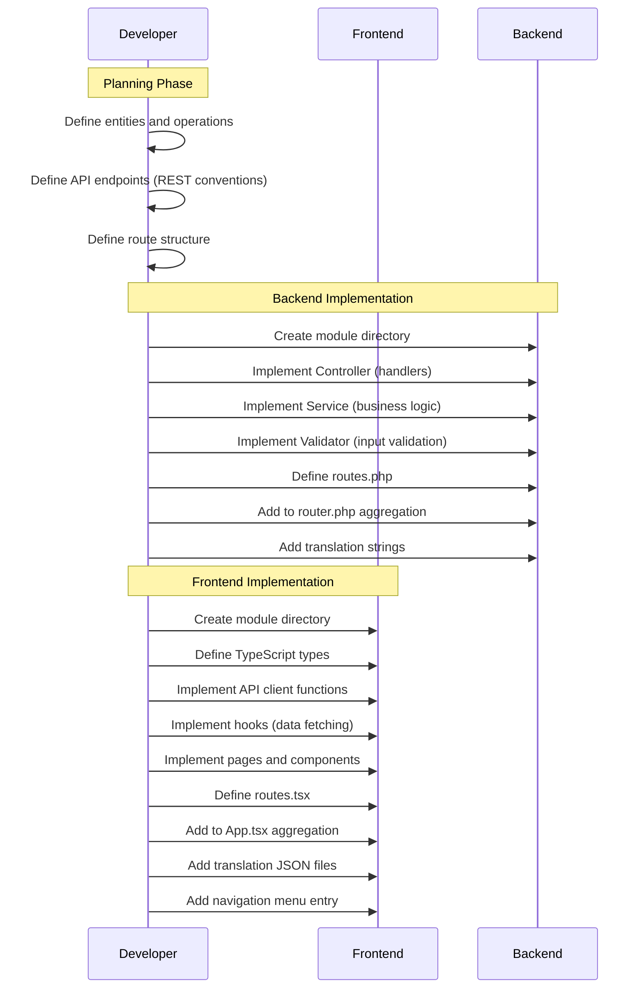
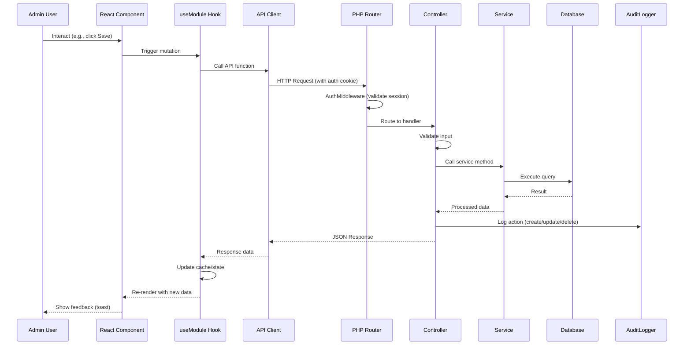

# ADR-0018: Modular Admin Interface Architecture

**Status**: Accepted

**Date**: 2026-01-23

---

## Context

The admin panel requires consistent, maintainable structure for implementing functional areas like member management, product management, settlements, and terminal administration. Each area needs:

- **Frontend components**: React pages, forms, lists, dialogs
- **Backend endpoints**: REST API handlers, validation, database operations
- **Shared concerns**: i18n, routing, state management, audit logging

Without a defined modular structure:
- Code organization becomes inconsistent across features
- Developers duplicate boilerplate for each new feature
- Locating related code (frontend ↔ backend) is difficult
- Testing and maintenance burden increases

Key requirements:
- **Cohesion**: Related frontend/backend code grouped together conceptually
- **Discoverability**: Clear conventions for where to find/add functionality
- **Consistency**: All modules follow same patterns (CRUD, validation, i18n)
- **Independence**: Modules can be developed/tested in isolation
- **Extensibility**: New modules follow established patterns

---

## Decision

**Admin functionality is organized into cohesive modules, each comprising frontend components and backend API endpoints. Modules follow standardized directory structures and naming conventions. Each module owns its routes, translations, and state management while sharing common infrastructure (auth, audit logging, HTTP client).**

---

## Module Definition

A **module** is a self-contained functional area that includes:

| Aspect | Frontend (React SPA) | Backend (PHP API) |
|--------|---------------------|-------------------|
| **Routes** | React Router routes under `/module-name/*` | REST endpoints under `/api/module-name/*` |
| **Components** | Pages, forms, lists, dialogs | Handlers, validators, services |
| **State** | Module-specific Zustand slice or context | Stateless (per-request processing) |
| **Translations** | `locales/{lang}/module-name.json` | `translations/{lang}/module-name.php` |
| **Types** | TypeScript interfaces for entities | PHP DTOs/arrays with validation |

### Core Modules

| Module | Description | Key Operations |
|--------|-------------|----------------|
| `members` | Member management | CRUD, GDPR export, anonymization, balance view |
| `products` | Product catalog | CRUD, activation toggle, category filter |
| `transactions` | Transaction journal | List, filter, storno, manual purchase |
| `settlements` | Periodic billing | Create, preview, export (CSV/SEPA), revoke |
| `terminals` | Terminal devices | Register, token generation, status monitoring |
| `admin-users` | Admin accounts | CRUD, password reset, activation toggle |
| `audit-log` | Activity history | List, filter, detail view (read-only) |
| `sepa-config` | SEPA settings | Setup wizard, configuration edit |
| `dashboard` | Overview | Statistics, quick actions, sync status |

---

## Directory Structure

### Frontend (admin-frontend)

```
admin-frontend/
├── src/
│   ├── modules/
│   │   ├── members/
│   │   │   ├── index.ts              # Module exports
│   │   │   ├── routes.tsx            # Route definitions
│   │   │   ├── pages/
│   │   │   │   ├── MemberListPage.tsx
│   │   │   │   ├── MemberDetailPage.tsx
│   │   │   │   └── MemberFormPage.tsx
│   │   │   ├── components/
│   │   │   │   ├── MemberTable.tsx
│   │   │   │   ├── MemberForm.tsx
│   │   │   │   ├── GDPRExportDialog.tsx
│   │   │   │   └── AnonymizeDialog.tsx
│   │   │   ├── hooks/
│   │   │   │   ├── useMembers.ts     # Data fetching
│   │   │   │   └── useMemberForm.ts  # Form state
│   │   │   ├── api/
│   │   │   │   └── members.api.ts    # API client functions
│   │   │   ├── types/
│   │   │   │   └── member.types.ts   # TypeScript interfaces
│   │   │   └── store/
│   │   │       └── members.store.ts  # Zustand slice (if needed)
│   │   │
│   │   ├── products/
│   │   │   └── ... (same structure)
│   │   │
│   │   ├── settlements/
│   │   │   └── ... (same structure)
│   │   │
│   │   └── ... (other modules)
│   │
│   ├── shared/
│   │   ├── components/              # Reusable UI components
│   │   │   ├── DataTable.tsx
│   │   │   ├── ConfirmDialog.tsx
│   │   │   └── FormField.tsx
│   │   ├── hooks/
│   │   │   ├── useAuth.ts
│   │   │   └── usePagination.ts
│   │   ├── api/
│   │   │   └── http.ts              # Axios instance with interceptors
│   │   └── types/
│   │       └── common.types.ts
│   │
│   ├── layouts/
│   │   └── AdminLayout.tsx          # Shell with navigation
│   │
│   └── App.tsx                      # Root component, route aggregation
│
└── public/
    └── locales/
        ├── de/
        │   ├── common.json
        │   ├── members.json
        │   ├── products.json
        │   └── ... (per module)
        └── en/
            └── ... (same structure)
```

### Backend (backend)

```
backend/
├── api/
│   ├── index.php                    # Router entry point
│   ├── router.php                   # Route registration
│   │
│   ├── modules/
│   │   ├── members/
│   │   │   ├── MembersController.php
│   │   │   ├── MembersService.php
│   │   │   ├── MembersValidator.php
│   │   │   └── routes.php           # Module route definitions
│   │   │
│   │   ├── products/
│   │   │   └── ... (same structure)
│   │   │
│   │   ├── settlements/
│   │   │   └── ... (same structure)
│   │   │
│   │   └── ... (other modules)
│   │
│   └── shared/
│       ├── AuthMiddleware.php
│       ├── AuditLogger.php
│       ├── ResponseHelper.php
│       └── ValidationHelper.php
│
├── translations/
│   ├── de/
│   │   ├── errors.php
│   │   └── ... (per module)
│   └── en/
│       └── ...
│
├── migrations/
│   └── ...
│
└── config/
    └── config.php
```

---

## Module Interface Patterns

### Frontend Module Contract

Each frontend module exports via `index.ts`:

```typescript
// modules/members/index.ts
export { memberRoutes } from './routes';
export { useMembers, useMember } from './hooks/useMembers';
export type { Member, MemberFormData } from './types/member.types';
```

Route aggregation in App.tsx:

```typescript
// App.tsx
import { memberRoutes } from './modules/members';
import { productRoutes } from './modules/products';
import { settlementRoutes } from './modules/settlements';

function App() {
  return (
    <Routes>
      <Route path="/" element={<AdminLayout />}>
        {memberRoutes}
        {productRoutes}
        {settlementRoutes}
        {/* ... other modules */}
      </Route>
    </Routes>
  );
}
```

### Backend Module Contract

Each backend module defines routes in `routes.php`:

```php
// api/modules/members/routes.php
return [
    ['GET',    '/api/members',              'MembersController@index'],
    ['GET',    '/api/members/{id}',         'MembersController@show'],
    ['POST',   '/api/members',              'MembersController@create'],
    ['PATCH',  '/api/members/{id}',         'MembersController@update'],
    ['DELETE', '/api/members/{id}',         'MembersController@delete'],
    ['POST',   '/api/members/{id}/export',  'MembersController@export'],
    ['POST',   '/api/members/{id}/anonymize', 'MembersController@anonymize'],
];
```

Route aggregation in router.php:

```php
// api/router.php
$routes = array_merge(
    require 'modules/members/routes.php',
    require 'modules/products/routes.php',
    require 'modules/settlements/routes.php',
    // ... other modules
);
```

---

## Module Workflow

### Adding a New Module



### Module Request Flow



---

## Shared Infrastructure

### Cross-Cutting Concerns

| Concern | Frontend Implementation | Backend Implementation |
|---------|------------------------|----------------------|
| **Authentication** | `useAuth` hook, Axios interceptor | `AuthMiddleware.php` |
| **Authorization** | Role-based route guards | Role check in controllers |
| **Audit Logging** | N/A (backend responsibility) | `AuditLogger.php` called by controllers |
| **Error Handling** | Axios error interceptor, error boundaries | `ResponseHelper::error()` |
| **i18n** | i18next with namespace per module | Language files per module |
| **Validation** | React Hook Form + Zod schemas | Validator class per module |
| **HTTP Client** | Shared Axios instance | N/A |
| **State Management** | Zustand slices, React Query | Stateless (per-request) |

### Shared Component Usage

Modules use shared components for consistency:

```tsx
// Using shared DataTable in members module
import { DataTable } from '@/shared/components/DataTable';
import { useMembers } from '../hooks/useMembers';

export function MemberTable() {
  const { data, isLoading } = useMembers();

  return (
    <DataTable
      data={data}
      loading={isLoading}
      columns={[
        { key: 'lastName', label: t('members.lastName') },
        { key: 'firstName', label: t('members.firstName') },
        // ...
      ]}
    />
  );
}
```

---

## Naming Conventions

### Frontend

| Type | Pattern | Example |
|------|---------|---------|
| Module directory | `kebab-case` | `admin-users/` |
| Page component | `PascalCase` + `Page` suffix | `MemberListPage.tsx` |
| Other components | `PascalCase` | `MemberForm.tsx` |
| Hooks | `use` prefix + `PascalCase` | `useMembers.ts` |
| API functions | `camelCase` verb + noun | `fetchMembers()`, `createMember()` |
| Types | `PascalCase` | `Member`, `MemberFormData` |
| Translation keys | `module.keyName` | `members.createTitle` |

### Backend

| Type | Pattern | Example |
|------|---------|---------|
| Module directory | `kebab-case` | `admin-users/` |
| Controller | `PascalCase` + `Controller` | `MembersController.php` |
| Service | `PascalCase` + `Service` | `MembersService.php` |
| Validator | `PascalCase` + `Validator` | `MembersValidator.php` |
| Route file | `routes.php` | `routes.php` |
| API endpoints | `kebab-case` pluralized | `/api/admin-users` |

---

## Consequences

### Positive

- **Discoverability**: Clear structure makes finding related code straightforward
- **Consistency**: All modules follow same patterns; reduced cognitive load
- **Isolation**: Modules can be developed and tested independently
- **Maintainability**: Changes to one module unlikely to affect others
- **Onboarding**: New developers learn one module, understand all
- **Code review**: Reviewers know where to look for each concern
- **Scalability**: New modules follow established patterns

### Negative

- **Initial overhead**: Setting up module structure takes time for small features
- **Duplication risk**: Similar logic across modules (e.g., CRUD operations)
- **Navigation complexity**: Deep directory nesting for small modules
- **Coordination**: Frontend and backend changes must align

### Mitigations

1. **Initial overhead**: Provide module scaffolding script or template
2. **Duplication**: Extract truly common patterns to shared utilities
3. **Navigation**: IDE features (Go to Definition, Search Everywhere) mitigate
4. **Coordination**: Define API contract first; frontend/backend can proceed in parallel

---

## Alternatives Considered

### Alternative 1: Feature Slices (Single Directory per Feature)

```
src/
├── features/
│   ├── members/
│   │   ├── frontend/
│   │   │   └── ... (React components)
│   │   └── backend/
│   │       └── ... (PHP handlers)
```

**Pros**: Maximum cohesion; frontend/backend truly co-located
**Cons**:
- Breaks conventional React/PHP project structure
- Build tooling complexity (need to handle mixed languages)
- IDE support weaker for unconventional layouts

**Rejected**: Conventional separation (admin-frontend/, backend/) is more tooling-friendly.

### Alternative 2: Domain-Driven Design (DDD) with Bounded Contexts

Full DDD with aggregates, value objects, domain events, repositories.

**Pros**: Rigorous domain modeling; scales to complex domains
**Cons**:
- Overhead for CRUD-heavy admin panel
- PHP ecosystem DDD tooling less mature
- Team learning curve
- Over-engineering for this scope

**Rejected**: Admin panel is primarily CRUD; DDD adds unnecessary complexity.

### Alternative 3: Flat Structure (No Modules)

```
src/
├── pages/
│   ├── MemberListPage.tsx
│   ├── ProductListPage.tsx
│   └── ...
├── components/
│   ├── MemberForm.tsx
│   ├── ProductForm.tsx
│   └── ...
├── api/
│   └── ...
```

**Pros**: Simple; no nesting
**Cons**:
- Scales poorly (dozens of files in each directory)
- No grouping of related functionality
- Harder to navigate as codebase grows

**Rejected**: Flat structure becomes unwieldy with 9+ functional areas.

### Alternative 4: Plugin Architecture

Modules as dynamically loadable plugins with registration system.

**Pros**: Runtime extensibility; third-party plugins possible
**Cons**:
- Significant infrastructure overhead
- Dynamic loading complexity in SPA
- Over-engineering for single-deployment system

**Rejected**: This is not a platform requiring third-party plugins.

---

## Related Decisions

- [ADR-0011: SEPA Configuration Management](./0011-sepa-configuration-management-admin-frontend.md) - Example module implementation
- [ADR-0013: Audit Logging](./0013-audit-logging.md) - Cross-cutting concern used by all modules
- [ADR-0015: Authentication and Authorization Strategy](./0015-authentication-and-authorization-strategy.md) - Shared auth infrastructure

---

## References

- **React Project Structure**: Feature-based organization patterns
- **PHP Best Practices**: PSR-4 autoloading, controller/service separation
- **Admin Panel Architecture**: `docs/frgs-bar-admin-architecture.md`
- **i18next**: Namespace-based translation organization

---

## Post-Implementation Monitoring

- Track time to implement new modules (should decrease as patterns mature)
- Monitor code review feedback on module structure compliance
- Gather developer feedback: Is structure intuitive?
- Check for cross-module dependencies (should be minimal)
- Review shared vs module-specific code ratio (healthy balance)
