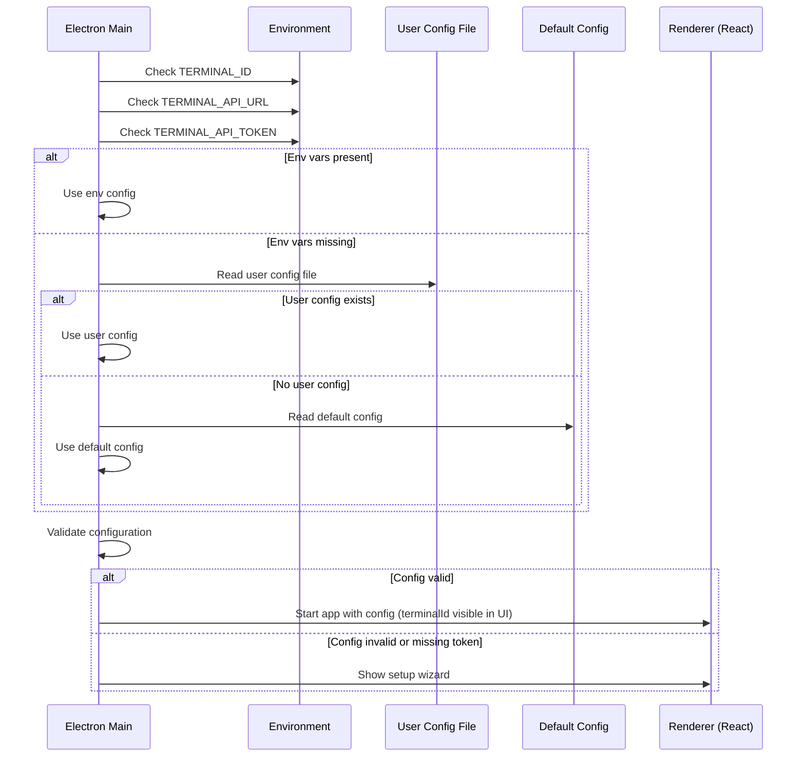
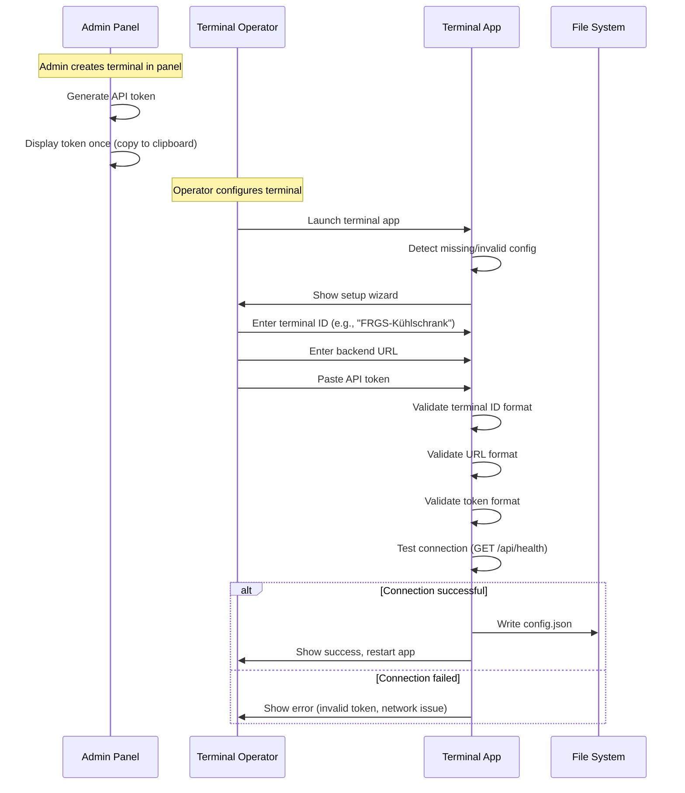

# ADR-0019: Frontend Access Token Configuration

**Status**: Accepted

**Date**: 2026-01-23

---

## Context

The Terminal application (Electron) requires configuration to connect to the backend API:

- **Backend URL**: The root URL of the backend API (e.g., `https://bar.example.org/api`)
- **Access Token**: The Bearer token for terminal authentication (per ADR-0015)
- **Terminal ID**: A human-readable identifier for this terminal instance (e.g., `FRGS-Kühlschrank`)

This configuration must be:
- **Flexible**: Deployable to different environments (development, staging, production)
- **Secure**: Tokens must not be committed to version control
- **Simple**: Non-technical operators can configure terminals
- **Persistent**: Configuration survives app restarts and updates

The Admin Panel (React SPA) does not require token configuration as it uses session-based authentication and is served from the same origin as the backend.

---

## Decision

**Terminal configuration is provided via a JSON configuration file stored outside the application bundle, with environment variables as an override mechanism. The configuration file is created during initial terminal setup and is excluded from version control.**

---

## Configuration Sources

Configuration is loaded with the following precedence (highest to lowest):

| Priority | Source | Use Case |
|----------|--------|----------|
| 1 | Environment variables | CI/CD, Docker, automated deployments |
| 2 | User config file | Production terminals, manual setup |
| 3 | Default config file | Development defaults (no secrets) |

### Environment Variables

| Variable | Description | Example |
|----------|-------------|---------|
| `TERMINAL_ID` | Human-readable terminal identifier | `FRGS-Kühlschrank` |
| `TERMINAL_API_URL` | Backend API root URL | `https://bar.example.org/api` |
| `TERMINAL_API_TOKEN` | Bearer token for authentication | `a1b2c3d4...` (64 hex chars) |

### Configuration File

Location varies by platform:

| Platform | Config Directory | Full Path |
|----------|------------------|-----------|
| macOS | `~/Library/Application Support/frgs-terminal/` | `~/Library/Application Support/frgs-terminal/config.json` |
| Windows | `%APPDATA%\frgs-terminal\` | `C:\Users\<user>\AppData\Roaming\frgs-terminal\config.json` |
| Linux | `~/.config/frgs-terminal/` | `~/.config/frgs-terminal/config.json` |

**File Format:**

```json
{
  "terminalId": "FRGS-Kühlschrank",
  "apiUrl": "https://bar.example.org/api",
  "apiToken": "a1b2c3d4e5f6..."
}
```

### Default Configuration (Development)

Bundled with the application for development convenience:

```json
{
  "terminalId": "Dev-Terminal",
  "apiUrl": "http://localhost:8080/api",
  "apiToken": ""
}
```

This file is committed to version control but contains no secrets.

---

## Configuration Schema

| Field | Type | Required | Validation | Description |
|-------|------|----------|------------|-------------|
| `terminalId` | string | Yes | 1-50 characters, alphanumeric + hyphen/underscore | Human-readable terminal identifier |
| `apiUrl` | string | Yes | Valid URL, HTTPS required in production | Backend API root URL |
| `apiToken` | string | Yes | 64 hex characters | Bearer token for terminal auth |

### Validation Rules

- `terminalId` must be 1-50 characters, allowing letters, numbers, hyphens, underscores, and spaces
- `terminalId` is used for display in UI, logging, and sent to backend in sync requests
- `terminalId` should be unique within a deployment (e.g., `FRGS-Kühlschrank`, `Bar-Terminal-1`, `Sauna-Kiosk`)
- `apiUrl` must be a valid URL (protocol + host)
- `apiUrl` must use HTTPS in production builds (HTTP allowed in development)
- `apiToken` must be exactly 64 hexadecimal characters
- Empty `apiToken` triggers setup wizard (first-run experience)

### Terminal ID Usage

The `terminalId` serves multiple purposes:

| Usage | Description |
|-------|-------------|
| **UI Display** | Shown in terminal header/status bar for physical identification |
| **Logging** | Included in log entries for debugging multi-terminal deployments |
| **Sync Requests** | Sent as `X-Terminal-Id` header; backend can track sync activity per terminal |
| **Admin Panel** | Displayed in terminal management view alongside connection status |
| **Troubleshooting** | Operators can identify which physical device corresponds to which config |

**Examples of good terminal IDs:**
- `FRGS-Kühlschrank` (location-based)
- `Bar-Terminal-1` (numbered)
- `Sauna-Kiosk` (function-based)
- `Hauptraum-Links` (position-based)

---

## Configuration Loading Flow



---

## Initial Setup Flow

When a terminal is first configured or the token is missing:



---

## Security Considerations

### File Permissions

Configuration file should have restricted permissions:

| Platform | Permissions | Command |
|----------|-------------|---------|
| macOS/Linux | `600` (owner read/write only) | `chmod 600 config.json` |
| Windows | User-only ACL | Inherited from AppData |

The application sets appropriate permissions when writing the config file.

### Version Control Exclusion

The following must be in `.gitignore`:

```gitignore
# Terminal configuration (contains secrets)
config.json
**/config.local.json
```

### Token Display

- Setup wizard masks token input (password field)
- Token is never logged or displayed after initial entry
- Config file is not readable via IPC from renderer process

### Development vs Production

| Aspect | Development | Production |
|--------|-------------|------------|
| HTTP allowed | Yes | No (HTTPS required) |
| Empty token allowed | Yes (for testing) | No |
| Config location | Project directory or user config | User config only |
| Token validation | Relaxed | Strict (64 hex chars) |

---

## Implementation

### Electron Main Process

Configuration loading in main process:

```typescript
// Pseudo-code for config loading
interface TerminalConfig {
  terminalId: string;
  apiUrl: string;
  apiToken: string;
}

function loadConfig(): TerminalConfig {
  // Priority 1: Environment variables
  if (process.env.TERMINAL_ID && process.env.TERMINAL_API_URL && process.env.TERMINAL_API_TOKEN) {
    return {
      terminalId: process.env.TERMINAL_ID,
      apiUrl: process.env.TERMINAL_API_URL,
      apiToken: process.env.TERMINAL_API_TOKEN,
    };
  }

  // Priority 2: User config file
  const userConfigPath = path.join(app.getPath('userData'), 'config.json');
  if (fs.existsSync(userConfigPath)) {
    return JSON.parse(fs.readFileSync(userConfigPath, 'utf-8'));
  }

  // Priority 3: Default config (bundled)
  const defaultConfigPath = path.join(__dirname, 'config.default.json');
  return JSON.parse(fs.readFileSync(defaultConfigPath, 'utf-8'));
}
```

### IPC Bridge

Renderer accesses config via secure IPC (no direct file access):

```typescript
// preload.ts - expose limited config API
contextBridge.exposeInMainWorld('terminalConfig', {
  getTerminalId: () => ipcRenderer.invoke('config:getTerminalId'),
  getApiUrl: () => ipcRenderer.invoke('config:getApiUrl'),
  // Token is NOT exposed to renderer; main process handles auth headers
});
```

The `terminalId` is safe to expose to the renderer as it contains no secrets. It can be displayed in the terminal UI header or status bar for identification.

### HTTP Client Configuration

Main process injects auth header and terminal ID; renderer never sees token:

```typescript
// Main process handles all API requests
async function apiRequest(endpoint: string, options: RequestInit) {
  const config = loadConfig();
  return fetch(`${config.apiUrl}${endpoint}`, {
    ...options,
    headers: {
      ...options.headers,
      'Authorization': `Bearer ${config.apiToken}`,
      'X-Terminal-Id': config.terminalId,
    },
  });
}
```

---

## File Structure

```
terminal-frontend/
├── src/
│   ├── main/
│   │   ├── config.ts           # Config loading logic
│   │   └── ...
│   └── renderer/
│       └── ...
├── config.default.json         # Committed, no secrets
├── config.json                 # NOT committed, gitignored
└── ...
```

---

## Consequences

### Positive

- **Simple deployment**: Copy config file or set env vars
- **Secure defaults**: Secrets never in version control
- **Flexible**: Works for manual setup and automated deployment
- **Transparent**: JSON format is human-readable and editable
- **Standard locations**: Uses platform-appropriate config directories
- **Token isolation**: Renderer process never accesses token directly
- **Terminal identification**: Human-readable ID simplifies multi-terminal management and debugging

### Negative

- **Manual setup required**: Each terminal needs individual configuration
- **No central management**: Tokens not managed via MDM or similar
- **File-based**: Requires filesystem access (not suitable for web deployment)

### Mitigations

- Setup wizard guides non-technical operators
- Clear documentation for configuration steps
- Future: Optional config endpoint for automated provisioning

---

## Alternatives Considered

### Alternative 1: Hardcoded Configuration

Embed URL and token directly in application code.

**Pros**: No external files to manage
**Cons**:
- Requires rebuild for each deployment
- Secrets in version control
- No per-terminal differentiation

**Rejected**: Fundamentally insecure and inflexible.

### Alternative 2: Database-Stored Configuration

Store config in local SQLite database alongside cached data.

**Pros**: Single storage location
**Cons**:
- Mixes configuration with data
- Harder to inspect/edit manually
- Backup/restore more complex

**Rejected**: Configuration and data have different lifecycles.

### Alternative 3: Encrypted Configuration File

Encrypt config.json with a master password.

**Pros**: Additional layer of security
**Cons**:
- Requires password entry on each launch
- Defeats unattended terminal operation
- Key management complexity

**Rejected**: Conflicts with unattended terminal requirement.

### Alternative 4: Remote Configuration Service

Fetch configuration from a central server on startup.

**Pros**: Centralized management
**Cons**:
- Chicken-and-egg: Need URL to fetch config
- Network dependency for startup
- Additional infrastructure

**Rejected**: Over-engineering for current scope; file-based is sufficient.

### Alternative 5: QR Code Provisioning

Scan QR code containing configuration during setup.

**Pros**: Easy for non-technical operators
**Cons**:
- Requires camera access
- QR code contains sensitive token (photo risk)
- Additional UI complexity

**Rejected**: Can be added later as enhancement; file-based is baseline.

---

## Related Decisions

- [ADR-0015: Authentication and Authorization Strategy](./0015-authentication-and-authorization-strategy.md) - Defines terminal token authentication
- [ADR-0016: Transport Security](./0016-transport-security.md) - HTTPS requirement for production

---

## References

- [Electron app.getPath](https://www.electronjs.org/docs/latest/api/app#appgetpathname) - Platform-specific paths
- [Electron Security Best Practices](https://www.electronjs.org/docs/latest/tutorial/security) - IPC and preload security
- [XDG Base Directory Specification](https://specifications.freedesktop.org/basedir-spec/basedir-spec-latest.html) - Linux config paths

---

## Post-Implementation Monitoring

- Track setup wizard completion rate
- Monitor configuration validation errors (which fields fail most?)
- Gather feedback: Is setup process clear for operators?
- Track support requests related to configuration issues
- Test upgrade scenarios: Does config persist across app updates?
