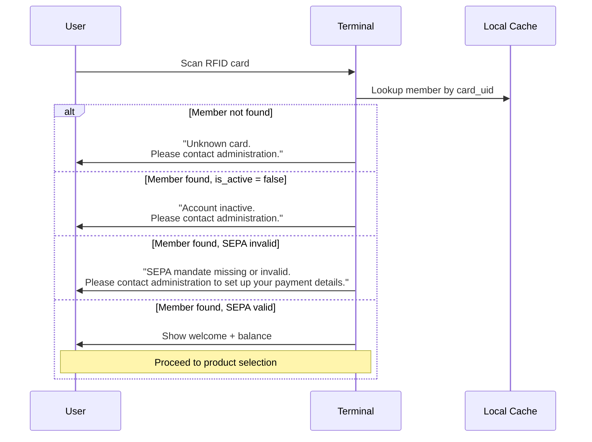

# ADR-0020: SEPA Mandate Requirement for Terminal Access

**Status**: Accepted

**Date**: 2025-01-23

**Deciders**: Architecture Team

---

## Context

The Club Bar system collects payments via SEPA Direct Debit. Members consume products at the terminal, and their outstanding balance is periodically settled via SEPA collection. For SEPA collections to succeed, each member must have:

1. **Valid IBAN**: Bank account for debiting
2. **Mandate Reference**: SEPA mandate identifier

Without both pieces of data, the system cannot collect payment for a member's transactions. This creates a problem:

- Members without SEPA data can accumulate debt that cannot be collected
- Manual follow-up required to obtain missing payment details
- Risk of members leaving organization with unpaid balance
- Administrative burden increases over time

### Current State

Currently, members can use the terminal regardless of SEPA data status. SEPA validation only happens at settlement time, when it's too late—transactions already exist.

### Business Requirement

The organization requires that **all members have valid SEPA data before they can use the terminal**. This is part of the onboarding process and ensures every transaction can be collected.

---

## Decision

**Members must have valid SEPA data (IBAN and mandate_reference) to use the terminal. Terminal access is blocked at card scan if SEPA data is missing or invalid. There is no grace period.**

> **Amended 2026-08-07 — the offline window and the server's role.** This ADR specifies the *preventive* half correctly: the terminal blocks at card scan, checking `is_sepa_valid` from its last sync. It does not say what the **server** does with transactions that arrive anyway, and that gap was being filled the wrong way.
>
> The terminal decides from its **last synced state**, so a member whose SEPA data is cleared after that sync is still served until the terminal next syncs. Those drinks are real and already consumed.
>
> **The server must therefore store and flag such transactions, never reject them.** Rejecting at sync destroys the record of a sale that actually happened — revenue lost silently, unrecoverable, because the beer is gone either way. `TransactionsService::processBatch` currently rejects them (`sepa_invalid`); that is a defect, tracked as [#162](https://github.com/dgloeckner/ruderbar/issues/162).
>
> Two layers, deliberately: **terminal blocks (preventive, costs nothing — the drink is not yet poured); server stores and flags (backstop, because by then it is).** See [#143](https://github.com/dgloeckner/ruderbar/issues/143) and [#171](https://github.com/dgloeckner/ruderbar/issues/171).
>
> Note also that this ADR's principle 1 defines validity as `iban IS NOT NULL AND mandate_reference IS NOT NULL`, which — via [ADR-0006](./0006-sepa-mandate-reference-strategy.md)'s auto-generated reference — is satisfied by typing an IBAN alone. Whether that is strong enough to gate bar access is open on [#164](https://github.com/dgloeckner/ruderbar/issues/164).

### Core Principles

1. **SEPA status is derived, not stored**: Calculated from `iban IS NOT NULL AND mandate_reference IS NOT NULL`
2. **Terminal validates at login**: Card scan triggers SEPA check before showing products
3. **Clear error message**: Member sees specific message directing them to admin
4. **No grace period**: SEPA data required from day one (part of onboarding)
5. **Admin visibility**: Dashboard report shows members with open balance but invalid SEPA
6. **Simple reactivation**: Re-entering IBAN and mandate_reference restores access

### SEPA Validity Check

```
is_sepa_valid = (iban IS NOT NULL) AND (mandate_reference IS NOT NULL)
```

No separate status field stored. Validity derived from existing fields.

### Terminal Login Flow



### Data Model Impact

**Backend (members table)**: No changes. Existing `iban` and `mandate_reference` fields used.

**Terminal (members_cache)**: Add `is_sepa_valid` boolean field to sync payload:

| Field | Type | Description |
|-------|------|-------------|
| is_sepa_valid | BOOLEAN | TRUE if member has valid IBAN and mandate_reference |

Backend calculates this during sync response. Terminal stores and checks locally.

### Error Messages

**German:**
> "SEPA-Mandat fehlt oder ungültig.
> Bitte wende dich an die Verwaltung, um deine Zahlungsdaten einzurichten."

**English:**
> "SEPA mandate missing or invalid.
> Please contact administration to set up your payment details."

### Admin Report: Members Needing SEPA Data

Dashboard shows members with issues:

```
Filter: (iban IS NULL OR mandate_reference IS NULL) AND has_open_balance = TRUE
```

Report columns:
- Member name
- Current balance
- Missing field (IBAN / Mandate / Both)
- Last transaction date

This report helps admins proactively fix data before settlement.

---

## Consequences

### Positive

- **Guaranteed collectability**: Every transaction can be settled via SEPA
- **Reduced admin burden**: No manual tracking of members with missing data
- **Clean onboarding**: SEPA data required upfront, not as afterthought
- **Simple model**: Binary state (valid/invalid) easy to understand
- **No stored status**: Derived from data, always accurate
- **Self-service possible**: Member provides IBAN to admin, immediately unblocked

### Negative

- **Onboarding friction**: Must collect SEPA data before member can use terminal
- **Existing members impacted**: Members without SEPA data will be blocked
- **Terminal rejection**: Member experience worse when blocked (must contact admin)

### Mitigations

1. **Onboarding checklist**: Clear process including SEPA data collection
2. **Migration**: Notify existing members before enforcement; grace period for migration only
3. **Fast resolution**: Admin can add SEPA data immediately; member retries at terminal

---

## Alternatives Considered

### Alternative 1: Stored Status Field

Add `sepa_status ENUM('valid', 'invalid', 'pending')` to members table.

**Pros**: Explicit status, could add more states

**Cons**:
- Redundant with existing fields
- Can become out of sync (status says valid but IBAN is NULL)
- More complex to maintain

**Rejected**: Derived status from data is simpler and always accurate.

### Alternative 2: Three States (Valid/Invalid/Missing)

Distinguish between "never had SEPA" and "SEPA revoked/removed".

**Pros**: More granular tracking

**Cons**:
- No practical difference in behavior (both block terminal)
- Extra complexity without benefit
- Just remove data to "revoke"; re-enter to "restore"

**Rejected**: Binary state sufficient. History available via audit log if needed.

### Alternative 3: Grace Period for New Members

Allow X days of terminal access before requiring SEPA.

**Pros**: Smoother onboarding; member can try system first

**Cons**:
- Members may accumulate debt that can't be collected
- Administrative tracking of grace period
- Inconsistent experience (works at first, then blocked)

**Rejected**: SEPA data should be part of onboarding. No grace period.

### Alternative 4: Soft Warning Instead of Block

Show warning but allow transactions.

**Pros**: Less disruptive; member can still use system

**Cons**:
- Defeats the purpose; debt accumulates
- Warning fatigue; members ignore it
- Still requires manual follow-up

**Rejected**: Must be a hard block to ensure compliance.

---

## Implementation Notes

**Sync API**: `GET /api/sync/members` response includes `is_sepa_valid` boolean per member.

**Terminal Cache**: Add column to `members_cache` table:
```sql
ALTER TABLE members_cache ADD COLUMN is_sepa_valid INTEGER NOT NULL DEFAULT 0;
```

**Terminal Logic**: On card scan, after finding member:
```
IF member.is_active = FALSE THEN
    show "Account inactive" error
ELSE IF member.is_sepa_valid = FALSE THEN
    show "SEPA mandate missing" error
ELSE
    proceed to product view
END IF
```

**Admin UI**: Add widget to dashboard or dedicated report page.

---

## Related Decisions

- [ADR-0005: IBAN Storage and Validation](./0005-iban-storage-and-validation.md) - IBAN field definition
- [ADR-0006: SEPA Mandate Reference Strategy](./0006-sepa-mandate-reference-strategy.md) - Mandate reference field definition
- [ADR-0004: Immutable Transaction Storage](./0004-immutable-transaction-storage.md) - Transaction and settlement model

---

## References

- **SEPA Core Direct Debit Rulebook**: Mandate requirements
- **German Civil Code (BGB § 675j)**: Payment authorization requirements

---

## Post-Implementation Monitoring

- Track count of terminal rejections due to SEPA invalid
- Monitor "Members needing SEPA data" report size over time
- Measure time from SEPA invalid detection to resolution
- Survey member satisfaction with onboarding process
- Verify no transactions exist for SEPA-invalid members
