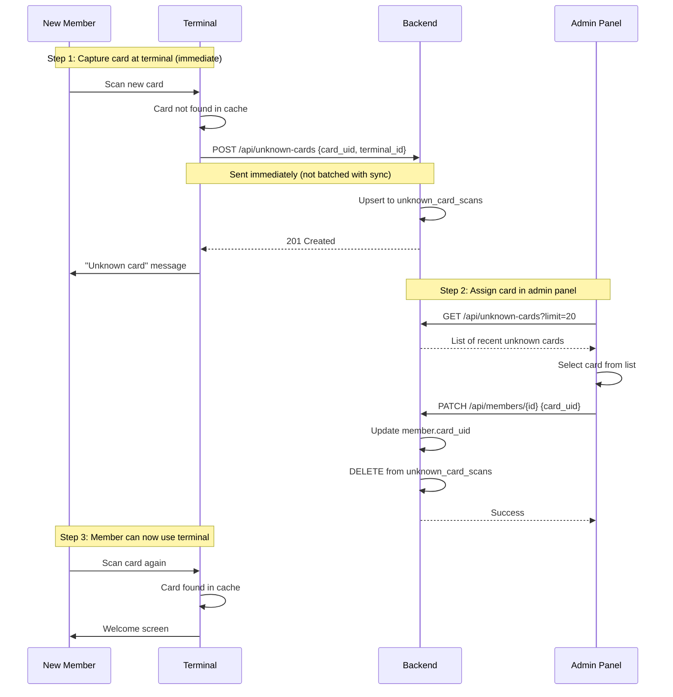

# ADR-0021: RFID Card Assignment Workflow

**Status**: Accepted

**Date**: 2025-01-23

**Deciders**: Architecture Team

---

## Context

Members need RFID cards assigned to use the terminal. The admin panel must provide a way to link a card's UID to a member record.

Current challenges:

1. **No reader at admin workstation**: Admin workstations typically don't have RFID readers
2. **Manual UID entry is error-prone**: Card UIDs are 8-20 hex characters, easy to mistype
3. **Terminal already has a reader**: The terminal hardware includes an RFID reader
4. **Unknown cards are tracked**: System already logs cards scanned at terminal that aren't assigned (`unknown_card_scans` table)

### Existing Infrastructure

The terminal already captures unknown card scans:

| Field | Description |
|-------|-------------|
| card_uid | The scanned card identifier |
| terminal_id | Which terminal detected the card |
| first_seen_at | When card was first scanned |
| last_seen_at | Most recent scan attempt |
| scan_count | Number of scan attempts |

This data is available but not currently used for card assignment.

---

## Decision

**RFID card assignment supports two methods: (1) manual UID entry for known card IDs, and (2) selection from recent unknown card scans captured by the terminal. The terminal's existing reader serves as the primary card registration device.**

### Core Principles

1. **Terminal as scanner**: Use the terminal's RFID reader for card registration (no admin workstation reader required)
2. **Unknown cards list**: Admin selects from cards recently scanned at terminal
3. **Manual fallback**: Direct UID entry for special cases (known card, replacement cards)
4. **Automatic cleanup**: Unknown card entry removed when assigned to member
5. **Recency-based**: Show most recently scanned cards first
6. **Multi-terminal support**: Show which terminal scanned each card

### Card Assignment Flow



### Immediate Upload of Unknown Cards

Unknown card scans are sent to the backend **immediately** (not batched with the regular sync interval):

| Data Type | Upload Timing | Reason |
|-----------|---------------|--------|
| Transactions | Batched (30-60s sync) | High volume, not time-sensitive |
| Unknown cards | **Immediate** | Admin needs to see card right away for assignment |

This ensures the card appears in the admin panel within seconds of scanning, enabling a smooth onboarding workflow where the admin can assign the card while the member is still present.

**Implementation**: Terminal makes a separate `POST /api/unknown-cards` request immediately when an unknown card is detected, independent of the regular sync cycle.

### Admin UI: Card Assignment Dialog

**Option A: Select from Unknown Cards (Recommended)**

| Element | Description |
|---------|-------------|
| List header | "Recent unassigned cards" |
| Card row | Card UID, terminal name, last scanned time, scan count |
| Sort | Most recently scanned first |
| Limit | Show last 20 cards |
| Empty state | "No unassigned cards. Ask member to scan their card at the terminal." |

**Option B: Manual Entry**

| Element | Description |
|---------|-------------|
| Toggle | "Enter card ID manually" |
| Input field | Text input for card UID |
| Validation | 8-20 hex characters, uppercase |
| Use case | Known card ID, card from external source |

### Onboarding Workflow

Recommended steps for registering a new member:

1. Admin creates member record (with SEPA data)
2. Admin tells member: "Please scan your card at the terminal"
3. Member scans card → terminal shows "Unknown card" → card logged
4. Admin refreshes unknown cards list → selects the card → assigns to member
5. Member scans again → terminal shows welcome

### API Endpoints

**POST /api/unknown-cards** (Terminal → Backend, immediate)

Reports an unknown card scan. Called immediately when terminal detects unrecognized card.

Request:
```json
{
  "card_uid": "A1B2C3D4E5F6",
  "terminal_id": "550e8400-e29b-41d4-a716-446655440000"
}
```

Response: `201 Created` (new card) or `200 OK` (existing card, scan_count incremented)

**GET /api/unknown-cards** (Admin Panel)

Returns recent unknown card scans.

| Parameter | Type | Default | Description |
|-----------|------|---------|-------------|
| limit | int | 20 | Max cards to return |
| since | datetime | - | Only cards scanned after this time |

Response:
```json
{
  "cards": [
    {
      "card_uid": "A1B2C3D4E5F6",
      "terminal_id": "uuid",
      "terminal_name": "Bar Terminal 1",
      "first_seen_at": "2025-01-23T10:00:00Z",
      "last_seen_at": "2025-01-23T14:30:00Z",
      "scan_count": 3
    }
  ]
}
```

**DELETE /api/unknown-cards/{card_uid}**

Removes card from unknown list (called automatically when assigned, or manually to dismiss).

---

## Consequences

### Positive

- **No extra hardware**: Uses existing terminal reader; no admin workstation reader needed
- **Reduced errors**: Selecting from list eliminates manual UID entry mistakes
- **Better UX**: Member scans card once; admin selects from list
- **Leverages existing data**: `unknown_card_scans` table already captures this
- **Multi-terminal friendly**: Works with multiple terminals; shows which terminal scanned
- **Immediate feedback**: Member sees "unknown card" confirming scan worked
- **Real-time availability**: Unknown cards sent immediately to backend (not waiting for sync interval)

### Negative

- **Two-step process**: Member must scan at terminal before admin can assign
- **Timing dependency**: Card must be scanned before admin opens assignment dialog
- **List management**: Old unknown cards accumulate if not cleaned up

### Mitigations

1. **Clear instructions**: Admin tells member to scan card before starting assignment
2. **Auto-refresh**: Unknown cards list refreshes automatically or on button click
3. **Cleanup job**: Periodic removal of unknown cards older than 30 days
4. **Manual entry fallback**: Always available for edge cases

---

## Alternatives Considered

### Alternative 1: Admin Workstation Reader

Require RFID reader connected to admin workstation.

**Pros**: Direct card scanning in admin panel

**Cons**:
- Additional hardware cost per admin workstation
- Driver/compatibility issues across platforms
- Admin may be remote (no physical card access)

**Rejected**: Terminal reader is already available; no need for duplicate hardware.

### Alternative 2: Real-time Push Notifications

WebSocket notification when card scanned at terminal.

**Pros**: Instant update in admin panel

**Cons**:
- Adds complexity (WebSocket infrastructure)
- Overkill for infrequent operation
- Polling/refresh is sufficient

**Rejected**: Simple refresh is adequate for this workflow.

### Alternative 3: QR Code on Card

Print QR code with card UID; admin scans with phone/webcam.

**Pros**: Works without RFID reader

**Cons**:
- Requires QR codes on all cards
- Additional printing/labeling step
- Not all cards have QR codes

**Rejected**: Existing RFID infrastructure is sufficient.

---

## Related Decisions

- [ADR-0014: RFID Scanning Integration](./0014-rfid-scanning-integration.md) - Terminal RFID reader
- [ADR-0020: SEPA Mandate Requirement](./0020-sepa-mandate-requirement-terminal-access.md) - Member onboarding

---

## References

- **Data Model**: `unknown_card_scans` table in [datamodel.md](../docs/datamodel.md)
- **Use Case**: [UC-A13: Assign RFID Card](../use-cases/admin/UC-A13-assign-rfid-card.md)

---

## Post-Implementation Monitoring

- Track percentage of cards assigned via list selection vs manual entry
- Monitor unknown_card_scans table size over time
- Measure time from card scan to assignment (onboarding efficiency)
- Collect feedback on card assignment workflow usability
