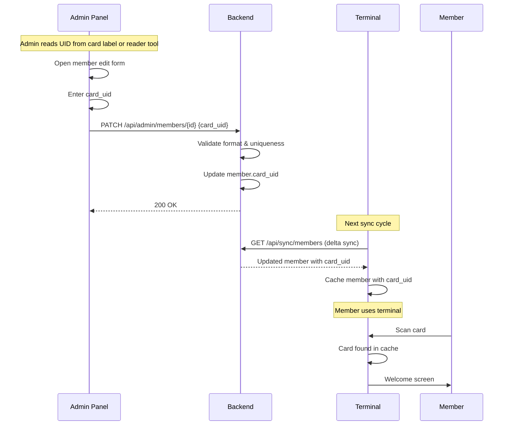

# ADR-0021: RFID Card Assignment Workflow

**Status**: Accepted (**Card UID Validation amended by
[ADR-0055](./0055-canonical-card-uid.md)**)

**Date**: 2025-01-23 (revised 2026-03-07)

**Deciders**: Architecture Team

---

## Context

Members need RFID cards assigned to use the terminal. The admin panel must provide a way to link a card's UID to a member record.

Current situation:

1. **Cards have printed UIDs**: Most RFID cards have the UID printed on the card label
2. **Reader diagnostic tools**: Card UIDs can also be read via reader diagnostic software and copied
3. **Small club scope**: Clubs typically onboard members one at a time, not in bulk
4. **Existing member edit form**: The admin panel already has a member edit form with a `card_uid` field

---

## Decision

**RFID card assignment uses manual UID entry in the admin panel. The admin types or pastes the card UID into the member edit form. The card_uid field is reduced to its canonical spelling, then validated for format and uniqueness.**

### Card UID Validation

**Amended by [ADR-0055](./0055-canonical-card-uid.md).** "Normalized to uppercase"
was not enough. The sources this ADR names — a card label, a reader's diagnostic
window, a copy-paste — print the same chip as `001EB4CB`, `001eb4cb`,
`00:1E:B4:CB` or `0x001EB4CB`, and `card_uid` is matched by exact string
comparison. Two consequences the table below now covers: the card works only
until somebody swaps the reader, and the uniqueness rule does not notice that
`001EB4CB` and `00:1E:B4:CB` are one card being handed to two members.

| Rule | Description |
|------|-------------|
| Canonical form | Uppercase hex, no separators, whole bytes, four to ten of them — `001EB4CB`. The only spelling stored |
| Accepted input | Any hex spelling a reader or diagnostic tool prints: case, byte separators (`:`, `-`, `.`, space), an `0x` prefix, and a leading zero dropped mid-byte are all reduced to the canonical form before validation |
| Refused input | Anything not readable as a hex UID, including a decimal reader's output — `0002012363` is also a well-formed 5-byte hex UID, so the backend never guesses. The member form offers that conversion explicitly instead |
| Length | 8-20 characters, i.e. 4-10 whole bytes, checked on the canonical form |
| Uniqueness | Each card_uid must be unique across all members, checked on the canonical form |

### Card Assignment Flow

### Onboarding Workflow

Steps for registering a new member with a card:

1. Admin creates member record (name, IBAN, SEPA mandate)
2. Admin reads the card UID from the card label (or pastes from reader diagnostic tool)
3. Admin enters card_uid in the member edit form and saves
4. Terminal syncs and receives the updated member record
5. Member scans card at terminal and is recognized

### Card UID Sources

| Source | Description |
|--------|-------------|
| Card label | UID printed directly on the RFID card |
| Reader diagnostic software | USB/NFC reader tools display UID when card is scanned |
| Copy-paste | UID copied from reader software into admin form |

---

## Consequences

### Positive

- **Simple implementation**: No extra API endpoints needed; uses existing PATCH /api/admin/members/{id}
- **No terminal changes**: Terminal does not need upload logic for unknown cards
- **Leverages existing form**: card_uid is already a field in the member edit form
- **No extra infrastructure**: No unknown_card_scans table, no cleanup jobs, no immediate-upload logic
- **Straightforward onboarding**: Single-step assignment in the admin panel

### Negative

- **Manual entry is error-prone**: Long UIDs without labels can lead to typos

### Mitigations

- UIDs are typically printed on RFID cards, making them easy to read
- Copy-paste from reader diagnostic tools eliminates manual typing entirely
- Format validation (hex-only, length check) catches most typos before save
- The form shows the canonical value that will be stored before the admin saves
  it, which is the only moment a mistyped UID is catchable at all — nobody reads
  twenty characters of hex back afterwards (ADR-0055)
- Uniqueness constraint prevents accidental duplicate assignments, and sees one
  spelling per chip rather than one per tool the UID was copied from

---

## Alternatives Considered

### Alternative 1: Unknown Card Upload Workflow

Terminal captures unknown card scans and uploads them to the backend immediately. Admin selects from a list of recently scanned unknown cards instead of typing the UID.

This would require:
- `unknown_card_scans` table in the database
- POST /api/unknown-cards endpoint (terminal to backend, immediate upload)
- GET /api/unknown-cards endpoint (admin panel to list recent cards)
- DELETE /api/unknown-cards/{uid} endpoint (cleanup on assignment)
- Terminal-side immediate upload logic (separate from regular sync)
- Admin UI card selection dialog with refresh, empty states, terminal names

**Rejected**: Over-engineered for small clubs where RFID cards have printed UIDs. The additional API endpoints, terminal-side upload logic, and admin UI for card selection add complexity without proportional benefit.

### Alternative 2: Admin Workstation Reader

Require RFID reader connected to admin workstation.

**Rejected**: Additional hardware cost per admin workstation. Terminal reader is already available, but the admin workstation typically does not have one. Cards have printed UIDs, making a reader unnecessary.

### Alternative 3: Real-time Push Notifications

WebSocket notification when card scanned at terminal.

**Rejected**: Adds WebSocket infrastructure complexity. Overkill for an infrequent operation.

### Alternative 4: QR Code on Card

Print QR code with card UID; admin scans with phone/webcam.

**Rejected**: Requires QR codes on all cards. Not all cards have QR codes printed.

---

## Related Decisions

- [ADR-0014: RFID Scanning Integration](./0014-rfid-scanning-integration.md) - Terminal RFID reader hardware and protocol
- [ADR-0020: SEPA Mandate Requirement](./0020-sepa-mandate-requirement-terminal-access.md) - Member onboarding prerequisites

---

## References

- **Use Case**: [UC-A13: Assign RFID Card](../use-cases/admin/UC-A13-assign-rfid-card.md)
