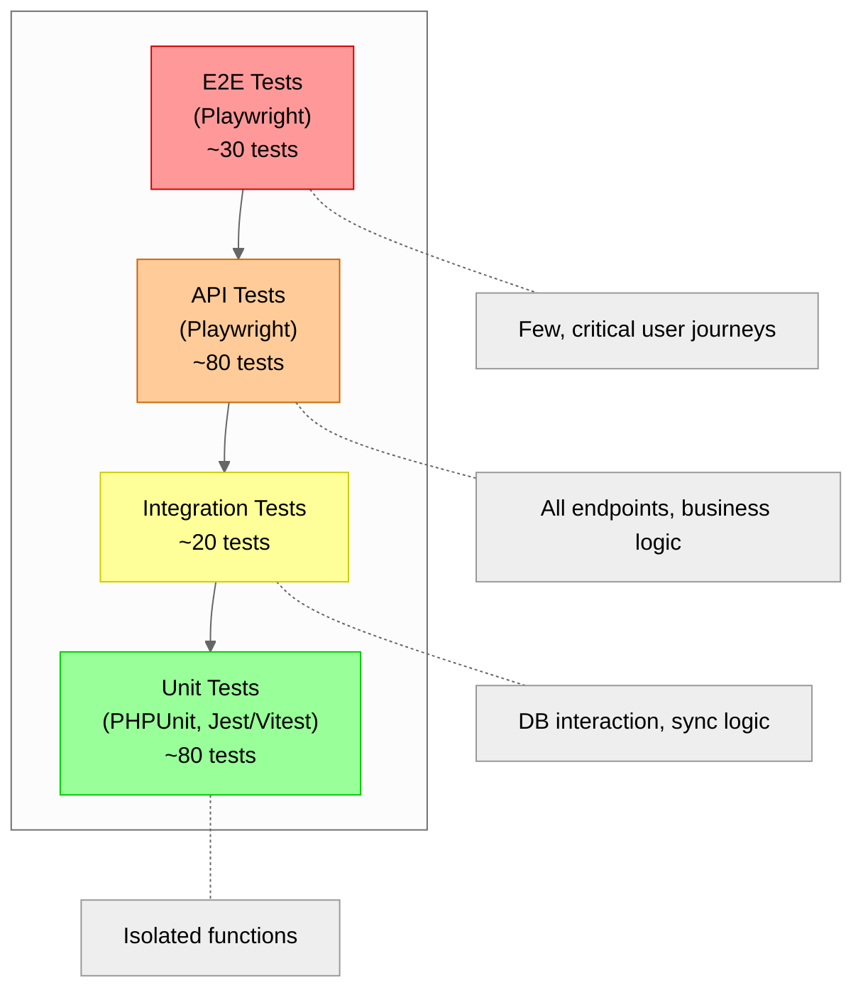
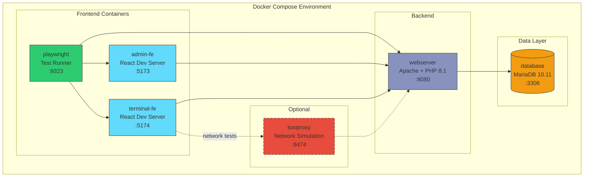
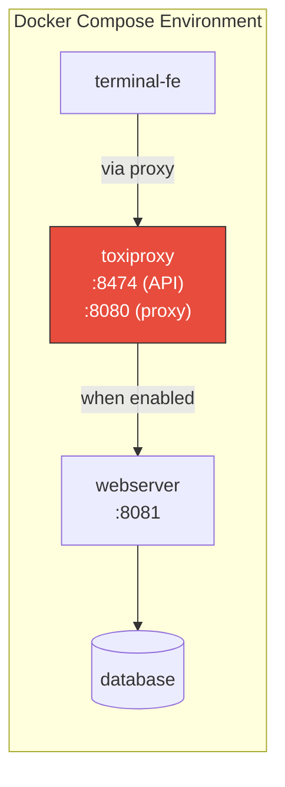
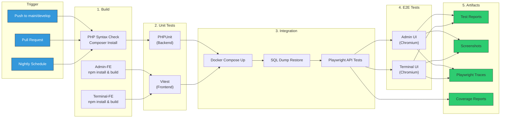

# ADR-0022: Test Strategy and Automation

**Status**: Accepted
**Date**: 2025-01-23

## Context

The Club Bar system requires a comprehensive testing strategy that ensures:

1. **Functional correctness**: Business logic matches requirements
2. **Integration reliability**: Frontend, backend, and database work together correctly
3. **Regression prevention**: Changes don't break existing functionality
4. **GDPR compliance**: Privacy workflows function reliably
5. **Offline capability**: Terminal operates without network connectivity

The system has multiple components (Admin Panel, Terminal, Backend API, Database) that need different testing approaches. Additionally, the offline-first architecture of the terminal introduces unique testing challenges.

## Decision

Adopt a **test pyramid approach** with Playwright as the primary test automation framework for both E2E and API tests, combined with unit testing frameworks for isolated logic.

### Core Principles

1. **Test pyramid hierarchy**: More unit tests, fewer E2E tests
2. **Unified tooling**: Playwright for E2E and API tests (same language, fixtures, assertions)
3. **Docker-based test environment**: Reproducible, isolated test execution
4. **Business-driven test design**: Tests derived from use cases and user journeys
5. **Test isolation**: Each test runs independently with no shared state
6. **Deterministic data**: No random values, fixed seed data

### Test Categories

| Category | Tool | Purpose | Count Target |
|----------|------|---------|--------------|
| Unit Tests (Backend) | PHPUnit | Isolated functions, validation logic | ~50 |
| Unit Tests (Frontend) | Jest/Vitest | React components, hooks, utilities | ~30 |
| API Tests | Playwright | All endpoints, business logic validation | ~80 |
| E2E Tests | Playwright | Critical user journeys | ~30 |

### Test Pyramid Structure

### Docker Test Environment

### Playwright Project Configuration

| Project | Browser | Viewport | Purpose |
|---------|---------|----------|---------|
| admin-chromium | Chromium | 1920x1080 | Admin UI desktop |
| terminal-touch | Chromium | 800x480 | Terminal touchscreen simulation |
| api-tests | — | — | Headless API testing |

### Test Data Management

| Strategy | Application | Description |
|----------|-------------|-------------|
| SQL Dump Restore | Before test suite | Fast restore from pre-built dump file |
| Transaction Rollback | After each API test | Fast, no side effects |
| Selective Cleanup | After E2E test | Delete only test-created data |

**Data Preparation**: A SQL dump file (`test-seed.sql`) contains the complete test dataset. This approach is faster than running individual INSERT statements and ensures consistent state across test runs.

**Seed Data Contents:**
- 1 admin user account
- 10 members (various statuses: active, inactive, anonymized)
- 15 products (active/inactive, all categories)
- 100 transactions (3 months history)
- 2 historical settlements
- 2 terminals (active/inactive)

### API Test Categories

| Category | Example | Assertions |
|----------|---------|------------|
| Happy Path | Create member with valid data | 201, correct body, DB entry |
| Validation | Create member with invalid IBAN | 422, error message |
| Authorization | Unauthenticated delete attempt | 401 |
| Idempotency | Same transaction sent twice | 200, no duplicates |
| Pagination | List with offset/limit | Correct result count |
| Edge Cases | Delete member with balance > 0 | 409, no deletion |

### Critical User Journey Tests (E2E)

| Journey | Use Cases | Priority |
|---------|-----------|----------|
| Member Lifecycle | UC-A11, UC-A12, UC-DSGVO-02 | High |
| Terminal Booking | UC-T01, UC-T02 | High |
| SEPA Settlement | UC-SEPA-01 through UC-SEPA-05 | High |
| Manual Settlement | UC-SEPA-06, UC-SEPA-07 | Medium |
| GDPR Compliance | UC-DSGVO-01 through UC-DSGVO-06 | High |
| Admin Management | UC-A61, UC-A62 | Medium |

### Network Failure Testing (Optional)

Testing the terminal's offline behavior requires simulating actual network failures. Playwright's `page.route()` intercepts requests at the browser level, but the frontend application cannot detect this as a network failure — requests simply never complete.

For realistic network failure testing, **Toxiproxy** can be added as an optional container:

**Toxiproxy capabilities:**
- Simulate connection timeouts
- Add latency to requests
- Drop connections mid-request
- Limit bandwidth

**Test flow:**
1. Terminal syncs through Toxiproxy (normal operation)
2. Test enables "timeout" toxic via Toxiproxy API
3. Terminal attempts sync, experiences real network failure
4. Terminal falls back to offline mode
5. Test disables toxic, terminal recovers

This approach is optional and adds complexity. For most scenarios, verifying that the terminal correctly uses cached data and queues transactions locally is sufficient without simulating actual network failures.

### Execution Time Targets

| Test Type | Count | Target Time | Parallelism |
|-----------|-------|-------------|-------------|
| Unit Tests (Backend) | ~50 | < 30s | 4 workers |
| Unit Tests (Frontend) | ~30 | < 20s | 4 workers |
| API Tests | ~80 | < 2min | 4 workers |
| E2E Tests (Admin) | ~20 | < 5min | 2 workers |
| E2E Tests (Terminal) | ~10 | < 3min | 2 workers |
| **Total** | ~190 | < 10min | — |

### CI/CD Pipeline

### Quality Metrics

| Metric | Target |
|--------|--------|
| Test Success Rate | > 99% |
| Line Coverage | > 80% |
| Branch Coverage | > 70% |
| Flaky Test Rate | < 2% |
| Average Test Time | < 500ms |

## Consequences

### Positive

- **Unified tooling**: Playwright handles both E2E and API tests, reducing context switching
- **Reproducible environments**: Docker ensures consistent test execution across machines
- **Fast feedback**: API tests provide quick validation without browser overhead
- **Comprehensive coverage**: Test pyramid ensures all layers are tested appropriately
- **Fast data setup**: SQL dump restore is faster than programmatic seeding
- **CI/CD ready**: Docker-based execution integrates easily into pipelines
- **Debug support**: Playwright traces, screenshots, and videos aid failure analysis

### Negative

- **Docker overhead**: Local development requires Docker setup
- **Playwright learning curve**: Team needs familiarity with Playwright APIs
- **Test maintenance**: E2E tests require updates when UI changes
- **Network failure testing complexity**: Requires optional Toxiproxy setup for realistic offline tests

### Mitigations

- Provide Docker Compose configuration with health checks for reliable startup
- Use Page Object pattern to isolate UI selectors from test logic
- Prioritize API tests over E2E tests for business logic validation
- Use `data-testid` attributes for stable element selection
- Network failure testing is optional; basic offline behavior can be verified without it

## Alternatives Considered

### 1. Separate Tools for API and E2E Tests
Using REST client libraries (e.g., Axios) for API tests and Playwright only for E2E.

**Rejected because:**
- Requires maintaining two test frameworks
- No shared fixtures or assertion patterns
- Harder to share authentication logic

### 2. Cypress Instead of Playwright
Cypress is popular for E2E testing with good developer experience.

**Rejected because:**
- API testing requires additional plugins
- Playwright has better support for multiple browser contexts (useful for concurrent access tests)
- Playwright's API request context integrates well with E2E tests

### 3. Local Development Without Docker
Running tests directly on developer machines without containers.

**Rejected because:**
- Environment inconsistencies across machines
- Harder to manage database state
- CI/CD environment would differ from local

## Related Decisions

- [ADR-0012: Eventual Consistency and Frontend Caching](0012-eventual-consistency-frontend-caching.md) — Sync behavior to test
- [ADR-0013: Audit Logging](0013-audit-logging.md) — Audit entries to verify in tests
- [ADR-0015: Authentication and Authorization](0015-authentication-and-authorization-strategy.md) — Auth flows to test
- [ADR-0004: Immutable Transaction Storage](0004-immutable-transaction-storage.md) — Transaction idempotency to verify

## References

- [Playwright Documentation](https://playwright.dev/docs/intro)
- [Test Pyramid](https://martinfowler.com/articles/practical-test-pyramid.html)
- [Docker Compose Documentation](https://docs.docker.com/compose/)
- [Toxiproxy](https://github.com/Shopify/toxiproxy) — Network failure simulation