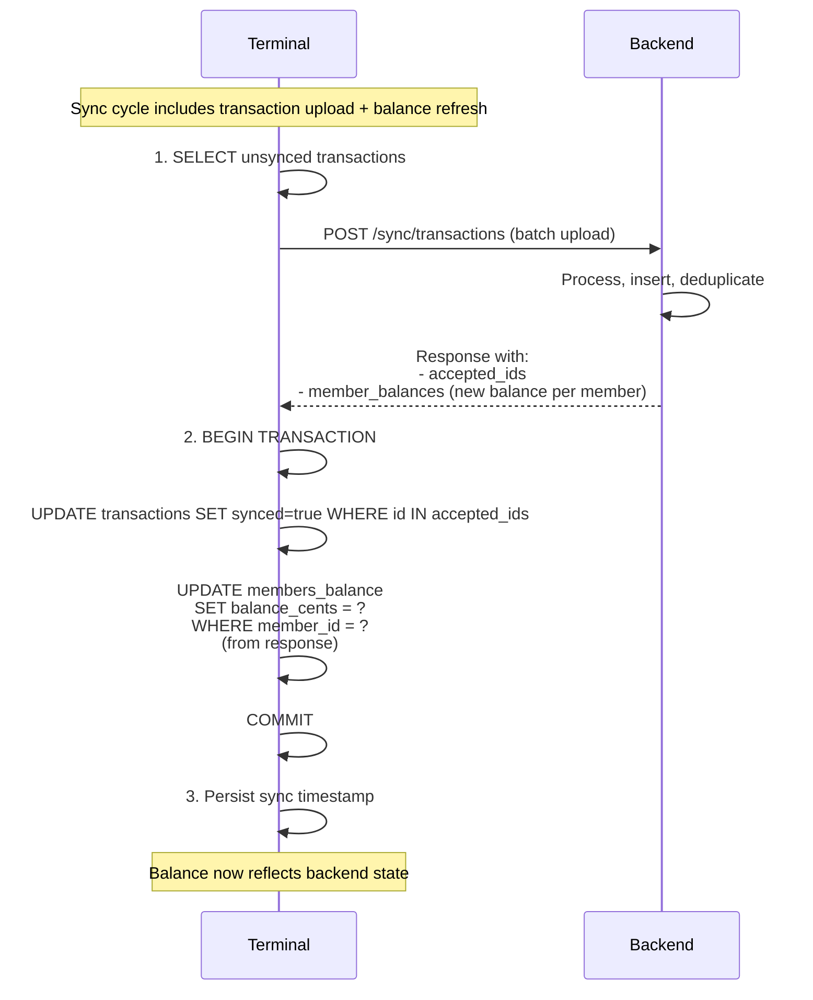

# ADR-0023: Terminal Balance State Management

**Status**: Pending Review

**Date**: 2025-01-25

---

## Context

The terminal needs to display a member's current financial position in two contexts:

1. **Current balance**: Sum of all unsettled transactions (what member owes)
2. **Projected balance**: Current balance plus items in the shopping cart

The terminal operates offline-first and maintains a local SQLite cache of data. Currently:
- Terminal stores only its own outgoing transactions (purchases)
- Terminal receives member data via periodic sync
- Terminal has no persistent record of a member's authoritative balance

Key constraints:
1. **Offline capability**: Balance display must work without network access
2. **Eventually consistent**: Terminal balance may diverge from backend after syncing new transactions
3. **Immutable transactions**: Backend uses append-only pattern (ADR-0004); corrections via reverse transactions
4. **Sync reliability**: Network may fail; sync operations must be recoverable
5. **Fast display**: Balance lookup must be instantaneous (no backend queries during purchase flow)

---

## Decision

**Terminal stores the current balance per member in SQLite. Balance is updated atomically when transactions are marked as synced to the backend. The sync API response includes the authoritative balance per member, which terminal uses to refresh its local copy.**

### Core Principles

1. **Persistent local balance**: SQLite stores `member_id → balance_cents` mapping
2. **Atomic updates**: Balance updated in same transaction as marking transactions synced
3. **Authoritative source**: Backend balance (returned in sync response) is source of truth
4. **Calculation-free**: Terminal does NOT calculate balance from transaction history; uses stored value
5. **Sync-driven updates**: Balance refreshed only after successful sync with backend
6. **Graceful degradation**: If sync fails, terminal shows previously synced balance

### Data Structure

#### Members Balance Table (Terminal SQLite)

```sql
CREATE TABLE members_balance (
  member_id BINARY(16) PRIMARY KEY,
  balance_cents INT NOT NULL DEFAULT 0,          -- Current outstanding balance
  last_updated_at DATETIME NOT NULL,             -- When balance was last synced

  FOREIGN KEY (member_id) REFERENCES members_cache(id),
  INDEX idx_last_updated (last_updated_at)
) ENGINE=InnoDB;
```

#### Sync Cycle with Balance Update



### API Response Format

The `/sync/transactions` POST response now includes member balances:

```json
{
  "accepted_transaction_ids": [
    "550e8400-e29b-41d4-a716-446655440000",
    "550e8400-e29b-41d4-a716-446655440001"
  ],
  "member_balances": {
    "member_uuid_1": 4500,      // €45.00 outstanding
    "member_uuid_2": -2000      // €20.00 credit
  }
}
```

### Balance Display Behavior

| Context | Data Source | Behavior |
|---------|------------|----------|
| Product view (main screen) | SQLite members_balance | Show current balance + cart preview |
| Balance detail screen | SQLite members_balance | Show transaction history + current balance |
| Offline (no network) | SQLite members_balance | Show last synced balance |
| After failed sync | SQLite members_balance | Keep previous value, show warning |
| New member (no sync yet) | Default: €0.00 | Calculate from local transactions if needed |

### Transaction Sync Flow (Detailed)

```
1. Gather unsynced transactions from local queue
2. POST to /sync/transactions
   - If network fails → stay in queue, retry later
   - If server error (5xx) → stay in queue, retry later
   - If client error (4xx) → log and mark as failed, investigate

3. On success:
   a. Mark transactions as synced (synced=true)
   b. Update members_balance from response
   c. Record sync timestamp

4. On next sync:
   a. Only unsynced transactions uploaded
   b. New balances received and updated
```

---

## Consequences

### Positive

✅ **Fast balance lookups**: Stored value, no calculation needed
✅ **Offline balance display**: Works without network access
✅ **Atomic consistency**: Balance and transaction sync status always aligned
✅ **Simple recovery**: Failed sync doesn't corrupt balance
✅ **Clear state**: Single source of truth per member (no derived calculations)
✅ **Audit trail**: Sync response preserves which transactions updated which balance

### Negative

❌ **Manual reconciliation**: If balance diverges from backend, requires manual sync to fix
❌ **Storage overhead**: One row per active member in members_balance table
❌ **Stale display**: Offline member sees previous sync balance (may be days old if offline long)
❌ **Sync dependency**: Balance accuracy depends on successful sync (network failures delay updates)

### Mitigations

1. **Offline warning**: If balance > 24 hours old, display "Balance last updated X days ago"
2. **Sync status indicator**: Show connectivity status on main screen
3. **Manual refresh**: Allow member to trigger sync even outside normal cycle
4. **Validation**: On each sync, compare local total (from transactions) with server balance; warn on divergence

---

## Alternatives Considered

### Alternative 1: Calculate Balance from Transaction History

Keep only transaction log; calculate balance on-demand.

```sql
SELECT SUM(amount_cents) FROM transactions WHERE member_id = ?
```

**Pros**: Single source of truth; no duplication
**Cons**:
- Slow with large transaction histories
- Requires reading all transactions every time
- Calculation can diverge if transaction history incomplete
- Doesn't account for corrections or deletions from backend

**Rejected**: Performance issue; terminal needs instant balance display during purchase flow.

### Alternative 2: Always Fetch Balance from Backend

Query `/sync/balance/{member_id}` on every balance display.

**Pros**: Always accurate and current
**Cons**:
- Non-functional offline
- Latency during purchase flow
- Network dependency for basic UX
- Backend load for every balance check

**Rejected**: Violates offline-first principle; unacceptable UX latency.

### Alternative 3: Caching with TTL

Store balance with expiration; refresh after 5 minutes or on manual request.

**Pros**: Flexibility to refresh partially stale balance
**Cons**:
- More complex cache invalidation logic
- Still shows stale data if offline
- Adds background refresh logic

**Rejected**: Atomic sync model simpler; refreshes at predictable sync intervals.

---

## Related Decisions

- [ADR-0004: Immutable Transaction Storage](./0004-immutable-transaction-storage.md) — Balance calculated from immutable transaction log; corrections via reverse transactions
- [ADR-0012: Eventual Consistency and Frontend Caching](./0012-eventual-consistency-frontend-caching.md) — Terminal caching strategy; balance updated during periodic sync
- [ADR-0024: Transaction History Retrieval in Terminal](./0024-transaction-history-retrieval-terminal.md) — On-demand transaction history (separate from balance sync)
- [ADR-0001: Monetary Values as Integer Cents](./0001-monetary-values-as-integer-cents.md) — Balance stored as integer cents
- [ADR-0003: GZIP Compression](./0003-gzip-compression-http.md) — Sync API response (including balances) compressed

---

## Implementation Notes

**Database Schema**: Add `members_balance` table with balance_cents and last_updated_at fields.

**API Change**: Update `POST /sync/transactions` response to include `member_balances` object mapping member UUIDs to balance_cents.

**Transaction Atomicity**: Use SQLite transactions to ensure balance and sync status updated together; if commit fails, entire sync rolls back.

**Error Handling**:
- If sync response missing member balance → use existing stored value
- If response shows different members than uploaded → investigate duplicate IDs
- Log balance changes for audit purposes

---

## Post-Implementation Monitoring

- Track balance update frequency (how often balance changes)
- Monitor sync success rate and member balance divergence
- Alert if balance stale > 24 hours for any member
- Verify atomic transaction updates (no partial syncs)
- Test offline scenario: member offline > 24 hours, balance accuracy after reconnect
