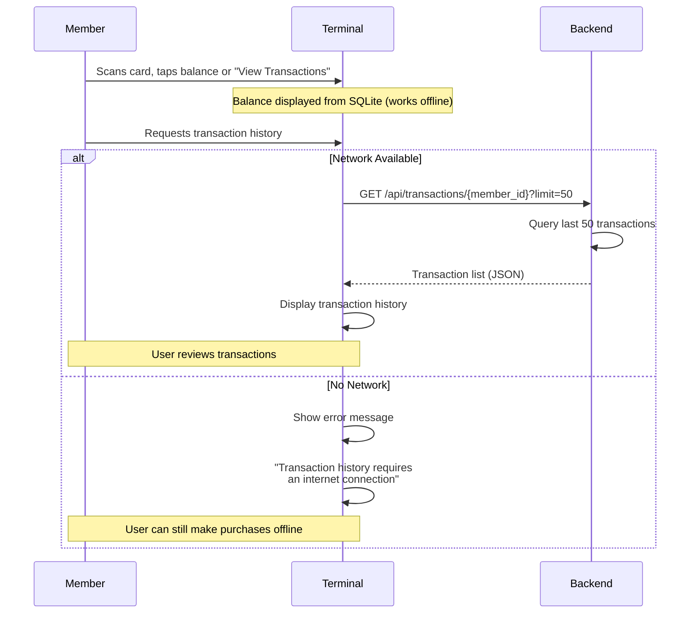
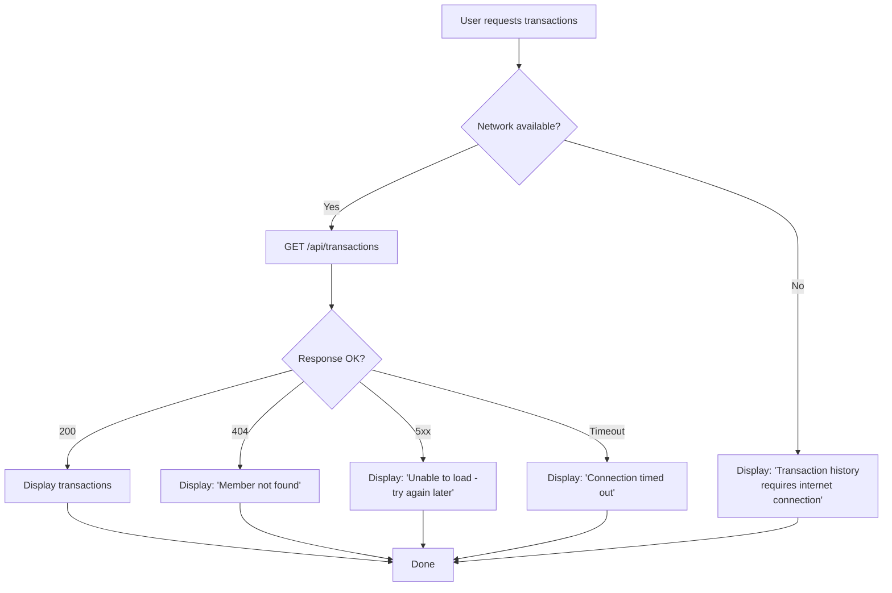

# ADR-0024: Transaction History Retrieval in Terminal

**Status**: Pending Review

**Date**: 2025-01-25

---

## Context

The terminal displays member transaction history to provide visibility into recent purchases and corrections. Current design (ADR-0012) specifies that terminal stores only its own outgoing transactions; complete history is maintained on backend.

Key requirements and constraints:

1. **On-demand retrieval**: User requests recent transactions at point of sale (during checkout or on balance screen)
2. **Network requirement**: History is convenience feature; core POS (purchase, balance) works offline
3. **Minimal local storage**: Terminal doesn't store complete transaction history (only own purchases)
4. **Backend as source of truth**: Full history maintained on backend (immutable per ADR-0004)
5. **Privacy by default**: Transaction data is sensitive; only show when explicitly requested
6. **Low bandwidth**: API call should be minimal; fetch only recent transactions (default 50)

---

## Decision

**Transaction history is online-only. Terminal fetches history on-demand from the backend via a dedicated GET endpoint. If network is unavailable, terminal displays an error message. No offline fallback, no cached history display. This decision prioritizes simplicity and aligns with offline-first principle: core POS operations (purchase, balance) work offline; convenience features (history view) require connectivity.**

### Core Principles

1. **Online-only feature**: History requires network connectivity; no offline fallback or cache
2. **Immediate error feedback**: Network unavailable → show error message ("Transaction history requires an internet connection")
3. **No caching strategy**: Response used for immediate display; not persisted to disk
4. **On-demand fetching**: Call `GET /api/terminal/transactions/{member_id}?limit=50` when user requests
5. **Minimal response**: Only recent transactions (default 50); quick response times
6. **Non-blocking**: User can continue shopping without viewing history; history is optional convenience feature

### Data Flow



### API Endpoint Specification

#### GET /api/transactions/{member_id}

**Path Parameters:**
- `member_id` (UUID): Member identifier

**Query Parameters:**
- `limit` (int, optional, default=50): Maximum transactions to return
- `offset` (int, optional, default=0): Pagination offset
- `since` (ISO 8601 datetime, optional): Transactions after this timestamp

**Response (200 OK):**

```json
{
  "member_id": "550e8400-e29b-41d4-a716-446655440000",
  "count": 12,
  "transactions": [
    {
      "id": "550e8400-e29b-41d4-a716-446655440001",
      "amount_cents": 350,
      "type": "purchase",
      "product_id": "550e8400-e29b-41d4-a716-446655440002",
      "product_name": "Pils",
      "created_at": "2025-01-25T14:32:00Z",
      "created_by_terminal_id": "terminal-001"
    },
    {
      "id": "550e8400-e29b-41d4-a716-446655440003",
      "amount_cents": -350,
      "type": "correction",
      "product_id": null,
      "product_name": "Correction: Wrong amount",
      "notes": "Member scanned twice - reversed",
      "created_at": "2025-01-25T14:33:00Z",
      "created_by_admin_id": null,
      "related_transaction_id": "550e8400-e29b-41d4-a716-446655440001"
    }
  ]
}
```

**Response (404 Not Found):**
- Member not found in system

**Response (400 Bad Request):**
- Invalid member_id format

**Response (503 Service Unavailable):**
- Backend service temporarily unavailable
- Terminal shows offline message and uses cache if available

### Terminal Display Behavior

| Scenario | Behavior |
|----------|----------|
| Network available, transactions found | Display list of 50 most recent transactions |
| Network available, no transactions | Show "No recent transactions" |
| Network unavailable (any reason) | Show "Transaction history requires an internet connection" |
| Backend error (5xx) | Show "Unable to load transactions - please try again later" |
| Member unknown (404) | Show "Member not found" |
| Request timeout (> 3 seconds) | Show "Connection timed out - check your internet and try again" |

### Caching Strategy (Optional Short-Term Cache)

If implementing response caching (not required by this ADR):

```
- Cache duration: 5 minutes (in memory only)
- Invalidate cache when:
  - Sync completes (new transactions may exist)
  - Manual refresh requested
  - Cache expiration
- Do NOT persist cache to disk (to avoid stale offline data)
```

### Error Handling



---

## Consequences

### Positive

✅ **Network-optional for core POS**: Terminal doesn't require connectivity for purchases or balance display
✅ **Low bandwidth**: Only fetches when requested; no periodic history sync
✅ **Simple implementation**: No caching logic, no cache invalidation, no offline fallback paths
✅ **On-demand**: Member sees current transactions when needed (and can reach them)
✅ **Clean separation**: History display decoupled from transaction upload sync
✅ **Clear user expectation**: Online-only messaging is straightforward and unambiguous
✅ **Backend-driven**: Terminal always sees authoritative history from backend
✅ **Reduced local storage**: No persistent transaction cache on terminal
✅ **Audit-friendly**: Transaction list fetched from immutable backend source

### Negative

❌ **No offline history**: Transaction review requires internet connection
❌ **Potential user frustration**: Members offline cannot see transaction details
❌ **Latency during checkout**: History fetch adds network roundtrip (< 1s typical, but requires connectivity)
❌ **Limited visibility during extended outages**: Multi-day offline → members have no way to review recent purchases

### Mitigations

1. **Clear messaging**: Show "Transaction history requires internet connection" message (not ambiguous error)
2. **Non-blocking**: History view doesn't block purchases; user can continue without viewing
3. **Fast timeout**: Set 2-3 second network timeout; don't hang waiting for slow networks
4. **Offline indication**: Show connectivity status on main screen so users understand state
5. **Alternative**: If needed, admins can print/email transaction summaries to members (out-of-system)

---

## Alternatives Considered

### Alternative 1: Offline Fallback with Cached History

Cache transaction history in SQLite; display cached data when offline (with stale warning).

**Pros**:
- Members can view history during offline periods
- Increases convenience factor

**Cons**:
- Adds caching logic, cache invalidation, state management complexity
- Users may act on stale data (see old balance, miss recent corrections)
- Confusing UX: which history is correct, cached or backend?
- Cache bloat: SQLite grows with transaction history
- Requires periodic cache updates (adds to sync burden)

**Rejected**: Offline-first principle prioritizes core operations (purchase, balance). History is convenience feature that requires connectivity. Simpler to show error than manage cache correctness.

---

### Alternative 2: In-Memory Cache (5-Minute TTL)

Cache response in memory only; refresh after 5 minutes or on manual request.

**Pros**:
- Fast re-fetch if user opens history twice
- No persistent storage bloat
- Reduces backend hits for high-frequency requests

**Cons**:
- Still requires caching state management
- TTL logic adds complexity (when does cache expire?)
- Terminal restart loses cache (expected behavior, but confusing)
- Doesn't help offline users (cache lost on network disconnect)

**Rejected**: Not worth the added complexity. History is not high-frequency operation; each fetch is negligible cost. Keep implementation simple.

---

### Alternative 3: Sync History as Part of Periodic Sync

Include recent member transactions in periodic sync (like members/products).

**Pros**: History available offline; always current after sync
**Cons**:
- Massive bandwidth overhead (syncs history for ALL members to each terminal)
- Not practical with large member bases (thousands of members × hundreds of transactions each)
- History irrelevant to POS checkout flow (pollutes sync payload)
- Makes sync cycle slower and less reliable
- Added complexity to sync response parsing

**Rejected**: Bandwidth and scope misalignment. Sync cycle optimized for purchase operations, not convenience features.

---

### Alternative 4: No History View Feature

Remove transaction history feature entirely from terminal.

**Pros**: Simplifies implementation; no API endpoint needed
**Cons**:
- Members lose visibility into purchases
- Can't see when/what was purchased or any corrections
- Reduces transparency and trust
- Doesn't meet use case UC-T02 requirements

**Rejected**: Use cases explicitly require transaction history display. Feature is valuable for member confidence.

---

## Related Decisions

- [ADR-0004: Immutable Transaction Storage](./0004-immutable-transaction-storage.md) — Backend stores immutable transaction history; terminal fetches from authoritative source
- [ADR-0012: Eventual Consistency and Frontend Caching](./0012-eventual-consistency-frontend-caching.md) — Terminal caching strategy; history retrieval is separate from periodic sync
- [ADR-0023: Terminal Balance State Management](./0023-terminal-balance-state-management.md) — Balance display updated during sync; transaction history on-demand (separate concern)
- [ADR-0003: GZIP Compression](./0003-gzip-compression-http.md) — Transaction history API response can be compressed

---

## Implementation Notes

**API Endpoint**: Implement `GET /api/terminal/transactions/{member_id}` in backend.

**Query Optimization**: Index transactions by (member_id, created_at DESC) for fast retrieval.

**Response Format**: Include only essential fields (id, amount, type, product_name, created_at) to minimize payload.

**Network Timeout**: Set 2-3 second timeout; fail gracefully rather than block checkout.

**Rate Limiting**: Consider rate-limiting this endpoint if history is frequently requested (not per-requirement, but operational concern).

**Testing**:
- Test with network unavailable (no internet connection)
- Test with member having no transactions
- Test with member having 100+ transactions (pagination)
- Test with backend timeout (> 3 seconds)
- Test with invalid member_id (404 response)

---

## Post-Implementation Monitoring

- Track API response latencies (should be < 1s for 50 transactions)
- Monitor endpoint hit rate (how often members request history)
- Alert if endpoint fails > 5 times per hour
- Verify network timeout behavior (terminal doesn't hang on slow network)
- Monitor cache hit rate if implementing in-memory caching
