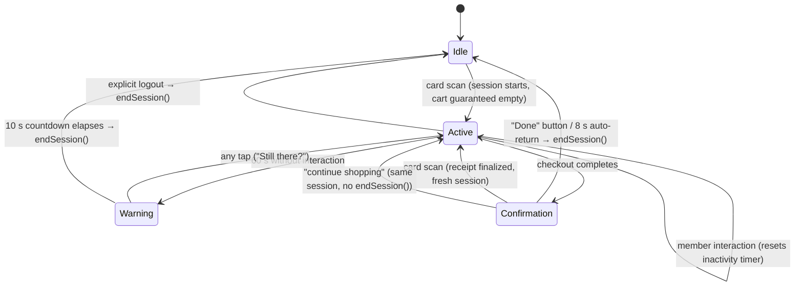

# ADR-0027: Terminal Session Lifecycle and Cart Ownership

**Status**: Accepted (amended 2026-08-06 — see [Amendment 1](#amendment-1-nothing-ends-a-session-during-a-critical-operation), [Amendment 2](#amendment-2-per-route-scan-policy-53), [Amendment 3](#amendment-3-a-shorter-resumable-receipt-25))

**Date**: 2026-08-05

---

## Context

The terminal had no defined session lifecycle. Cart state (`CartProvider`) and member state (`MembersProvider`) were independent, and each screen hand-rolled its own logout. This produced a critical money-wrong bug (#13): logout cleared the member but not the cart, so the next member who scanned inherited — and paid for — the previous member's items.

Two adjacent gaps share the same root cause:

- No inactivity timeout existed (#23); `AppConfig.inactivityTimeout` was declared but never used.
- RFID scanning currently only works on the idle screen (#26); once it works everywhere, the semantics of a card tap during an active session must be defined.

A public kiosk needs one authoritative answer to: when does a session start, when does it end, and what state dies with it?

## Decision

**A session is the unit of terminal interaction, and the cart belongs to the session — never to the member. Sessions are protected: they end in exactly three ways, and nothing else ends or replaces them. This rule is permanent.**

### Session lifecycle

Session ends are suspended for as long as a checkout or dispense is in flight (rule 7).

### Rules

| # | Rule | Rationale |
|---|------|-----------|
| 1 | A session starts only by a card scan from the idle screen. | Single entry point; cart defensively cleared at start. |
| 2 | A session ends **only** by: explicit logout, inactivity timeout, or checkout completion. | Protects the active member's cart and billing identity. |
| 3 | A foreign card tap during an **Active or Warning** session is **rejected** (with a "please log out first" hint). It never ends, replaces, or merges the session. | Prevents session hijacking and cross-member billing. Binding constraint on #26. Scoped to Active/Warning by [amendment 2](#amendment-2-per-route-scan-policy-53) — the Confirmation screen holds a finished receipt, not an open cart. |
| 4 | The same member re-tapping their own card mid-session is a no-op, and the tap counts as activity (resets the inactivity timer, dismisses the "Still there?" warning). | An accidental double-tap must not wipe the cart; a member still standing at the terminal is not idle. |
| 5 | The cart is created empty at session start and silently discarded at session end. No cross-session cart preservation. | Cart is session state, not member state. Silent discard: nothing is billed yet, and a blocking dialog would hold the kiosk hostage. |
| 6 | Inactivity timeout: 60 s without interaction, then a visible 10 s countdown warning; any tap resets. | 30 s (original dead constant) punishes slow deciders; without any timeout a walked-away session blocks the terminal (rule 3 forbids takeover by scan). |
| 7 | **Nothing ends a session while a checkout or dispense operation is in flight** — not the inactivity timer, not an explicit logout, not a card scan. `endSession()` is a no-op for as long as the critical operation runs, and the logout affordance renders disabled. | A long token dispense must never be interrupted mid-billing. Broadened from "the inactivity timer is suspended" by [amendment 1](#amendment-1-nothing-ends-a-session-during-a-critical-operation): the member must always reach the confirmation screen for a charge they incurred (#48). |
| 8 | All session ends go through a single `endSession()` on a session controller; no screen clears member or cart state directly. | One code path to enforce the invariant; future paths (e.g. new screens) cannot reintroduce #13 — and, since rule 7's guard lives inside `endSession()`, cannot reintroduce #48 either. |
| 9 | On the **Confirmation** screen any card that could start a session finalizes the shown receipt and starts that member's session (the same member gets a fresh session — "one more round"); an invalid card shows a scan error and does **not** finalize the receipt. | The receipt is a finished transaction, not an open cart: there is nothing to protect and takeover is the queue win. Added by [amendment 2](#amendment-2-per-route-scan-policy-53). |
| 10 | The **Confirmation** screen auto-returns to idle after **8 s**, and offers a non-destructive "Done" that dismisses it immediately plus a "continue shopping" that returns to the product list **without ending the session**. | The receipt is the tail of a fast flow; a long dwell throttles the whole queue. Added by [amendment 3](#amendment-3-a-shorter-resumable-receipt-25). |

### Amendments

#### Amendment 1: nothing ends a session during a critical operation

Decided 2026-08-05 (record: #55, implemented with #48). Rule 7 originally only suspended the inactivity *timer*, which left the logout button tappable during checkout: the member was billed, `endSession()` navigated to idle, and the confirmation screen was never reached — a silent charge.

The guard now sits at two layers:

- **Controller** — `endSession()` returns without doing anything while `isCriticalOperationInFlight` is true. The invariant lives where rule 8 says it must, so any future caller (new screen, timer, scan handler) inherits it.
- **UI** — the logout affordance renders disabled while a critical operation is in flight, so the refusal is visible rather than a dead tap.

A tap during checkout is simply refused; there is no deferred logout. Checkout completion always reaches the confirmation screen, where logout works normally.

#### Amendment 2: per-route scan policy (#53)

Decided 2026-08-05 (record: #53, implemented with #26). Once scan capture moves to the app shell, rule 3's session protection is scoped to Active/Warning, rule 4 gains the activity reset, rule 9 defines the Confirmation-screen takeover, and rule 7 covers scans as well: while a critical operation is in flight every scan is rejected with "please wait — transaction in progress", and scans are never queued.

#### Amendment 3: a shorter, resumable receipt (#25)

Decided 2026-08-06 (record: #25). The Confirmation dwell drops from 30 s to 8 s, and the receipt gains a fourth exit.

The 30 s dwell was served in full almost every time. Its only escape hatch was styled in the danger colour and labelled "Log out", which on a *success* screen reads as "cancel my purchase" — so members left it alone and waited, and the queue waited with them. Rule 9 lets the next member tap in early, but that only helps the person behind; the member who is not finished had no way to buy a second round without ending their own session first.

So the receipt now ends three ways instead of two:

- **"Done"** (neutral/primary, never the danger colour) — `endSession()`, back to idle.
- **8 s auto-return** — the same, unattended.
- **"Continue shopping"** — back to the product list on the **same session**. No `endSession()`, no cleared member; the auto-return timer is cancelled and `recordActivity()` restarts the inactivity timer, so the resumed session is governed by rule 6 again.

Rule 2's three session ends are unchanged: continuing to shop is not a session end, it is the absence of one. The cart is already empty (checkout drained it), so rule 5's cart-belongs-to-session invariant is untouched — the member simply resumes filling the same session's cart.

Two details follow from rule 7 rather than from this amendment, and are recorded here because #25 is where they landed in code:

- The dismissal gates on `endSession()`'s return value. A refused end (critical operation in flight) must not navigate — landing on `/idle` with a member still selected only makes the router bounce back to `/products`, resuming a session that was supposed to be over. The receipt stays up instead.
- The receipt shown when the session lookup fails (#16) keeps its "Done"-only action row. That branch means the receipt could not be read back, which is the wrong moment to invite more spending.

The raw session UUID is also gone from the member-facing receipt. It carried no meaning for the person reading it; staff look a transaction up from the local database or the backend.

### Alternatives considered

- **Scan-to-switch** (a new card tap ends the current session and starts a new one): more convenient when a member walks away, but a bystander's tap could silently destroy an active cart, and a mis-read could switch billing identity mid-order. Rejected — the inactivity timeout covers the walk-away case safely.
- **Cart preservation across sessions** (the removed `cartPreservationDuration` constant hinted at a 1-hour cart hold per member): contradicts cart-belongs-to-session; an unattended public terminal must not resurrect old carts. Rejected.
- **Per-screen cleanup calls** (patch `clearCart()` into each logout site): minimal diff but each future logout path can forget the call — exactly how #13 happened. Rejected in favor of the single controller.

## Consequences

### Positive

- The #13 class of bug (state surviving a session boundary) becomes structurally impossible: session-scoped state has one owner and one teardown path.
- #23 (inactivity timeout) is solved by the same mechanism; future features reuse `endSession()`.
- #26 gains a precise, decided contract for mid-session scans before implementation starts.

### Negative

- A member who abandons a full cart loses it silently and must re-select items on next login; accepted (a few taps, nothing billed).
- The terminal is blocked for up to ~70 s (60 s + 10 s warning) after a walk-away before the next member can scan; mitigated by the visible countdown and the logout button remaining available to anyone.
- Rule 7 means a hung dispense keeps the session open **and un-endable** — neither the timer nor a logout tap can clear it; bounded by the dispenser dialog's own request timeouts, and every critical operation must therefore be closed in a `finally` block so the counter cannot leak.
- A member who taps logout mid-checkout sees the button do nothing until the transaction finishes; accepted, and made legible by the disabled styling.

## Related

- [ADR-0014](./0014-rfid-scanning-integration.md) — RFID scanning integration
- [ADR-0023](./0023-terminal-balance-state-management.md) — balance state shown within a session
- Issues: #13 (cart persists across logout), #23 (inactivity timeout), #26 (scan outside idle screen), #48 (logout during in-flight checkout)
- Decision records for the amendments: #55 (logout guard), #53 (per-route scan policy)
- `CONTEXT.md` — definitions of *Session*, *Cart*, *Deckel*
