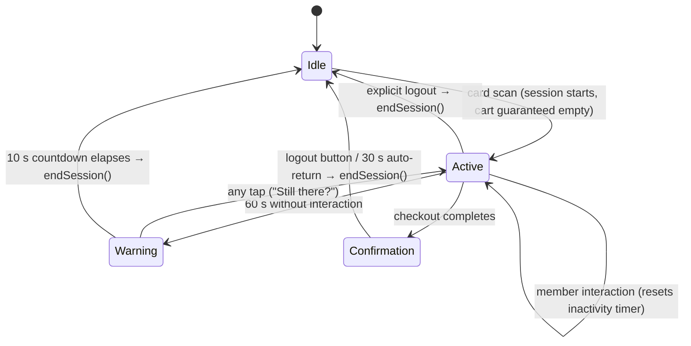

# ADR-0027: Terminal Session Lifecycle and Cart Ownership

**Status**: Accepted

**Date**: 2026-08-05

---

## Context

The terminal had no defined session lifecycle. Cart state (`CartProvider`) and member state (`MembersProvider`) were independent, and each screen hand-rolled its own logout. This produced a critical money-wrong bug (#13): logout cleared the member but not the cart, so the next member who scanned inherited — and paid for — the previous member's items.

Two adjacent gaps share the same root cause:

- No inactivity timeout existed (#23); `AppConfig.inactivityTimeout` was declared but never used.
- RFID scanning currently only works on the idle screen (#26); once it works everywhere, the semantics of a card tap during an active session must be defined.

A public kiosk needs one authoritative answer to: when does a session start, when does it end, and what state dies with it?

## Decision

**A session is the unit of terminal interaction, and the cart belongs to the session — never to the member. Sessions are protected: they end in exactly three ways, and nothing else ends or replaces them. This rule is permanent.**

### Session lifecycle

### Rules

| # | Rule | Rationale |
|---|------|-----------|
| 1 | A session starts only by a card scan from the idle screen. | Single entry point; cart defensively cleared at start. |
| 2 | A session ends **only** by: explicit logout, inactivity timeout, or checkout completion. | Protects the active member's cart and billing identity. |
| 3 | A foreign card tap during an active session is **rejected** (with a "please log out first" hint). It never ends, replaces, or merges the session. | Prevents session hijacking and cross-member billing. Binding constraint on #26. |
| 4 | The same member re-tapping their own card mid-session is a no-op. | An accidental double-tap must not wipe the cart. |
| 5 | The cart is created empty at session start and silently discarded at session end. No cross-session cart preservation. | Cart is session state, not member state. Silent discard: nothing is billed yet, and a blocking dialog would hold the kiosk hostage. |
| 6 | Inactivity timeout: 60 s without interaction, then a visible 10 s countdown warning; any tap resets. | 30 s (original dead constant) punishes slow deciders; without any timeout a walked-away session blocks the terminal (rule 3 forbids takeover by scan). |
| 7 | The inactivity timer is suspended while a checkout or dispense operation is in flight. | A long token dispense must never be interrupted by an auto-logout mid-billing. |
| 8 | All session ends go through a single `endSession()` on a session controller; no screen clears member or cart state directly. | One code path to enforce the invariant; future paths (e.g. new screens) cannot reintroduce #13. |

### Alternatives considered

- **Scan-to-switch** (a new card tap ends the current session and starts a new one): more convenient when a member walks away, but a bystander's tap could silently destroy an active cart, and a mis-read could switch billing identity mid-order. Rejected — the inactivity timeout covers the walk-away case safely.
- **Cart preservation across sessions** (the removed `cartPreservationDuration` constant hinted at a 1-hour cart hold per member): contradicts cart-belongs-to-session; an unattended public terminal must not resurrect old carts. Rejected.
- **Per-screen cleanup calls** (patch `clearCart()` into each logout site): minimal diff but each future logout path can forget the call — exactly how #13 happened. Rejected in favor of the single controller.

## Consequences

### Positive

- The #13 class of bug (state surviving a session boundary) becomes structurally impossible: session-scoped state has one owner and one teardown path.
- #23 (inactivity timeout) is solved by the same mechanism; future features reuse `endSession()`.
- #26 gains a precise, decided contract for mid-session scans before implementation starts.

### Negative

- A member who abandons a full cart loses it silently and must re-select items on next login; accepted (a few taps, nothing billed).
- The terminal is blocked for up to ~70 s (60 s + 10 s warning) after a walk-away before the next member can scan; mitigated by the visible countdown and the logout button remaining available to anyone.
- Rule 7 means a hung dispense keeps the session open; bounded by the dispenser dialog's own request timeouts.

## Related

- [ADR-0014](./0014-rfid-scanning-integration.md) — RFID scanning integration
- [ADR-0023](./0023-terminal-balance-state-management.md) — balance state shown within a session
- Issues: #13 (cart persists across logout), #23 (inactivity timeout), #26 (scan outside idle screen)
- `CONTEXT.md` — definitions of *Session*, *Cart*, *Deckel*
