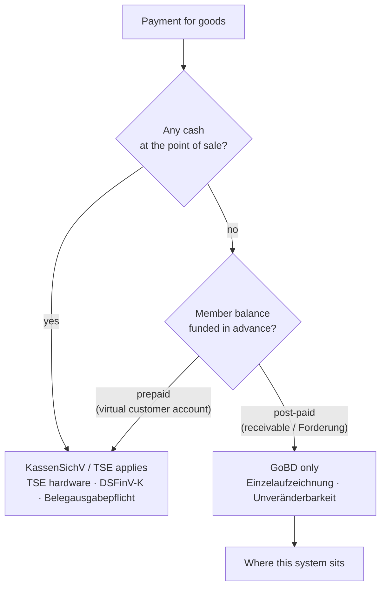

# ADR-0028: Legal and Regulatory Constraints on Money Handling

**Status**: Accepted
**Date**: 2026-08-07

## Context

Money-semantics decisions for this system were locked on [map #139](https://github.com/dgloeckner/ruderbar/issues/139). Three of those tickets were **research** rather than design: they established facts about German law and SEPA scheme rules that constrain the design rather than following from it.

Those facts kept being rediscovered. One ruling — "members should never end a period in net credit, prevent it at entry" — was made, implemented in two places, and then overturned by research showing it was not tenable. The same prevent-at-entry shape then reappeared in a second code path nobody had re-read.

This ADR records the constraints themselves, separately from the design decisions that respond to them. **They are stable**: they do not change when we change our minds about schema or workflow. Design rulings live on their map tickets and may be revised; this document may only be revised if the law or the scheme rulebook changes.

Sources: [#140](https://github.com/dgloeckner/ruderbar/issues/140) (refund obligation), [#149](https://github.com/dgloeckner/ruderbar/issues/149) (bank return reporting), [#159](https://github.com/dgloeckner/ruderbar/issues/159) (correction bookkeeping). Full working in `research/`.

> ⚠️ **Not legal advice.** Points marked ⚠️ need confirmation from the club's Steuerberater or bank. They are flagged where the research found no authority, not smoothed over.

## Decision

**The system is bound by the constraints below. Any design decision that contradicts one of them is wrong, regardless of how convenient it is.**

### 1. Member credit must be representable and refundable

| Constraint | Source |
|---|---|
| Bar consumption is a **Leistungsaustausch** (payment for goods), not a Mitgliedsbeitrag. The non-refundability that protects membership dues — and the Gemeinnützigkeit concern around refunding them — does not apply. | #140 |
| Money received without legal ground **must be returned**. An over-collected consumption charge is a civil-law debt owed by the club, and the claim does not depend on what the club's software permits. | § 812 Abs. 1 S. 1 BGB |

Refusing to record a correction does not extinguish the member's claim. It only makes the ledger wrong and moves reconciliation into a spreadsheet.

### 2. A collection line must be strictly positive

`InstdAmt` in pain.008 carries `minInclusive value="0"`. A negative amount **cannot** appear in a collection file — this is structural, not a policy choice.

The invariant belongs at **settlement time**, not at data entry. Preventing negative balances at entry is the error corrected in §1.

### 3. Settled collections are not final

| Window | Applies to | Source |
|---|---|---|
| **8 weeks** | Any authorised collection, no reason required | § 675x BGB, EPC SDD Core Rulebook |
| **13 months** | Collections made **without a valid mandate** — these are *unauthorised* transactions | § 675x BGB |

The second window is the one that surprises. A collection made against a member with no signed mandate is reclaimable for over a year, not eight weeks.

Note the direction: a refund reverses a collection, after which the member holds the money and the club's claim revives. The member ends in **debit**, not credit. Net credit arises from over-charges corrected after collection, from prepayment, and from termination — not from refunds.

### 4. Corrections must be traceable to what they correct

> Korrektur- bzw. Stornobuchungen müssen auf die ursprüngliche Buchung rückbeziehbar sein.
> — GoBD **Rz. 64**, last sentence (added in the 2019 recast)

Rz. 72 requires the identifying feature be carried **into the record**; Rz. 73 explicitly rejects date, name or statement-number as sufficient at volume. **A free-text reason string does not satisfy this.**

A BMF circular binds the tax administration rather than the courts, but it restates § 145 Abs. 1 S. 2 and § 146 Abs. 4 AO and is the standard an auditor applies.

**Two operations, not one.** A goodwill credit is a *new* Geschäftsvorfall, not a Stornobuchung — Rz. 64 never reaches it. Reversing a specific booking and adjusting a balance are legally distinct acts, and only the first requires linkage. A single optional foreign key cannot express this distinction.

### 5. Payouts require a document trail, not a second signature

**Required**: the Rz. 77 Beleg fields — unique identifier, amount, sufficient explanation, date, responsible issuer — plus a unique tie to the actual bank line. Rz. 73 rules out statement-number alone, which makes a persisted end-to-end identifier a GoBD requirement for **outbound** payouts, not only for matching inbound returns.

**Not required**: no statute, BMF circular or court decision imposes four-eyes, countersignature, or a Vorstandsbeschluss on a Vereins-Auszahlung. § 40 BGB makes the § 27 Abs. 3 regime dispositive, and the Kassenprüfer has no statutory basis at all. Do not invent this control and then design around it.

**Retention**: 8 years (§ 147 Abs. 3 AO, post-BEG IV), **suspended** while the Festsetzungsfrist runs. No hard automatic deletion.

### 6. The system is outside the TSE regime — conditionally

§ 1 Abs. 1 KassenSichV and AEAO zu § 146a Nr. 1.2 require *at least partly* **baren** Zahlungsvorgängen. This system takes no cash, so: no TSE, no DSFinV-K, no Belegausgabepflicht, no Kassenbuch, no Kassensturzfähigkeit.

**The GoBD applies regardless** — § 146 Abs. 6 AO and AEAO Nr. 2.1.1 — including to a plain Einnahmen-Überschuss-Rechnung. Einzelaufzeichnung and Unveränderbarkeit are binding.

⚠️ **The exit is conditional.** The same AEAO passage extends Kassenfunktion to "virtuelle (Kunden-)Konten" and to value taken "an Geldes statt vor Ort", and states a cash drawer is not required. A **prepaid** member balance reads as in scope. Our post-paid tab — a Forderung — is the better reading, but the research searched specifically for an authority holding that a post-paid Debitorenkonto sits outside § 146a AO and **found none**. This is interpretation, not a holding.

**Architectural consequence: terminal-side top-up is ruled out by design.** Allowing members to load value onto their account would plausibly pull the entire system into the TSE regime. This is not a feature we have merely not built yet; it is one we may not build without re-opening this ADR.

### 7. What a bank tells us about a returned collection

Per DK **Anlage 3**, the return booking carries: `EREF+` (end-to-end id), `MREF+` (mandate reference), the original amount, a reason code, and the original debtor's name and IBAN.

| Consequence | Detail |
|---|---|
| The original **Verwendungszweck is not returned** | It can never be a matching key |
| Matching depends on `EREF+` / `MREF+` | Both must be persisted as sent, and must remain resolvable after the member's details change |
| Expect **`MS03`** ("reason not specified") domestically | Germany suppresses `AM04`/`AC04`/`MD07` for data-protection reasons, so the *reason* is often unavailable |

⚠️ If a bank books returns collectively rather than individually, the fallback is a manual camt.053 upload — not EBICS.

## Consequences

**Positive**

- The rules that overturned a ruling once are now written down where the next person will find them, rather than being rediscovered by research a third time.
- Separating external constraints from design rulings means a design change no longer risks silently dropping a legal requirement.
- Several open questions become narrower: linkage is required rather than debatable; a payout needs a Beleg but not a countersignature; top-up is closed rather than merely unbuilt.

**Negative**

- **§6 rests on interpretation.** The prepaid/post-paid boundary has no authority either way, and it carries the largest consequence in this document. Mitigation: the boundary is an explicit architectural commitment, so crossing it is a visible decision rather than an accident.
- **§4 makes an optional foreign key insufficient**, which forces a schema and type change rather than a validation tweak.
- ⚠️ Two points need external confirmation: how GoBD completeness applies to the club's Einnahmen-Überschuss-Rechnung (Steuerberater), and whether the club's bank books returns individually (bank).

**Neutral**

- This ADR constrains; it does not design. How the system satisfies each constraint is decided on the map tickets and recorded in the implementing issues.

## Related

- [ADR-0004](./0004-immutable-transaction-storage.md) — immutable transactions, corrections as reverse transactions. §4 here bears directly on its "Optional" `related_transaction_id`.
- [ADR-0009](./0009-settlement-lead-times-bank-working-days.md) — settlement lead times and bank working days. §3's return windows begin from the execution date it governs.
- [Map #139](https://github.com/dgloeckner/ruderbar/issues/139) — the design rulings responding to these constraints.
- `research/correction-bookkeeping-law.md`, `research/credit-limit-precedents.md` — full working, quoted sources.
