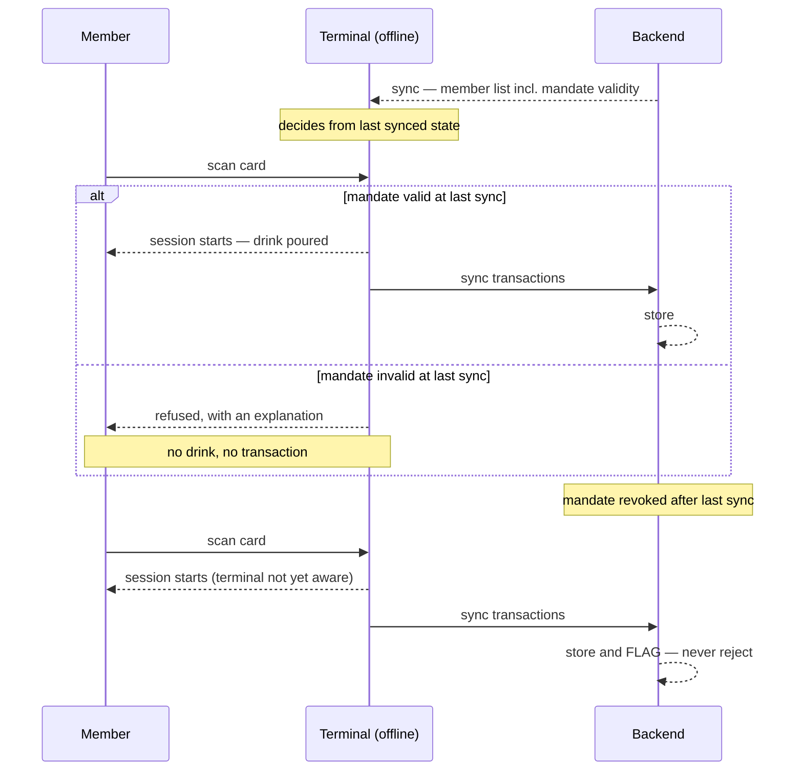

# ADR-0029: SEPA Mandate as a Precondition for Bar Access

**Status**: Accepted
**Date**: 2026-08-07

## Context

The bar is **unstaffed and self-service**: a member scans their RFID card, pours their own drink, and the amount lands on their Deckel. Nobody checks anything at the point of sale, because nobody is there. Collection happens later, by SEPA direct debit.

Every earlier decision treated a missing SEPA mandate as a **billing** problem, handled after the fact:

- [ADR-0004](./0004-immutable-transaction-storage.md) and the sync contract accept whatever the terminal reports — by sync time the drink is already served.
- The settlement design excludes members without usable bank details and reports them for follow-up.

That leaves an unpriced risk. A member with no way to pay can accumulate an unbounded tab, and the club only finds out at settlement — by which point the drinks are gone and the only remedies are chasing an unwilling payer or writing the debt off.

The question is whether a mandate governs **being collected from**, or **being allowed to drink**.

## Decision

**A valid SEPA mandate is a precondition for using the bar. No valid mandate, no session — enforced immediately, within the limits of offline operation.**

The system is SEPA-only. There is no alternative payment path into the bar: no cash ([ADR-0028](./0028-legal-constraints-on-money-handling.md) §6), no prepayment, no invoice-on-request.

### Two layers, deliberately

The gate moves to the point of sale, but the after-the-fact handling stays. Both are required, and it is a mistake to collapse them.

| Layer | Role | Failure it prevents |
|---|---|---|
| **Terminal, at card scan** | Preventive. Refuses the session against the last synced state. | Unbounded tab by a member who cannot be billed |
| **Server, at sync** | Backstop. Stores and flags; **never rejects**. | Losing a sale that was already served during the offline window |

**The server must never reject a transaction for a missing mandate.** By the time a row reaches the backend the beer is gone. Refusing it destroys the record of a real sale — revenue lost silently, with no way to recover it. The terminal is the only place where refusal costs nothing, because the drink has not yet been poured.

### "Immediately" means as immediately as offline-first allows

The terminal decides from its **last sync**. A mandate revoked after that sync leaves a window in which the member is still served. That window is bounded by sync frequency and is **accepted** — closing it would require online-only operation, which contradicts the offline-first architecture the terminal exists to provide.

### Consequences for the member

A bounced direct debit places a member on collection hold, which locks them out of the bar. This is a deliberate social decision, not a side effect: a member whose payments are failing should stop accumulating debt.

The route back is a **bank transfer** settlement recorded by the Kassenwart, after which the member is restored. That is the only non-direct-debit payment the system accepts, and it exists for exactly this case.

### What "valid" means

Defined outside this ADR — see the mandate-validity work on [#164](https://github.com/dgloeckner/ruderbar/issues/164). This ADR asserts only that *whatever* the predicate is, it gates bar access rather than merely settlement.

⚠️ **This policy is inert until that predicate is real.** At the time of writing, a `mandate_reference` is generated automatically whenever an IBAN is present, and `mandate_signed_at` is checked nowhere. "Valid mandate" therefore means "somebody typed an IBAN", and a rule gating bar access on it is bypassed by doing what admins already do. Enforcing access on today's predicate would give false assurance.

## Consequences

**Positive**

- The club's exposure to an unpayable tab is bounded by one sync interval instead of one settlement period.
- Members find out at the bar, when they can still act, instead of receiving a demand weeks later.
- The mandate becomes a single, meaningful gate rather than a soft flag interpreted differently in three places.

**Negative**

- **A failed payment removes access to a social space.** In a members' club that is felt personally, and it will occasionally be wrong — a bank error, a closed account, a member on holiday. Mitigation: the refusal message must say what happened and what to do, and the bank-transfer route back must be quick. If the club wants a grace period, that is a change to this ADR rather than an implementation detail.
- **The offline window is a real hole**, just a small one. A member revoked this morning can still drink tonight if the terminal has not synced.
- **Onboarding becomes stricter**: no mandate, no bar. There is no browsing-membership tier.

**Neutral**

- The settlement-time exclusion for members without usable bank details still exists, but should be **empty in steady state**. Anything in it is either inside the offline window or on a post-return hold — so it becomes an alarm worth investigating, not a routine worklist.

## Related

- [ADR-0028](./0028-legal-constraints-on-money-handling.md) — §6 records that the system is cash-free by policy, which is what leaves SEPA as the only rail.
- [ADR-0004](./0004-immutable-transaction-storage.md) — append-only storage; the reason a served drink can never be un-recorded.
- [ADR-0012](./0012-eventual-consistency-frontend-caching.md) — the eventual-consistency model that makes the offline window unavoidable.
- [#171](https://github.com/dgloeckner/ruderbar/issues/171) — the ruling this ADR records; [#164](https://github.com/dgloeckner/ruderbar/issues/164) defines the validity predicate; [#152](https://github.com/dgloeckner/ruderbar/issues/152) implements the terminal side; [#162](https://github.com/dgloeckner/ruderbar/issues/162) the server backstop.
