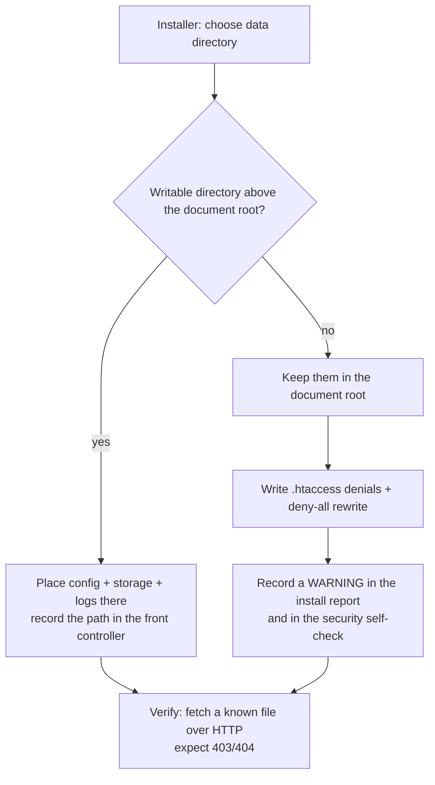

# ADR-0031: Production Hardening on Shared Hosting

**Status**: Accepted (amended by [ADR-0038](./0038-transactional-mail-outbox-on-shared-hosting.md): mail delivery adds the first accepted *hard* dependency on a host feature — see "Mail and the scheduler"; by [ADR-0039](./0039-periodic-deckel-statement.md): the scheduler's *interval* joins its existence as a declared and verified host fact, and a weekly-only host is refused)
**Date**: 2026-08-09

## Context

Club Bar ships as a ZIP that a club treasurer unpacks into the document root of a mass-hosting account — IONOS is the reference target ([ADR-0016](./0016-transport-security.md)). There is no root shell, no FPM pool file, no `httpd.conf`, and no guarantee that any file we ship is honoured. Hardening therefore has to be designed around a question that does not arise on a machine we own: **when a hardening measure is silently ignored, does anyone find out?**

The obvious answer — ship a battle-tested `php.ini` — turns out to buy much less than it looks like, because PHP sorts every directive into a mode that decides who may set it:

| Mode | Examples | Reachable from a shipped ini file on mass hosting | Reachable from application code |
|---|---|---|---|
| `PHP_INI_ALL` | `session.*`, `display_errors`, `log_errors`, `session.save_path`, `session.use_strict_mode`, `zend.exception_ignore_args` | yes | **yes** |
| `PHP_INI_PERDIR` | `upload_max_filesize`, `post_max_size` | yes | no |
| `PHP_INI_SYSTEM` | `expose_php`, `disable_functions`, `allow_url_fopen` | **no** | no |

Nearly everything a hardened `php.ini` is famous for is `PHP_INI_SYSTEM` and out of reach on shared hosting whatever file we ship. Nearly everything *this* application needs is `PHP_INI_ALL` — which application code can set, and which no host can silently drop.

Two platform details shape the rest of the decision:

- IONOS runs PHP as CGI/FPM, not `mod_php`. A bare `php_value` in `.htaccess` therefore returns **HTTP 500**, not a warning — it is an outage, not a no-op.
- The per-directory ini file under CGI/FPM is `.user.ini`, re-read on a TTL (`user_ini.cache_ttl`, 300s by default), not `php.ini`. Whether a given tariff honours it is a property of the account, not of our package.

### What the package looks like today

`scripts/build-package.sh` assembles a flat document root:

| Path | Contents | Protection today |
|---|---|---|
| `config.php` | DB password, `TOTP_ENCRYPTION_KEY` | none beyond "PHP files are executed, not served" |
| `backend/storage/mandates/<member-uuid>.pdf` | Scanned SEPA mandates: name, IBAN, handwritten signature | `RewriteRule ^backend/ - [F,L]` plus a `Require all denied` in the directory |
| `backend/logs/<date>.log` | Application log, including request context | same |
| `backend/`, `.installer-data`, `.upgrade-secret` | Source, vendor, installer state | same, plus `<Files>` denials |

Every one of those protections is an `.htaccess` directive. `.htaccess` is honoured at the host's discretion: a migration to a different tariff, a webserver change, or an `AllowOverride None` turns the whole table into world-readable URLs — and the mandate filenames are the member UUIDs the API already hands to the browser, so they are guessable rather than secret. The build additionally sets `chmod 777` on the package root, `storage/` and `logs/`.

The application sets no `display_errors`, no `log_errors` and no `session.save_path`. A fatal raised before Slim's error handler is installed — the `new PDO(...)` in `bootstrap.php` is outside it — prints whatever the host's defaults allow.

## Decision

Five rules, in priority order. The first is the one the others follow from.

### 1. Hardening lives in code; configuration files are advisory

Every `PHP_INI_ALL` directive the deployment depends on is applied by the application at startup, before anything else runs. A shipped `.user.ini` may repeat those values, and may carry the `PHP_INI_PERDIR` handful that code cannot reach, but nothing may depend on it being read.

The test is: *if this file were deleted on the host, would the deployment still be hardened?* Where the answer is no, the measure belongs in code.

This makes the hardening unit-testable in CI, which a config file that only some hosts honour can never be.

### 2. Secrets and member documents live outside the document root where the host allows it

`config.php`, `logs/` and `storage/` hold the two things this system exists to protect: banking credentials and member PII. Their confidentiality currently rests on a rewrite rule. The installer resolves a data directory instead:

The fallback stays supported — a tariff with no writable parent must remain installable — but it is a *degraded* state that the deployment reports about itself, not the silent default it is today.

### 3. Nothing is assumed applied; the deployment proves it

Because no layer is guaranteed, the effective configuration is measured (`ini_get()`, a live HTTP fetch of a file that must not be served) and reported in three places:

| Surface | Audience | Answers |
|---|---|---|
| Installer prerequisite step | The treasurer, once | "Is this host safe to install on?" |
| Authenticated security self-check | The admin, any time | "Did a host change break something since?" |
| Package smoke test in CI | Us, every build | "Did we regress the package?" |

The self-check reports *measured* values, never the values we intended. A row is green only when the effective state was observed.

### 4. Least privilege on files

`0777` on the document root, `storage/` and `logs/` is a build-time convenience that survives into production. The package targets `0600` for `config.php` and the narrowest mode the host tolerates for writable directories, applied and then verified by the installer — a permission that could not be set is a self-check finding, not a silent pass.

### 5. Never ship a bare `php_value` or `php_flag`

On the reference target this is an outage, not a degradation. Any such directive must be wrapped in `<IfModule mod_php.c>`. This rule exists because the failure mode is indistinguishable from an application bug and costs a support cycle to diagnose.

### The resulting layers

| Layer | Mechanism | What belongs here | If the host ignores it |
|---|---|---|---|
| L0 | Application code at startup | All `PHP_INI_ALL` directives; header removal | Cannot be ignored |
| L1 | `.user.ini` | `PHP_INI_PERDIR` directives; duplicates of L0 | Degraded, reported by L4 |
| L2 | `.htaccess` | Access denials, security headers, HTTPS redirect | Degraded, reported by L4 — and the reason for decision 2 |
| L3 | Hosting control panel | PHP version, TLS, directory listing | Documented checklist; nothing else is possible |
| L4 | Self-check | Measures L0–L3 and reports drift | The layer that makes the others honest |

### Mail and the scheduler

> **Amended 2026-08-14** by [ADR-0038](./0038-transactional-mail-outbox-on-shared-hosting.md).

Sending the SEPA pre-notification adds a path to the table above, and it breaks the pattern of every row in it: the other layers degrade when the host ignores them, this one does not work at all.

| Layer | Mechanism | What belongs here | If the host does not provide it |
|---|---|---|---|
| M0 | Outbox row inside the settlement transaction | The intent to announce | Cannot be ignored — it commits with the settlement |
| M1 | Host scheduler (panel cron → CLI, panel cron → URL, or an external HTTP scheduler) | The only sending path | **Nothing is ever sent.** Blocked at install, alarmed in operation |
| M2 | External heartbeat monitor | The alarm that M1 stopped | Silent erosion of the announcement deadline |
| M3 | In-app self-check + per-message status | Diagnosis and the manual remedy | An alarm with nothing to act on |

**This is the first accepted hard dependency on a host feature, and rule 3 permits it.** Rule 3 forbids *silent* dependence — "when a hardening measure is silently ignored, does anyone find out?" — not dependence as such. Here the answer to that question is yes, by design and at two points: the installer will not report a green prerequisite until a real scheduled run has been **observed** (not simulated, not asserted by the treasurer), and settlement finalize stays blocked until one has. What is measured is the same thing rule 3 always measures: the effective state, never the intended one.

The honest consequence, stated rather than discovered: **the supported hosting set narrows to tariffs that can schedule something.** In practice that excludes nobody — the URL endpoint can be driven by an external scheduler — but a tariff with no scheduling of any kind, and no willingness to point an external one at the install, cannot run this application's announcement obligation and should not run the application.

Two smaller points belong in this ADR's own terms:

- **The SMTP DSN is a secret and lives in `config.php`** in the data directory (decision 2), next to the DB password and the TOTP key. Absent DSN disables mail rather than failing, in the same way `llm.provider` does.
- **The panel's CLI PHP is frequently not the web PHP** — different version, different extensions, different ini. The cron records the CLI version it ran under, so the mismatch shows up in the self-check instead of as an unexplained failure.

## Consequences

**Positive**

- The security posture stops depending on files a host may ignore. What code sets, code guarantees.
- Hardening becomes testable: L0 has unit tests, the package smoke test asserts effective values, and a regression fails CI rather than shipping.
- A misconfigured or downgraded host becomes *visible* — today it is indistinguishable from a correct one.
- The two highest-value assets (banking credentials, scanned mandates) stop being one `AllowOverride` away from public.

**Negative**

- The installer grows a path-resolution step, and the front controller must locate a data directory that is no longer a fixed sibling. Mitigation: the in-docroot layout stays supported as an explicit fallback, so no host becomes uninstallable.
- Upgrades must migrate an existing in-docroot installation, or knowingly leave it alone. Mitigation: `upgrade.php` treats relocation as an offered, reversible step, never an implicit one.
- A self-check that reports amber on a host the treasurer cannot change is a support burden with no remedy attached. Mitigation: every finding carries what to do about it, and "your host does not allow this" is an accepted, documented outcome rather than a failure.
- Tighter file modes will break on hosts whose PHP process user differs from the file owner. Mitigation: the installer verifies writability after every `chmod` and reverts rather than leaving the installation broken.

**Neutral**

- A shipped `.user.ini` remains worth having, but as the second layer of four. Reading the decision as "we ship a hardened ini file" would miss the point.

## Implementation

| Issue | Decision it implements |
|---|---|
| [#245](https://github.com/dgloeckner/clubbar/issues/245) | 2 — secrets and member documents out of the document root |
| [#246](https://github.com/dgloeckner/clubbar/issues/246) | 1 — runtime hardening in `bootstrap.php` (L0) |
| [#247](https://github.com/dgloeckner/clubbar/issues/247) | 3 — the security self-check (L4) |
| [#248](https://github.com/dgloeckner/clubbar/issues/248) | 4 — least privilege on files |
| [#249](https://github.com/dgloeckner/clubbar/issues/249) | 5 and layers L1/L2 — `.user.ini` and `.htaccess` |
| [#250](https://github.com/dgloeckner/clubbar/issues/250) | L2 — Content-Security-Policy for the admin SPA |
| [#251](https://github.com/dgloeckner/clubbar/issues/251) | 1 — `__Host-` cookie prefix, following #105 |

## References

- [ADR-0016](./0016-transport-security.md) — Transport Security; requires the cookie attributes and `session.use_strict_mode` this ADR routes into L0
- [ADR-0025](./0025-session-fixation-protection.md) — Session Fixation Protection; `session_regenerate_id()` at login, complemented by strict mode
- [ADR-0029](./0029-two-tier-retention-and-erasure.md) — Two-Tier Retention and Erasure; mandate documents are subject to erasure, which presumes they were never public
- [ADR-0038](./0038-transactional-mail-outbox-on-shared-hosting.md) — Transactional Mail Outbox; the M0–M3 layers above, and why a mandatory scheduler stays compatible with rule 3
- [ADR-0022](./0022-test-strategy-and-automation.md) — Test Strategy; the basis for requiring L0 and the package smoke test to be automated
- [#105](https://github.com/dgloeckner/clubbar/issues/105) / [#237](https://github.com/dgloeckner/clubbar/pull/237) — the session cookie `Secure` flag; the first measure applied under rule 1
- `scripts/build-package.sh`, `package/.htaccess`, `package/install.php` — the surfaces this ADR governs
- PHP manual — *List of php.ini directives* (the `PHP_INI_*` modes table this decision rests on)
