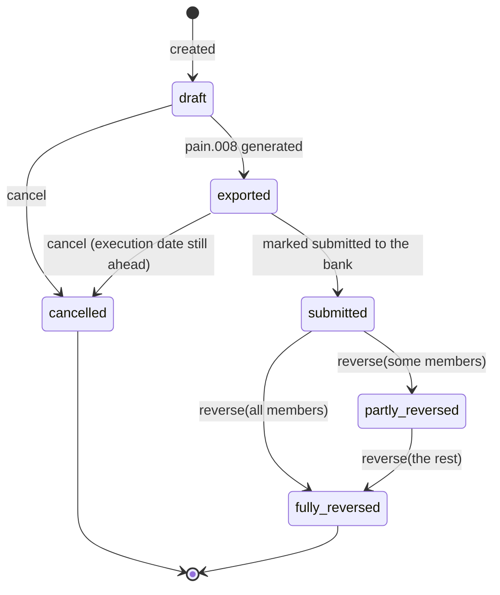

# ADR-0032: Settlement Lifecycle

**Status**: Accepted (amended by [ADR-0038](./0038-transactional-mail-outbox-on-shared-hosting.md): announcement enqueue belongs to the create transaction, and cancellation either supersedes an unsent announcement or sends a cancellation notice — see §10)

**Date**: 2026-08-09

---

## Context

[ADR-0004](./0004-immutable-transaction-storage.md) makes the *transaction* immutable and says how a booking is corrected. It says almost nothing about the *settlement* — the object that decides which of those transactions get collected, produces the pain.008 file, and has to survive the bank sending money back. What it does say is now wrong in three places: it describes cancellation as deleting `settlement_items`, has no notion of a settlement being submitted, and knows nothing of a collection being clawed back.

That gap was filled ticket by ticket during the critical remediation, and the semantics ended up spread across four rulings and one migration with no ADR naming them:

| Ruling | Established |
|---|---|
| [Exclude-and-flag](https://github.com/dgloeckner/ruderbar/issues/141) | who takes part in a run, and what happens to a member in credit |
| [Settlement cancellation](https://github.com/dgloeckner/ruderbar/issues/142) | how late a run can be called off, and what survives calling it off |
| [Settlement reversal](https://github.com/dgloeckner/ruderbar/issues/148) | what happens when the bank undoes a collection the club considered final |
| [Manual settlements](https://github.com/dgloeckner/ruderbar/issues/163) | that direct debit is one of three settlement methods, not the only one |

Three external facts drive all four. § 675x BGB and the EPC SDD Core Rulebook § 4.3 give the payer eight weeks to demand an unconditional refund of an authorised direct debit — thirteen months where no valid mandate existed — so a collection is never final on the club's say-so. § 812 BGB makes an over-collected amount a debt the club owes, so a member in credit must be representable rather than rejected. And [ADR-0028](./0028-legal-constraints-on-money-handling.md) records the GoBD requirement that a correction be traceable to what it corrects, which rules out fixing a settlement by editing it.

## Decision

**A settlement is an append-only record of a collection attempt. Its state is derived from the facts recorded against it, never stored. It can be cancelled only while no money has moved; once money has moved the only remedy is a reversal event, which is recorded and never erases what it reverses.**

### 1. State is derived, never stored



There is no `status` column and there must not be one. Every fact the status reports already lives somewhere authoritative, and a stored copy would be a fifth place for it to disagree with the other four — invisibly. The codebase has been bitten by exactly that: cancellation used to delete `settlement_items` while `settlements.total_amount_cents` kept its original value, so the two disagreed with no way to tell which was right.

The ladder is evaluated most-final first:

| Status | When | Source of truth |
|---|---|---|
| `cancelled` | the run never moved money | `settlements.is_cancelled` |
| `fully_reversed` | every settled member has a reversal | `settlement_reversals` rows |
| `partly_reversed` | at least one, not all, do | `settlement_reversals` rows |
| `submitted` | the file reached the bank | `settlements.submitted_at` |
| `exported` | a file was generated | `settlements.exported_at` |
| `draft` | none of the above | — |

A settlement carrying reversals but no items to count members against is `partly_reversed`, not `fully_reversed`. Completeness is not something to infer from a zero.

### 2. Who takes part in a run

A run names **members**, not transactions ([ADR-0030](./0030-settlement-selection-is-a-member-picker.md)). Each named member is tested on their **total unsettled position** — every unsettled transaction they hold, ignoring the run's date window — and each included member then settles that whole position.

| Member's total unsettled balance | Settled? | Line in the pain.008 file? |
|---|---|---|
| `> 0` | yes | yes |
| `= 0` | yes — the rows are closed out | no |
| `< 0` | **no** — excluded entirely | no |

The window must not decide the amount. Overcharged €20 in January, drinks €5 in February: settling February alone computes `+5`, debits the member €5 they do not owe, and strands the €20 credit unsettled and invisible. Testing the total gives `−15`, the member is excluded, and both rows carry forward together.

Splitting "settled" at `≥ 0` from "collected" at `> 0` is what lets a credit close itself out: a credit of `−15` plus a `payout` of `+15` nets to zero, the next run settles both rows without writing a file line, and the member can then be erased cleanly — the erasure check in [ADR-0029](./0029-two-tier-retention-and-erasure.md) requires a zero balance.

**Consequence, accepted:** `period_start` / `period_end` are descriptive labels on the run, not a boundary on its contents. A run can reach back indefinitely.

### 3. Exclusions are reported, never silent

Three buckets, because each needs a different remedy, and collapsing them into one warning list hides that:

| Bucket | Cause | Remedy |
|---|---|---|
| Credit | member's total unsettled balance is negative | let it ride, or pay it out at offboarding |
| Ineligible | no active SEPA mandate | an **alarm**, not a worklist — under SEPA-only this bucket is empty in steady state |
| On hold | a bank return placed a collection hold | investigate the dispute, then clear the hold |

Exclusion is normal operation, so none of the three blocks a run. What is forbidden is omitting a member from the file without saying so: the export returns every omission with a typed reason and the member's name, states the divergence as money (settlement total, collected total, shortfall), and writes it to the audit entry — the only one of its outputs that outlives a file download.

### 4. Cancellation: while no money has moved

The rule is not "before export". Generating a pain.008 file is not sending it, and locking there strands the ordinary case of downloading a file, spotting a wrong amount and never submitting it — leaving the treasurer to reverse money that never moved.

| Method | Cancellable | Because |
|---|---|---|
| `direct_debit` | until `submitted_at` is set, with the execution date as a backstop | the money moves when the file reaches the bank |
| `bank_transfer` | never | the money already arrived |
| `write_off` | always | no money ever moves |

The execution-date backstop exists because the explicit flag depends on somebody remembering to click it. A settlement whose scheduled execution date has passed is treated as locked whether or not it was marked submitted; the money has almost certainly moved by then, so the guarantee does not rest on human memory.

Only a `direct_debit` is a batch. A `bank_transfer` is one member paying one tab and a `write_off` is a decision about one member, so neither may be exported and neither may quietly cover a group — enforced in the schema, not just the service.

### 5. Items survive: the live claim is separate from the record

Cancelling used to `DELETE` the line items, which is what returned the transactions to the unsettled pool — and what destroyed the record of what the cancelled run contained, so its CSV export came back empty.

Keeping the rows conflicts with a `UNIQUE` constraint on `settlement_items.transaction_id`, and MariaDB has no partial indexes. It does permit many NULLs in a unique column, which is the whole mechanism:

| Column | Role |
|---|---|
| `transaction_id` | permanent history — what this settlement contained, forever |
| `active_transaction_id` | the live claim, `UNIQUE`, nulled when the claim is released |

A live item holds `active_transaction_id = transaction_id`, so the database still makes double-settlement impossible, including under two concurrent runs. Cancelling or reversing nulls it, freeing the transaction to be settled again while the row survives — and many freed rows coexist because NULLs do not collide.

### 6. Reversal is an append-only event

Club-initiated undo of a collected run and a bank-initiated clawback are the **same operation** with different triggers, at per-member granularity. Whole-settlement undo is simply "every member"; the trigger is an audit reason, not a second code path.

| Column | Type | Meaning |
|---|---|---|
| `settlement_id` | CHAR(36) | the run being reversed |
| `member_id` | CHAR(36) | whose collection came back |
| `reason` | ENUM(`bank_return`, `club_error`) | who initiated it |
| `amount_cents` | BIGINT | what came back |
| `bank_reference` | VARCHAR(35) NULL | the bank's return reference |
| `created_by_admin_id`, `created_at` | | who recorded it, and when |

`UNIQUE (settlement_id, member_id)` — a member is reversed at most once per settlement.

An event table rather than columns on `settlement_items`, because a reversal *is* an event with its own metadata: who, when, why, and against which bank reference. Columns would repeat that across every item of a member's reversal, with no single row representing "the return", and would leave `bank_reference` homeless.

```mermaid
sequenceDiagram
    participant K as Kassenwart
    participant A as Admin UI
    participant S as SettlementReversalService
    participant DB as Database

    K->>A: Bank statement shows a returned debit
    A->>S: POST /admin/settlements/{id}/reverse {member_ids, reason, bank_reference}
    S->>S: ReversalGate — has this settlement moved money?
    S->>DB: BEGIN
    S->>DB: NULL active_transaction_id on the named members' items only
    S->>DB: INSERT settlement_reversals row per member
    alt reason = bank_return
        S->>DB: place a collection hold on each member
    end
    S->>DB: COMMIT
    S-->>A: recomputed status + the reversal events
    Note over K,DB: the members' debt revives; a held member is excluded from the next run
```

Exactly one of cancellation and reversal is available for any live settlement. The reversal gate is written as the *mirror* of the cancellation gate — it asks the cancellation gate rather than restating its rule — so "cancel it instead" and "reverse it instead" can never both point at doors that refuse to open.

### 7. A bank return places a collection hold

The exclusion rule and the reversal mechanism combine into a trap that has to be closed explicitly. A reversal frees the member's transactions back to unsettled, but a run sweeps *every* unsettled row of an included member — so the next run would re-debit the exact transactions the member just disputed. They dispute again, the club pays another return fee, and it loops.

| Reason | Effect |
|---|---|
| `bank_return` | member placed on **collection hold**: their transactions stay unsettled and visible, but no run may collect from them until an admin clears the hold |
| `club_error` | no hold — the corrected run re-collecting is the entire point |

The hold lives on the member, not the settlement: it outlives the run that caused it. Permanent write-off was rejected as the alternative, because it silently eats legitimate debt whenever a member disputes, with nothing prompting anyone to pursue it.

### 8. Returns are recorded manually

Automated return-file ingestion (camt.053 / pain.002) is **out of scope**. German banks are required by DK *DFÜ-Abkommen Anlage 3* to carry the original `EREF+` (EndToEndId), `MREF+` (Mandatsreferenz), `OAMT+` and a reason code on the return booking itself, so the Kassenwart can resolve a return from an ordinary statement. Three conditions attach:

- The `EndToEndId` must be **persisted**, not derived from a loop index, or a return resolves to a member but not to a specific collection.
- The return-entry UI is a **lookup**, not a free-hand form: paste an `EREF` or `MREF`, or filter by amount and due date. Free-hand member selection is guesswork once two members owe the same amount.
- Expect `MS03`. In Germany AM04, AC04, MD07 and RR01–04 are suppressed for data-protection reasons and collapse into "sonstige Gründe", so no logic may assume a specific domestic reason code. The original Verwendungszweck does **not** come back either — DK replaces it with the constant `RETURN/REFUND` — so it can never be used for matching.

### 9. Invariants worth stating

- **`settlements.total_amount_cents` stays `UNSIGNED`.** Each included member's settled rows sum exactly to their balance, and only members at `≥ 0` are included, so the total is a sum of non-negatives and cannot be negative. The column is therefore a free database-level assertion: a bug that admits a credit member throws during settlement *creation*, before any file exists and before money moves.
- **`settlement_items.amount_cents` stays signed.** Individual storno rows are negative; only the aggregate is constrained.
- **No non-positive line ever reaches the file.** pain.008 forbids it structurally, and the export asserts it independently so a bug surfaces as a clear error rather than an XSD rejection.
- **Cancellation and reversal are atomic.** Freeing the claims and recording the event commit together or not at all. A crash between them used to leave a live settlement with no items, whose transactions silently counted as unsettled.

### 10. Announcing a run is part of creating it

> **Amended 2026-08-14** by [ADR-0038](./0038-transactional-mail-outbox-on-shared-hosting.md), which owns the mail machinery. What belongs *here* is that the lifecycle above now has a side effect, and where in the lifecycle it sits.

`createSettlement` is what issue [#361](https://github.com/dgloeckner/clubbar/issues/361) calls "finalize" — this ADR has no such term, and it is the only point at which `SettlementLeadTime::DAYS = 7` guarantees the pre-notification distance by construction.

**The announcement is enqueued inside the same transaction as the settlement and its items, and no network call takes place.** One outbox row per collected member (`amount > 0`); members in credit or at zero get none, because nothing is being collected from them. The queue therefore describes a settlement that exists, or neither exists — a finalize cannot half-succeed and leave the club unable to say who was told.

Cancellation (§4) splits on what the member already knows:

| Announcement row | On cancellation |
|---|---|
| not yet sent (`pending` / `failed`) | `superseded` — nothing left the building, there is nothing to retract |
| `sent` | a `cancellation_notice` is enqueued — *"Einzug entfällt"* |

Notifying on an unsent row would tell a member that a collection they were never told about has been called off, which is worse than silence.

**Invariant added to §9:** an outbox row exists for exactly the members a live settlement collects from, and the uniqueness key is `(kind, settlement_id, member_id)` — on the message, not on the settlement — so a retried finalize cannot produce a second announcement.

## Consequences

### Positive

- The four rulings have one home, and the state model can be read without reconstructing it from four issue threads and a migration.
- Nothing can drift, because nothing is duplicated: status is derived, the flag and the constraint on a claim are the same column, and the two gates are one rule.
- A cancelled or reversed settlement still says what it contained. Its CSV export is not empty, which is what an auditor asks for.
- The database, not a service, prevents double-settlement — including across concurrent runs.
- A member in credit is a representable state rather than an error, which is what § 812 BGB actually requires.

### Negative

- Deriving status costs a join against `settlement_reversals` on every settlement read, including the list query. Mitigated by an index on `settlement_id`; it has not been measured under load, because there is no load yet.
- `period_start` / `period_end` mean less than they look like they mean. An admin reading "August" on a run that swept a January credit will be surprised exactly once, which is why the exclusion buckets are shown while choosing rather than at confirmation.
- The split between `transaction_id` and `active_transaction_id` is a schema idiom nobody arrives at by intuition. Every query touching settled-ness must pick the right one, and picking wrong is silent: joining on `transaction_id` counts cancelled runs as live.
- Manual return entry depends on the club's bank booking returns individually. If it books them collectively, with per-member detail only in camt, the minimum viable fallback is a manual camt.053 upload — still smaller than a bank connection, but not nothing. ([#183](https://github.com/dgloeckner/clubbar/issues/183) asks the bank.)
- A collection hold has to be cleared by hand. A forgotten hold is a member who is never collected from again, and nothing currently escalates one that has sat for months.

### Mitigations

1. The exclusion, ineligible and hold buckets are shown during selection, so a surprising sweep is visible before it is confirmed rather than after.
2. `ReversalGate` asks `CancellationGate` rather than restating it, and a test pins that exactly one of the two is open across every settlement row shape.
3. The export's omissions are written to the audit entry, not only to a response header, so they survive the download.

## Alternatives considered

**A stored `status` column.** Rejected: it is a copy of four facts that can disagree with them, and this codebase has already shipped that bug once.

**Forbidding cancellation once exported.** Rejected: exporting is generating a file, not sending it. The rule would force a reversal of money that never moved, which is a lie in the ledger to work around a UI convention.

**Reversal as columns on `settlement_items`.** Rejected: a reversal is an event with a bank reference and an author. Columns scatter that across every item and leave the reference nowhere to live.

**Permanent write-off instead of a collection hold.** Rejected: it silently forgives real debt on every dispute, with no prompt to pursue it.

**Automatic payout of credit balances.** Rejected as a standing surface. Credit arises from a storno of an already-collected transaction; for a member who stays it carries forward and is drunk off. The only case that needs money to move is a **departing** member in credit, which is handled at offboarding as the mirror of a write-off. The `payout` transaction type exists for that; the standalone report does not.

## Related decisions

- [ADR-0004](./0004-immutable-transaction-storage.md) — transaction immutability; settlement reversal follows the same append-only principle at the settlement level
- [ADR-0008](./0008-sepa-xml-export-format-selection.md) — the pain.008 format the export produces
- [ADR-0009](./0009-settlement-lead-times-bank-working-days.md) — how `execution_date`, the cancellation backstop, is chosen
- [ADR-0028](./0028-legal-constraints-on-money-handling.md) — the legal constraints behind traceable corrections and representable credit
- [ADR-0029](./0029-two-tier-retention-and-erasure.md) — the zero-balance precondition a close-out satisfies
- [ADR-0030](./0030-settlement-selection-is-a-member-picker.md) — why a run names members
- [ADR-0033](./0033-terminal-sync-contract.md) — where the unsettled transactions a run sweeps come from
- [ADR-0038](./0038-transactional-mail-outbox-on-shared-hosting.md) — the outbox §10 enqueues into, and the scheduler that drains it

## References

- [§ 675x BGB](https://www.gesetze-im-internet.de/bgb/__675x.html) — unconditional refund right for an authorised direct debit, eight weeks
- [§ 812 BGB](https://www.gesetze-im-internet.de/bgb/__812.html) — over-collection is a debt owed back, regardless of what the UI permits
- EPC SDD Core Rulebook § 4.3 — refund rights and R-transaction handling
- DK *DFÜ-Abkommen Anlage 3* — what a German bank must carry on a return booking (`EREF+`, `MREF+`, `OAMT+`, reason code)
