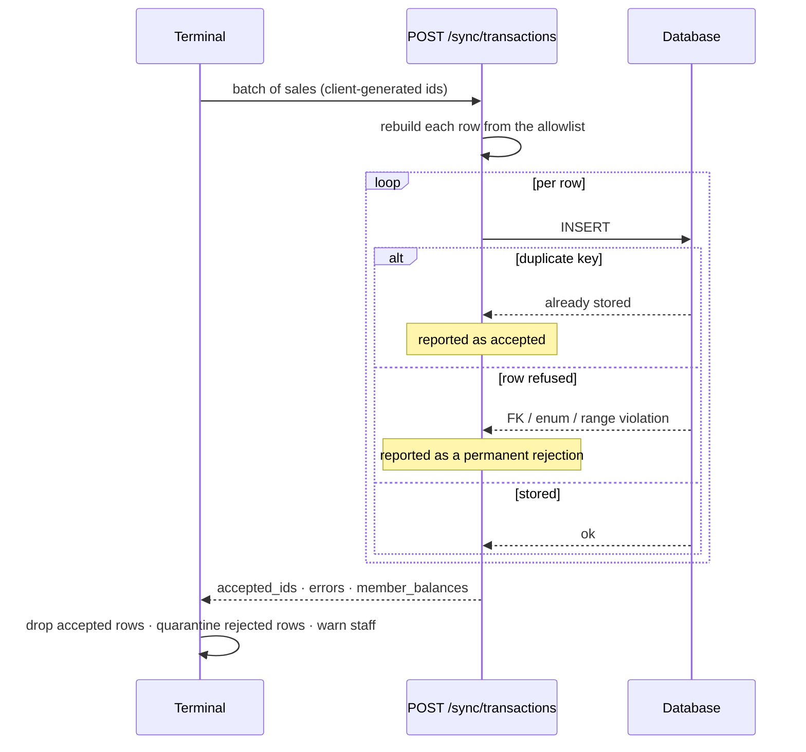

# ADR-0033: Terminal Sync Contract

**Status**: Accepted

**Date**: 2026-08-09

---

## Context

The terminal sells a drink against a cache it last synced hours or days ago, and uploads the sale later. What the server may do with that upload was never decided anywhere — it was implicit in `api/terminal.yaml`, and the code contradicted the spec in several places at once:

- `POST /sync/transactions` **rejected** a sale from a member whose IBAN had since been cleared, destroying the record of a drink that was already drunk.
- The controller answered a field-level problem by refusing the **whole batch** with 422, while the service refused **individual rows** for a member-level problem — two failure modes for what looks to the terminal like one class of problem.
- `INSERT IGNORE` downgraded foreign-key violations, invalid enum values and bad dates to warnings, so a discarded row came back in `accepted_ids`, the terminal purged it from its offline queue, and the sale existed nowhere.
- The spec said "**All fields required**: id, member_id, product_id, amount_cents, created_at". Nothing enforced it, and the controller omitted `id` — the key the whole idempotency guarantee rests on.
- The whole payload was handed to the repository, which read `transaction_type`, `related_transaction_id` and `created_by_admin_id` straight out of it. A terminal token could forge a storno.

Two rulings settled it: [Sync accept/reject contract](https://github.com/dgloeckner/ruderbar/issues/143) and [Timestamp authority](https://github.com/dgloeckner/ruderbar/issues/144). This ADR records them.

## Decision

**By sync time the drink is already in the member's hand. The server therefore refuses a row only when it physically cannot store it — never because a business rule now says the sale should not have happened.**

A refusal at sync does not undo a sale. It only loses the record of one.

### 1. What may be rejected

| Rejected — cannot be stored | Accepted and flagged — already happened |
|---|---|
| Malformed row, or missing `id` | Member has no active SEPA mandate |
| Unknown `member_id` (FK violation) | Member deactivated since the last sync |
| Unknown `product_id` | Member over any notional limit |
| `amount_cents` not a positive integer | `amount_cents` diverges from the product's current price |
| An `occurred_at` the database cannot parse | An `occurred_at` that is implausible but storable |

The missing-mandate rejection is the one that mattered: a member whose IBAN was cleared on Tuesday drinks on Friday against a stale terminal cache, and Saturday's sync used to drop the sale with no record it ever happened. [ADR-0020](./0020-sepa-mandate-requirement-terminal-access.md) keeps the *preventive* half at the terminal, which blocks at card scan and costs nothing because the drink is not yet poured. The server is the backstop, and by then it is.

**Flagging needs no schema.** "This member has an unsettled balance and no active mandate" is a live derived condition, and deriving it is correct: it clears by itself the moment the member supplies their IBAN, because the obstacle to billing is gone. The flag surfaces as the settlement preview's ineligible bucket ([ADR-0032](./0032-settlement-lifecycle.md) §3).

### 2. Per-item commit

Each row is judged and committed independently. A whole-batch 4xx is reserved for a **malformed envelope** — not an array, empty with nothing else asked for, over the batch size limit, bad auth — where nothing was judged at all. Anything that got as far as being judged comes back in the per-item result, which already carries `accepted_ids`, `rejected_count`, `errors` and `member_balances`.

Every rejection uses one shape: the `transaction_id`, a machine-readable code, and a human message. Two rejection paths emitting different keys is how the terminal ended up unable to tell the two cases apart.

### 3. A rejection is permanent; a request failure is transient

The terminal must be able to tell these apart from the response alone, because it acts on them very differently.

| Class | Signal | Terminal behaviour |
|---|---|---|
| Per-item rejection | in `errors`, structurally unstorable | **permanent** — never retried |
| Whole-request failure | 5xx, timeout, dropped connection | **transient** — retry the whole batch unchanged; idempotency makes that safe |

Under this contract a permanent rejection always indicates a **bug**, not ordinary operation.

### 4. The terminal quarantines what it cannot resend

A permanently rejected row leaves the sync queue — so it cannot loop forever — into a local failed-sales area, with an undismissable on-screen warning naming the member, amount and time. It is never auto-retried.

The sale is not silently lost, and the alert is loud precisely because it should never fire.

### 5. Idempotency

`id` is **client-generated and required**. A row without one cannot be deduplicated, so it is structurally unstorable.

> Re-posting a batch creates no duplicate rows, returns the same ids in `accepted_ids`, and counts each sale exactly once toward the member's balance. Partial overlap behaves correctly: `[t1,t2,t3]` then `[t2,t3,t4]` leaves exactly four rows.

**A duplicate is reported as accepted.** The terminal only needs to know it may drop the row; "already stored" and "just stored" are equally safe. Duplicate volume is counted server-side, where a spike still reveals a misbehaving terminal.

The implementation is a plain `INSERT` catching **only** the duplicate-key case (SQLSTATE 23000 / errno 1062), with a refused row raised as its own error class and every other failure left to propagate as transient. `INSERT IGNORE` cannot be used here under any circumstances: it is what made a discarded row indistinguishable from a stored one.

### 6. Field authority

`transactions` used to carry one client-supplied `created_at`, conflating two different facts. They are split:

| Column | Owner | Meaning | Used for |
|---|---|---|---|
| `occurred_at` | **terminal** | when the sale happened at the bar | member history, revenue reports |
| `received_at` | **server** | when the backend learned of it | audit, forensics |

Neither can be faked into doing the other's job. A server-only stamp dates a whole offline weekend to Monday, breaking the offline-first premise and lying to members about their own history; a client-only stamp leaves no trustworthy anchor after an incident. **Billing filters on neither** — a run sweeps a member's unsettled rows regardless of date ([ADR-0032](./0032-settlement-lifecycle.md) §2).

The wire field stays `created_at` for terminal compatibility and is mapped to `occurred_at` on write.

| Field | Authority | Rule |
|---|---|---|
| `id` | terminal | required — it is the idempotency key |
| `occurred_at` | terminal | stored as sent, flagged if implausible |
| `amount_cents` | terminal | stored as sent, flagged if it diverges from the product's current price |
| `member_id`, `product_id` | terminal | must resolve, else structurally rejected |
| `received_at` | **server** | stamped on arrival, never accepted from a client |
| `created_by_terminal_id` | **server** | from the auth token, never the payload |
| `transaction_type` | **server** | forced to `purchase` — a terminal never makes corrections |
| `created_by_admin_id` | **server** | forced NULL |
| `related_transaction_id` | **server** | forced NULL |

Forcing the last three is not tidiness. [ADR-0004](./0004-immutable-transaction-storage.md) makes a `UNIQUE` index on `related_transaction_id` the arbiter of "a transaction is stornoed at most once", so a forged link *consumes the slot* — the treasurer's genuine storno of that purchase would then be refused with 409 forever. Write-integrity bug and denial-of-correction in one.

**On `amount_cents`:** the terminal charged a price the member saw and accepted, possibly weeks earlier while offline. Recomputing server-side from the current catalogue would silently bill a different amount than the tile showed at the bar, and would fail outright for a deleted product. So the claimed amount stands, with a flag when it diverges — which also catches a terminal running a stale product cache. A compromised terminal can lie about amounts, but it can equally invent whole transactions, so this is not the weak link.

### 7. An implausible timestamp is flagged, never rewritten

An `occurred_at` far in the future, or absurdly old relative to `received_at`, is **stored exactly as sent** and flagged for review.

Rewriting it destroys the evidence: a dead clock battery and a probing attacker look identical once the value has been clamped. Silently editing a recorded fact also sits badly with an append-only ledger, and there is nothing to gain — the unforgeable anchor already exists in `received_at`. Rejecting was considered and refused for the governing reason above: a terminal whose clock battery dies would have an entire evening's revenue refused over a hardware fault.

The backdating attack this originally guarded against — set `occurred_at` outside the billing window so the sale escapes settlement forever — was largely neutralised elsewhere. Settlement no longer filters by date, so a backdated row is swept in regardless. The residual hole is that member *selection* still comes from a windowed query, so someone who backdates and then never transacts again could stay unselected indefinitely; narrow, and it does not survive the member drinking again. A periodic "unsettled transactions older than N months" check is the proportionate answer, not a structural one.

### 8. Enforcement: an allowlist in production, OAS enforcing in test

The premise that OpenAPI validation merely needs switching on in production is **wrong**. The terminal OAS validator catches the invalid-request exception and forwards to the handler anyway, by explicit design, so request validation is non-enforcing in *every* environment including test. That is also how the spec and the controller drifted on `id` for months without anything noticing.

| Layer | Role |
|---|---|
| Production | an explicit server-side **allowlist** rebuilds the insert row from named fields, so an unknown field cannot reach SQL whatever the spec permits |
| Test / CI | OAS request validation **enforces**, so spec-versus-implementation drift fails the build |

One guard in production, one drift-detector in CI, neither pretending to be the other. `additionalProperties: false` on the terminal transaction schema is defence in depth behind the allowlist, not a replacement for it — the repository must not depend on middleware for its invariants, since the validator is one environment variable away from being inert.

## Where the code does not yet match

Recorded rather than quietly omitted, because an ADR that describes only the parts already built is not a contract.

| Item | State |
|---|---|
| Whole-batch 422 on a field-level problem (§2) | **Not done** — [#259](https://github.com/dgloeckner/clubbar/issues/259). The controller still validates required fields and `amount_cents > 0` across the batch and refuses all of it with `422 validation_failed`. Ruling #143 §2 requires those to become per-item rejections in a 2xx response. Because the terminal only reaches its quarantine path on a 2xx and retries the batch unchanged otherwise, one unstorable row wedges every good sale queued behind it indefinitely. The existing tests all post single-item batches, so none of them pins the batch-wide behaviour. |
| Price-divergence flag (§6) | **Not done** — [#204](https://github.com/dgloeckner/clubbar/issues/204). The amount is stored as sent; nothing compares it to the product's current price. |
| OAS request validation enforcing in test (§8) | **Not done** — [#205](https://github.com/dgloeckner/clubbar/issues/205). The production allowlist is in place; the CI drift-detector is not. |

Everything else in this ADR is implemented and covered by tests.

## Consequences

### Positive

- A served drink is never lost to a business rule that changed after it was served. This was a live, silent revenue-loss path.
- The terminal has one contract, not two: everything judged comes back per item, in one error shape.
- The idempotency guarantee is real rather than accidental, and pinned by tests that were checked against mutations of the repository to confirm they fail when the guarantee is removed.
- A compromised terminal token can no longer forge a storno, nor block the genuine one.
- An offline weekend's sales carry the right dates on a member's history and on revenue reports, while the audit trail still has a stamp nobody at the bar can set.

### Negative

- Storing an unbillable sale means the treasurer has work the system created: the ineligible bucket is a list of members who drank without a mandate. Under SEPA-only that bucket should be empty in steady state, which is why it is sized as an alarm rather than a worklist — but the offline window guarantees it will occasionally not be empty.
- Two timestamps is two things to get right in every query. Reporting must use `occurred_at`, audit and sync cursors `received_at`, and choosing wrong is silent.
- Flagging rather than clamping means implausible values are really in the table. A terminal with a dead clock battery pollutes revenue-by-day reporting until someone acts on the flag.
- The allowlist must be maintained by hand. A genuinely new terminal-owned field that nobody adds to it is dropped silently — the failure mode is a lost field, not an error.
- Quarantine moves the failure to a human. A staff member who ignores the banner leaves a real sale unbilled indefinitely.

### Mitigations

1. The quarantine warning is undismissable and names the member, amount and time, so the row can be re-entered by hand.
2. Refused rows are logged at ERROR with the driver's own SQLSTATE and message, so "the database refused it" is diagnosable rather than a mystery.
3. `additionalProperties: false` on the terminal schema surfaces an unrecognised field in test, where the allowlist would silently drop it in production.

## Alternatives considered

**Reject a sale from a member with no mandate.** Rejected: the beer is gone either way, so the only thing refused is the record. Revenue disappears silently and shows on no report.

**Recompute `amount_cents` server-side from the catalogue.** Rejected: it bills a different amount than the tile showed, and fails outright for a deleted product.

**Clamp an implausible `occurred_at` into range.** Rejected: it destroys the evidence that distinguishes a hardware fault from an attacker, and edits a recorded fact in an append-only ledger.

**A single server-stamped timestamp.** Rejected: it dates an entire offline weekend to Monday, which breaks the offline-first premise and misreports members' own history back to them.

**Rely on OpenAPI validation as the production guard.** Rejected: it is non-enforcing by design and configuration-dependent. An invariant that a deployment flag can switch off is not an invariant.

## Related decisions

- [ADR-0004](./0004-immutable-transaction-storage.md) — append-only transactions and the idempotency guarantee this contract implements
- [ADR-0012](./0012-eventual-consistency-frontend-caching.md) — why the terminal is deciding against a stale cache in the first place
- [ADR-0015](./0015-authentication-and-authorization-strategy.md) — the terminal token whose authority §6 reads `created_by_terminal_id` from
- [ADR-0017](./0017-input-validation-injection-prevention.md) — validation posture the allowlist sits inside
- [ADR-0020](./0020-sepa-mandate-requirement-terminal-access.md) — the preventive half at the terminal, of which this is the backstop
- [ADR-0022](./0022-test-strategy-and-automation.md) — where the enforcing-OAS drift check belongs
- [ADR-0027](./0027-terminal-session-lifecycle.md) — the session the sale is recorded in
- [ADR-0032](./0032-settlement-lifecycle.md) — what happens to these transactions once they are unsettled rows
