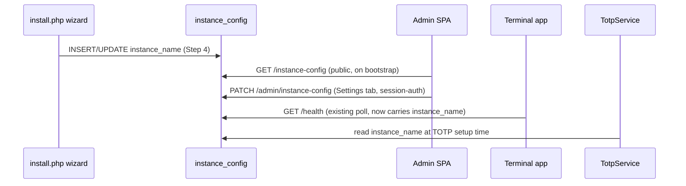

# ADR-0034: Instance Branding Configuration

**Status**: Accepted

**Date**: 2026-08-11

**Deciders**: Architecture Team

---

## Context

Club Bar is a fork-free, self-hosted product: every deployment is a different club, but the UI hardcodes the string "Club Bar" (or, in one leftover spot, the pre-rebrand name "Ruderbar") across three surfaces:

| Surface | Hardcoded string | Location |
|---|---|---|
| Admin frontend | "Club Bar" | `index.html` `<title>`, `MainLayout.tsx` header/footer, `LoginPage.tsx` alt text |
| Terminal | "Club Bar" | `ConfigService.defaultDisplayName`, `app_config.dart` `appName` |
| TOTP enrollment (admin 2FA) | "Ruderbar" / "Ruderbar (dev)" | `TotpService.php` — the `issuer` shown inside every admin's authenticator app |

A deploying club currently cannot see its own name anywhere in the product without editing source. [Issue: Lack of Club Bar Branding] asks for a single **instance name** (example: "FRGS Ruderbar"), set once during installation and editable later from the admin panel, that all three surfaces read from.

This is a second admin-configurable, organization-wide setting after SEPA config ([ADR-0007](./0007-organization-sepa-configuration-storage.md)), which makes the storage-shape question worth revisiting rather than assuming the answer.

### Requirements

1. **Set during first-time install** — the `package/install.php` wizard, not a manual DB edit.
2. **Editable afterward in the admin panel** — no redeploy needed.
3. **Read by three independent runtimes**: the admin SPA (browser, no session before login), the Terminal app (Flutter, offline-capable, polls the backend periodically), and the PHP backend itself (TOTP issuer, generated server-side).
4. **Not sensitive** — a club's own name is not a secret, unlike SEPA creditor data.

---

## Decision

**A dedicated `instance_config` singleton table, following the `sepa_config` pattern from ADR-0007, holding one column: `instance_name`.**

A generic key-value `settings` table was considered now that this is the second config domain, and rejected for the same reasons ADR-0007 already gives: weaker type/length validation, no schema-level single-row guarantee, and — concretely here — every future organization-wide setting doesn't need to share one undifferentiated table just because two exist today. A second one-column table costs one migration and is precisely as explicit as `sepa_config`.

### Database Schema

| Column | Type | Description |
|---|---|---|
| id | TINYINT UNSIGNED | Singleton row, always `1` |
| instance_name | VARCHAR(100) | Club-chosen display name, e.g. "FRGS Ruderbar" |
| updated_by_admin_id | CHAR(36) | FK → `admin_users.id`, `SET NULL` on delete |
| created_at / updated_at | TIMESTAMP | Standard audit columns |

Seeded with `instance_name = 'Club Bar'` so an unconfigured install still renders something coherent rather than an empty string.

### API Shape

Unlike SEPA config, the read side carries no sensitive data and is needed *before* an admin session exists (the login page itself must show the instance name) and *without* any session at all (the Terminal has no admin session, only a terminal bearer token). The read/write split is therefore asymmetric:

| Endpoint | Auth | Used by |
|---|---|---|
| `GET /instance-config` | none (public) | Admin SPA bootstrap (incl. login page), any unauthenticated caller |
| `PATCH /admin/instance-config` | admin session | Settings → Instance tab |

A public GET of a non-secret display string is not a new risk surface; it is the same trust level as the existing unauthenticated `GET /health`.

### Distribution to the Terminal

The Terminal has no generic "pull config" endpoint — only per-entity delta sync (`/sync/members`, `/sync/products`, …) and the unauthenticated `GET /health`, which the Terminal already polls every sync cycle to establish connectivity ([ADR-0033](./0033-terminal-sync-contract.md)) and from which it already hand-parses an out-of-spec `version` field. `instance_name` is added to that same response, for the same reason `version` was: it is small, non-sensitive, and the Terminal already fetches it on a cadence that makes near-real-time propagation free.

The Terminal keeps its existing per-terminal `displayName` override in `config.json` ([ADR-0019](./0019-frontend-access-token-configuration.md), issue #297) — that mechanism predates this ADR and covers a different case (a terminal that wants to show something other than the org-wide name, e.g. during a themed event). Precedence: **an explicit `config.json` `displayName` wins; otherwise the backend-supplied `instance_name` is shown; otherwise the stock "Club Bar" fallback.**

### TOTP Issuer

`TotpService` currently hardcodes `'Ruderbar'` / `'Ruderbar (dev)'` as the `otpauth://` issuer shown in every admin's authenticator app, regardless of deployment. It is changed to read the configured `instance_name` (falling back to `'Club Bar'` if unset), so an authenticator app entry reads as the club the admin actually administers, not a name inherited from this project's own pre-rebrand history.

---

## Consequences

### Positive

- Consistent with the existing `sepa_config` precedent — no new pattern to learn.
- One public, cheap GET covers both the pre-login admin screen and the Terminal, riding an endpoint (`/health`) the Terminal already polls — no new sync machinery.
- Per-terminal override (`config.json`) is preserved rather than replaced, so issue #297 deployments are unaffected.

### Negative

- A second single-purpose singleton table, rather than a general settings mechanism — the third org-wide setting will face this same "new table vs. generic store" question again.
- The Terminal only learns about a changed instance name on its next health poll, not instantly.

### Mitigations

- If a third and fourth org-wide setting appear, revisit consolidation then, with three real examples instead of one hypothetical.
- The health-poll delay matches the existing connectivity-check cadence and is the same staleness window the Terminal already tolerates for `version`.

---

## Related Decisions

- [ADR-0007: Organization SEPA Configuration Storage](./0007-organization-sepa-configuration-storage.md) — precedent for the singleton-table pattern
- [ADR-0019: Frontend/Terminal Access Token Configuration](./0019-frontend-access-token-configuration.md) — per-terminal `config.json` override this ADR layers on top of
- [ADR-0033: Terminal Sync Contract](./0033-terminal-sync-contract.md) — the `/health` poll this ADR piggybacks on
