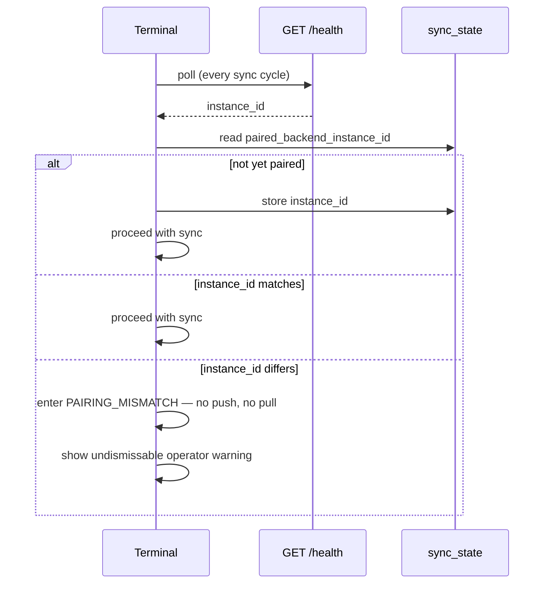

# ADR-0035: Terminal–Backend Instance Pairing

**Status**: Accepted

**Date**: 2026-08-13

**Deciders**: Architecture Team

---

## Context

[Issue #380](https://github.com/dgloeckner/clubbar/issues/380) reported a member's purchase missing from their history. Investigation of a captured terminal SQLite db against a backend MySQL dump showed the transaction — and four others, including a client-generated `id` the terminal had already marked `synced = 1` after a genuine accepted response ([ADR-0033](./0033-terminal-sync-contract.md) §5) — absent from the backend's `transactions` table entirely. Both sync code paths were audited and are sound: the terminal only flags a row synced after the server confirms it in `accepted_ids`, and the backend only reports an id accepted after a durable `INSERT` succeeds. Nothing in the application code could produce this state on its own.

The one anomaly explains it: the backend's `terminals.last_sync_at` for the terminal in question was frozen at a point in time *before* the five missing transactions were even created. A terminal that had been happily syncing against one backend database was, at some point, talking to a database that had no memory of that history — most plausibly a database that was reset or reseeded (the project's own dev-reset flow, documented in `CLAUDE.md`, wipes and reseeds the schema; the same shape of event — restore-from-backup, environment mixup, a wrong `.env` pointed at a fresh instance — is not specific to that flow). The terminal has no way to notice this. It only ever asks "did you accept this batch?", never "are you still the same backend I was talking to yesterday?" — so it kept queuing new sales against local state that assumed continuity which no longer existed.

This is a narrower problem than general reconciliation (comparing balances or transaction counts after the fact). It is a **pairing** problem: a terminal's local db is only ever safe to sync against the one backend database it has synced against before. Detecting that the two have diverged, before any more data is exchanged, is the goal.

## Decision

**The backend carries a stable, randomly-generated `instance_id`. A terminal remembers the `instance_id` of the backend it last synced with and refuses to sync — at all — the moment a different one shows up, until a human clears it.**

### 1. Backend identity

`instance_config` (ADR-0034) gains one column:

| Column | Type | Description |
|---|---|---|
| instance_id | CHAR(36) | Random UUID, generated once when the install wizard writes this singleton row |

`install.php` generates it at the same step that seeds `instance_name`. It is never regenerated by normal operation — only ever by whatever recreates the `instance_config` row from scratch, which is precisely the class of event this ADR defends against: a fresh install, a wipe-and-reseed, a restore that predates the row's last write. A restore of a full, consistent backup carries the row (and its `instance_id`) forward unchanged, so a legitimate disaster-recovery restore of *the same* instance does not trip this mechanism — only a database that has lost the specific history the terminal depended on does.

### 2. Distribution

`GET /health` already carries `version` and `instance_name` and is already polled every sync cycle regardless of connectivity (ADR-0033, ADR-0034). `instance_id` is added to that same response — no new endpoint, no new round trip.

### 3. Terminal-side pairing state

The terminal's `sync_state` key-value store gains one key: `paired_backend_instance_id`. It is written once, on the terminal's first-ever successful `GET /health` after provisioning (trust-on-first-use — there is nothing to compare against yet). From then on, every `GET /health` response is checked against it **before** any sync push or pull is attempted for that cycle.

### 4. On mismatch: hard block, not a warning

A mismatch means the terminal cannot trust that anything it believes is synced actually is, and cannot trust that pulling fresh member/product data would be consistent with its own transaction history. The terminal:

- **Stops all sync** — no transaction push, no member/product delta pull — until the mismatch is cleared. It keeps operating offline against its last-known-good local cache, exactly as it already does during any ordinary connectivity outage; this is not a new mode of unavailability, only an extended one.
- **Surfaces an undismissable warning**, naming the count of locally unsynced transactions at risk, in the same spirit as the permanent-rejection quarantine warning in ADR-0033 §4.
- **Never auto-clears.** Silently re-pairing to the new instance is exactly the silent data-loss failure mode this ADR exists to prevent — the terminal would resume syncing, the local "unsynced" transactions would upload cleanly against a backend with no conflicting history, and the operator would never learn that their previous session's sales are gone from wherever they went. Clearing the mismatch is a deliberate admin action (re-pairing UI/flow, logged to `audit_log`), out of scope for this ADR's data model but required before implementation.

### 5. What this does not solve

This protects against **divergent** backend history, not **partial** backend data loss on an otherwise-continuous instance (e.g., a single row dropped by an infra fault with `instance_id` unchanged). That remains a candidate for the reconciliation check discussed separately — the two are complementary, not alternatives: pairing catches "wrong/reset database," reconciliation would catch "right database, missing rows."

## Consequences

**Positive:**
- Closes the exact failure mode observed in #380 — a terminal is structurally prevented from accumulating sync history against a backend that does not share its past.
- Zero new network calls; rides the existing `GET /health` cadence.
- Fails safe: the terminal's own data is never deleted or overwritten by this mechanism, only queued locally until reconciled.

**Negative:**
- A deliberate, legitimate backend reseed (the dev-reset flow, a fresh staging environment reused for a new purpose) now requires an explicit re-pairing step on every terminal that had talked to it — friction that did not exist before, though arguably it should have.
- Adds one more piece of state (`paired_backend_instance_id`) each terminal must carry correctly across app updates and reinstalls; losing it accidentally forces a trust-on-first-use re-pair, silently discarding the protection until the next mismatch.
- Does not cover partial data loss on a continuous instance (see §5) — could be read as "solved" when it is only half of the problem.

## Where the code does not yet match

Implemented: the `instance_config.instance_id` migration (015), the `/health` response field, the terminal's pairing check (`SyncService.checkPairing`) and hard-block state (`SyncProvider.pairingMismatch`), the operator warning UI (`PairingMismatchBanner`), and the re-pair action (`POST /terminal/pairing/ack`, terminal-token-authenticated per §4's revised decision below, logged via the `terminal_repair` audit action, migration 016).

**Revision on re-pair authorization**: §4 originally left the re-pair endpoint's auth model open. It is terminal-token-authenticated, not a separate admin credential — this is a user-error/data-continuity safeguard (a terminal reconnected to the wrong or reset backend), not a security boundary, so the same token that already authorizes every other terminal write is sufficient. A human still makes the call: the block only clears when someone at the terminal deliberately taps "resume."

Not implemented: the reconciliation check for partial data loss on an otherwise-continuous instance (§5) remains a separate, future piece of work.
