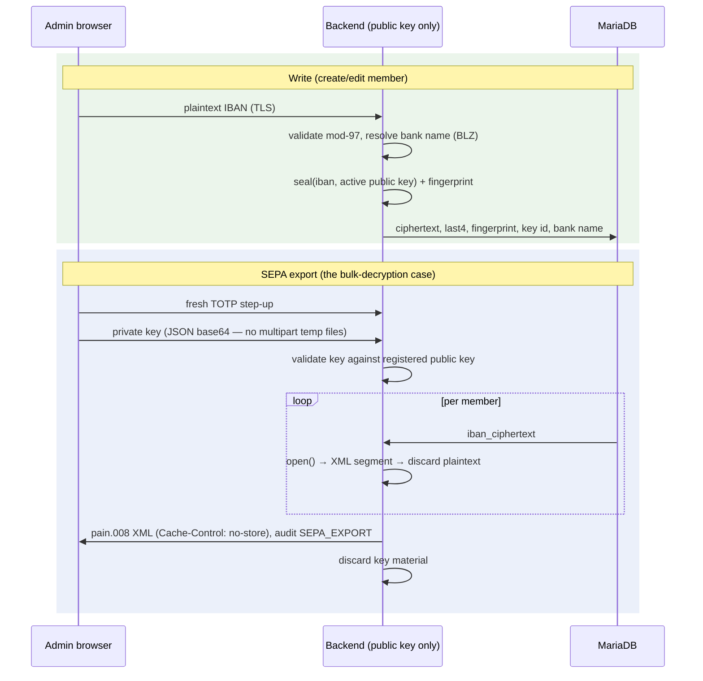

# ADR-0036: IBAN Encryption at Rest with libsodium Sealed Boxes

**Status**: Accepted

**Date**: 2026-08-13

**Amends**: [ADR-0005](./0005-iban-storage-and-validation.md) (revokes its rejection of at-rest encryption; its validation and audit-masking decisions stand)

---

## Context

Member IBANs are stored in plaintext in `mandates.iban`. The DB credentials sit in `config.php` on the same shared host (ADR-0031 documents that file's protection as "PHP files are executed, not served" plus `0600` where the host allows it). Anyone who obtains the database — SQL injection, a stolen dump, a stolen backup, a co-tenant reading a world-readable export — obtains every member's bank account number.

ADR-0005 rejected at-rest encryption ("HTTPS + access control sufficient"), naming the real blocker: *"Key management overhead (where to store encryption key?)"*. A server-resident symmetric key would indeed add little: the same host compromise that yields the DB usually yields `config.php` and the key with it.

The revised design removes that blocker by removing the decryption key from the server entirely. Sodium and `sodium_crypto_box_seal()` were verified working on the production-like IONOS hosting (PHP 8.4.24; 32-byte Curve25519 keys, 48-byte sealed-box overhead, full roundtrip tested).

Three code paths genuinely need the plaintext IBAN: SEPA pain.008 XML generation, the member create/edit form at submit time, and validation/bank-name resolution at write time. Everything else (lists, previews, eligibility checks, terminal sync, audit, CSV, GDPR export) works from a masked value or mere presence.

## Decision

**IBANs are encrypted at application level with libsodium sealed boxes (`sodium_crypto_box_seal`). The server stores only the public key and can therefore encrypt but never decrypt. The private key is generated offline, archived by the club outside the hosting environment, and supplied temporarily — behind fresh TOTP step-up re-authentication — only for SEPA export, exceptional full-IBAN display, and key rotation.**

### Threat model

Compromise of any **one** of the following alone must not reveal complete stored IBANs:

| Compromised asset | Why IBANs stay protected |
|---|---|
| MariaDB / SQL dump / DB backup | Rows hold sealed-box ciphertext + last 4 characters only |
| DB credentials | Same — the DB never contains plaintext or the private key |
| PHP source / deployment artifact | Contains no key material |
| `config.php` / `.env` | Holds the fingerprint key (see below), never the private key |
| Entire webspace contents | Private key is never persisted server-side |

Documented residual risks (not addressed by this design):

- private key and ciphertext compromised **together**;
- an administrator workstation compromised while the private key is in use;
- an already-compromised PHP runtime during a legitimate key-supplying request;
- accidental leakage via logs, temp files, or debugging (mitigated: no multipart key upload, audit masking, `zend.exception_ignore_args`).

### Storage

`mandates` (per active or historical mandate):

| Column | Type | Description |
|--------|------|-------------|
| iban_ciphertext | VARBINARY(512) | `sodium_crypto_box_seal(normalized_iban, active_public_key)` |
| iban_last4 | CHAR(4) | Last 4 characters, plaintext — routine display (`****3000`), no decryption needed |
| iban_fingerprint | CHAR(64) | Keyed `sodium_crypto_generichash(normalized_iban, IBAN_FINGERPRINT_KEY)`, hex |
| encryption_key_id | CHAR(36) FK | The key generation this row is sealed under |
| bank_name | VARCHAR(255) | Resolved from the BLZ at write time (list display can no longer derive it) |
| iban | VARCHAR(34) NULL | Legacy plaintext; nulled row-by-row by the one-time batch encryption; column drop is a follow-up release |

The IBAN is normalized (uppercase, no spaces) and mod-97-validated before sealing — validation happens while the plaintext is transiently in memory at write time, exactly as before.

**Why the fingerprint exists**: `MembersRepository::applyMandateChange()` must distinguish a bank change (end mandate, open a new one with a new reference) from a mere correction — it does so by comparing the submitted IBAN with the stored one. Sealed boxes are randomized and the server cannot decrypt, so equality is checked via the keyed fingerprint. The fingerprint key lives in `config.php` (never the DB), so a DB-only attacker cannot run confirmation/brute-force attacks against the enumerable IBAN space; an attacker with both DB and config learns at most equality relations, not account numbers. `sepa_config.creditor_iban` (the club's own account, printed on every letterhead and contribution invoice) deliberately stays plaintext.

### Key lifecycle

States: `PENDING → ACTIVE → RETIRING → RETIRED`, plus `REVOKED` and `COMPROMISED`. Exactly one operational ACTIVE key at any time.

| Rule | Value |
|---|---|
| Cryptoperiod | 365 days from activation (`expires_at = activated_at + 365d`); no extend operation — expiry is resolved by rotation |
| Warnings | ≤ 90 d INFO, ≤ 30 d WARNING, ≤ 7 d CRITICAL — computed at request time (shared hosting has no cron), shown on the dashboard and the Security & Credentials page |
| Expiry enforcement | Server-side hard block of SEPA export **and** of encrypting new/changed IBANs; key management and rotation remain available |
| Generation | On a trusted admin machine with the shipped offline generator (`tools/keypair-generator.html`, vendored libsodium.js); the private key never needs to reach the server to register a public key |
| Metadata | `encryption_keys` table: identifier, algorithm `SODIUM_CRYPTO_BOX_SEAL`, raw 32-byte public key, SHA-256 fingerprint, status, lifecycle timestamps, creator. The DB never contains a private key |
| Compromise | Immediate revocation + replacement regardless of remaining lifetime; re-encrypt as soon as practical (stolen ciphertext + stolen old key is not retroactively fixable) |

### Flows

Rotation (annual or on compromise): register NEW public key (PENDING) → activate (NEW ACTIVE, OLD RETIRING; new writes use NEW) → re-encrypt in resumable batches of 100, the browser supplying the OLD private key per batch request (never stored server-side, never in a session) → each batch uses optimistic `UPDATE … WHERE encryption_key_id = :old` so a concurrent member edit wins → verify zero rows on OLD → OLD RETIRED. Every step audited with affected row counts.

### API surface

Full IBANs leave the system in exactly one place: the SEPA XML handed to the bank. Member list/detail/preview, settlement CSV and the GDPR export carry `iban_last4` (+ mandate reference — sufficient for revision per the retention design; the member knows their own IBAN). The edit form is overwrite-only: it shows `****3000`, an empty field keeps the stored value. Exceptional full-IBAN display is a privileged operation with the same step-up + private-key flow, audited as `IBAN_FULL_VIEW`.

### Deviations from the handoff document

| Handoff §27 recommends | This ADR decides | Why |
|---|---|---|
| Granular permissions (KEY_MANAGEMENT, SEPA_EXPORT, …) | Flat admin model (ADR-0015) + fresh TOTP step-up per sensitive operation | A role system is a large separate build; step-up gives the "fresh authorization" property with the existing `StepUpAuthService` |
| Scheduled daily expiry evaluation | Request-time computation, warnings on every dashboard load | Shared hosting guarantees no cron (ADR-0031); enforcement is request-time anyway |
| Optional email notifications | Deferred to a follow-up issue | Needs idempotent-notification storage; warnings are already unmissable in the UI |

## Consequences

### Positive

- ✅ A stolen database, dump, or backup no longer exposes bank accounts — the answer to "IBANs should only be stored offline" is that the *decryption capability* is offline.
- ✅ No server-resident decryption key to manage or rotate under duress; key custody is an organizational procedure the club already understands (like the safe key).
- ✅ Key expiry, rotation, revocation and compromise handling are explicit, visible, audited and enforced server-side.
- ✅ Day-to-day operation (lists, settlements, terminal access checks) needs no key and no decryption.

### Negative

- ❌ **Losing the last valid private key makes all IBANs sealed under it unrecoverable.** The club's key archive is now part of the backup story; recovery copies must be tested periodically (operational procedure in `docs/deployment.md`).
- ❌ SEPA export gains a step: the treasurer must supply the private key (step-up + file/paste) on each export.
- ❌ The treasurer's workstation becomes security-relevant during key operations — documented residual risk.
- ❌ After the one-time batch encryption, rolling back to a pre-encryption release is unsafe (old code would find no plaintext); a DB backup from before the upgrade is the only rollback path.
- ❌ Bank-name display depends on write-time resolution; names change only when the mandate is next touched.

### Residual risks kept open (tracked as follow-ups)

- `mysqldump` backups are unencrypted (they now contain ciphertext, but the rest of the row set is still personal data) — recommend `gpg -c` in the backup procedure.
- The legacy plaintext `iban` column is dropped in a later release, after all installs have run the batch encryption.
- `TotpService` still uses its own AES-256-CBC path; migrating it onto a shared abstraction is out of scope here.

## Alternatives Considered

### Symmetric key in `config.php` (AES-256-GCM)

The natural incremental step (mirrors `TOTP_ENCRYPTION_KEY`). Rejected: the key sits on the same host as the data; a webspace compromise yields both. It protects only the DB-dump-without-filesystem case — real, but strictly weaker than moving the key offline, and it was exactly ADR-0005's original objection.

### MariaDB at-rest / tablespace encryption

Not available on shared hosting, and protects only against physical media theft — the running DB serves plaintext to anyone with credentials.

### Store only last4, keep full IBANs entirely offline (paper)

Strongest storage posture, but SEPA export would require re-typing every IBAN per settlement — operationally untenable and error-prone; sealed boxes achieve the same "server cannot read them" property while keeping export practical.

## Related Decisions

- [ADR-0005](./0005-iban-storage-and-validation.md) — amended by this ADR (validation, audit masking stand)
- [ADR-0015](./0015-authentication-and-authorization-strategy.md) — flat admin model retained; step-up used for sensitive operations
- [ADR-0016](./0016-transport-security.md) — TLS remains the transport layer under all flows here
- [ADR-0029](./0029-two-tier-retention-and-erasure.md) — mandate rows (now ciphertext-bearing) remain retained per its rules
- [ADR-0031](./0031-production-hardening-on-shared-hosting.md) — the hosting constraints this design works within
- [ADR-0037](./0037-mandate-documents-not-retained.md) — removes the other at-rest IBAN copy (scanned documents)

## References

- [libsodium sealed boxes](https://doc.libsodium.org/public-key_cryptography/sealed_boxes) — `crypto_box_seal` construction
- [OWASP Key Management Cheat Sheet](https://cheatsheetseries.owasp.org/cheatsheets/Key_Management_Cheat_Sheet.html) — lifecycle principles this design follows
- Security handoff document 2026-08-12 (club-internal) — agreed architecture incl. IONOS sodium verification
