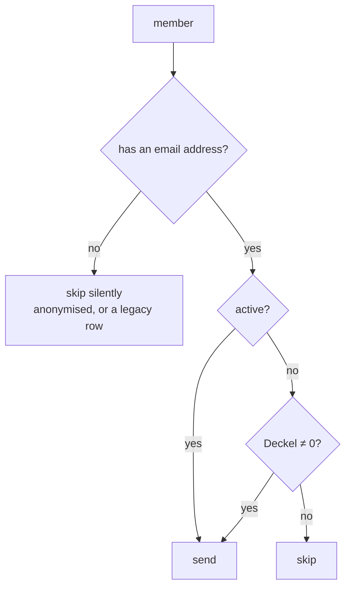

# ADR-0039: The Periodic Deckelauszug

**Status**: Accepted

**Date**: 2026-08-15

**Amends**: [ADR-0038](./0038-transactional-mail-outbox-on-shared-hosting.md) (enqueue may be triggered by time; the no-body rule keeps its principle but loses its original justification; the stall alarm stops keying on age), [ADR-0031](./0031-production-hardening-on-shared-hosting.md) (the scheduler's *interval* joins its existence as a declared, verified host fact — and a weekly-only host is refused), [ADR-0029](./0029-two-tier-retention-and-erasure.md) (outbox retention varies by message kind)

---

## Context

A member learns what they owe in exactly two ways today. They can look at the terminal, and they receive a **Vorabankündigung** when a settlement is about to collect from them. Between settlements, nothing.

That gap is not merely a comfort problem. `CreditLimit::LIMIT_CENTS` is €100, the warning band starts at 80%, and the rule is enforced **at the terminal, offline, in front of the member**: a checkout that would push the tab past the limit is refused (UC-T11 E3). So for a member who is not watching the screen closely, the first signal that their Deckel has run away from them is being turned away at the bar, with a queue behind them.

[#361](https://github.com/dgloeckner/clubbar/issues/361) §5 deferred this explicitly — *"statement mail optional, out of scope"* — because the epic's job was the collection, not the tab. ADR-0038 then built a general outbox: a queue keyed on `(kind, subject_id, dedup_key)`, a single sending path, and content dispatched through a registry so that *"a new notification type is a new builder rather than a branch in the sending loop."* The statement is the first thing to test whether that generality was real.

It turns out to be real in the parts ADR-0038 anticipated and to bend in three it did not, because a Deckelauszug differs from a Vorabankündigung in ways that reach the architecture rather than the template:

| | Vorabankündigung | Deckelauszug |
|---|---|---|
| Triggered by | A person finalising a settlement | **Time passing** |
| Its subject | A settlement | Nothing — there is no entity |
| Its number | Frozen by an append-only settlement | **Live**; the member can change it by buying a beer |
| If it never arrives | A written promise (§ 7 Abs. 3) is broken | Nobody is worse off than today |

Designed in a grilling session on 2026-08-15; the alternatives below were argued rather than imagined afterwards.

## Decision

**A Deckelauszug is a periodic statement of a member's Deckel — sent to every active member on a fixed calendar boundary regardless of what they owe, itemised and netted, announcing nothing and collecting nothing.** It rides ADR-0038's outbox as a new `kind`.

`CONTEXT.md` carries the term, and **Vorabankündigung** alongside it. The glossary had no notification vocabulary at all, and the Deckelauszug is only definable next to the thing it must not be mistaken for.

### 1. Enqueue may be triggered by time, and the unique index is what makes that safe

Every enqueue until now happened *inside a business transaction*, and ADR-0038 leaned on that: settlement, items and outbox rows commit together, so there is no half-finalize. A periodic statement has no transaction to join. It is a scan over members, run because a date passed.

What survives the change is the part that mattered. ADR-0038's own framing — *"idempotency lives on the message, not on the settlement"* — was never really about transactions; it was about `UNIQUE (kind, subject_id, dedup_key)` refusing a duplicate without a lookup-then-insert race. That constraint does not care what caused the insert.

| | |
|---|---|
| `kind` | `deckel_statement` |
| `subject_id` | The **member**. `MailSubject::MEMBER` |
| `dedup_key` | The **period** — `2026-08`, `2026-Q3` |

So the enqueue scan needs no transaction, no cursor and no resume state: it inserts and swallows a duplicate-key violation. A run killed halfway is completed by the next tick at no cost, and a tick that fires ten times within a period produces one message. **The scan is deliberately not wrapped in a transaction** — wrapping it would turn a harmless partial scan into a long-held lock on a mass-hosting database, buying atomicity nobody needs.

There is **no `statement_run` entity**. It was considered and rejected: nothing about a run is worth keeping — nothing is collected, nothing is reproducible-for-GoBD, nobody signs it.

### 2. The value is computed as of the period boundary, at send time

ADR-0038 rule 5 stores no body and renders at send. Its justification was specific: *"this is safe precisely because ADR-0032 makes the settlement append-only — the amount cannot drift between enqueue and send."*

**That justification does not transfer, and the rule survives anyway** — because the actual principle was *reproducible from stored data*, and immutability was merely how the pre-notification happened to satisfy it. A Deckel is reproducible too, as long as the question is dated:

> A transaction was unsettled at `t` when it occurred at or before `t` and no settlement claiming it had been created by `t` without also having been cancelled by `t`.

This is answerable only because of a decision made for another reason entirely. [#142](https://github.com/dgloeckner/clubbar/issues/142) split `settlement_items` into `transaction_id` (the history) and `active_transaction_id` (the live claim) so that cancelling a settlement would stop destroying the record of what it contained. A transaction therefore keeps a row for **every** settlement that ever claimed it, and `settlements.created_at` / `cancelled_at` date each claim.

**Why not simply compute it live at send.** Because with an itemised statement, a live value means the same message says different things on each delivery attempt. A greylisted mail that leaves three days late lists fewer drinks than it would have on the 1st; a member collected in the meantime receives an August statement itemising **nothing at all** and totalling 0,00 €. Under a retry queue — which is the entire premise of ADR-0038 — a message whose content shrinks between attempts is indefensible.

The cost is a **second definition of settled money**, in the class whose docblock reads *"what 'unsettled' means, in one place"* and which exists because that definition had been copy-pasted six times and drifted ([#119](https://github.com/dgloeckner/clubbar/issues/119)). This is accepted rather than dismissed, under two conditions: the dated predicate lives **inside** `UnsettledTransactions` as a named sibling of the live one — #119's failure was a duplicated *answer*, not a second named *question* — and a test pins the two to agree at `t = now`.

### 3. Everyone, always, with no individual opt-out

| Case | Ruling | Why |
|---|---|---|
| Deckel > 0 | Send | The point |
| Deckel = 0 | **Send** | A statement that arrives only when you owe something is a nudge wearing a statement's clothes. Boring and predictable is the product |
| Deckel < 0 (credit) | **Send**, stated as a credit | Without implying a Payout is coming — that is a separate act (`CONTEXT.md`) |
| Inactive / deleted, Deckel = 0 | Skip | |
| Inactive / deleted, Deckel ≠ 0 | **Send** | Deactivating a member does not cancel what they owe, and going dark on a debt you will still collect is the one case where silence is wrong |
| No email address | **Skip silently** | In practice an anonymised member (ADR-0029 clears `email`). There is nobody to write to and nothing to fix |

Cadence is club-wide configuration — `off | monthly | quarterly`, default `monthly` — and there is **no per-member opt-out**. Legally this is comfortable: information about an existing contractual relationship is not Werbung under § 7 UWG, so no consent is required. It is nonetheless unsolicited recurring mail, and the honest reason there is no opt-out is that this system has **no member login**: an opt-out would mean a public endpoint, a token, an unsubscribe link and a preference record — a larger feature than the statement. The club-wide switch is the off-ramp. A per-member flag is a column and a checkbox if it is ever needed.

**Weekly cadence is not offered.** Fifty-two itemised statements a year makes "predictable" read as "relentless", and nothing in a tab that settles monthly moves that fast.

### 4. Itemised, netted, capped — and the total is never the sum of what was printed

| Rule | |
|---|---|
| **Netted** | A purchase and its Storno cancel and **both** lines disappear |
| **Orphaned Storno** | A Storno whose original was collected in an earlier settlement has nothing to net against and stands alone as a negative line. It is money in the member's favour |
| **Order** | Chronological. Grouping by product is a second aggregation to get wrong, and it destroys the *when* that makes a line recognisable |
| **Cap** | 100 lines, then „…und N weitere Buchungen" |
| **Total** | Computed over the **full** set, never over the printed lines — and the mail says so. The cap is safe only because of this |
| **Zero** | A sentence, not an empty table |
| **Never present** | Mandate reference, Gläubiger-ID, IBAN, execution date, due date. Those belong to the Vorabankündigung, and a statement that borrows them reads as a collection notice |

Netting is computed once, over the same set the total comes from, so lines and total cannot disagree. That is a structural property rather than an assertion.

The same drink appears on every Deckelauszug until a settlement finally claims it. This is not double counting — a Deckelauszug is a **balance**, like a bank statement, not a ledger of new activity. Suppressing a line because it appeared last month would make the printed lines stop summing to the Deckel, which is the actual double-counting bug, inverted.

**The privacy cost is real and is stated rather than argued away.** Every active member receives, monthly, an itemised record of what they drank and when — unsolicited, with no individual way out. The mitigation is structural: ADR-0038 rule 5 stores no body, so the record exists in the member's inbox and **nowhere in this system's database**.

### 5. The scheduler's interval becomes a declared fact, and weekly is refused

ADR-0031 accepted a hard dependency on the host having *a* scheduler. Every number downstream then quietly assumed the interval `bin/cron.php` recommends — every 5–15 minutes. Panel crons in practice offer **hourly at best, sometimes only daily or weekly**, and three things break at that granularity.

**`mail_config.cron_interval` — `hourly | daily`** — declared during the installer's existing prerequisite step (ADR-0038 rule 7), where the admin is already being shown the command and pressing *Prüfen*, and **cross-checked against observed gaps** between `cron_heartbeat` runs. Both halves are needed: the first run must already schedule a sensible retry before anything has been measured, and only observation catches a crontab that says hourly and fires daily — the same class of mismatch `php_version` is already recorded to expose. A disagreement is reported by the self-check; it does not silently override the declaration.

**`weekly` is refused.** ADR-0038 argues the § 7 Abs. 3 distance is guaranteed *at enqueue*, because the execution date is already seven days out. At a weekly drain that argument fails: a message enqueued an hour after a tick leaves up to seven days later and lands **on** the execution date. The announcement distance goes to roughly zero. Per ADR-0038 rule 3 — *"an installation with no scheduler cannot keep the § 7 promise, so it must not pretend to"* — such a host is blocked from finalising settlements, exactly as an unverified scheduler is. **The escape hatch, named and deliberately not built**: raise `SettlementLeadTime::DAYS` to 14 on a weekly host so the announcement still lands seven days out. That trades an ADR-0009 constant against a hosting limitation, and should not be spent until a real club needs it.

**The retry ladder is measured in ticks.** The flat `RETRY_BACKOFF_SECONDS = 900` was tuned for greylisting's ~15-minute expectation and is already dead letter at an hourly cron. It becomes a multiplier on `cron_interval` — `1 × 2 × 4 × 8`, four attempts. Hourly gives fifteen hours of trying, far more than greylisting needs and nothing against a seven-day deadline; daily degrades gracefully instead of firing four retries the cron will never be awake for.

**Stall detection stops keying on age.** ADR-0038's *"oldest unsent message older than 24 h"* is incompatible with an exponential ladder — one stubborn mailbox stays `pending` by design and fires the alarm, which is precisely the wolf-crying that ADR-0038 rule 6 forbids. Two interval-relative signals replace it:

| Signal | Predicate | Means |
|---|---|---|
| Liveness | `now − last_run_at > interval × 2` | The scheduler stopped |
| Throughput | any `pending` row with `next_attempt_at ≤ now − interval × 3` | Something was **due** and nothing took it |

A row waiting out its backoff has `next_attempt_at` in the *future* and cannot trip either signal, however long its ladder runs. **Being due and ignored** replaces **being old** as the definition of a stall, and both thresholds scale with the interval — an hourly install alarms in ~3 hours, a daily one in ~3 days.

### 6. Retention varies by kind

ADR-0029 places `mail_outbox.recipient` in the operational tier. ADR-0038 assumed one retention rule for the queue. That no longer fits:

| Kind | Retention | Why |
|---|---|---|
| `sepa_prenotification`, `cancellation_notice` | As ADR-0038 defines | Evidentiary — proof the § 7 Abs. 3 announcement went out |
| `deckel_statement` | `sent` rows pruned at **90 days** | Proves nothing anyone will ever need |

Twelve rows per member per year, each carrying a snapshot address, for a message with no evidentiary purpose, is PII accumulating for nothing — the same reasoning that made ADR-0038 refuse to store bodies. `kind` already decides three other things about a row; retention is a fourth.

### The tick

```mermaid
sequenceDiagram
    participant C as Cron (hourly)
    participant E as PeriodicEnqueue
    participant DB as Database
    participant D as DrainService
    participant M as MTA

    C->>E: is a period due, and unenqueued?
    alt cadence off, or period already enqueued, or period is stale
        E-->>C: nothing
    else due
        E->>DB: scan members in scope
        loop per member
            E->>DB: INSERT (deckel_statement, member, period)
            Note over E,DB: duplicate key = already said; swallowed
        end
    end
    C->>D: drain (batch)
    D->>DB: claim
    D->>DB: recompute Deckel **as of the period boundary**
    D->>M: send
    D->>DB: heartbeat
```

### Who receives one



## Consequences

**Positive**

- A member finds out where they stand before the terminal refuses them, which is the concrete harm this addresses.
- ADR-0038's generality is exercised rather than asserted: a new `kind`, a new builder, no branch in the sending loop, no second sending path, no second scheduler.
- Idempotency for a *time-triggered* message costs nothing new — the unique index already answered "has this been said?", and a period is just another dedup key.
- The stall alarm gets **more** correct, not less. Keying on due-and-ignored rather than age means a long retry ladder no longer produces false alarms, and the thresholds now scale with the host instead of assuming a machine we own.
- The hosting assumption stops being implicit. ADR-0031 knew the scheduler could be missing; it did not know the interval could be a week.

**Negative**

- **A second definition of settled money exists.** Mitigated by keeping it in the same class and pinning the two together with a test, but #119 is the reason to say plainly that this is a place future drift can happen.
- **Every active member receives a monthly itemised record of their drinking, with no way to opt out.** Legal, structurally mitigated (no body stored), and still the sharpest edge of this decision. If members object, the answer is a per-member flag, not a redesign.
- **The retry ladder and stall predicate change behaviour for the Vorabankündigung**, which is shipped and working. They share one drain; this is unavoidable and should be treated as a change to a live feature rather than an addition beside it.
- **The default is `monthly`, so the feature is on.** For a new install that is a deliberate choice. For an **upgrade** it means an existing installation mails its entire membership on the next 1st — before anyone has read a release note. The migration therefore sets existing installs to `off` and raises a prompt to switch on ([#462](https://github.com/dgloeckner/clubbar/issues/462) step 11.4); this divergence from "monthly everywhere" is the one part of the design deliberately left for confirmation, because it is the only place where a default reaches real people by itself.
- **A weekly-only host is now refused outright.** ADR-0031's supported set narrows a second time. In practice hourly is universal on the tariffs in scope, but this is a stated limit rather than one to be discovered.
- A member whose address someone blanked in the admin panel is indistinguishable from an erased one, and neither will be noticed. Accepted: the alternative was a warning surface for a case that should not occur, given `email` is required on member creation.

**Neutral**

- The statement makes no promise. It is deliberately **not** written into the Nutzungsordnung, so ADR-0038 rule 6's "best effort" holds here without qualification — unlike the Vorabankündigung, where best effort is a legal risk the club chose to carry.

## Alternatives considered

**Live value at send.** Rejected: under a retry queue the same message would say different things on different attempts, and a member settled between enqueue and send would receive an itemised statement listing nothing. See decision 2.

**Snapshot the amount into a `payload` column at enqueue.** Rejected: it breaks ADR-0038's no-body rule for a value that is reproducible, multiplying copies of member PII for no evidentiary gain — the same trade ADR-0038 already refused.

**A `statement_runs` entity as the subject.** Rejected: it buys a reporting surface for a run with no state worth keeping, and would need a page built to justify itself. The outbox rows are the record, and they are prunable precisely because nothing needs them.

**Only mailing members who owe something.** Rejected: it turns a statement into a nudge, makes arrival itself a message about the member's balance, and abandons the predictability that is the whole product.

**Suppressing a statement when a Vorabankündigung for that member is in flight.** Rejected: it makes the predictable thing conditionally absent and couples the statement to settlement state, which calendar anchoring was chosen to avoid. Two mails with visibly different subjects, one carrying „Stand: 1. August", is not a problem worth that coupling.

**A separate cron entrypoint for periodic mail.** Rejected: it would be a scheduled job that nothing verifies and nothing monitors — precisely the failure ADR-0038 rule 7 was written against. The install gate and the heartbeat exist exactly once.

**Extending the ladder past 24 h and teaching stall detection about backoff schedules.** More correct in principle; rejected in favour of the simpler overdue predicate, which achieves the same immunity without the stall check needing to know how backoff works.

## Related decisions

- [ADR-0002](./0002-product-internationalization.md) — `preferred_language` selects the statement's language, `de` fallback
- [ADR-0028](./0028-legal-constraints-on-money-handling.md) — the Storno rules that decide what a netted line may do
- [ADR-0029](./0029-two-tier-retention-and-erasure.md) — amended here: outbox retention varies by kind
- [ADR-0031](./0031-production-hardening-on-shared-hosting.md) — amended here: the scheduler's interval is a declared, verified host fact, and weekly is refused
- [ADR-0032](./0032-settlement-lifecycle.md) — the append-only settlement history that makes the dated predicate possible
- [ADR-0038](./0038-transactional-mail-outbox-on-shared-hosting.md) — the outbox, the drain, the registry and the rules this decision amends

## References

- `CONTEXT.md` — **Deckelauszug** and **Vorabankündigung**
- [#361](https://github.com/dgloeckner/clubbar/issues/361) — the epic, whose §5 deferral this lifts
- [#462](https://github.com/dgloeckner/clubbar/issues/462), [#463](https://github.com/dgloeckner/clubbar/issues/463) — implementation phases P11 and P12
- [#406](https://github.com/dgloeckner/clubbar/issues/406) — `cron_interval`, the tick-relative ladder and the overdue stall predicate
- [#119](https://github.com/dgloeckner/clubbar/issues/119) — why a second definition of "unsettled" is worth naming as a risk
- [#142](https://github.com/dgloeckner/clubbar/issues/142) — the `transaction_id` / `active_transaction_id` split that makes the dated predicate answerable
- § 7 UWG — why information about an existing contractual relationship needs no consent
