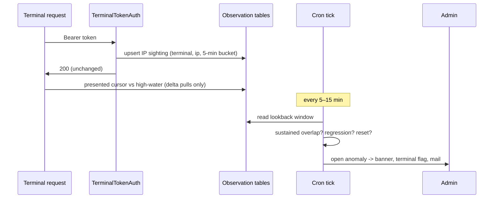

# ADR-0041: Terminal Credential Anomaly Detection

**Status**: Accepted

**Date**: 2026-08-15

**Deciders**: Architecture Team

---

## Context

A terminal authenticates with a bearer token and nothing else. `TerminalTokenAuthenticator` resolves a SHA-256 hash to a `terminals` row; there is no device binding, no proof of possession, no session. Two clients presenting the same token are indistinguishable — both become the same `terminal_id`, both write transactions attributed to it, and both keep `last_sync_at` warm so the dashboard shows one healthy till.

[ADR-0036](./0036-iban-encryption-sealed-box.md) gave those tokens a lifetime and [#395](https://github.com/dgloeckner/clubbar/issues/395) gave them overlap rotation, so a token that outlives its device eventually stops working. Neither answers the question in between: **is this token being used by more than one device right now?** A POS device is stolen, resold, or its token copied by somebody who was on site, and until an admin happens to notice, the copy reads the full member roster and writes sales indefinitely.

The obvious signal — "the terminal's IP changed" — is not usable as an authorization decision. A clubhouse on a German consumer line is re-IP'd on a roughly daily forced reconnect; CGNAT rotates the egress address per connection; IPv6 privacy extensions rotate the source address on one NIC every few hours; and a terminal is *designed* to be offline for days and reconnect (ADR-0033), so "different IP than last week" is the normal case. Meanwhile the likely attacker — someone replaying the token from the club LAN or a phone on the same CGNAT block — presents the *same* IP. Enforcing on IP change would stop the bar selling daily while missing the plausible thief.

Two signals do carry information, and neither requires a terminal-side change.

**Concurrency, not change.** One terminal is one device. Two source addresses genuinely active *at the same time*, sustained, is close to impossible legitimately. A clean handover from a reconnect produces two addresses in sequence with no overlap; a clone produces two addresses overlapping for as long as both devices are running.

**Sync-cursor continuity.** The delta cursor (`SyncCursor`) is a server-issued millisecond watermark the terminal stores and echoes back as `?since=`. It is monotonic non-decreasing for an honest client, because the terminal persists whatever the server returned and the server never returns less than it was given. A second client on the same token holds its own copy of that state, and the divergence is visible server-side — where today nothing looks at it.

## Decision

**The backend records, per terminal, where its authenticated requests come from and what sync cursor they present. A periodic job turns those observations into anomalies and alerts an admin. Nothing is ever blocked, revoked, or rate-limited as a result.**

Alert, don't enforce. The cost of a false positive is a bar that cannot sell; the cost of a false negative is a delay in a human noticing something a human has to judge anyway. [ADR-0035](./0035-terminal-backend-instance-pairing.md)'s pairing mismatch remains the only hard block on the terminal path, and it earns that because it protects against silent data loss rather than against an attacker.

### 1. What the request path records

Two writes on the authenticated request path, both alongside the `updateLastSync()` UPDATE that already runs on every terminal request.

| Table | Grain | Written by |
|---|---|---|
| `terminal_ip_sightings` | one row per (terminal, IP, 5-minute bucket) | every authenticated terminal request |
| `terminal_sync_cursors` | one row per (terminal, stream) | the three delta-pull endpoints |

A terminal issues roughly 180–300 authenticated requests per hour (a 60-second cycle of 3–5 calls). Bucketing the sightings at five minutes bounds that to at most 12 rows per hour per (terminal, IP) instead of one row per request, and an `INSERT … ON DUPLICATE KEY UPDATE` costs the same class of write as the `UPDATE terminals` already there.

`terminal_sync_cursors` holds the high-water mark per stream (`members`, `products`, `categories`) plus a counter and the details of the last regression. The comparison happens at request time because that is the only moment the presented cursor exists; deciding what it *means* does not.

**The cursor is never used to change a response.** A regression is recorded and the delta is served exactly as before. A detector that changed sync behaviour would be enforcement wearing a different hat.

### 2. What the periodic job decides

`TerminalAnomalyDetector` runs on the existing scheduler tick (`backend/bin/cron.php`, and the `/api/cron/drain` URL trigger), before the mail drain so an alert raised this tick leaves in the same tick. It holds the same lock — there is one tick, per [ADR-0039](./0039-periodic-deckel-statement.md), not a second entrypoint nothing monitors.

| Kind | Condition | Innocent explanation |
|---|---|---|
| `concurrent_ip` | two IPs for one terminal whose activity intervals overlap by ≥ `MIN_OVERLAP_MINUTES` inside the lookback window | a dual-WAN site whose uplink genuinely load-balances per connection; an IPv6 client rotating its interface identifier |
| `cursor_regression` | a presented cursor below the recorded high-water mark, presented value > 0 | the terminal was restored from a backup |
| `cursor_reset` | a presented cursor of 0 while the high-water mark is > 0 | the terminal was re-provisioned, or its local database was cleared |

Overlap is computed as `min(last_seen) − max(first_seen)` over each pair of IPs seen for that terminal within the lookback, aggregated across buckets. A clean ISP handover yields an overlap at or near zero and stays quiet; two devices selling through one evening yield hours.

### 3. Why a single cursor regression is enough

A lagging client does not stay lagging. `SyncCursor::next()` returns every row at or after the presented cursor and hands back a watermark derived from the newest of them, so a client that is behind catches up on its next poll. A forked pair therefore produces **one** regression per stream per data-change event — sparse, not a stream of them. Any threshold like "five regressions in an hour" would have detected nothing in a club whose member and product data changes a few times a week.

So a single regression opens an anomaly, and repetition is handled by deduplication rather than by a threshold: one open row per (terminal, kind), with an occurrence count and a last-seen stamp. An admin acknowledges it; the next occurrence after that opens a fresh one.

The distinction between `cursor_regression` and `cursor_reset` exists because their innocent explanations differ in frequency. A re-provisioning is deliberate, rare, and produces `cursor_reset` on all three streams within one cycle — an admin who just did it will recognise it. A restore from backup produces `cursor_regression`. Neither is common enough for the alert to be noise, and both are worth a human glance.

### 4. What reaches the admin

Three surfaces, all reading `terminal_anomalies`:

- **A dashboard alert** in the existing `alerts` bag (`DashboardService::getDashboard()`), beside the encryption-key and SEPA-config warnings.
- **A per-terminal flag** on the Terminals and Credentials tabs, next to the token lifecycle badges that already answer "is this credential healthy".
- **An email to every active admin**, enqueued through the [ADR-0038](./0038-transactional-mail-outbox-on-shared-hosting.md) outbox via `NotificationsService::warnAdmins()`, deduplicated per anomaly so an ongoing condition mails once rather than once per tick.

Acknowledgement is an explicit admin action (`POST /api/admin/terminals/{id}/anomalies/{anomalyId}/acknowledge`), audited. It clears the surfaces; it does not change anything about the token. An alert nobody can dismiss becomes an alert everybody ignores.

### 5. Retention

`terminal_ip_sightings` is pruned to `TERMINAL_IP_RETENTION_DAYS` (default 30) on the same tick. A source IP is personal data, and [ADR-0029](./0029-two-tier-retention-and-erasure.md) rules only on member data — it has nothing to say about technical identifiers, and the two existing IP stores (`login_attempts`, `terminal_auth_attempts`) are unbounded because nothing has ever pruned them. Thirty days is long enough to investigate an incident and far short of anything that could be called a movement profile. Anomaly rows outlive it: they carry the IPs that justified them, in the `details` payload, as the record of why an admin was told something.

### 6. What this does not do

It does not authenticate the device. A token copied to a second machine that runs at a different time of day, in a club whose data never changes, produces neither overlap nor divergence and is invisible to both detectors. Closing that needs the token bound to a device-held secret — the `device_id` column exists and is unique, but the terminal never presents it, so binding it is a protocol change and a separate decision.

It also inherits the deployment's IP visibility. `REMOTE_ADDR` is read directly and `X-Forwarded-For` is deliberately not trusted, because a caller can forge it. Behind a reverse proxy that does not preserve the client address, every terminal presents the proxy's IP: `concurrent_ip` then cannot fire at all, and the cursor detectors carry the whole load.

## Consequences

**Positive:**
- The two questions worth asking about a terminal credential — "is more than one device holding it?" and "does this client's history match the one we have been talking to?" — get asked continuously instead of never.
- No terminal-side change. Both signals are recorded from data the terminal already sends, so no app release, no protocol version, no migration of field devices.
- No new failure mode for the bar. Nothing on the request path can now refuse a sale that it would have accepted before.
- Bounded, prunable storage for a class of data (source IPs) the project had been accumulating without a retention story.

**Negative:**
- **Two extra writes per authenticated request** on the busiest path in the system — roughly 300/hour/terminal. Both are single-row upserts on primary-key-addressed rows, but they are not free, and a shared-hosting database is the constraint this project designs around.
- **IPv6 privacy extensions will produce false positives.** A single terminal rotating its interface identifier presents two genuinely overlapping addresses. Comparing by /64 prefix is the fix and is deliberately not implemented here: it is a change to what "the same source" means, and it should be made when a deployment shows it is needed rather than guessed at now.
- **`cursor_reset` fires on every legitimate re-provisioning.** That is a real interruption to an admin who just reinstalled a terminal, and there is no way to tell them apart from a token-only thief by cursor alone.
- **Detection depends on the scheduler.** An installation whose cron is not running gets no alerts. The scheduler is already mandatory and already surfaced by a banner when it has never run (ADR-0038 rule 7), so this adds a dependent rather than a new risk — but a silent detector is worse than none if nobody notices it is silent.
- Anomaly rows retain IP addresses past the sightings retention window, which is a deliberate exception to §5 and needs to be stated in the privacy notice alongside the audit log's existing `ip_address`.

## Alternatives Considered

**Revoke or block on the signal.** Rejected: the false-positive profile above puts a bar offline on a DHCP event or a reinstall, and the recovery requires somebody to walk to the device with a new token. ADR-0035's hard block is justified by silent data loss; this is not.

**Record one row per request instead of bucketing.** Rejected: ~7,000 rows per terminal per day, all to answer a question that five-minute resolution answers exactly as well.

**Compute the anomalies at request time**, the way every other periodic concern in this codebase is computed (dashboard warnings, credential expiry). Rejected for the IP rule: sustained overlap is a question about a *window*, and answering it on each of 300 requests per hour per terminal means the same aggregate scan 300 times. The cursor comparison does happen at request time, because the presented cursor exists nowhere else.

**Bind the token to a device secret** (a device-held key presented per request, TOFU-pinned server-side — the mirror of ADR-0035's `instance_id` pinning). This is strictly the stronger control and has no false positives from DHCP at all. Not rejected — deferred: it requires a terminal release and a provisioning-flow change, while everything in this ADR ships server-side against traffic that already exists.
