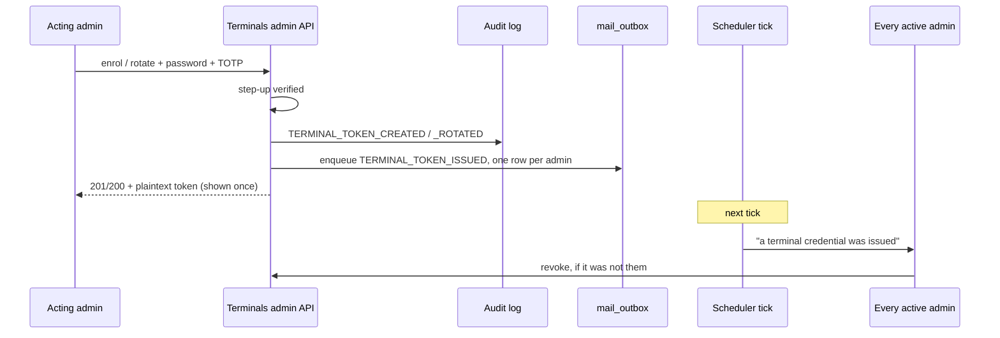

# ADR-0043: Terminal Credential Issuance Is Announced, Not Gated Further

**Status**: Accepted

**Date**: 2026-08-16

**Deciders**: Architecture Team

---

## Context

A terminal token is the highest-value credential this system hands out to a machine. It reads the full member roster on every sync ([ADR-0033](./0033-terminal-sync-contract.md)) and writes transactions attributed to a till. Exactly two endpoints mint one:

| Endpoint | Mints |
|---|---|
| `POST /api/admin/terminals` | the credential a newly enrolled device will use |
| `POST /api/admin/terminals/{id}/rotate-token` | a replacement, staged alongside the one in the field ([#395](https://github.com/dgloeckner/clubbar/issues/395)) |

Both are already the hardest-gated write paths in the admin API. Each requires a **step-up** — the caller's own password plus their own fresh TOTP code, verified by `StepUpAuthService` at the moment of the action — on top of an authenticated session; each carries the step-up rate limiter, so the credential behind the gate cannot be ground down; and each writes a first-class audit action (`TERMINAL_TOKEN_CREATED`, `TERMINAL_TOKEN_ROTATED`) separate from terminal CRUD, so a credential's history is readable without reconstructing it. Renaming, deactivating and revoking deliberately stay on plain session auth: revocation must never be the harder path.

### What is missing

**Nothing tells a human that a credential was minted.** The audit log records it, but the audit log is *pull* — somebody has to decide to go and look. Every other credential event this project considers worth knowing about already *pushes*: expiry warnings mail every active admin ([#438](https://github.com/dgloeckner/clubbar/issues/438)), a suspected clone mails them ([ADR-0041](./0041-terminal-credential-anomaly-detection.md) §4), an admin's login address moving mails the address it moved away from ([ADR-0015](./0015-authentication-and-authorization-strategy.md)). Issuance — the one event that *creates* a secret rather than reporting on one — is silent.

### The attack vector

An attacker holding one admin's session **and** password **and** a live TOTP code — phishing with a relayed second factor, or malware on the admin machine — clears the step-up and mints a token. From that point they hold a credential that syncs the member roster from anywhere on the internet, for `API_TOKEN_TTL_DAYS`.

ADR-0041's detectors do not see this. They compare a token's observed behaviour against the history that token has been building: two source addresses genuinely overlapping, or a sync cursor that does not continue. A **freshly minted** token has no history to contradict and, if the attacker enrols a new terminal rather than rotating an existing one, no second device to overlap with. Both detectors are structurally blind to it. ADR-0041 §6 said as much about device binding; this is the same gap seen from the issuance end.

So the mint path is well gated and entirely unobserved, and the question that prompted this ADR was whether to gate it harder — specifically, with the offline private key from [ADR-0036](./0036-iban-encryption-sealed-box.md).

## Decision

**Every terminal credential issuance — enrolment and rotation alike — is announced by email to every active admin, through the [ADR-0038](./0038-transactional-mail-outbox-on-shared-hosting.md) outbox. Nothing else about the mint path changes: no new gate, no new refusal, no terminal-side change.**

Alert, don't gate. This is ADR-0041's posture applied to the other end of the credential's life, and for the same reason: it is the only control available here that raises the cost to an attacker without raising it for the club. The step-up already in place is the right gate; what it lacks is a witness.

The witness has to be **out of band**. An attacker who holds a session, a password and a TOTP code can also delete nothing and hide nothing — but they cannot reach the other admins' inboxes. That is the whole security property this decision buys, and it is why the message goes to every active admin rather than only to the actor.

### Both mint paths, not only rotation

Rotation alone would leave the cheaper attack unannounced. Rotating an existing terminal's token is the *noisier* of the two: it stages a replacement that a till operator eventually has to type in, and the club notices. Enrolling a brand-new terminal that nobody is standing next to produces a working credential and no operational symptom at all. An attacker picks the second one. Announcing only renewal would announce only the attack nobody would choose.

### Mechanics

| Aspect | Decision |
|---|---|
| Kind | A new admin-addressed `MailKind::TERMINAL_TOKEN_ISSUED` |
| Enqueued by | `TerminalsService::createTerminal()` and `::rotateToken()`, via `NotificationsService::warnAdmins()`, in the same call that writes the audit entry |
| Recipients | Every active admin with an address — including the one who acted |
| Occasion | The issuance moment (the token's `issued_at` stamp), not a tier |
| Contents | Terminal name, device id, which of the two events it was, the new token's expiry, who acted, when |
| Never in the mail | The token itself, or any part of it |
| Failure | Best effort; enqueue failure never fails the issuance |

**The occasion is an event, not a tier.** Expiry warnings pass `30d` as the occasion because "this key is inside the 30-day window" stays true for thirty days, and `UNIQUE (kind, subject_id, dedup_key)` is the only thing standing between that and thirty emails. Issuance is not a condition that persists — it happens once, and two rotations of the same terminal are two separate things to be told about. This follows `ADMIN_EMAIL_CHANGED`, which passes the moment of the change for exactly that reason: it announces something already committed, where suppressing the second occurrence would suppress the one that mattered.

**The acting admin is a recipient too.** They know what they just did; the message is a receipt they can ignore. Its value is that it is the same message that arrives when somebody else mints a credential in their name, and an admin who has never seen one will not recognise the one that counts.

**No token material, ever.** The plaintext token is shown once in the API response and is never stored server-side (only its SHA-256 hash is). A mail carrying it would put the credential in every admin's mailbox and undo that property.

**It queues; it does not send.** ADR-0038 rule 3: the scheduler is the only sender. An install with no `mail.dsn` discards it at the transport and the issuance still succeeds. A mint that failed because mail was down would be an outage on the recovery path — the path an admin walks precisely when a till is already locked out.

### What a recipient does about it

Nothing automatic. Revocation is the existing action, on plain session auth, and stays the easier path: `revokeAccess()` clears the active *and* the pending hash, so a credential minted by somebody who should not have minted it dies in one click. This ADR adds the signal; the judgement stays with the human, as it does for every anomaly ADR-0041 raises.

## Consequences

**Positive:**

- The one credential event in the system that created a secret while telling nobody now tells everybody. The detection window shrinks from "until an admin thinks to read the audit log" to "until an admin reads their mail".
- The signal is out of band with respect to the credential that was compromised. Session, password and TOTP together do not reach another admin's inbox.
- It covers the case ADR-0041's detectors are structurally blind to — a credential with no history to contradict.
- No new failure mode on the till path, no terminal release, no protocol change. It reuses the outbox, the mail-kind enum, the builder pattern and the admin-recipient fan-out that #438 and ADR-0041 already built.
- Nothing about the mint path gets harder, so the recovery path — rotate a token for a bar that cannot sell — is exactly as fast as it was.

**Negative:**

- **It detects; it does not prevent.** An attacker who mints a token and pulls the roster within the hour has the data before anyone opens their mail. This shortens the window, it does not close it.
- **An admin whose mailbox is compromised alongside their session sees nothing.** The out-of-band property is carried entirely by the *other* admins — and a single-admin installation therefore gets no security benefit from this at all, only a receipt.
- **Legitimate rotation generates mail.** A club re-provisioning four terminals sends four messages to each admin, deliberately not deduplicated across terminals: each is a distinct credential, and collapsing them would collapse the attack into the maintenance.
- **It inherits the scheduler as a dependency**, the same one ADR-0041 took on. An installation whose cron is not running gets no announcement. That is already surfaced by the never-run banner (ADR-0038 rule 7), so this adds a dependent rather than a new risk — but a silent witness is worse than a known-absent one.
- Admin accounts without an email address are silently skipped, as they are for every other admin-addressed kind.

## Alternatives Considered

### 1. Gate issuance on the ADR-0036 offline private key

**Rejected.** The proposal was to require the club's archived sealed-box private key — the gate `KeyRotationService` and the SEPA export already carry — before a terminal token can be minted.

- **It would be a policy check, not a cryptographic necessity.** The private key protects IBANs because decryption is *impossible* without it; the property survives a total server compromise. Applied to issuance it protects nothing cryptographically: the backend still mints the token, and an attacker with code execution or DB write bypasses the check entirely by writing `api_token_hash` directly. The only path it covers is the compromised-admin path, which password-plus-fresh-TOTP already covers.
- **It would degrade the property it borrows.** Every use of that key is a window in which a compromised runtime can see it. Today those windows are rare and ceremonial. Token rotation across several terminals on a bounded TTL is routine and often urgent, and making it depend on the key pushes the club to keep the key somewhere convenient — the admin laptop, a password manager, a USB stick in the bar drawer. That trades a strong guarantee (IBANs unreadable from a stolen database *and* a stolen webspace) for a marginal one.
- **It would make recovery harder than compromise.** Rotation is the fix for a locked-out till, and ADR-0015 already lists unannounced token expiry as a known operational negative. Gating it behind a key custodian who may be unreachable means a bar that cannot sell until somebody drives over. ADR-0041 rejected enforcement on the same principle, and §"revocation must never be the harder path" is the same rule seen from the other side.

### 2. Bind the token to a device-held key (proof of possession, TOFU-pinned)

**Deferred, not rejected** — unchanged from [ADR-0041](./0041-terminal-credential-anomaly-detection.md) §6 and its final alternative. The terminal generates a keypair at provisioning, presents proof of possession per request, and the server pins the public key on first use, mirroring how [ADR-0035](./0035-terminal-backend-instance-pairing.md) pins `instance_id`.

It is the strongest control available, and it is honestly **not a control against this ADR's attack vector**: an attacker who can mint a token can also pin their own device key at first use, because trust-on-first-use trusts whoever arrives first. What it defeats is every path where the token *string* leaks without the device — a screenshot, a support ticket, a copied config, the clone case ADR-0041 can currently only detect after the fact. That is the larger real-world exposure and the right place to spend asymmetric-crypto complexity, but it needs a terminal release and a provisioning-flow change, and it does not remove the need for a witness on issuance.

### 3. Client certificates / mTLS for terminals

**Rejected**, as in [ADR-0016](./0016-transport-security.md), and the rejection is worth restating in this context rather than merely cited. Beyond the CA operations it would impose on shared hosting, it does not touch this attack vector: the certificate would be issued by the same admin action, behind the same session, that mints the token today. It changes what the credential *is*, not who can cause one to exist.

### 4. Four-eyes approval — a second admin confirms every issuance

**Rejected.** It genuinely defeats a single compromised admin, and it is unusable here. A large share of installations run with one active admin, for whom it makes enrolment impossible rather than harder; and in every installation it makes minting harder than revoking, which is the rule this project has held consistently. A club locked out of its own till on a Saturday evening because the second admin is unreachable is a worse outcome than the attack it prevents.

### 5. Expire a token that is never presented

**Rejected for now.** A minted credential that no device ever uses would age out in days rather than the full TTL, shrinking the value of a token minted by an attacker who never intends to run a till. It adds a third lifetime concept to a token lifecycle that already carries pending, active and expired states (#395), and it fires on an entirely normal operation: a token minted on Friday and typed in at the bar on Monday. Worth revisiting only if issuance alerts turn out to be ignored in practice.

### 6. Announce activation instead of issuance

**Rejected.** `TERMINAL_TOKEN_ACTIVATED` — a pending token promoted by the first sync that presents it — is a tempting trigger because it proves a device really took the credential. It is the wrong moment: the secret exists, and is usable, from the instant it is minted, and an attacker syncing from their own machine would *cause* the activation rather than be caught by it. Announcing both would double the volume to say the same thing twice.

### 7. Notify on the audit log generally, or send a digest

**Rejected.** A mail per audited action buries the one that matters; a periodic digest re-introduces the delay this decision exists to remove. `warnAdmins()` already encodes the same judgement in the small — it audits only when something was actually queued, precisely so the entry that matters is not buried by ones that do not.

### 8. Rate-limit or cap issuance beyond the existing limiter

**Rejected.** The step-up rate limiter already prevents grinding the credential behind the gate, and a cap on *successful* mints per period would hit the exact legitimate burst — re-provisioning several terminals after a hardware refresh — while an attacker needs only one.

## Related Decisions

- [ADR-0015](./0015-authentication-and-authorization-strategy.md): Authentication and Authorization Strategy — terminal bearer tokens, their bounded lifetime, and the step-up on self-service credential changes
- [ADR-0016](./0016-transport-security.md): Transport Security — the standing rejection of client-certificate authentication
- [ADR-0036](./0036-iban-encryption-sealed-box.md): IBAN Encryption at Rest — the offline private key this ADR declines to borrow
- [ADR-0038](./0038-transactional-mail-outbox-on-shared-hosting.md): Transactional Mail Outbox — the queue, the dedup constraint, and "the scheduler is the only sender"
- [ADR-0041](./0041-terminal-credential-anomaly-detection.md): Terminal Credential Anomaly Detection — alert-don't-enforce, the admin-addressed warning path, and the device-binding deferral
- [ADR-0013](./0013-audit-logging.md): Audit Logging — the pull-based record this decision complements rather than replaces

## References

- [OWASP Authentication Cheat Sheet](https://cheatsheetseries.owasp.org/cheatsheets/Authentication_Cheat_Sheet.html)
- [NIST SP 800-63B §5.1.4](https://pages.nist.gov/800-63-3/sp800-63b.html) — out-of-band notification of credential changes
