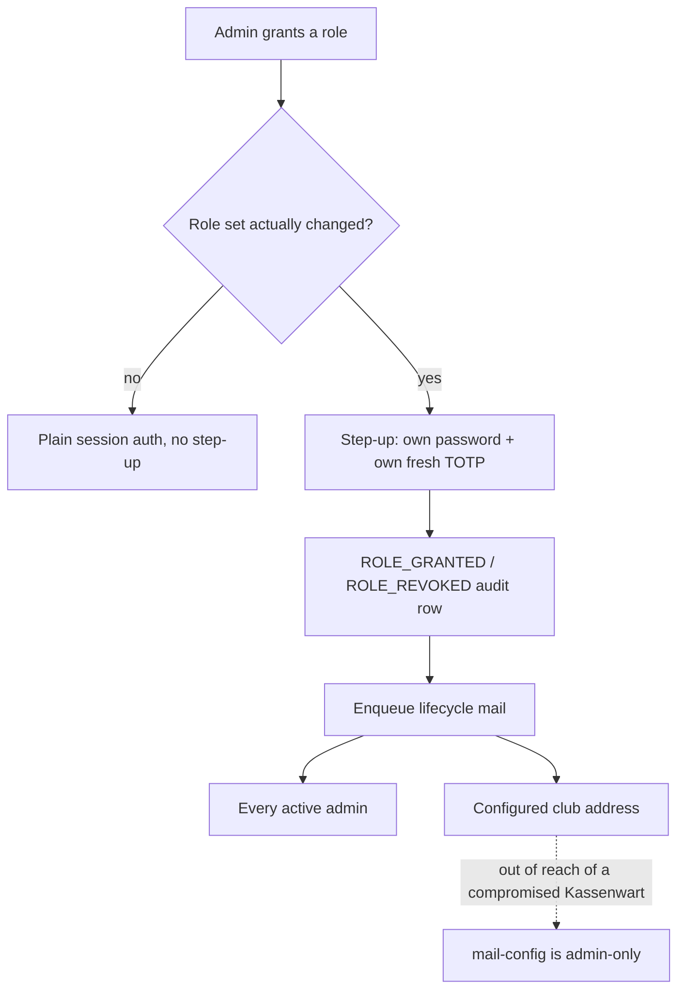

# ADR-0044: Tiered Admin Roles — `admin`, `Kassenwart`, `Getränkewart`

**Status**: Accepted

**Date**: 2026-08-17

**Deciders**: Architecture Team

---

## Context

[ADR-0015](./0015-authentication-and-authorization-strategy.md) states, in one sentence and without weighing alternatives: *"All admin users have full access: CRUD all entities, settlements, GDPR workflows, user management, audit log."* Access is controlled by two bits — `is_active` and `totp_enabled` — and nothing else. `backend/patterns/pattern-015-authorization-access-control.md` describes the resulting model as structural: route-group middleware separates terminal bearer auth from admin session auth, and within the admin group there is no differentiation at all. There is no `role` column, no permission enum, no policy layer; a repo-wide grep for `role|rbac|permission` in `backend/src` returns only file modes and HTML `role="presentation"`.

That flat model was never *rejected* in favour of something else. ADR-0015 rejected JWT, OAuth/OIDC, RFID-as-authentication and per-user terminal login, each with reasons. Flat admin access was asserted. This ADR fills that hole.

### What forced the question

[#498](https://github.com/dgloeckner/clubbar/issues/498) hardened admin user creation — step-up re-authentication ([#510](https://github.com/dgloeckner/clubbar/issues/510)), a pinned rate limiter ([#511](https://github.com/dgloeckner/clubbar/issues/511)), installer parity. [#507](https://github.com/dgloeckner/clubbar/issues/507) asked the owner question those fixes kept circling: with no lesser tier, every admin account is a skeleton key, and there is nothing to fall back to.

The concrete driver is not hypothetical. The club needs **two functions that are not the same job**:

| Function | Needs | Does not need |
|---|---|---|
| Technical administration | Terminal tokens, encryption keys, mail and cron configuration, account management | Member bank details |
| Kassenwart (treasurer) | Members, settlements, SEPA collection, storno, Vorabankündigung | Terminal tokens, encryption keys, account creation |

Route inventory revealed a third pile that is neither: **categories and products** — who decides that Radler now costs €2.20 and Alt is out of stock. It is the highest-frequency, lowest-sensitivity work in the panel and the most obviously delegable, and today it can only be handed over by granting unlimited access.

### The threat being bought down

**Insider curiosity**, explicitly — a person who legitimately needs part of the panel browsing the parts they do not: member bank details, mandate references, an individual's drinking history. Not external session compromise (step-up and rate limiting are the controls there, and a lesser tier does nothing about it: an attacker takes the account they compromised). Not insider accident (confirmation friction and reversibility are the controls there).

No external obligation forces this. The club's published documents do not promise function-limited access, so the system is not out of step with its own text. This is a risk-appetite decision.

## Decision

**Three hardcoded roles form a ladder with one root. `admin` is a strict superset holding exactly the capabilities it holds today. `kassenwart` and `getraenkewart` are lesser siblings beneath it. Roles compose additively; one person may hold both lesser roles without becoming `admin`. Enforcement is a declarative route→roles map consulted by middleware, and it fails closed.**

Nobody loses power on the day this ships. Some people gain a smaller amount of it.

### The roles

| Role | Is | Language |
|---|---|---|
| `admin` | Whoever holds the server. Every capability, including the sealed-box private key and account management | English — it is not a Vereinsamt |
| `kassenwart` | The elected treasurer: members, settlements, SEPA collection, storno, member notifications | German — the word the club and the Vorstand already use |
| `getraenkewart` | Whoever looks after the bar stock: the drinks list, prices, availability, product sales figures | German, same reason |

An account's role set is either `admin` alone, or any non-empty combination of the two lesser roles — `admin` is never held alongside `kassenwart` or `getraenkewart`. "Roles compose additively" above is about the two lesser roles combining with each other, not about reaching `admin` by addition: `admin` is the root of the ladder, not a further rung on top of the other two. No account can change its own role set either, `admin` included — a role change is always made by a *different* admin acting on the account (#548).

`admin` stays English deliberately. `Kassenwart` and `Getränkewart` are Vereinsämter that a Mitgliederversammlung elects; `admin` is not, and the language difference is a permanent, free reminder that it is a different kind of thing. It stops a future reader assuming there ought to be a Vorstand vote about who gets it.

This follows the precedent `CONTEXT.md` set for `Storno`, `Deckel` and `Vorabankündigung`: use the word the people who read it actually say. Role names are user-facing — they appear in the account form, the admin list, and audit rows the Vorstand may one day read.

### Grant table

Read-only surfaces are grouped with their module unless noted.

| Surface | `admin` | `kassenwart` | `getraenkewart` |
|---|:--:|:--:|:--:|
| `/security-check`, `PATCH /instance-config` | ✅ | — | — |
| `GET /scheduler` | ✅ | ✅ ᵇ | — |
| `/admin-users/*` — create, edit, delete, reactivate, reset-password | ✅ | — | — |
| `/audit-log` | ✅ | — | — |
| `/encryption-keys/*` | ✅ | — | — |
| `/terminals/*` — including token rotate and revoke | ✅ | — | — |
| `/mail-config/*`, cron-secret rotation | ✅ | — | — |
| `/dashboard`, `/statistics/monthly` | ✅ | ✅ | — |
| Members — read, create, edit, collection-hold clear | ✅ | ✅ | — |
| Members — **delete, anonymize, GDPR subject-access export** | ✅ | — | — |
| Transactions — list, export, per-member, **storno** | ✅ | ✅ | — |
| Settlements — all, **including SEPA XML export** | ✅ | ✅ | — |
| `GET /sepa-config` | ✅ | ✅ | — |
| `POST` / `PUT` / `PATCH /sepa-config` | ✅ | — | — |
| Notifications — list, retry | ✅ | ✅ | — |
| `/bank-lookup` | ✅ | ✅ | — |
| Categories, Products — including status and pricing | ✅ | — | ✅ |
| `/reports/terminal-activity` | ✅ | ✅ | ✅ |
| `/reports/{revenue\|consumption\|transactions}` | ✅ | ✅ | ✅ ᵃ |
| `/api/auth/*` — own profile, password, 2FA | ✅ | ✅ | ✅ |
| `/api/sync/*` — terminal bearer auth | *unaffected* | | |

ᵃ `group_by` restricted to an allow-list for `getraenkewart` — see §"Fail closed".

ᵇ The response is split rather than the route (#677): a `kassenwart` receives `verified` and the recommended interval, and the operator half — `setup.cli_command`, `drain_url`, the drain's PHP build and the interval pair — stays `admin`-only. See §"The scheduler status is granted to the office it blocks".

### Why the boundary falls where it does

**The Kassenwart does not get the whole member module.** `anonymize`, `delete` and the GDPR subject-access export are none of them settlement work — you never need to erase a member to run a collection, so gating them costs the office nothing. The first two are irreversible: an accidental erasure is not recoverable by a storno or a re-run, and irreversible-plus-rare is exactly where a second pair of eyes is cheap. The third is the single cleanest "download everything about one named person" action in the system; gating the browsing surface while leaving that button beside it would be theatre.

**The scheduler status is granted to the office it blocks.** `GET /scheduler` reports whether a scheduled run of the mail drain has ever been observed — and until one has, finalizing a direct debit is *refused*. Every settlement route is the Kassenwart's, so the Kassenwart is precisely who meets that refusal, and from the day roles shipped the banner meant to warn them ahead of it was the one request their session could not make (#677). A warning that reaches only the office it does not concern is not a warning.

The grant widened; the payload did not. What a Kassenwart reads is the `verified` flag and the interval the setup instructions recommend — enough to say *a scheduled task is missing and collections are blocked until somebody adds it*. What stays behind `admin` is everything describing the deployment: `setup.cli_command` names this installation's document root, `drain_url` names its trigger endpoint, and `php_version`, `missing_extensions` and the declared/observed interval pair are the self-check's reading of the host. That is the same detail ADR-0031 keeps behind the operator's session, and none of it is actionable by an office with no hosting panel — so the banner they see names the remedy they *do* have: ask whoever holds the server.

This is the only row where the grant is wider than the body, and it is a route-level grant plus a **payload allow-list**, following the rule §"Fail closed" states for `group_by`: a field added to that response next year is `admin`-only until a human writes it into the office view.

**And the Getränkewart is left out of that grant deliberately.** Nothing they can do is blocked by the scheduler gate, so the banner would warn them of a refusal they will never meet — and the panel does not fetch on their behalf, which is what keeps a request that could only answer 403 off every page they open.

**The Kassenwart reads SEPA configuration but does not write it.** They need to verify the Gläubiger-Identifikationsnummer on screen against what the bank holds before submitting a batch. Writing it is a once-in-years act whose blast radius is a rejected collection run and a Vorabankündigung the club already sent that no longer matches what happened — the same class as encryption keys and terminal tokens.

**The Getränkewart sees product sales but not the club's financial position.** `GET /dashboard` and `GET /statistics/monthly` are not aggregates: `recent_transactions` carries `member_id` and full `member_name`, `members_near_limit` lists five named members with their individual Deckel, and `top_members[]` ranks named members by personal spend. `GET /reports/terminal-activity` is genuinely clean. The rule is not "is it aggregated" but **what does the office need** — total outstanding Deckel tells nobody whether to stock Alt.

**No deny rules.** Grants are additive only. Deny would make the effective permission set non-obvious the moment somebody holds two roles, which is routine by design. A future role needing "everything except X" is a signal that X belongs behind its own grant.

### Fail closed, everywhere

Two places this model can silently regress, and one rule for both.

**Routes.** Enforcement is a declarative route→roles map consulted by middleware — extending `AdminSessionAuth`, which already does path-based allow-listing for `totp_setup_required`. **A route with no entry is `admin`-only.** When somebody adds an admin route six months from now and does not touch the map, it works for `admin` and returns 403 for everyone else until a human deliberately grants it. The failure mode becomes "a Kassenwart cannot reach the new page" — visible, reported, fixed in a minute — instead of a Getränkewart quietly seeing member data for six months.

This also makes the whole model testable as a single fact: enumerate every route registered in `routes.php`, assert each appears in the map, fail the build otherwise. That test cannot be written against per-controller checks.

**Parameters.** `GET /reports/{reportType}` accepts `group_by`, and `group_by=member` turns every row's `dimension` into a member's full name with their spend and transaction count. Same endpoint, same response shape — the privilege boundary sits on a query parameter. It is expressed as an **allow-list** (`category`, `product`, `day`, `week`, `month`, `year`), never as a deny-list naming `member`.

The two behave identically today and diverge the first time somebody adds a `group_by` value. Under a deny-list the new dimension is visible from the moment it merges and nobody is reminded; under an allow-list it is invisible until somebody adds it, in a diff a reviewer sees.

**Payloads.** `GET /scheduler` is the same shape one rung further in (#677): the route is granted to the Kassenwart, and the *fields* of the response are the boundary. Same rule — the office view is an allow-list naming `verified` and the recommended interval, not the full response with the operator fields removed. A deny-list there would hand a club office whatever field somebody adds to that DTO next year, on the day it merges.

**The general rule: wherever a role boundary lands on a parameter or on a field rather than on a route, it is an allow-list.**

### Granting a role is minting authority

`POST /api/admin/admin-users` carries step-up; `PATCH /api/admin/admin-users/{id}` does not. The moment role becomes a field on that row, creating an admin costs a password and a fresh TOTP code while **promoting an existing Getränkewart to `admin` costs nothing but a live session** — and it is the quieter path, since lifecycle mail fires on creation.

So role changes carry step-up, on the same rule the codebase already states: *any endpoint that mints or consumes a credential carries step-up*.

| Aspect | Decision |
|---|---|
| Gate | Step-up when the role set **actually changes** — mirroring `PATCH /profile`, which gates on the email actually moving rather than on every save |
| Audit | Dedicated `ROLE_GRANTED` / `ROLE_REVOKED` actions, not folded into a generic admin-user update |
| Announcement | The out-of-band lifecycle mail fires on grant and revoke as well as on account creation |
| Who may | `admin` only. A Kassenwart cannot create an account or grant a role, including to a peer |

Dedicated audit actions matter because folding the most security-relevant event in this feature into a generic update row makes it unfilterable in the log — the one place it needs to be findable.

### The alarm survives a single admin

[ADR-0043](./0043-terminal-credential-issuance-is-announced.md) sends credential-issuance mail to every active admin, and notes honestly that a single-admin installation gets no security benefit from it, only a receipt. Admin lifecycle mail has the same problem in sharper form: with exactly one admin, a message about account creation goes from the actor, to the actor, about a thing they just did — and it is silent in precisely the case that matters.

**Admin lifecycle mail therefore goes to a configured club-level address** — a Vorstand list, the Kassenwart's inbox — in addition to every active admin account. That address is the only version that still fires when there is one admin and they are the problem.

This is load-bearing on the grant table: `mail-config` is `admin`-only, which means a Kassenwart cannot redirect the alert channel to themselves. Every other detection in this design depends on that.

### Frontend

| Aspect | Decision |
|---|---|
| Navigation | Sections the role cannot reach are **hidden**, not disabled |
| Landing page | Per role — `getraenkewart` → Products, `kassenwart` → Dashboard, `admin` → Dashboard |
| Refusal | A distinct error code (`insufficient_role`) and a named screen: "this section is not available for your role" |

Hiding wins because the purpose of the role is a *smaller tool*, not the same tool with most of it crossed out. A panel that is seventy percent greyed is worse to use and quietly advertises the shape of everything the person is not trusted with.

Per-role landing is the difference between "the tool opens on my work" and "the tool opens on an error and I assume it is broken" — `getraenkewart` has no dashboard, so without this their first experience is a 403.

The refusal screen is required regardless of the nav, because **hidden navigation is not enforcement**. A bookmarked URL, a stale tab, or a role changed mid-session all produce a legitimate 403 for a legitimate user.

### Migration

**Every existing `admin_users` row becomes `admin`. The installer's first-admin bootstrap creates an `admin`.**

Behaviour-preserving: nobody logs in the next morning to find something missing, no seed data changes, and the installer path — which [#498](https://github.com/dgloeckner/clubbar/issues/498) already has three open issues about — gains no fourth. Demotion is a deliberate, audited, per-person act performed afterwards by a human who has looked at the person.

A migration that inferred roles from activity — "whoever last ran a settlement becomes `kassenwart`" — is rejected. It removes access based on a guess, and the first symptom of a wrong guess is a Kassenwart unable to do their job mid-settlement-run with no visible explanation. **A migration must never remove access.**

## Consequences

**Positive:**

- **The Getränkewart holds no sealed-box private key and therefore cannot decrypt any IBAN.** That is cryptographic exclusion, not UI gating — it survives a bug in the route map.
- A malicious or compromised Kassenwart cannot **acquire capability or persist**: no accounts, no terminal tokens (and so no back door into the sync API, which reads the full roster outside the panel entirely), no encryption keys of their own, no redirected alert address, and no sight of the audit log to check whether they are being watched or what evidence exists.
- The panel becomes delegable. Product maintenance — the most frequent and least sensitive work in it — can be handed to somebody without also handing them every member's bank details.
- Audit rows gain meaning. Today the log is the *only* thing distinguishing one admin from another; now the role is part of the record.
- Default-deny makes the model testable as one build-time assertion over the route table.
- Nothing existing gets harder. `admin` is unchanged, the migration is a no-op behaviourally, and the terminal API is untouched.

**Negative:**

- **This does not confine IBAN confidentiality against the Kassenwart**, who holds a key copy because SEPA collection requires one. That is the office, not a gap — but it means the role boundary around member banking data is enforced by *which office you hold*, not by cryptography, for that role.
- **Role changes are now a privilege-escalation surface** that did not exist before. Mitigated by step-up, dedicated audit actions and lifecycle mail, but the surface is new and this ADR created it.
- **A permission dimension now exists on every endpoint, every test and every page.** Every new admin route needs a map entry and a decision; every list page needs a role-aware nav entry. That tax is permanent.
- **The Kassenwart cannot complete a member erasure alone.** Somebody leaves the club and asks to be forgotten: the Kassenwart runs the final settlement, then an `admin` presses the button. A handful of times a year, and a real dependency on a second person being available.
- **The `group_by` allow-list is the one place this can regress silently**, and it regresses by omission rather than by commission — a reviewer has to notice that a new dimension was *not* added, which is the harder thing to notice.
- **A Getränkewart cannot see terminal state** (`GET /terminals` is `admin`-only). They will learn the bar terminal is down from a person, or infer it from `/reports/terminal-activity` going quiet.
- **Key rotation on office handover is remembered, not enforced.** An outgoing Kassenwart keeps their private key file; the system does not prompt. Accepted because the sealed box exists to protect against database theft by an outside attacker, not against people who legitimately held the key.

### Relationship to ADR-0015

This decision supersedes ADR-0015's single sentence *"All admin users have full access"*. Everything else in ADR-0015 stands unchanged: session auth for the panel, bearer tokens for terminals, mandatory TOTP, bcrypt cost ≥12, the step-up rules for self-service credential changes, and the rejections of JWT, OAuth/OIDC, RFID-as-authentication and per-user terminal login.

ADR-0015 has not been edited. Per `CLAUDE.md`, ADRs are not modified without explicit owner confirmation; an amendment note pointing here is the appropriate follow-up.

`backend/patterns/pattern-015-authorization-access-control.md` needs updating in the same pass. Its `AuthorizeResourceOwner` sketch — documented as "would be used if the system introduces RBAC" — is the seam this decision fills, though the shape differs: a route→roles map rather than ownership checks, because nothing here is owned by an admin.

## Alternatives Considered

### 1. Keep the flat model; close the blast radius with step-up and rate limiting alone

**Rejected**, though it is what [#498](https://github.com/dgloeckner/clubbar/issues/498) already does and it is the right answer for external compromise. It does nothing for the threat actually named: a Kassenwart who needs the settlements page has the members page too, and step-up does not care. Re-authentication proves *who* is acting, never *whether they should*.

### 2. Permissions as data — a table of grants assembled into roles in the UI

**Rejected.** The club has a handful of admins and three real functions. It buys flexibility that would never be used and costs a permission-editing UI, a seed migration, and the ability for an admin to construct a role nobody reviewed. Hardcoded roles are greppable, diffable in review, and *are* the ubiquitous language — `Kassenwart` is already a term in `CONTEXT.md`.

### 3. A read-only admin tier

**Rejected** — it was the shape [#507](https://github.com/dgloeckner/clubbar/issues/507) proposed, and the real functions do not divide by power level. A Kassenwart must write: settlements, stornos, collection holds. A Getränkewart must write: prices, availability. Neither is served by read-only, and a read-only tier that could still see every member's IBAN would miss the point entirely. The division is by **office**, not by verb.

### 4. One role per user

**Rejected.** In a volunteer organisation people go on holiday and cover for each other. Single-role-per-user looks tidier and reliably degrades into shared credentials, which is strictly worse than no roles at all.

### 5. A separate `owner` role that alone manages accounts

**Rejected as self-deception.** RBAC does not contain the role that manages roles: whoever can grant `kassenwart` can grant it to themselves. Adding an `owner` tier relocates that property one level up without removing it. The honest version is to accept that `admin` is the root and make escalation **loud** — audit plus out-of-band mail — rather than pretend it is impossible.

### 6. Four-eyes approval on account creation and role grants

**Rejected**, on the same grounds [ADR-0043](./0043-terminal-credential-issuance-is-announced.md) §4 rejected it for terminal credentials. It genuinely defeats a single compromised admin and it needs a pending-approval state machine, invitation expiry, and a deadlock story for a club down to one admin. Real cost against a threat ranked as *curiosity*, not malice. Detection is the proportionate control: somebody who must mint an account that emails the Vorstand list is no longer idly browsing.

### 7. Field-level redaction — the same member record rendered without banking data

**Rejected as the primary mechanism**, and largely unnecessary. It fails open by default: a field added later is visible unless somebody remembers to hide it, and the test asserts absence rather than presence. It is also mostly already solved — IBANs are masked by default and `IBAN_FULL_VIEW` is a discrete audited act, so the field that matters most is handled without a redaction layer. Where a boundary genuinely cannot be drawn at the route (the `group_by` parameter), it is drawn as an allow-list instead.

### 8. Per-holder keypairs so each key-holder's decryptions are individually attributable and revocable

**Rejected as out of scope**, having first been mistaken for the fix to a hole that does not exist. The sealed box ([ADR-0036](./0036-iban-encryption-sealed-box.md)) protects against theft of the database by an outside attacker; it was never a control against people who legitimately held the key. A Kassenwart reading IBANs is the office doing its job, not a leak to be closed. Multi-recipient encryption would make office handover cheaper — revoke a key rather than re-seal every IBAN — and that is a far larger piece of work that should not be smuggled in under a roles change.

### 9. Hard-gate Kassenwart offboarding on a completed key rotation

**Rejected.** It makes the urgent act — removing a departing person's panel access today — wait on the slow one, re-sealing every member IBAN. The club wants the outgoing Kassenwart locked out in thirty seconds and the key rotated that week.

### 10. Per-controller authorization checks

**Rejected.** It scatters the model across sixty call sites and fails open by omission: a controller with no check is simply open, and nothing surfaces that. It also cannot be verified by a single test over the route table, which is the property that keeps this design true a year from now.

## Related Decisions

- [ADR-0015](./0015-authentication-and-authorization-strategy.md): Authentication and Authorization Strategy — the flat-access sentence this supersedes, and everything else it keeps
- [ADR-0036](./0036-iban-encryption-sealed-box.md): IBAN Encryption at Rest — the private key whose possession, not whose role, bounds IBAN access
- [ADR-0043](./0043-terminal-credential-issuance-is-announced.md): Terminal Credential Issuance Is Announced — alert-don't-gate, and the single-admin problem this ADR answers with a club-level address
- [ADR-0013](./0013-audit-logging.md): Audit Logging — where `ROLE_GRANTED` / `ROLE_REVOKED` live
- [ADR-0038](./0038-transactional-mail-outbox-on-shared-hosting.md): Transactional Mail Outbox — the channel the lifecycle mail queues on
- [ADR-0029](./0029-two-tier-retention-and-erasure.md): Two-Tier Retention and Erasure — the anonymization this ADR keeps `admin`-only
- `backend/patterns/pattern-015-authorization-access-control.md` — the pattern that must be rewritten alongside this

## References

- [#507](https://github.com/dgloeckner/clubbar/issues/507) — the owner question this ADR answers
- [#498](https://github.com/dgloeckner/clubbar/issues/498) — the admin-creation hardening epic that raised it
- [OWASP Authorization Cheat Sheet](https://cheatsheetseries.owasp.org/cheatsheets/Authorization_Cheat_Sheet.html) — deny by default, enforce authorization on every request
