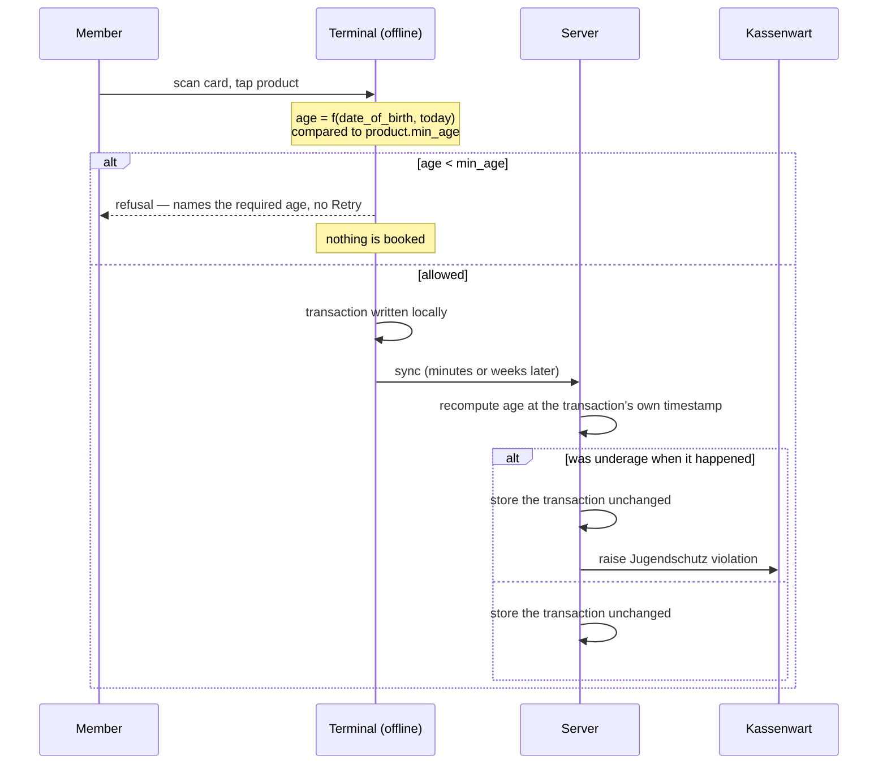

# ADR-0045: Age-Restricted Products — the Terminal Refuses, the Server Records

**Status**: Accepted

**Date**: 2026-08-20

**Deciders**: Architecture Team

---

## Context

The club runs a bar and the bar serves alcohol. **JuSchG § 9 Abs. 1** is a hard external
constraint on that: beer, wine and sparkling wine may not be handed to anyone under 16, and
spirits — anything containing distilled alcohol — not to anyone under 18.

Nothing in this system knows any of it. A member's card opens the product grid and every tile on
it is bookable. There is no date of birth on `members` and no age attribute on `products`; a
repo-wide grep for `birth`, `dob`, `min_age` and `age_restricted` returns only `RESTRICT` foreign
keys, an HSTS `max-age` and the `beer-alcohol-free` icon name.

The gap was recorded before it was worked on. `research/175-onboarding-form-datenschutz.md:348`:

> "For a bar serving alcohol this is not a formality — JuSchG limits are a separate constraint on
> the product, and a minor's onboarding must not produce an alcohol-purchasing card."

Two properties of the system shape every option available here:

1. **The terminal is offline-first** ([ADR-0033](./0033-terminal-sync-contract.md)).
   It decides from a local cache that may be hours or weeks old, and the server is not consulted
   at checkout. Whatever enforces the limit has to work with the terminal unplugged.
2. **Transactions are immutable and append-only**
   ([ADR-0004](./0004-immutable-transaction-storage.md)). A row that reaches the server is a
   record of something that already physically happened at the bar.

## Decision

**A member carries a raw date of birth. A product may carry a minimum legal age. The terminal
computes the member's age locally at checkout and refuses the combination offline. The server
never rejects such a sale — it records it and raises a Jugendschutz violation for a human.**

Four decisions, each with the consequence it buys:

| # | Decision | Consequence |
|---|---|---|
| 1 | Terminal sync carries the **raw birth date**; the terminal computes age locally | Correct on any day, arbitrarily long offline — at the cost of a real birth date living on each kiosk |
| 2 | Date of birth is **mandatory** for members | No fail-open branch, no "unknown age" path, no settings surface |
| 3 | Terminal **blocks** preventively; server **records and flags**, never rejects | Applies [ADR-0020](./0020-sepa-mandate-requirement-terminal-access.md)'s two-layer split rather than departing from it |
| 4 | The product field is a **free nullable integer** `min_age`, 1–99; NULL = unrestricted | Not a German-law enum — this is self-hosted open source, not only German clubs |

### 1. Why the limit sits on the product, not the category

A category is a display grouping. The Getränkewart rearranges categories to make the grid easier
to use during a busy shift, and nothing about that action is legal in character. If the limit
lived on the category, dragging a tile from "Bier" to "Angebote" would silently un-restrict it,
and the club would find out at an Ordnungsamt visit rather than in a code review.

The limit is a property of the *liquid*: the same Radler is 16+ whichever grid cell it is shown
in. Putting it on the product means the only way to remove a restriction is to deliberately clear
a number on that product, which is an act with a name and an audit row.

The field is a free integer rather than a `{16, 18}` enum. JuSchG's two thresholds are German
law; this software is self-hosted by whoever installs it, and an Austrian, Swiss or Dutch club has
its own numbers. `TINYINT UNSIGNED NULL`, validated 1–99, expresses "a minimum age" without
encoding one jurisdiction's answer.

### 2. Why the raw birth date is synced

Age is not a stable attribute. It changes on a date the server cannot predict a sync for, which
rules out every derived alternative:

- A precomputed `age_years` is **wrong from the member's next birthday** until the next sync. A
  terminal offline over a long weekend would refuse a member who turned 18 on the Saturday.
- A boolean `may_buy_alcohol` is worse: it bakes in one threshold and cannot answer a product
  with a different one.

Only the raw date is correct on every future day without contact with the server, which is
exactly the property the offline-first terminal of [ADR-0033](./0033-terminal-sync-contract.md)
demands.

**This puts personal data on the kiosk, and this ADR owns that.** `docs/erm-frontend.md` lists a
"Data NOT cached (privacy/data minimization)" set for `members_cache`; a date of birth now joins
the cached side, and that list is amended rather than quietly contradicted. What compensates:

1. The kiosk sits on club premises, in a room the club controls, not on a member's device.
2. The cache still holds no contact data, no banking data, no address — the birth date is joined
   only by name and card UID.
3. The birth date is **never displayed**. Rule 6 below makes the refusal name the *required* age,
   never the member's, because the terminal screen is read by whoever is standing at the bar
   (`research/art9-rfid-display-retention.md`).
4. Erasure propagates through the same delta sync that delivered it: an anonymised member's row
   arrives with the date nulled, on the ordinary cursor, with no new mechanism.

### 3. Why the server records and flags rather than rejects

An earlier draft had the server reject an underage transaction at sync.
[ADR-0020](./0020-sepa-mandate-requirement-terminal-access.md) shows that exact behaviour was
already built and then deliberately removed ([#162](https://github.com/dgloeckner/ruderbar/issues/162)):

> "The server must therefore store and flag such transactions, never reject them. Rejecting at
> sync destroys the record of a sale that actually happened — revenue lost silently,
> unrecoverable, because the beer is gone either way."

The argument transfers to Jugendschutz with more force, not less:

1. **The drink is gone.** The terminal decided from its last sync; by the time the row reaches
   the server the glass is empty. Rejecting it does not un-serve the minor. It only deletes the
   club's knowledge that it happened.
2. **§ 146 Abs. 1 AO requires Einzelaufzeichnung**, with no exemption this club can claim
   (`docs/legal-requirements-and-how-we-meet-them.md` §1.3). Dropping the row trades a youth
   protection incident for a bookkeeping violation, and keeps the first one anyway.
3. **A silent rejection is the worst of the three outcomes.** The terminal believes the sale
   succeeded, the member was served, and nobody is told. Youth protection needs a human to *find
   out* — which is the opposite of dropping the row.

So the transaction is stored unchanged and a **Jugendschutz violation** is raised for an admin to
acknowledge. The club learns it happened and can act on the actual cause: a stale terminal, a
wrong birth date, or a member who needs a conversation.

The two layers are not redundant. The terminal is **prevention** and it is the only layer that
can prevent anything, because it is the only one present when the drink is poured. The server is
**detection**, and it exists precisely for the case where prevention failed — a terminal that had
not synced since before the product was restricted, or since the member's birth date was
corrected.

### 4. Why mandatory, and how that coexists with erasure

Decision 2 says every member has a date of birth. GDPR erasure says it must be deletable —
`MembersRepository::anonymize()` nulls every column that says something about the human being,
and `docs/legal-requirements-and-how-we-meet-them.md:58` already lists date of birth among the
erased fields (OLG Dresden 4 U 1278/21).

These do not conflict, because they are enforced in different places. The column is `DATE NULL`;
the create rules say `required`. This is not a new pattern — `first_name` and `last_name` are
`VARCHAR(100) NULL` in `001_initial_schema.sql` and get `required` appended in `store()` today,
for the same reason.

The result is that **a NULL birth date means exactly one thing: an anonymised member** — who is
`is_active = 0` and cannot book at all. There is no third state to write a fail-open branch for,
which is why rule 3 below can say "never allow" without qualification.

No backfill is specified because the product is not live. An installation with existing members
would need one; this one does not.

## Consequences

### ✅ Positive

- The bar's central legal constraint is enforced where the drink is actually handed over, with no
  network dependency.
- The check is correct on the member's birthday and every day after it, offline, indefinitely.
- A sale that slipped through is *known*, with a named cause, instead of being absorbed into the
  Deckel.
- The Getränkewart — who sets the number — gains no member data whatsoever (rule 5).
- Other jurisdictions are expressible without a code change.

### ❌ Negative

1. **A real date of birth now lives on every kiosk.** `docs/erm-frontend.md`'s minimisation list
   shrinks and this is a genuine loss, not a technicality.
2. **A violation channel is only as good as the person watching it.** An unacknowledged violation
   is indistinguishable from a club with no minors.
3. **A mandatory field that erasure must still clear** is a shape that invites a future
   `NOT NULL` "cleanup" to break GDPR compliance.
4. **The system trusts the birth date on file.** It checks no Personalausweis and cannot.
5. **The terminal's refusal is only as fresh as its last sync**, which is what decision 3 exists
   to catch — after the fact.

### Mitigations

1. Never displayed (rule 6); joined by no contact or banking data; erased through the same delta
   sync; the kiosk is on club premises.
2. The violation is raised on the existing terminal-anomaly channel rather than a new surface
   nobody has a habit of opening, and — unlike ADR-0020's derived `ineligible_members` bucket —
   it **never clears itself** (rule 4).
3. The `DATE NULL` + `required` split is stated in the migration comment, in the repository
   docblock, and asserted by a test that anonymisation nulls the column.
4. Named as a non-goal, in this ADR and in the epic. Identity verification is a bar-staff
   procedure, not a software feature.
5. The gap is exactly the detection layer's remit, and the violation names the terminal.

## Alternatives Considered

| Alternative | Why not |
|---|---|
| **Derived threshold dates per member** (`{"16": "2028-03-04", "18": "2030-03-04"}` synced instead of the DOB) | Offline-correct and genuinely more minimal. Rejected as over-engineered for the actual privacy delta: the terminal would still hold a value from which the birth date is trivially recovered, at the cost of a bespoke sync payload, a set of thresholds the server must guess in advance, and a migration whenever a club invents a new one |
| **Precomputed `age_years` on the sync payload** | Wrong between birthdays. The failure is silent and lands on the member most likely to complain about it |
| **A boolean `may_buy_alcohol`** | Bakes one threshold into the wire format; cannot express 16 and 18 at once, let alone another country's number |
| **Category-level limits** | Categories are presentation and get rearranged during a shift. A legal limit must not move when a tile is dragged |
| **Server-side rejection of underage transactions** | Destroys the record of a sale that really happened, conflicts with § 146 AO, and was already built and removed once in [#162](https://github.com/dgloeckner/ruderbar/issues/162) |
| **Automatic storno on a detected violation** | The club eats the cost of a drink it already served, and a storno is an admin's decision about a booking, not a legal finding. It would also make the violation *look* resolved |
| **Blocking terminal access outright for minors** | Disproportionate and wrong: an underage member may buy an Apfelschorle. The limit is on the product, not on membership |
| **A per-terminal or per-time-of-day rule** | JuSchG § 9 does not vary that way, and every added dimension is another thing that can be misconfigured into permitting a sale |

## Rules

These hold across every implementation milestone and are the assertions the tests are written
against:

1. **The cart service is the authority.** Greyed-out tiles are a courtesy. Every refusal path must
   hold with the UI bypassed.
2. **Age is computed at the moment that matters** — the terminal at checkout, the server at the
   transaction's own timestamp. Never at sync time, never cached as a number.
3. **A NULL birth date means an anonymised member**, never "unknown, allow anyway".
4. **A recorded violation never clears itself.** Unlike a derived SEPA flag, a past sale to a
   minor stays true regardless of what changes afterwards.
5. **The Getränkewart gains no member data.** They set a number on a product; they still see no
   name, no Deckel, no birth date.
6. **Never state a member's age or birth date on the terminal screen.** The refusal names the
   required age, not the member's.

## Non-Goals

The club-website onboarding form and its Art. 13 notice (separate repository —
[#591](https://github.com/dgloeckner/clubbar/issues/591)) · identity verification of any kind ·
per-category or per-terminal age rules · time-of-day serving restrictions · a "guardian present"
override (JuSchG § 9 Abs. 2 is real law, deliberately not modelled — an override is a person's
judgement, and a system that records one invites it to be clicked) · backfilling birth dates ·
blocking terminal *access* on age.

## Related Decisions

- [ADR-0002](./0002-product-internationalization.md) — product schema and the sync contract the
  `min_age` field rides
- [ADR-0004](./0004-immutable-transaction-storage.md) — why a recorded sale is not deleted
- [ADR-0020](./0020-sepa-mandate-requirement-terminal-access.md) — the two-layer prevent/record
  rule this applies, and the #162 amendment that removed rejection
- [ADR-0028](./0028-legal-constraints-on-money-handling.md),
  [ADR-0029](./0029-two-tier-retention-and-erasure.md) — date of birth as erasable operational data
  (OLG Dresden 4 U 1278/21), and the § 146 AO Einzelaufzeichnung duty decision 3 leans on
- [ADR-0033](./0033-terminal-sync-contract.md) — the offline-first delta sync that carries both
  new fields
- [ADR-0044](./0044-tiered-admin-roles.md) — the role split rule 5 depends on

## References

- **JuSchG § 9** — Alkoholabgabe an Kinder und Jugendliche
  (<https://www.gesetze-im-internet.de/juschg/__9.html>)
- **§ 146 Abs. 1 AO** — Einzelaufzeichnungspflicht; `docs/legal-requirements-and-how-we-meet-them.md` §1.3
- `research/juschg-age-limits.md` — the statutory basis in detail
- `research/175-onboarding-form-datenschutz.md` — where the gap was first recorded
- Epic [#582](https://github.com/dgloeckner/clubbar/issues/582);
  plan `plans/2026-08-20-jugendschutz-age-restrictions.md`
