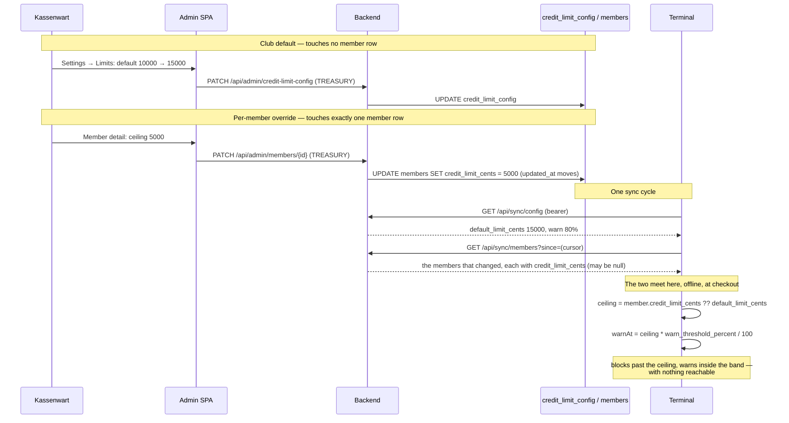

# ADR-0047: Configurable Credit Limits — a Club Default, a Per-Member Override

**Status**: Accepted

**Date**: 2026-08-23

**Deciders**: Architecture Team

---

## Context

The credit limit is enforced. [#24](https://github.com/dgloeckner/clubbar/issues/24) made it
real: the terminal blocks a checkout that would push a member's Deckel *past* the ceiling, warns
from the band below it, and does both offline, in front of the member, without asking anyone
([#51](https://github.com/dgloeckner/clubbar/issues/51) decided that split).

The **number** is not configurable. It is a hardcoded constant, duplicated in two languages:

| Where | What |
|---|---|
| `terminal-frontend/lib/config/app_config.dart` | `balanceLimitCents = 10000`, `balanceWarnThresholdPercent = 80` |
| `backend/src/Modules/Dashboard/Domain/CreditLimit.php` | `LIMIT_CENTS = 10_000`, `WARN_THRESHOLD_PERCENT = 80` |

The backend copy's own docblock states the problem it could not solve at the time:

> "Until the limit is configurable per instance there is nowhere for a single copy to live: the
> terminal has to work with no backend reachable, so it cannot read the value from here."

So a club that wants a different ceiling needs a rebuilt terminal binary **and** a backend deploy,
released together — because the dashboard's near-limit panel
([#385](https://github.com/dgloeckner/clubbar/issues/385)) and the Deckelauszug
([ADR-0039](./0039-periodic-deckel-statement.md)) both *name* the figure the terminal enforces. If
the two copies drift, the club tells members about a line nobody is holding.

This was specified from the beginning and never built. `UC-T12` E2 says the maximum balance is
"configured in backend (synced to terminal)", and `research/credit-limit-precedents.md` §2 records
what actually exists: no limit field on any API, no config transport for a global one, and "no
per-member limit exists anywhere". That last conclusion is what this ADR supersedes.

Two properties of the system constrain every option:

1. **The terminal decides offline** ([ADR-0033](./0033-terminal-sync-contract.md),
   [ADR-0023](./0023-terminal-balance-state-management.md)). Whatever the limit is, the terminal
   must be able to apply it with nothing reachable.
2. **Member sync is a delta on `updated_at`** ([ADR-0033](./0033-terminal-sync-contract.md)). A
   terminal asks for the members that changed since its cursor, and gets nothing else.

## Decision

**The club sets a default ceiling and a warning band. A member may be given a ceiling of their
own. Every consumer — the terminal's block, the terminal's warning banner, the dashboard panel,
the Deckelauszug — resolves the same value through one rule: the member's own ceiling if they have
one, otherwise the club's.**

| Setting | Where it lives | Who may set it |
|---|---|---|
| Club default ceiling | `credit_limit_config` singleton, on the `instance_config` shape ([ADR-0034](./0034-instance-branding-configuration.md)) | `admin`, `kassenwart` |
| Warning band % | Same row — club-wide, **not** overridable per member | `admin`, `kassenwart` |
| Per-member ceiling | `members.credit_limit_cents`, nullable | `admin`, `kassenwart` |

Six decisions, each with the consequence it buys:

| # | Decision | Consequence |
|---|---|---|
| 1 | The club default and the per-member override travel on **separate transports** | A changed club setting reaches every terminal on its next poll, without touching a single member row |
| 2 | The **terminal resolves**, the backend does not pre-resolve | One coalesce is duplicated in Dart; in exchange the terminal is correct offline for as long as it has to be |
| 3 | `NULL` means inherit; **`0` means unlimited** | A member never singled out moves with the club default; a member deliberately uncapped stays uncapped when the default changes |
| 4 | The warning band is **club-wide**, never per member | One knob per member, not two, across the DB, both API specs, both frontends and the sync payload |
| 5 | Both verbs on `/admin/credit-limit-config` are **TREASURY** | The Kassenwart owns what members may run up on their Deckel, without an `admin` in the room |
| 6 | The backend still **records and never enforces** | Unchanged from [ADR-0020](./0020-sepa-mandate-requirement-terminal-access.md): a synced sale is a historical fact |

### 1. Why the club default and the override travel separately

The club default rides a **new `GET /api/sync/config`**. The per-member override rides the
existing `Member` schema on `GET /api/sync/members`. The terminal keeps both and coalesces.

The obvious alternative is for the backend to do the coalescing and send one ready-made effective
limit per member. It was rejected because **`/sync/members` is a delta on `updated_at`**. Changing
a club setting touches no member row, so nothing would appear in any terminal's next delta, and
every terminal would keep enforcing the old ceiling until each member happened to change for some
unrelated reason — a language preference, a new card, a corrected surname. The club would raise
its limit and watch it take effect one member at a time, over weeks, in an order nobody can
predict or explain.

Two repairs for that were considered and both are worse:

- **Mass-touch `members` on every default change.** It works, and it corrupts `updated_at` for
  everything else that reads it: the delta cursor itself, the admin list's "last changed" column,
  and any future audit that asks when a member record last actually changed. One club setting
  would rewrite the modification history of the entire membership.
- **Reset every terminal's cursor on a config change.** Same effect by another route — a full
  member resync per terminal per settings edit, and a cursor that no longer means what
  [ADR-0033](./0033-terminal-sync-contract.md) says it means.

Separate transports keep both payloads honest: a member row changes when the member changes, and a
club setting is one small document the terminal re-reads every cycle.

### 2. Why the terminal still resolves

The terminal applies the limit at checkout, with the member standing in front of it and possibly
no network at all. It therefore cannot ask, and the resolution has to happen locally.

That means the rule exists twice — `CreditLimitPolicy::forMember()` on the backend, and the same
coalesce in Dart. **This ADR records that as an accepted duplication, not an oversight.** What
keeps it safe is its size: it is one expression on each side ("the member's ceiling if set,
otherwise the club's"), each unit-tested, with no branching beyond the null check. The moment the
rule grows a second condition — a category, a time window, a per-member band — the duplication
stops being safe, which is one more reason those are non-goals below.

The warning band needs no resolution at all: it is a single club-wide percentage, applied to
whatever ceiling the member ends up with.

### 3. The `/health` versus `/sync/config` boundary

`GET /health` already carries `instance_name` and `instance_id`
([ADR-0034](./0034-instance-branding-configuration.md),
[ADR-0035](./0035-terminal-backend-instance-pairing.md)), and adding a third club-policy field
there would be the cheapest change available — the terminal already polls it every cycle,
unauthenticated.

It is refused, and the rule is stated here so that it stops being re-decided per field:

> **`/health` carries only what a terminal needs *before* it can authenticate**: that the backend
> is reachable, and the pairing identity that decides whether this terminal may sync at all.
> Everything else the club configures lives behind `TerminalTokenAuth`.

`instance_name` qualifies under that rule — the login and idle screens render it before any token
is used. A credit ceiling does not: by the time a limit matters the terminal is bearer
authenticated and already polling `/sync/*`, so nothing is bought by exposing the club's financial
policy to an unauthenticated caller.

Renaming `/health` into the terminal-bootstrap endpoint it was drifting towards is not available
either: `docker-compose.yml`'s healthcheck, `scripts/dev-stack.sh`, both deploy workflows,
`package/install.php`, `RuntimeHardening` and the package smoke tests all depend on the path. The
boundary rule is what stops the drift instead.

### 4. Why `NULL` and `0` are different answers

| `members.credit_limit_cents` | `credit_limit_config.default_limit_cents` | Effective ceiling | Meaning |
|---|---|---|---|
| `NULL` | `10000` | `10000` | Inherit — moves with the club |
| `NULL` | `0` | `0` (unlimited) | Inherit — the club caps nobody |
| `5000` | `10000` | `5000` | This member is capped lower |
| `20000` | `10000` | `20000` | This member is trusted further |
| `0` | `10000` | `0` (unlimited) | This member is deliberately uncapped |

**`NULL` means inherit, and that is the point.** A defaulted column would freeze every member at
whatever the default happened to be on the day they were created, which is the opposite of what a
club-level default is for: raising it must lift everyone who has not been deliberately excepted.

**`0` means unlimited** — not a convention invented here. `limitCents <= 0` already means "not
enforced" in the terminal's `CreditLimitCheck` and in `CreditLimit::isEnforced()`, and the
Deckelauszug already omits its limit sentence on it. Reusing it keeps one meaning for the value
across three consumers instead of introducing a second sentinel.

The two therefore answer different questions — "follow the club" versus "no ceiling for this
member" — and the distinction is fragile in exactly one place: **a cleared input field must send
`null`, never `0`**. That is rule 4 below, and it is asserted at the API boundary rather than
trusted to the UI. For the same reason a **negative** ceiling is rejected rather than accepted as
"unlimited": `-1` would work by accident through the `<= 0` check, and an accidental meaning is
one nobody can rely on.

### 5. Why the warning band is club-wide

An override sets one number: the ceiling. The band is always the same share of whatever ceiling a
member ends up with — a member on €200 with a club band of 80% is warned from €160, a member on
€50 from €40.

A per-member band was rejected as a knob nobody has asked for that doubles the surface across the
database, both OpenAPI specs, both frontends and the sync payload, and adds a second value the
Dart side would have to resolve — which is precisely what keeps decision 2's duplication small.

### 6. Why both verbs are TREASURY

Both `GET` and `PATCH /api/admin/credit-limit-config` are `TREASURY` (`admin` + `kassenwart`),
deliberately **unlike** `sepa-config`, whose read is `TREASURY` and whose writes are `admin`-only
([ADR-0044](./0044-tiered-admin-roles.md)).

The asymmetry there is about blast radius. A wrong Gläubiger-ID means a rejected collection run
and a Vorabankündigung that no longer matches what happened — a mess with a bank and members in
it. A wrong ceiling mints no credential, exports no data, and is undone by typing the right
number. Deciding what members may run up on their Deckel is the Kassenwart's own job, and a role
model that makes them fetch an `admin` for it is not modelling the club.

This forces a UI change, because `/settings` is `admin`-only in `SECTION_ROLES`.
`admin-frontend/src/utils/adminRoles.ts` already anticipates it: *"Splitting the treasurer's slice
of it out is a page change, not a grant change, and until that happens the honest answer is to
hide it."* This ADR is the decision that makes that page change due.

### 7. The dashboard panel is ranked by share of ceiling

`members_near_limit` compares every tab against one global threshold and orders by amount. With
per-member ceilings the threshold becomes per row, and **the ordering changes with it: share of
ceiling, not raw amount.**

A member €10 past a €50 ceiling is already being refused at the bar. A member at €170 of €200 is
merely being warned. Ranking by amount puts the second one first and buries the one who cannot
buy a drink. This is a deliberate behaviour change to an existing panel, not a side effect.

A member whose effective ceiling is `0` is unlimited, has no denominator, and therefore never
appears in the panel at all — the same rule the terminal applies, expressed as a query.

### 8. Why the backend still does not enforce

Unchanged. `TransactionsService::processBatch()` stores and flags; the terminal prevents. A
transaction that reaches the backend is a record of a drink that was already handed over, and
rejecting it destroys the club's knowledge of a sale that happened rather than un-serving it —
the reasoning [ADR-0020](./0020-sepa-mandate-requirement-terminal-access.md) settled and
[ADR-0045](./0045-age-restricted-products.md) applied again.

Making the limit configurable does not change that split. It makes the *number* the terminal
enforces come from the club instead of from a compiled constant.

### Data structures

**`credit_limit_config`** — singleton, on the `instance_config` shape
([ADR-0034](./0034-instance-branding-configuration.md), itself following `sepa_config` from
[ADR-0007](./0007-organization-sepa-configuration-storage.md)):

| Column | Type | Description |
|---|---|---|
| id | TINYINT UNSIGNED | Singleton row, always `1` |
| default_limit_cents | INT | Club-wide ceiling in cents ([ADR-0001](./0001-monetary-values-as-integer-cents.md)); `0` = no ceiling |
| warn_threshold_percent | TINYINT UNSIGNED | Share of the ceiling from which a member is warned, 1–100 |
| updated_by_admin_id | CHAR(36) | FK → `admin_users.id`, `SET NULL` on delete |
| created_at / updated_at | TIMESTAMP | Standard audit columns |

Seeded with `10000` / `80` — **exactly today's constants**, so the migration is deployable and
verifiable before any behaviour moves.

Signed `INT`, like every other cents column in the schema (`price_cents`, `amount_cents`), rather
than `UNSIGNED`. The gain from `UNSIGNED` would be a second refusal of a negative ceiling below the
API's — worth having, but not at the cost of making the money columns two different types, and
MariaDB's own answer to an out-of-range `UNSIGNED` write depends on `sql_mode` rather than being
reliably a refusal. So the ban on a negative ceiling is stated once, at the boundary, where the
error message can say why (rule 3).

**`members.credit_limit_cents`**:

| Column | Type | Description |
|---|---|---|
| credit_limit_cents | INT NULL | This member's own ceiling in cents. `NULL` = follow the club default; `0` = unlimited |

**What `GET /api/sync/config` returns** (bearer-authenticated, no cursor — the document is one
row and is re-read whole each cycle):

```json
{
  "credit_limit": {
    "default_limit_cents": 10000,
    "warn_threshold_percent": 80
  }
}
```

The envelope is named rather than flat so the endpoint can carry the *next* club-wide setting a
terminal needs without another route — which is the whole reason it is `/sync/config` and not
`/sync/credit-limit`.

**What `/sync/members` gains**: one nullable field, `credit_limit_cents`, on the existing `Member`
schema. It moves with the member row it belongs to, under the cursor that already exists.

### How the two meet



---

## Consequences

### ✅ Positive

- A club changes its ceiling by typing a number, not by releasing a terminal binary and a backend
  together.
- The dashboard, the Deckelauszug and the terminal can no longer name different figures: there is
  one stored value and one resolution rule per side.
- A club setting propagates without touching a single member row, so `updated_at` keeps meaning
  what [ADR-0033](./0033-terminal-sync-contract.md) says it means.
- The Kassenwart can do their own job without an `admin` present.
- Raising the default lifts everyone who was never deliberately excepted — the behaviour a
  club-level default is for.
- Shipping the foundation changes nobody's limit: the seed *is* today's constant.

### ❌ Negative

1. **The resolution rule now exists in two languages** — PHP and Dart — and nothing but review
   keeps them the same.
2. **A club default change reaches a terminal only at its next `/sync/config` poll.** A terminal
   offline for a week enforces last week's ceiling for a week.
3. **`NULL` versus `0` is a distinction a UI can destroy** by sending `0` for a cleared field, and
   the damage is silent: a member quietly becomes uncapped.
4. **Rolling the migration back discards every per-member override irreversibly.** The column is
   the only place they live.
5. **An existing dashboard panel changes its ordering**, so a Kassenwart who has learned to read
   it top-down is reading something slightly different afterwards.
6. **One more club-wide singleton table**, which is the third time this repo has answered "new
   table or generic settings store" the same way.

### Mitigations

1. One expression per side, unit-tested on both, and named in each other's docblock the way the
   current constants already name each other. Growing the rule is a non-goal precisely because it
   would break this.
2. Named for what it is — the same eventual-consistency bargain as
   [ADR-0012](./0012-eventual-consistency-frontend-caching.md) and
   [ADR-0023](./0023-terminal-balance-state-management.md). A stale ceiling errs in the club's
   favour or against it by one polling interval, and the terminal already carries a stale
   membership list under the same terms.
3. Enforced at the API boundary, not in the UI: `null` clears, `0` is a deliberate value, and a
   negative number is rejected rather than silently meaning "unlimited".
4. Stated in the migration's own `COMMENT` and in the epic. There is no rollback that preserves
   overrides, and pretending otherwise would be worse than saying so.
5. The change is deliberate and stated in the panel's own copy: the list is ordered by how close
   each member is to *their* ceiling.
6. Consistent with `sepa_config` and `instance_config` rather than novel, and cheaper than the
   generic settings table [ADR-0034](./0034-instance-branding-configuration.md) already declined.

## Alternatives Considered

| Alternative | Why not |
|---|---|
| **The backend sends a pre-resolved effective limit per member** | `/sync/members` is a delta on `updated_at`; a club setting touches no member row, so the new default would reach each terminal one member at a time, whenever those members next changed for unrelated reasons |
| **Mass-touch `members` when the default changes** | Makes the above work by corrupting `updated_at` for the delta cursor, the admin list and every future audit of when a member record actually changed |
| **Reset every terminal's sync cursor on a config change** | A full member resync per terminal per settings edit, and a cursor that stops meaning what ADR-0033 defines |
| **Put the club default on `GET /health`** | Cheapest change available, and it finishes turning a health check into an unauthenticated terminal-bootstrap endpoint under a name that no longer describes it. The path cannot be renamed — six deployment-critical consumers depend on it |
| **A defaulted (`NOT NULL DEFAULT 10000`) member column** | Freezes each member at the default of the day they were created; raising the club default would then lift nobody |
| **A separate `has_override` boolean beside the amount** | Two columns that can disagree, to express what one nullable column expresses exactly |
| **A per-member warning band** | Doubles the surface across DB, two API specs, two frontends and the sync payload for a knob nobody has asked for, and grows the rule that decision 2 needs to stay one line |
| **`admin`-only writes, mirroring `sepa-config`** | Copies an asymmetry that exists for blast radius the credit ceiling does not have; it would make the Kassenwart fetch an `admin` to correct a number they own |
| **Backend rejection of a sale past the limit** | Destroys the record of a drink already served. Settled in ADR-0020 and re-applied in ADR-0045 |
| **A "no tab at all" ceiling** | `0` already means unlimited; a member who must not run a tab is deactivated, which is a membership decision, not a ceiling of zero |

## Rules

These hold across every implementation slice of the epic and are what the tests assert:

1. **One resolution rule, expressed once per side.** `CreditLimitPolicy::forMember()` on the
   backend; the same coalesce in Dart. Nothing else may resolve a limit — no controller, no
   widget, no query.
2. **`NULL` means inherit; `0` means unlimited.** They are different answers and are never
   normalised into one another.
3. **A cleared override sends `null`.** A cleared field must never arrive as `0`, and the API
   rejects a negative ceiling rather than treating it as unlimited.
4. **The warning band is club-wide.** It is applied to the member's effective ceiling and is never
   stored per member.
5. **`/health` carries only what a terminal needs before it can authenticate.** Every other club
   setting a terminal needs goes on `/sync/config`.
6. **The terminal prevents, the backend records.** No limit check ever rejects a synced
   transaction.
7. **Shipping the configuration changes nobody's limit.** The seeded values are the constants they
   replace.

## Non-Goals

A per-member warning band · backend enforcement of the limit · a "no tab at all" state · limits
per category or per product · time-boxed limits (per evening, per month — the Deckel is the thing
being capped, and it resets at settlement) · making `SepaConfigTab` read-only for the Kassenwart
(`GET /sepa-config` is already `TREASURY`, but exposing the tab means building a read-only mode;
the Limits tab is what the Kassenwart gains here).

## Related Decisions

- [ADR-0001](./0001-monetary-values-as-integer-cents.md) — the ceiling is integer cents, like
  every other amount in the system
- [ADR-0012](./0012-eventual-consistency-frontend-caching.md) — the bargain a club setting that
  propagates on a poll is making
- [ADR-0020](./0020-sepa-mandate-requirement-terminal-access.md) — the terminal prevents, the
  backend records; why a synced sale is never rejected
- [ADR-0023](./0023-terminal-balance-state-management.md) — the terminal's local Deckel, the
  number the ceiling is compared against
- [ADR-0033](./0033-terminal-sync-contract.md) — the delta-on-`updated_at` contract that decides
  the transport split, and the home of the new `/sync/config`
- [ADR-0034](./0034-instance-branding-configuration.md) — the singleton-config shape
  `credit_limit_config` follows, and the `/health` precedent this ADR bounds
- [ADR-0035](./0035-terminal-backend-instance-pairing.md) — the pairing check that is the *other*
  thing `/health` legitimately carries
- [ADR-0039](./0039-periodic-deckel-statement.md) — the Deckelauszug, which states the member's
  ceiling and must therefore resolve it per member
- [ADR-0044](./0044-tiered-admin-roles.md) — the role tiers, and the `sepa-config` asymmetry
  decision 6 deliberately does not copy

## References

- Epic [#555](https://github.com/dgloeckner/clubbar/issues/555) — the task breakdown this ADR
  opens
- [#24](https://github.com/dgloeckner/clubbar/issues/24) — the limit defined but not enforced;
  [#51](https://github.com/dgloeckner/clubbar/issues/51) — block at checkout, warn on add
- [#385](https://github.com/dgloeckner/clubbar/issues/385) — the dashboard's near-limit panel,
  whose threshold and ordering decision 7 rewrites
- `use-cases/terminal/UC-T12-error-scenarios.md` E2 — "Maximum balance configured in backend
  (synced to terminal)", specified from the beginning
- `research/credit-limit-precedents.md` — the prior study; its §2 conclusion "no per-member limit
  exists anywhere" is what this ADR supersedes
