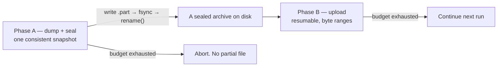
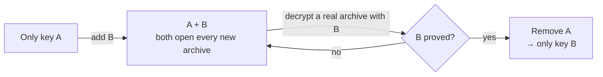

# ADR-0049: Encrypted Off-Site Backups on Shared Hosting

**Status**: Accepted

**Date**: 2026-08-24

**Amends**: [ADR-0031](./0031-production-hardening-on-shared-hosting.md) (a second accepted hard dependency on a host feature: outbound HTTPS), [ADR-0038](./0038-transactional-mail-outbox-on-shared-hosting.md) (narrows decision 3 — see "One scheduled command, re-read"), [ADR-0029](./0029-two-tier-retention-and-erasure.md) (a backup is a place erased data lives), [ADR-0036](./0036-iban-encryption-sealed-box.md) (a second keypair, and why it is deliberately not the first one)

---

## Context

**This system had no backups.** Not "weak backups" — none. The only thing that
existed was a procedure in `docs/deployment.md`: a `mysqldump | gzip | gpg -c`
script driven by `crontab -e`. Two hundred lines further down, the same document
explains that the reference host — IONOS shared webhosting ([ADR-0031](./0031-production-hardening-on-shared-hosting.md)) —
offers a webcron with a single HTTP GET field, no shell, no crontab and no
`mysqldump` binary.

So the documented procedure could not run on the documented host. Meanwhile
`README.md` advertised *"automated daily backups with 30-day retention"* as a
shipped feature. A club that followed the documentation to the letter ended up
with **no backups and the belief that it had them**, which is worse than knowing
it had none.

Two further gaps made the same point:

- Both deploy workflows run migrations with **no pre-migration dump**, by an
  explicit earlier decision (*"shared hosting without shell makes pre-migration
  backups from CI impractical"*), mitigated only by a printed reminder nobody acts on.
- Two annual verification duties are documented and **owned by nobody**:
  [ADR-0013](./0013-audit-logging.md)'s audit-log restore test, and the
  private-key archive test in the deployment guide.

### What the data demands, and what the operator can carry

Two constraints pull against each other, and naming both is what keeps this
decision honest.

**The operator is a volunteer.** A Kassenwart does this four evenings a year and
hands over to a successor who was not there when it was set up. A control nobody
operates is worse than a simpler one that runs, because it *looks* like
protection. This rules out most of what a backup product would ship.

**The data sets a floor anyway.** A dump holds names, addresses, birth dates and
the whole transaction history. [ADR-0036](./0036-iban-encryption-sealed-box.md)
sealed the IBANs, but mandate references, bank names and IBAN last-4 remain in
the clear — and that ADR's own threat model names *"a stolen backup"* explicitly.
"It is only a club" does not lower the bar; it changes which controls are worth
having.

## Decision

**A scheduled job inside the application dumps the database, seals it to a
keypair the server cannot open, writes it outside the document root, and pushes
it to storage the club owns. A restore is proved before any of it is believed.**

Six requirements follow, and everything else in this ADR is refinement of them.

| # | Requirement | Why it is not optional |
|---|---|---|
| 1 | Backups happen **automatically** | Today there are none. This is the actual gap |
| 2 | **Encrypted**, with the key not on the server | `config.php` plus an unencrypted backup is the whole member database, from one file, on a host where `.htaccess` has already silently stopped being honoured once ([#383](https://github.com/dgloeckner/clubbar/issues/383)) |
| 3 | **Off the host** | A suspended, deleted or lost account takes the webspace and everything on it |
| 4 | Someone has **actually restored one** | An untested backup is a belief, not a backup |
| 5 | **Bounded retention** | A backup outliving an [ADR-0029](./0029-two-tier-retention-and-erasure.md) erasure defeats it |
| 6 | Someone **notices when it stops** | The silent-stall failure [ADR-0038](./0038-transactional-mail-outbox-on-shared-hosting.md) already fears for mail |

### 1. The dump is produced in PHP, is complete, and the snapshot is atomic

There is no `mysqldump` on the target, so the dumper walks the schema itself and
streams rows to a sealed file.

**Every base table is dumped in full, and the list comes from the live schema.**
The dumper enumerates `information_schema.TABLES` at run time, so a table added
by next month's migration is in that night's archive with no backup-side change.
There is no per-table classification, no skip list and no schema-only class: an
earlier draft of this decision maintained one — three classes, a hand-kept map of
every table, and a CI bijection test policing the map against the live schema —
and it is rejected under *Alternatives considered*. The application's schema is
allowed to evolve without the backup knowing or caring; **a backup that holds
opinions about which parts of the database matter is a backup that can be wrong
about them**, and the cost of being wrong is asymmetric and silent: a table
wrongly skipped is missing on the day of a restore, and nothing before that day
says so.

"Everything" deliberately includes the tables the earlier draft argued out:
`bank_codes` (~20k reference rows, identical in every installation — compression
makes them cheap, and dumping them means a restored installation works
immediately instead of needing a repopulation step and an endpoint to perform
it) and the rate-limit counters (`login_attempts`, `terminal_auth_attempts`,
`terminal_ip_sightings` — restoring a few hours of stale counters is harmless).
What the archive would *lose* by selection is unbounded; what it gains is bytes.

Completeness therefore has no runtime failure mode of its own: there is nothing
to classify, so nothing can be unclassified. **Confidentiality still fails
closed** — no recipient key means no archive at all (decision 2), and a
plaintext fallback is never written.

#### What the dumper assumes, and what keeps those assumptions true

Three properties of the schema make the dumper correct. None is enforced by
anything the dumper does, so each is asserted by a guard test instead — the day
one stops holding, CI says so rather than the backup failing at 03:00:

| Assumption | What breaks without it |
|---|---|
| Every name is a **base table** | `SHOW TABLES` returns views as well, and a view dumped as if it were a table breaks the restore. The dumper therefore reads `information_schema.TABLES` with `TABLE_TYPE = 'BASE TABLE'` — and the guard test asserts the schema holds no views, triggers, routines or events, because a table-only archive would lose those *silently* rather than loudly |
| Every table is **InnoDB** | `START TRANSACTION WITH CONSISTENT SNAPSHOT` covers InnoDB and nothing else. A non-InnoDB table is read at whatever moment the cursor reaches it, so the archive tears between tables — and looks perfectly normal |
| The restoring session is **UTC** | See below |

#### The archive states the session it must be restored under

A dump is a sequence of statements, and the same statement means different things
in different sessions. The archive therefore pins its own: `NAMES utf8mb4`,
`SQL_MODE` (neither `NO_BACKSLASH_ESCAPES`, which would change every escaped
value, nor `NO_ZERO_DATE`, which would reject the zero dates it copies verbatim),
`FOREIGN_KEY_CHECKS = 0` because tables are written in name order rather than
dependency order, the database's own character set, and — the one whose absence
has no symptom — **`time_zone = '+00:00'`**.

The schema holds 53 `TIMESTAMP` columns against 29 `DATETIME`, and `TIMESTAMP` is
converted by the session zone. An archive imported through phpMyAdmin in the
host's local zone shifts every one of those 53 columns by the offset: settlement
dates, announcement distances, audit timestamps and the seven-day
[ADR-0038](./0038-transactional-mail-outbox-on-shared-hosting.md) window all move
together, consistently, and nothing about the result looks wrong. Every *other*
path in this project already pins UTC, which is exactly why forgetting it here
was easy.

The same reasoning binds the *reading* side: the dump connection asserts its own
offset before opening the snapshot, because a correct-looking statement written
from a non-UTC read carries the wrong instant.

#### The archive is addressable per table

Each table is written between terminated markers, and every `INSERT` names its
columns. Two unrelated needs turn out to want the same property:

- **Repairing one table is not restoring the database.** When a tablespace is
  unreadable or a table has been dropped, the club wants that table back — not a
  restore that discards everything since the dump.
- **phpMyAdmin has an upload limit.** A single file from a grown database will
  not import through the web UI on shared hosting at all. On a host with no
  shell that is a restore blocker, not an inconvenience.

Named columns are what let a single table's section load into a schema that has
since gained a nullable column, instead of failing on arity; at 100 rows per
statement the extra bytes are noise.

**A damaged index needs no archive at all.** `ALTER TABLE t ENGINE=InnoDB`
rebuilds every index in place and `OPTIMIZE TABLE` does the same on InnoDB;
`REPAIR TABLE` is MyISAM-only and is not the answer on this schema. Worth stating
because it is the first thing an operator reaches for, and because restoring
everything to fix an index would discard every transaction since the dump. This
also means a logical dump can never carry a *stale* index: it carries DDL, and
the server rebuilds each of the schema's 63 secondary indexes as the rows go
back in.

**A snapshot must be atomic; a transfer must be resumable.** These are different
problems and get different treatment — the distinction is what makes the run fit
inside a host's execution limit without ever producing a torn file:

A dump resumed across runs was rejected outright: it produces a torn snapshot
that looks exactly like a backup and is not one.

### 2. Encryption, with a keypair of its own

The archive is sealed with the primitive family already audited here
([ADR-0036](./0036-iban-encryption-sealed-box.md), [ADR-0048](./0048-shared-symmetric-crypto-abstraction.md)):
a random stream key sealed to each recipient's public key, the body under an
authenticated stream cipher over the compressed SQL. The server can *produce* an
archive it structurally cannot read.

**Not the IBAN keypair, and this is the load-bearing part.** Per
[ADR-0044](./0044-tiered-admin-roles.md) and [CONTEXT.md](../CONTEXT.md) the
**Kassenwart holds a copy of the IBAN private key**, because SEPA collection is
impossible without it. Sealing backups to that key would hand the Kassenwart the
audit log, every admin's TOTP ciphertext and the database password — an office
boundary violation of exactly the kind the notification rules exist to prevent.
Backups belong to the **Admin**: *whoever holds the server*.

**The archive seals to a list of recipients, not to one key.** The motivation is
not cryptographic, it is organisational: the realistic failure in a Verein is
*"der Vorstand hat gewechselt und niemand hat den Schlüssel"*. Two standing
recipients — the **Admin** and a second board member — cost a few dozen bytes
and make one volunteer disappearing survivable. That the same mechanism turns key
rotation into a safe overlap instead of a cutover is a consequence, not the reason.

**Custody follows the office, and the Kassenwart is not it.** The temptation is
to hand one copy to the Kassenwart, who is the volunteer most reliably still in
post next year. That would re-cross, through a second keypair, precisely the
boundary the paragraph above draws: a backup carries the audit log, every admin's
TOTP ciphertext and the database password, and it makes no difference to the
Kassenwart's reach whether they arrive sealed to the IBAN key or to a new one.
The second recipient is a board member because two holders are needed, not
because the office confers access.

**Fail closed.** With no recipient key configured, **no backup is written at
all**, and the security self-check reports it as a failure. A plaintext fallback
is never written. This is [ADR-0031](./0031-production-hardening-on-shared-hosting.md)
rule 3 applied unchanged: refuse and report, never silently degrade.

**Configuring a recipient key is also what switches backups on.** There is no
separate enabled flag (decision 8): "keys configured" and "backups on" are one
state, named accordingly in `config.php` (`backup.recipient_public_keys`), so the
two can never disagree — the failure mode a flag would add is an installation
switched on with no key, which produces a nightly *failure* rather than a nightly
backup.

### 3. Rotation is an event, not a calendar entry

Unlike the IBAN key there is no cryptoperiod here and nothing blocks on expiry —
no export refuses to run. Rotation happens when a key holder leaves or a key is
compromised, and **not** annually: a chore nobody performs becomes a warning
nobody reads.

There is never a moment when an *unproved* key is the only way into an archive —
which is the failure the deployment guide already warns about for the IBAN key
archive: a private key corrupted on write, saved in the wrong encoding, or
quietly the previous rotation's, is indistinguishable from a good one until the
day it is needed.

**A routine rotation deletes no archives**, and the instinct to say otherwise is
the trap. A handover is not a breach: the departing Kassenwart is a former
officeholder, not an attacker. Deleting would destroy the club's backup depth at
precisely the moment an organisational change makes a mistake most likely. The
right answer to *"the previous holder can still read them"* is that they destroy
their copy and it is minuted.

**Retention retires the key by itself.** Archives sealed to the old key age out
on their own schedule, so within months nothing under it exists — and at no point
was the club without backups. Rotation plus the retention that already ships *is*
the key retirement; there is no delete step, only patience.

Which yields the rule that would otherwise be got wrong every time: **a rotation
must not discard the old private key.** "Rotated" means dead for *writing*, not
for *reading*, until retention has drained. Discard it at rotation time and the
still-existing archives are destroyed silently, with no error, discovered at
restore time.

### 4. A compromised key is a different problem, and software is not the remedy

Rotating to a new key changes nothing about archives already sealed to the old
one. They cannot be re-sealed: that would require the old private key **on the
server**, which is the property this whole design exists to avoid. The only thing
that reduces exposure is destroying the ciphertext.

The first question decides everything, and when it cannot be answered the
pessimistic branch is taken — the same posture
[ADR-0031](./0031-production-hardening-on-shared-hosting.md) rule 3 takes
everywhere else, that an unmeasured state is never counted as the good one:

| | Key compromised, ciphertext **not** reachable | Key **and** ciphertext compromised |
|---|---|---|
| Example | A private key on a stolen laptop; no webspace and no storage access | The webspace and its upload credential leaked; or the tenant itself breached |
| Is deletion a remedy? | **Yes** — destroy the archives and the exposure closes | **No.** The data is out; deletion is hygiene |
| What it is | An incident to contain and minute | A **data breach**, with the notification duties that follow |

Order matters and is the thing that goes wrong under pressure: **mark the key,
rotate, take a fresh backup, prove it opens — and only then destroy.** Destroying
first trades a confidentiality problem for a total loss.

The application's part is deliberately small — smaller than an earlier draft made
it. Every archive names the keys it was sealed to **in its own header** (decision
8), so enumerating the residue of a compromised key is a scan of the local
directory plus a listing of the remote store, with no register to consult and
none to have drifted. Stopping the key is removing it from
`backup.recipient_public_keys`; the record of who holds which key, and of the
compromise itself, lives where the club's other security decisions live — in its
minutes and its key register, outside the application. Enumerating, deleting and
reporting the residue is a runbook. A purge wizard would be machinery for an
event a club faces approximately never, and the club would be reading a runbook
in crisis anyway.

### 5. One scheduled command, re-read

[ADR-0038](./0038-transactional-mail-outbox-on-shared-hosting.md) decision 3
says *"one scheduled command, because a second is a job nothing watches."* The
load-bearing half of that sentence is **"nothing watches"**, not **"one
command"**. It was written when the mail drain was the only scheduled work, and
what it rejected was a second *sending* path — one that would degrade a missing
scheduler from a hard failure to a soft one and remove the pressure to fix it.

**This ADR narrows that rule to its actual principle: no scheduled path may
exist that nothing observes.** A second job with its own observation is
permitted. A second sending path still is not.

The backup therefore gets its own entrypoint and its own URL trigger, and pays
for them with its own self-check row and its own failure notice. The gain is not
cosmetic:

| | Shared with the mail cron | Its own cron |
|---|---|---|
| Execution budget | Two jobs split one host timeout | Each gets the full window |
| Cadence | A daily job asking "am I due?" ~96×/day | The schedule states the intent |
| Blast radius | A backup dying on a large table sits in the mail run's path and holds its lock | Isolated |

**The backup does not gate settlement finalize.** ADR-0038 decision 7 blocks
finalize because an unannounced collection is one the club promised not to make.
No such promise rides on a backup, and refusing to let the Kassenwart collect
would be the worse failure. A missing backup cron is a self-check finding and a
notice to the Admin, not a lockout.

The URL trigger is heavier than the mail drain's and is treated as such: it
**produces and stores a database dump**. So it requires the shared cron secret,
is unmounted when no secret is configured, answers with an empty success always —
it triggers, it never serves an archive — and carries a minimum-interval guard so
repeated calls cannot fill the webspace quota with dumps.

### 6. Storage: what a location must offer, and what M365 actually offers

Three properties, and naming them is what makes the choice arguable rather than a
preference:

| | Property | Why |
|---|---|---|
| **a** | A **failure domain separate from the host** | Suspension, deletion or loss of the account must not take the backups |
| **b** | **Immune to the host's own credentials** | A compromised webspace must not be able to destroy the history it can write to |
| **c** | The **club can reach it without us** | A backup only the maintainer can restore is not the club's backup |

The local copy under the data directory satisfies none of (a). It exists to stage
the upload and to serve the common case — undoing an operator mistake an hour ago
— and is never the answer to *where are the backups*.

Microsoft 365 is the chosen target: it is storage the club already owns, so it
satisfies (a) and (c) without introducing a new processor or a new bill. It does
**not** satisfy (b), and it is worth separating three guarantees that get
conflated:

| Guarantee | Available where |
|---|---|
| *"The credential cannot delete"* | **Not available.** The application permission model scopes *which* site, but the per-site role includes delete; there is no create-only role |
| *"Deletion is non-destructive"* | Retention on the target library. **This is what we are buying** |
| *"Genuinely append-only"* | Object storage with versioning and object lock, and a key that may put and not delete |

So the remedies are two, and deliberately the whole list: **retention on the
target library**, which makes a delete recoverable rather than impossible — the
guarantee must be stated in those words and never as "the credential cannot
delete" — and **a periodic manual copy** to a medium the server has never been
able to write to. The second is the one that survives everything else, needs no
licence, and is the reason it becomes a recurring duty rather than advice.

The transport sits behind a single DSN, mirroring the mail transport's shape, so
the storage target is swappable without touching the producer. Object storage
with object lock is the option that would close (b) properly and is recorded here
as the recommended upgrade for a club that wants the guarantee rather than the
mitigation.

### 7. A restore is proved, not assumed

The dumper is hand-written, and a hand-written dumper is exactly the kind of code
that silently mangles a binary column, a JSON column, a zero date or an unusual
codepoint — and then produces a file that looks perfectly fine until the day it
is restored.

So the deliverable of this decision is not the dump. It is a test that seeds a
database, runs the real backup path, decrypts, restores into a **second schema**
and asserts row-for-row equality — plus an annual human drill that does the same
thing by hand, because a test proves the code and only a drill proves the
*procedure*, the archive and the key.

**Row equality does not prove an index.** A dumper that dropped every one of the
schema's 63 secondary indexes, its foreign keys with their `ON DELETE` clauses,
or its `CHECK` constraints would pass a row-for-row comparison unchanged, and the
restored database would be correct in content and wrong in every other way. So the
comparison covers **schema too**: normalised `SHOW CREATE TABLE` per table, source
against restored.

**And the dumper is diffed against a reference implementation.** CI runs a MariaDB
service container, so `mariadb-dump` is available *there* even though the reference
host has none. Both dumps are restored into scratch schemas and the two restored
schemas are compared — DDL per table plus ordered row checksums. Comparing the
restored *state*, never the dump text, is what makes this meaningful: the two
differ on formatting, batching and comments, none of which is a defect.

This is the honest answer to the risk that this decision exists for. "The
hand-written dumper is correct" was an assertion backed by the hazards we thought
to enumerate; against an oracle it becomes a difference or the absence of one, and
it costs about one CI step. It does **not** make `mysqldump` a runtime path — see
*Alternatives considered*; it cannot be one on the reference host, and running it
where it does exist would halve the field exposure of the PHP path that is the
risky one.

**A restore has to end in a working installation, not merely an equal one.**
Two things are true of a correct restore that a row comparison would not catch:
the configuration file must travel inside the archive (below), and the archive's
own session pinning (decision 1) has to survive the operator, since overriding
it shifts every `TIMESTAMP` in the database with no visible symptom.

The restore path assumes no shell: download the archive, decrypt it with a
browser-based offline tool built the same way as the existing keypair generator,
import the resulting SQL through whatever database tool the host offers. A restore
tool that needed SSH would not exist for the reference host.

**Restoring everything is the wrong remedy for partial damage**, and partial
damage is the commoner event. A damaged index needs no archive at all — see
decision 1 — and a single lost table needs its own section, not a restore that
discards every transaction since the dump. The runbook therefore treats "repair
one table" as a first-class procedure rather than a footnote to disaster
recovery.

**The configuration file travels inside the archive.** Without the TOTP
encryption key a restored database locks out **every** admin's second factor;
without the IBAN fingerprint key, mandate-change detection breaks. The composition
risk is stated rather than hidden, in the words the deployment guide already uses
for the key archive: the key archive and one backup must never be the only two
copies of anything sitting in the same building.

### 8. The archive is the record; the database holds no backup state

**The backup observes the database and writes nothing into it.** No tables, no
migration, no audit rows. A backup is a procedure that stands outside the system
it protects — it happens to share the codebase, and that is the whole
relationship. This decision replaces an earlier draft that gave the backup three
tables of its own (`backup_runs`, `backup_keys`, `backup_config`); what was wrong
with them is recorded under *Alternatives considered*, and it is more than tidiness.

**The archive describes itself.** The container's cleartext header — readable
with no key, which the offline decryptor already relies on — carries everything a
future reader needs in order to know what they are holding before they can open
it:

| Field | Why it is a must-have |
|---|---|
| format version, algorithm | What this build can read, stated rather than probed |
| `created_at` (UTC) | When the snapshot was taken — retention and "which archive do I want" both read it |
| recipients: `{fingerprint, label}` per key | *Which envelope in the safe opens this* — answerable years later, from the file alone, with no register to consult |
| instance identity and database name | An archive found on a share is attributable — clubs merge, hosts are shared, volunteers keep copies |
| schema version (highest applied migration) | Which application version can load this, and whether an upgrade must follow the import |
| dump format version | The SQL dialect contract between emitter and restore tooling |
| table manifest, `{table: row count}` | What is inside, without decrypting — and the decryptor's per-table split can name its parts |
| plaintext length and SHA-256 | A restore can prove it decrypted what was sealed |

Nothing in the header is secret — names of tables and a row count are not member
data — and everything that could change the plaintext is inside the
authenticated stream.

**Operational state lives beside the archives, not in the database.** The backup
directory holds the archives, an append-only journal (`index.jsonl` — one line
per run attempt and outcome), and, while an upload is in flight, a sidecar file
with its resume state. The interval guard, retention, the panel's history and
the self-check all read the journal and the directory. The journal is a
convenience, never a truth: *which keys still open archives that still exist* is
answered by the archive headers themselves — a scan of the directory locally, a
listing of the store remotely — so the answer cannot drift from reality the way
a database row can.

**Configuration is `config.php` only.** `backup.recipient_public_keys` (whose
presence *is* the on-switch — decision 2), `backup.dsn`, and optional retention
overrides above compiled defaults. No `backup_config` row: club policy that
cannot be expressed in the file does not exist for this feature.

**No audit-log entries.** The audit log records what admins do to member data
inside the system ([ADR-0013](./0013-audit-logging.md)); a scheduled procedure
that reads everything and writes only to its own directory is not that, and
threading audit vocabulary through it coupled the backup to the application's
schema (the migration had to respell the entire `audit_log` action enum to add
four values). The backup's own record is its journal and its log lines.

**Positive**

- The system has backups. That is not a small claim to be able to make: it had none.
- A stolen webspace yields ciphertext. The backup stops being the *easiest* path
  to the member database and becomes the hardest.
- The dumper becomes trustworthy by test rather than by hope, and the restore
  procedure by drill rather than by document.
- The schema can evolve without the backup knowing: a new table is in the next
  archive with no backup-side change, and there is no map to fall out of date.
- A restore cannot corrupt backup state, because there is none in the database.
  The archives and the journal beside them are the whole record; an archive found
  anywhere is attributable and self-describing from its header alone.
- No migration, no data-model change, no audit vocabulary: the feature touches
  the application's schema nowhere.
- Two orphaned annual duties acquire an owner by joining the drill.
- The false claims in `README.md` and the unrunnable procedure in the deployment
  guide are corrected, which is the smallest and most immediate improvement here.

**Negative**

- **Push-only cannot survive a host takeover on its own.** An attacker holding
  the webspace holds the upload credential. Mitigation: library retention where
  the tenant allows it, and the periodic manual copy where it does not — which is
  why that copy is a duty and not a suggestion.
- **Retention is a window, not a wall.** An attacker who waits it out wins. Accepted.
- **Backups defeat erasure for a bounded window.** Retention is enforced by the
  application, but a provider recycle bin extends it further. Bounded and written
  into the Verzeichnis rather than unknown.
- **Losing every private key loses every archive.** Inherent to the construction,
  the same trade [ADR-0036](./0036-iban-encryption-sealed-box.md) already accepted
  for IBANs. Mitigation: two standing recipients, and a drill that would notice.
- **A second scheduled job is a second thing to configure**, and a successor
  Kassenwart can fail to re-add it after a tariff migration. Mitigation: it is
  observed, so its absence reads as "no backup ever" rather than as silence.
- **The club can stop doing the manual copy and nobody would know.** Honestly
  unfixable by software. The annual drill is where it surfaces, which is why the
  drill is the duty that must not be cut.
- **Run history is a flat file.** No relational queries over it, and deleting the
  backup directory deletes the local history (the archives elsewhere keep their
  own headers). Accepted at this scale: the journal is a convenience, the headers
  are the record.
- **Key custody is tracked outside the application.** Whether a key was ever
  proved against a real archive, and whether one is compromised, lives in the
  club's own key register and minutes, not in a panel. The drill is what keeps
  that record honest.
- **Full dump means full-size dump.** `bank_codes` and the counters ride along in
  every archive. Compression absorbs it, and the trade was made knowingly:
  simplicity and completeness over bytes.

**Neutral**

- The supported hosting set does not narrow further. Outbound HTTPS is a second
  hard dependency on a host feature, but every tariff that can already reach an
  SMTP server or a heartbeat monitor can reach a storage API.

## Alternatives considered

**A scheduled GitHub Actions workflow that pulls a dump.** Rejected on three
independent grounds, any one of which is sufficient. It cannot reach a shared
host's database, which does not listen off-localhost. It would need a long-lived
credential to the installation, stored outside it. And decisively: **this product
ships as a ZIP that other clubs self-host**, so a workflow in this repository is
our own operations, not a backup feature — it would leave every other
installation exactly as unprotected as before.

**`mysqldump` on a schedule.** The documented procedure today. There is no shell,
no crontab and no binary on the reference host. Kept, relabelled, for self-hosters
on a root server.

Two further reasons, because "the binary is absent" invites the obvious
counter-proposal — *use it where it exists*. First, existence is not
availability: shared hosting routinely lists `exec` and `proc_open` in
`disable_functions`, and the password would have to travel through a defaults
file, never `-p`, which is world-visible in `ps`. This product ships as a ZIP to
clubs on hosts nobody here will ever see.

Second, and decisively: **a hybrid is worse than either half.** Two dump dialects
double the restore matrix — every runbook step, every recovery drill and every
round-trip test exists twice — while halving the field exposure of the PHP
dumper, which is the half that needs exposure most. The path that gets used only
where nobody is watching is the path that fails on the day it is needed.

None of which makes the binary useless. Where it *is* available — CI — it is the
best available oracle, and decision 7 uses it as one. Rejected as a runtime path,
adopted as a test instrument; these are not in tension.

**Sealing backups to the IBAN keypair.** Rejected: the Kassenwart holds a copy of
that key, and would thereby hold the audit log, every admin's TOTP ciphertext and
the database password.

**A resumable dump across scheduler ticks.** Rejected: a torn snapshot that looks
like a backup.

**A pull endpoint an external puller could fetch from.** Workable, and it inverts
the credential blast radius. Rejected for now because the periodic manual copy
covers the same risk without adding a public endpoint that serves member data.

**Application-side push to third-party object storage.** Rejected for the first
implementation: it brings a new processor's credentials into `config.php` and a
new data-processing agreement into the product — the same reasoning that left
[ADR-0038](./0038-transactional-mail-outbox-on-shared-hosting.md)'s HTTP mail
transport unbuilt. Recorded above as the recommended upgrade path where a club
wants genuine append-only.

**An "inbox" layout** in which the application writes to a landing library and a
tenant-side automation copies each archive into one the application cannot touch.
It works, and it genuinely inverts the blast radius. Not built: it adds a
tenant-side moving part with its own licensing question and its own way to stop
silently, and retention plus the manual copy already covers the risk at a club's scale.

**An automated compromise purge** with archive enumeration and remote deletes.
Rejected as machinery for an event a club faces approximately never. The record
that makes a manual purge *possible* is kept — in the archive headers themselves;
the wizard is not.

**A per-table classification (full / schema-only / skip).** Built in the first
implementation and removed. It kept a hand-maintained copy of the schema inside
the backup code — every table named, with a CI bijection test in both directions
policing the map against the live database, a runtime policy for the unclassified
case, and drift alarms comparing one night's manifest to the last. All of that
machinery existed to manage a hazard the map itself created: the map *was* the
drift. Its own first draft listed `sessions` in the skip set — a table migration
`044` had already dropped — which is the failure in miniature: a second record of
the schema is wrong the moment nobody notices a migration. Dumping every base
table, enumerated live, deletes the hazard instead of guarding it, and the bytes
it saves (chiefly `bank_codes`) are cheaper than the endpoint, the runbook step
and the CI apparatus the saving cost.

**Backup state in the application database.** Built in the first implementation
(`backup_runs`, `backup_keys`, `backup_config`, migration `055`) and removed. A
backup that stores its state inside the thing it backs up is self-referential,
and the loops are not theoretical: every archive contained its own half-written
`running` row, so restoring one resurrects a run that never finishes and reads
as a stalled scheduler; a compromise blocklist kept in `backup_keys` is *reverted
by any restore* of an archive predating the compromise — a restore silently
un-deciding a security decision; and rows drift from files the moment an
operator deletes an archive by hand, after which the row wins arguments it
should lose. The tables also dragged in hand-written DML, a migration (with the
respelled audit enum), and a data-model change — none of which a procedure
outside the system should own. Replaced by decision 8: the self-describing
archive, the journal beside it, and `config.php`.

**Annual key rotation on a schedule.** Rejected: no cryptoperiod applies, and an
invented chore nobody performs produces a warning everyone learns to ignore.

**Deleting old archives on a routine rotation.** Rejected — see decision 3. It
costs the club its backup depth at a handover, and retention retires the key
without it.

## Related decisions

- [ADR-0031](./0031-production-hardening-on-shared-hosting.md) — the mass-hosting premise; amended here with a second accepted hard host dependency
- [ADR-0038](./0038-transactional-mail-outbox-on-shared-hosting.md) — the scheduler this decision joins; its decision 3 is narrowed here
- [ADR-0036](./0036-iban-encryption-sealed-box.md) — the sealed-box construction and the key-archive discipline this reuses with a separate keypair
- [ADR-0048](./0048-shared-symmetric-crypto-abstraction.md) — the shared key-handling primitives
- [ADR-0029](./0029-two-tier-retention-and-erasure.md) — erasure, which a backup can outlive
- [ADR-0044](./0044-tiered-admin-roles.md) — why backups are the Admin's and not the Kassenwart's
- [ADR-0013](./0013-audit-logging.md) — its annual restore test, which the backup drill adopts
- [ADR-0022](./0022-test-strategy-and-automation.md) — the test pyramid the round-trip and its `mariadb-dump` oracle sit inside; applied here, not amended
- [#686](https://github.com/dgloeckner/clubbar/issues/686) — the epic implementing this decision
