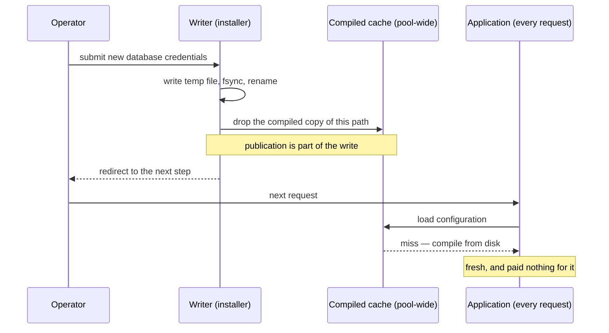

# ADR-0050: Configuration Coherence Is the Writer's Job

**Status**: Accepted

**Date**: 2026-08-27

**Amends**: [ADR-0031](./0031-production-hardening-on-shared-hosting.md) (adds a rule for the `config.php` it places), [ADR-0038](./0038-transactional-mail-outbox-on-shared-hosting.md) and [ADR-0049](./0049-encrypted-offsite-backups-on-shared-hosting.md) (both keep operator settings in that file)

---

## Context

`config.php` is the one file every other decision leans on. ADR-0031 chose its
location and the fallback inside the document root; ADR-0038 put the mail DSN in
it because it carries an SMTP password; ADR-0049 put the whole backup
configuration in it because a restore must not be able to revert backup
settings. None of them said how it is **read**, and the answer turned out to
matter.

### Two requirements that look contradictory

**It is immutable.** An operator writes it at install, again at an upgrade, and
perhaps once more when a board member changes the mail password. Between those
events it is read on **every single HTTP request**. The ratio is not close, and
it is the design input: a cost added to a read is levied forever to serve
something that happens twice a year.

**But it is updated, and the updater must see its own writes.** The installer
writes the database credentials in step 2 and reads them back in step 3 — a
different HTTP request, milliseconds later — to open the connection it migrates
through.

### What went wrong when only the first half was considered

PHP loads the file with `require`, so opcache caches the *compiled* form.
`opcache.revalidate_freq` defaults to **2 seconds**, during which the cached
copy is served and the file's mtime is never consulted.

So step 3 reads the credentials as they were **before** step 2 wrote them. On a
first install this is harmless — nothing is cached for a file that did not
exist. On a re-run through `?update=1`, which is exactly the path an operator
takes when *changing* the database, the installer migrates the previous database
and reports success (#714).

The first remedy proposed was to make reads safe: invalidate before every
`require`. It works, and it resolves the tension by **making every request pay,
forever, for a writer that almost never runs** — including in `index.php`, where
it would defeat opcache for this file permanently on the shared hosting that
ADR-0031 exists to support.

## Decision

> **Coherence is the writer's responsibility, not the reader's.**

A reader never asks *"has the configuration changed?"* It is **told**, by the
only participant that can know: whatever changed it. Immutability holds for
readers precisely because the writer breaks their cache on their behalf.

### 1. Two lifecycles, named separately

| | Application | Installer / updater |
|---|---|---|
| Frequency | every request | a few times in a deployment's life |
| Treats configuration as | immutable — load once, never re-check | mutable, and must read back coherently |
| Cost it may carry for freshness | **none** | whatever correctness requires |
| Freshness comes from | being told | doing the telling |

The application is not permitted to spend anything on freshness. The updater is
permitted to spend whatever it needs, because nothing it does is on a hot path.

### 2. Whoever writes the file announces the change

Publication is part of writing, not a separate step a caller may forget. The
component that writes configuration invalidates the cached compilation of the
path it just wrote, in the same operation, after the content is durably in
place.

Because the compiled cache is shared across the worker pool, one writer
announcing is enough for every reader in it. That is what lets a single point of
publication serve call sites that are never modified.

### 3. What readers may not do

Each of these is a plausible-looking future change that quietly reinstates the
cost this decision removes:

- checking freshness per read — invalidating, re-stat'ing, comparing mtimes
- a TTL or generation counter on a cached configuration value
- adding a cross-request cache (a shared-memory store, a warmed file) **without**
  wiring the writer into it — the rule extends to such a cache, but only
  deliberately, and the writer must announce to it too

A reader that finds itself wanting any of these has found a writer that is not
announcing. Fix the writer.

### 4. Read-after-write inside one process is the writer's problem too

A component that writes a file and reads it back within the same process —
verifying what it just rendered, for instance — is its own writer and announces
to itself. This is not an exception to the rule; it is the rule at the smallest
scale.

### 5. The limit, stated rather than discovered

A writer can only announce to caches it can reach. A command-line writer has a
separate compiled cache from the web pool and cannot invalidate it, so the web
pool may serve a stale compilation until its own timestamp validation notices —
bounded by the revalidation interval, and self-healing.

This is accepted, not worked around. Closing it would mean a cross-process
signalling mechanism on shared hosting: more moving parts, another thing to
fail silently, to remove a bounded window nobody can observe. The rule is
satisfied — the writer announced to everything it could reach.

## Consequences

**Positive**

- The failure that motivated this is fixed at one point rather than at nine, and
  the eight call sites that were never the problem are never touched.
- Reads cost nothing. The file the application loads on every request is
  compiled once and served from cache until an operator changes it, which is
  what makes ADR-0031's placement affordable on the tariffs it targets.
- A configuration-reading helper becomes safe to use anywhere, including a hot
  path. Before this, a shared helper carried a per-call cost that its callers
  could not see — a trap for whoever adopted it next.
- The rule generalises. Any future cache of configuration — in-process, shared
  memory, a warmed artifact — inherits a stated obligation on the writer rather
  than an argument to be had again.

**Negative**

- **A writer that does not go through the sanctioned path breaks coherence
  silently.** Someone editing `config.php` by hand over FTP announces nothing;
  the application will be up to one revalidation interval behind. Accepted:
  timestamp validation makes it self-healing, and the installer exists so
  hand-editing is not the expected path (#710).
- **The obligation is invisible at the call site.** A reader looks like a plain
  file load, and nothing at that line says a writer somewhere guarantees its
  freshness. Mitigated by keeping publication inside the writing component, so
  there is one place to read the rule and one place to break it.
- **Cross-SAPI staleness remains** (decision 5), bounded and unfixed by choice.
- **This is a rule about a mechanism the platform owns.** A host with timestamp
  validation disabled changes the failure from bounded to permanent. The
  self-check reports what it observes rather than assuming, per ADR-0031
  decision 3, but the rule cannot enforce the host's configuration.

**Neutral**

- No new component, no dependency, no schema change. This decision records where
  an existing responsibility belongs.

## Alternatives considered

**Invalidate before every read.** The first proposal in #714, and correct in the
narrow sense that it produces fresh values. Rejected: it inverts the cost onto
the operation that happens millions of times to serve the one that happens
twice, and in the application's entry point it would defeat compilation caching
for this file permanently — a real cost on the shared hosting ADR-0031 commits
to. It also spreads one rule across every call site, where it must be remembered
each time instead of held in one place.

**Have the updater not read back at all**, passing what it wrote to the next
step directly. Rejected: the steps are separate HTTP requests, so "directly"
means a session or a scratch file, and the values include the database password.
A JSON scratch file in the document root is precisely the exposure that keeping
configuration in an executable PHP file avoids (ADR-0031). The file is the right
place to read from; the read needed to be correct.

**Disable timestamp validation and rely purely on announcement.** The standard
posture for genuinely immutable deployed code, and faster still. Rejected: it
converts decision 5's bounded window into a permanent stale read, and shared
hosting rarely lets an application set it either way. The self-healing behaviour
is load-bearing here precisely because we do not control the host.

**Cache configuration in shared memory and manage it explicitly.** Rejected as
premature: the compiled cache already does this, for free, on every host that
runs PHP. Adding a second cache would add a second thing to invalidate — and by
this ADR's own rule, another announcement the writer must make.

## Related decisions

- [ADR-0031](./0031-production-hardening-on-shared-hosting.md) — places `config.php` and sets the shared-hosting premise that makes per-read cost matter
- [ADR-0038](./0038-transactional-mail-outbox-on-shared-hosting.md) — keeps the mail DSN in the file because it carries a secret
- [ADR-0049](./0049-encrypted-offsite-backups-on-shared-hosting.md) — keeps backup configuration in the file so a restore cannot revert it
