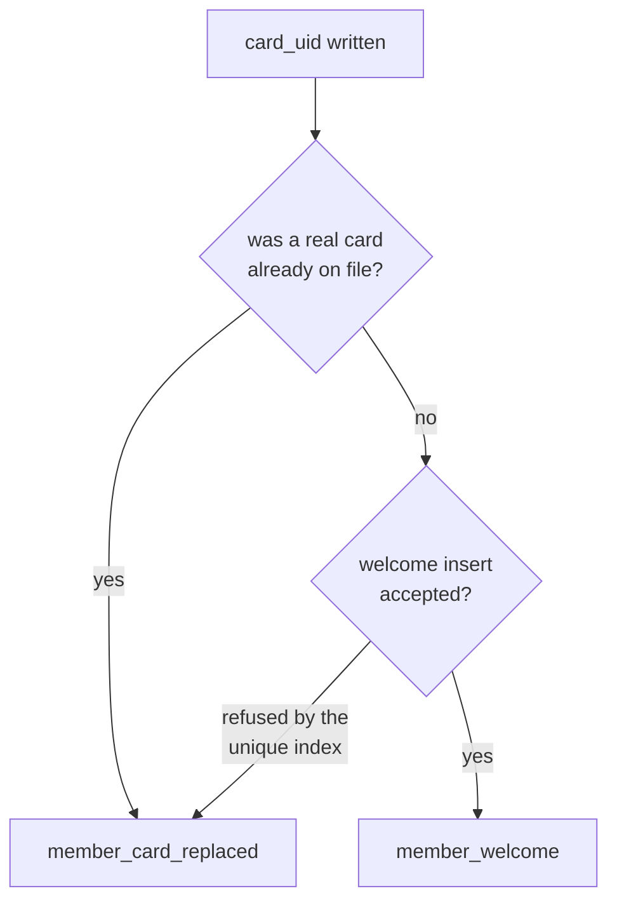

# ADR-0051: A Member Hears From the Club When Their Card Arrives

**Status**: Accepted

**Date**: 2026-08-29

**Amends**: [ADR-0038](./0038-transactional-mail-outbox-on-shared-hosting.md) (four new consumers, and the first member-addressed kinds that are not about money)

---

## Context

Three kinds of mail reach a member today — `sepa_prenotification`,
`cancellation_notice`, `deckel_statement` — and all three are about money. Every
one of them presupposes an address that works.

Nothing has ever tested that presupposition.

[#362](https://github.com/dgloeckner/clubbar/issues/362) made `members.email`
mandatory on create precisely *because* the Vorabankündigung is a contractual
promise (Nutzungsordnung § 7 Abs. 3), and then went no further: the address is
checked against `FILTER_VALIDATE_EMAIL` and trusted from that moment on. It is
not unique, not normalised, and never written to. A Kassenwart who types
`anna@gmial.com` in March finds out in November — seven days before the first
collection, from a `failed` row nobody had a reason to be watching.

The second gap is the mirror of one this project already closed for admins. An
admin's login address moving mails the address it moved *away* from
([ADR-0015](./0015-authentication-and-authorization-strategy.md),
`MailKind::ADMIN_EMAIL_CHANGED`), because that is the one channel a change the
owner did not make can still reach them through. A member's address can be
moved by any Kassenwart, from a list of every member, with no step-up and no
notice to anybody. A member has no session to steal, so the likely cause is a
mistake rather than an attack — the wrong row in a long table — which makes it
*more* probable, not less, and equally invisible.

### Why not at registration

The obvious trigger is `POST /api/admin/members`, and it is the wrong one.

Under [ADR-0021](./0021-rfid-card-assignment-workflow.md) a card UID is typed
into the edit form, normally after the record exists. A member row without a
card cannot do anything: no session can start, no Deckel can move, no settlement
can collect. It is paperwork. A mail welcoming somebody to a bar they cannot
yet enter announces nothing, and it arrives at the moment the club is least
certain the record is even finished — the birth date, the mandate and the card
are all still to come.

## Decision

**A member is written to when their card is assigned, and the card gates every
member-addressed lifecycle notice. Four kinds, all queued through the ADR-0038
outbox, none of them sent inline.**

| Kind | Recipient | Occasion |
|---|---|---|
| `member_welcome` | the member | their **first** card |
| `member_card_replaced` | the member | any **later** card assignment |
| `member_email_changed` | the address being **left** | the address moved |
| `member_email_activated` | the address being **taken up** | the address moved |

All four: `subjectType()` is `MailSubject::MEMBER`, `addressesMember()` is true,
`addressesClub()` is false, `recipientRoles()` is `[]`.

### 1. The welcome is the first message a member ever receives

This is the invariant the rest rests on, and it is what makes the card the gate
for the address pair as well as for itself. A member the club has never written
to receiving *"the address we hold for you has changed"* gets an out-of-context
message from an unfamiliar sender about a relationship they do not know they
have. Silence is better.

So a member with no card is told nothing. In practice the gate costs nothing:
a member without a card has no Deckel to state and nothing to collect, so no
money mail would reach them either.

A request that assigns a first card **and** a new address sends the welcome
only. There was no prior relationship for an address to move within, and the
welcome goes to the new address regardless.

### 2. Welcome or replacement is read from the transition, not from the queue

A card that replaces another is a replacement. That reading depends on nothing
but the row being updated, and it is deliberately not delegated to the queue:
`MailRetention` prunes a delivered welcome at ninety days, and a rule that asked
the outbox *"have we greeted this member?"* would turn every later replacement
back into a greeting.

Exactly one case is ambiguous — a card cleared and later reassigned looks
identical to a first assignment. There the welcome is attempted and
`MailOutboxRepository::enqueue()` returning false is what reports that the
member has been greeted already. That is `UNIQUE (kind, subject_id, dedup_key)`
answering, not a lookup, so two overlapping requests cannot both conclude they
are the first.

The welcome's dedup key is the constant `welcome`; the replacement's is
`replaced:<stamp>` — an occasion, because two replacements are two things to be
told about. Neither carries the card UID: it would put a card identifier in the
queue for no gain.

### 3. Both ends of an address change, and they are different messages

Two kinds rather than one kind in two rows, for the reason the three
`encryption_key_*` values are three kinds: they are different messages, with
different subject lines, read by different people, and the queue is filtered by
kind.

- The **former** address is told that this is the last thing it will receive and
  who to tell if it was not them. Its recipient cannot be derived at send time —
  `members.email` holds the new address by then — so it is frozen into the row's
  `recipient` snapshot, which is the guarantee that column exists to give.
- The **new** address is told that club mail arrives here now. Its real job is
  to fail: a bounce becomes a `failed` row in Settings → Notifications carrying
  the transport's verbatim error, at a moment when a typo is still cheap.

**It is not a verification.** No token, no `email_verified_at`, no double
opt-in, and nothing is gated on delivery — the address is in use from the moment
it is saved. Calling it a confirmation would promise a gate that does not exist.
A member whose address bounces is a member the Kassenwart phones, which is the
same remedy [CONTEXT.md](../CONTEXT.md) already names for a member SEPA cannot
collect from.

### 4. Neither address notice names the other address

`AdminEmailChangedMail` withholds it because telling a possibly-hijacked mailbox
where the account went helps nobody. Here the argument is ADR-0038 rule 5's:
bodies render at send time from live state, so an address printed in one of
these could have moved again between a greylisted attempt and the one that
succeeds — and a message naming the *wrong* address is worse than one naming
none. Each copy proves its own address by arriving there.

The same reasoning keeps the change time honest: it comes from the row's own
`queued_at`, because the enqueue happens in the call that writes the change.

### 5. What the welcome carries, and what it must not

| In | Out |
|---|---|
| The card works; how to pay at the bar | The card UID — the member has it, or is about to |
| **That the card may not have reached them yet** | The Mandatsreferenz and Gläubiger-ID |
| How the Deckel accrues and that it is collected by SEPA | Any amount, limit or balance |
| That a Vorabankündigung arrives ≥ 7 days before every collection | Any link, token or action |
| What the club stores, and that a reply reaches the Kassenwart | |

**The mail routinely arrives before the plastic does**, and both card notices
say so. A Kassenwart types the UID in while *preparing* an onboarding — the card
is handed over at the bar, or posted, possibly days later — so the message
reaches a member holding nothing. Without that paragraph the welcome is an
instruction that cannot be followed.

For the replacement it is sharper than a courtesy. `card_uid` is a single
column, so assigning a new UID stops the old card matching anybody from that
moment: there is a real window in which the member cannot pay at all. Naming it
is the difference between a gap they were warned about and a card that
mysteriously stopped working at the bar, in front of a queue.

The banking details are the deliberate omission. The registration form promises
they reach the member *„mit der Vorabankündigung zum ersten Einzug per E-Mail"*
— moving them into a welcome would change a channel the club has written down,
and at card time there is frequently no mandate on file to name.

Setting up the Vorabankündigung is the paragraph that earns the mail's keep: a
member who has been told a collection will be announced seven days ahead cannot
be surprised by the first one.

### 6. Best effort, and never a gate

Every enqueue is wrapped and swallowed. The card assignment and the address edit
are already committed by the time any of this runs; a queue that will not take a
notice is a smaller problem than a Kassenwart told their edit failed when it did
not. Failures are logged rather than audited — a failed enqueue is not a member
event, and filing one under `update` would put noise in the query those entries
exist to answer.

There is **no on/off setting**. These are event-triggered like
`ADMIN_EMAIL_CHANGED`, not cadence-driven like the Deckelauszug, and they can
only fire on cards assigned *after* the upgrade — so unlike ADR-0039's statement
there is no way for a migration to mail an existing membership. The global
switch (an empty `mail_config.sender_address` means nothing sends) still
applies.

### 7. Erasure needs nothing new

Every row carries `member_id`, so `NotificationsService::eraseMember()`
supersedes the pending ones and scrubs the snapshots in the same transaction
that anonymises the member — [ADR-0029](./0029-two-tier-retention-and-erasure.md)
and [#408](https://github.com/dgloeckner/clubbar/issues/408) cover these for
free. Anonymisation writes an `ANON-` placeholder into `card_uid` and runs
through `MembersRepository::anonymize()` rather than `updateMember()`, so it
never reaches the trigger; the placeholder is filtered anyway, because a
placeholder read as a card would turn an erasure into an onboarding.

## Consequences

**Positive**

- The club finds out an address is wrong when it is cheap to fix, rather than a
  week before a collection depends on it.
- An address moved by mistake or by the wrong hand is visible to the one person
  who can say so, through a channel the mistake cannot suppress.
- A member's first contact from the club sets up the Vorabankündigung, so the
  § 7 Abs. 3 announcement arrives as something expected.
- Nothing new is needed from the queue: four kinds, one builder, the same claim
  and the same drain. ADR-0038's generality holds for the fourth time.

**Negative**

- **Four kinds is a lot for one feature**, and `MailKind` is now 21 cases. The
  alternative — one kind with a state field — was rejected for the reason the
  `encryption_key_*` split gives, and the exhaustive `match` expressions mean
  the cost lands as compiler errors on the next kind rather than as silent drift.
- **A welcome pruned at ninety days can be sent twice**, to a member whose card
  was cleared and reassigned across that boundary. Accepted: holding one row per
  member forever to prevent a duplicate greeting would retain an address
  indefinitely for no evidentiary purpose, which is what ADR-0029 asks this
  table not to do. The transition rule keeps the ordinary replacement out of
  this entirely.
- **The Kassenwart can now cause four emails from one edit form**, with no
  preview and no undo. Mitigated by keeping every message short, actionable and
  free of anything the member could be alarmed by finding in an inbox.
- A member with no address (a legacy row predating #362) is silently skipped.
  Visible only in the Datenqualität panel's `without_email` count, which is
  where it already was.

**Neutral**

- The new-address notice looks like a verification and is not one. That is
  stated in the message itself (*„Du musst nichts bestätigen"*) rather than left
  to be inferred, because a member who waits for a confirmation link that never
  comes is worse off than one who was told there is nothing to do.

## Alternatives considered

**Welcome at record creation.** Rejected: a member row with no card can do
nothing, the record is usually incomplete at that moment, and the mail would
welcome somebody to a bar they cannot enter.

**Notify only the old address on a change**, mirroring `ADMIN_EMAIL_CHANGED`
exactly. Rejected: it detects a wrong change and never checks that the new
address exists, which is the more common failure by a wide margin and the one
that quietly breaks the § 7 Abs. 3 promise.

**Notify only the new address.** Rejected for the opposite reason: it confirms
reachability and leaves a member whose address was moved without their knowledge
with no way to find out.

**A real double opt-in.** Rejected as out of proportion and, worse, misleading:
gating anything on confirmation would mean an unconfirmed member stops receiving
the Vorabankündigung the club is obliged to send. A notice whose failure is
visible achieves the diagnostic value without the gate.

**One `member_email_changed` kind in two rows**, split by `dedup_key`. Rejected:
the two are different messages with different subject lines, and the
Notifications page filters by kind — an admin chasing *"did the new address
bounce?"* wants exactly that row.

**Deciding welcome-vs-replacement purely from the queue.** Rejected: correct
until `MailRetention` prunes the welcome, after which every replacement becomes
a greeting. The transition answers it in every case but one.

## Related decisions

- [ADR-0038](./0038-transactional-mail-outbox-on-shared-hosting.md) — the outbox, the single sending path, and rule 5's render-at-send, which is why no address is printed in the change notices
- [ADR-0021](./0021-rfid-card-assignment-workflow.md) — card assignment is a `PATCH` that usually follows creation, which is what makes the card a moment distinct from registration
- [ADR-0015](./0015-authentication-and-authorization-strategy.md) — the admin email-change notice this mirrors for members
- [ADR-0029](./0029-two-tier-retention-and-erasure.md) — the outbox is a second place a member address lives; these rows are in scope and need nothing new
- [ADR-0039](./0039-periodic-deckel-statement.md) — the other member-addressed kind whose subject is the member; the contrast is that a statement is time-triggered and switchable, and these are event-triggered and not
- [ADR-0044](./0044-tiered-admin-roles.md) — `recipientRoles()` is `[]` here: a member-addressed kind is not fanned out to an office

## References

- Nutzungsordnung Vereinsbar § 7 Abs. 3 — the seven-day announcement the welcome sets up (club document, not held in this repository)
- Registration form — the Mandatsreferenz reaches the member *„mit der Vorabankündigung zum ersten Einzug"*, which is why the welcome does not carry it
- [#362](https://github.com/dgloeckner/clubbar/issues/362) — an address became mandatory and remained unverified
- [GDPR Art. 13](https://gdpr-info.eu/art-13-gdpr/) — the information duty the welcome's closing paragraph speaks to
