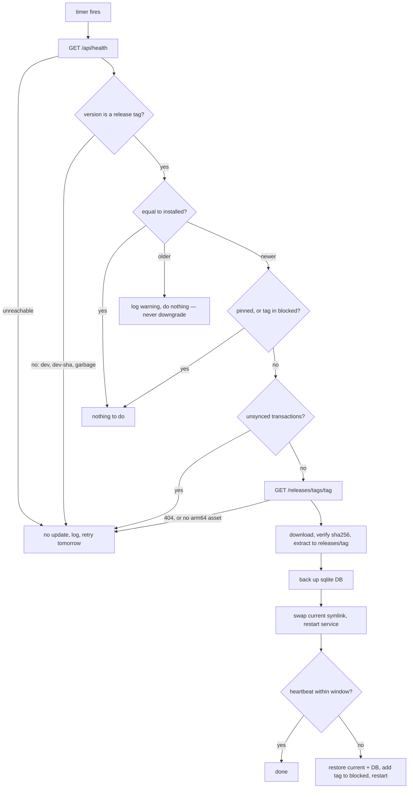

# ADR-0054: A Terminal Runs Its Backend's Version

**Status**: Accepted (amended 2026-09-06 — see *The window is part of the
argument, not a default*)

**Date**: 2026-09-06

**Deciders**: Architecture Team

---

## Context

Terminals are Flutter Linux apps on Raspberry Pi kiosks, and they are updated by
hand: build or download the arm64 tarball, rsync it to `/opt/clubbar-terminal/`,
restart. A club with three terminals in a room nobody visits between Tuesdays
updates them when somebody remembers to, which in practice means when something
is already wrong.

[#318](https://github.com/dgloeckner/clubbar/issues/318) asks for an unattended
mechanism: check nightly, install atomically, roll back automatically if the new
version is unhealthy. Four properties of this deployment constrain every option.

1. **Nobody is at the keyboard.** A Pi in a bar has no operator. An update that
   can leave the terminal needing a human has failed, because the human arrives
   at 19:00 on a Friday to a room full of people who want a beer.
2. **The terminal holds money that exists nowhere else.** Transactions are
   booked offline and synced later ([ADR-0033](./0033-terminal-sync-contract.md)).
   An update that loses the local sqlite database loses real purchases.
3. **One repository, one release.** The backend package
   (`clubbar-<tag>.zip`) and the terminal bundle
   (`clubbar-terminal-linux-arm64-<tag>.tar.gz`) are built from the same commit
   by the same workflow, and CI already writes the same tag into
   `backend/VERSION` and into the terminal's `APP_VERSION`. The two components
   are versioned together whether or not anything enforces it.
4. **The sync contract is not versioned.** There is no negotiation, no
   `Accept-Version`, no compatibility window. A terminal and a backend from
   different releases work together by luck, and the luck is untested: CI only
   ever exercises the pair built from one commit.

Property 4 is what turns "which version should a terminal install?" from an
ops preference into a correctness question. #318's original answer was the
GitHub `releases/latest` endpoint, with promoting a pre-release to stable as the
deliberate *bless for terminals* act. That answer has a club's terminals moving
on a schedule the club's backend knows nothing about — which is exactly the
untested pair, arrived at automatically, at 04:00, unattended.

## Decision

**A terminal runs exactly the version its backend reports. Upgrading the backend
is the single act that moves terminals; there is no second control.**

The invariant is equality, not "at most". `terminal < backend` is tolerated as a
transient — the hours between a backend upgrade and that night's update run, or
the aftermath of a rollback — and `terminal > backend` is never produced by this
system.

### Where the version comes from

`GET /api/health` already returns `version`, read from `backend/VERSION` by
`HealthCheckService`, and the terminal already fetches it
(`NetworkService.fetchBackendVersion()`, shown in the status modal). That field
is the target. There is no separate "terminal target version" field: two numbers
are two things to get wrong, and a club-wide pin — if one is ever wanted —
belongs beside the credit policy on `/sync/config` as its own decision.

`/api/health` is public and needs no token. That matters: the updater must work
when the app is dead, its credential has expired, or its sync has been failing
for a week.

### What the updater does

A shell script on the Pi, run by a systemd timer (`RandomizedDelaySec`,
`Persistent=true` so a terminal that was off catches up). It reads `apiUrl` from
`config.json`, curls `/api/health`, and compares against
`basename $(readlink current)`.



Five of those branches are refusals, and all five are **"no update", not an
error**. A terminal that skips a night has lost nothing; a terminal that updates
when it should not have is a bar that cannot sell beer.

Two refusals deserve their reasoning stated:

- **`dev` and `dev-<sha>` mean no update, ever.** A club self-hosting from git,
  or from a `main` build of the package, reports one of those forever. Its
  backend version is unknown, and an unknown ceiling is not an infinite ceiling
  — the same reading [ADR-0044](./0044-tiered-admin-roles.md) gives an
  unclassified route. That club hand-manages its backend and will hand-manage
  its terminals.
- **Never downgrade.** A backend rolled back to an older tag leaves the terminal
  ahead, violating the invariant, and the updater is the only thing that could
  fix it. It does not: moving backwards means running a sqlite migration
  backwards, and the pre-update backup that would make that safe is long gone.
  The updater's job is a *gate on updates*, not restoring an invariant somebody
  else broke. It logs and leaves it.

### A/B slots with an atomic switch

```
/opt/clubbar-terminal/
  releases/v0.2.0/             # each release fully self-contained
  releases/v0.2.1/
  current  -> releases/v0.2.1  # symlink, swapped atomically
  previous -> releases/v0.2.0  # rollback target
  blocked                      # versions that failed, never retried
```

The `current` symlink is the **single source of truth for what is installed**.
No `VERSION` file is baked into the bundle: a second copy can contradict the
directory it sits in, and the contradiction would be silent — an updater
confidently declining to update a terminal that is running something else. The
app keeps its compiled-in `APP_VERSION` for the idle screen and for the header
below, which is display and reporting, never the updater's input.

### The heartbeat is the only health criterion

The app runs as a systemd **user service**, which `INSTALL.md` §4 already
installs. That unit ships `Restart=always` with `StartLimitIntervalSec=0` —
restart rate limiting switched off, deliberately, because a kiosk should come
back up at 22:00 no matter what happened. So a restart count cannot be the
health signal: a terminal crash-looping forever never trips a limit that is
turned off.

Health is therefore one thing: within a bounded window of the swap, the app has
written its heartbeat — the file it touches once a **first sync round-trip
succeeds**. That covers the app that crash-looped and the app that came up
wedged with the same test, and it needs no change to the restart policy.

On failure: `current` goes back to `previous`, the sqlite backup is restored,
the tag is written to `blocked`, and the service restarts. Restoring the
database is safe because the run happens at night on an idle, synced terminal —
a version that never got healthy booked nothing.

### The window is part of the argument, not a default

> **Amended 2026-09-06 — the 04:00 window is load-bearing.** The sentence above
> rests on it and the original text did not say so, which left the impression
> that the schedule was a preference somebody could tune.

Restoring the pre-update database is safe *because* the run happens at night on
an idle, synced terminal. That is a premise, not a convenience, and a faster
cadence deletes it: an update landing at 14:00 on a Saturday restarts the till
mid-service and can then restore a backup taken minutes earlier, discarding
whatever was rung up in between.

The unsynced-transactions refusal narrows that window without closing it. It is
checked before the download, and a member can tap a card between the check and
the swap — so at 04:00 the gap is theoretical and during service it is a real
sale.

So **any cadence faster than nightly is a development override**, expressed as a
systemd drop-in, and deliberately *not* a `config.json` key. The two are not
equivalent conveniences. A drop-in is a file somebody had to sit down and
create, in a directory they had to know about; a configuration key sits in the
same file as `apiUrl` and `fullscreen`, where an operator copies it out of a
forum post without reading the paragraph that explains what it costs. The
asymmetry is the point: this setting should be available to whoever is
debugging the updater and awkward for everybody else.

This also settles the open question #318 raised about per-terminal update
windows: the answer is no, not because it is hard, but because the safety
argument above is only true in one of them.

### A blocked terminal waits for the next release

`blocked` plus exact-match has a consequence worth stating plainly: the only
version the terminal will ever consider is the one it just blacklisted, so it
stays on the old, working version and **does nothing until the backend moves to
a newer tag**. That is the intended behaviour — the club ships a fix, the
backend rolls forward under the same single-release policy, and the terminal
follows — but it means a terminal can silently stop updating for as long as the
backend stands still.

Which is why observability is not optional here.

### Terminals report their version

Every terminal-authenticated request carries `X-Terminal-Version`. The backend
records it on the `terminals` row beside `last_sync_at`, and the admin panel's
Terminals page shows it.

A header, not a sync-payload field, for two reasons: a terminal that syncs but
books nothing still reports, and the version is an attribute of the *terminal*,
not of a batch of transactions. It is **fail-open** — missing or unparseable
means record nothing, never refuse the sync. An old terminal must keep selling
drinks.

Three states have to be distinguishable on that page: current, behind, and
**stuck at `<tag>` after a failed update**. "Behind" alone is not an alarm — it
is the normal state of every terminal for a few hours after every backend
upgrade, and alarming on it trains the club to ignore it, the same reasoning the
empty-digest rule in `CLAUDE.md` applies to mail.

### A Release publishes both artifacts or neither

Today `test-package` (which uploads the backend ZIP) and `build-terminal` (which
uploads the terminal tarball) are independent jobs with no dependency between
them, each with its own `if: github.event_name == 'release'` upload step. A
release whose arm64 build fails still publishes a backend ZIP — and under this
ADR that points every terminal in every club at a tag with no tarball.

A `release-gate` job that both feed, and which performs both uploads, replaces
them. Not `test-package.needs: [build-terminal]`: that makes shipping the
backend hostage to an arm64 runner and inverts the dependency the project
actually wants. Publication becomes one act, which is what a **Release** means.

The updater's defensive "tag exists, no matching asset → no update" path stays
anyway. A guarantee in CI is not a guarantee on a Pi three months later.

## Consequences

### Positive

- **The untested pair cannot arise automatically.** The sync contract is
  unversioned and CI only tests one commit's pair; this makes that pair the only
  one a club can end up running by machine.
- **One control, held by the person who already holds it.** The admin who
  upgrades the backend has upgraded the terminals. There is no release to bless,
  no channel to choose, no per-terminal decision — and nothing to keep in sync
  between two mechanisms.
- **Backend-first is enforced, not documented.** The ordering that a
  schema-changing release requires is a property of the design rather than a
  sentence in a runbook.
- **The failure modes are all "nothing happened".** Unreachable backend,
  unparseable version, missing asset, unsynced transactions, blocked tag: five
  distinct conditions, one outcome, retried tomorrow.

### Negative

- **A terminal can stop updating indefinitely and only a screen says so.** A
  blocked tag with a stationary backend is a permanent freeze. Mitigation: the
  `X-Terminal-Version` reporting is required rather than nice-to-have, and the
  Terminals page must name the stuck state specifically.
- **Clubs deployed from git never auto-update their terminals.** `dev` is not a
  version. Mitigation: none, and none wanted — this is the fail-closed branch
  working.
- **Terminals cannot get a fix the backend does not also carry.** A
  terminal-only bug now needs a full release and a backend upgrade to reach the
  Pi. Mitigation: that is the same act the project already performs, and the
  single-release policy is what makes it cheap.
- **The invariant is enforced in one shell script on one Pi.** Nothing stops a
  hand-installed terminal from being newer than its backend. Mitigation:
  deliberately none — a backend that *refused* to sync a too-new terminal would
  turn version skew into a bar that cannot sell drinks, which is the wrong
  failure for a kiosk. It is reported, not enforced.
- **`/api/health` tells any passer-by the exact backend version** of a club's
  installation. This is true today and unchanged by this ADR, but the field
  becomes load-bearing, so it is now a thing that cannot be quietly removed.
  Tracked separately from #318.
- **A rollback leaves the terminal behind until the next release.** Accepted:
  running the last known-good version is better than retrying one that already
  failed.

## Alternatives considered

**Install the latest stable release** (#318's original requirement 2). The
release gate is GitHub's `releases/latest`, and promoting a pre-release to
stable is the act that blesses a version for terminals. Rejected: it moves
terminals independently of the backend, producing exactly the untested pair
property 4 warns about, and it puts the control in the release process rather
than in the hands of the club running the software. It also needs a second
concept — "stable" — that means nothing to the backend package.

**Install the newest stable release ≤ the backend's version.** Keeps
backend-first ordering while letting terminals take intermediate fixes.
Rejected: it needs `GET /releases` with pagination, it can select a release
nobody intended terminals to reach, and it re-introduces guessing about which
version a terminal *should* be on — the thing this ADR exists to remove.

**An in-app updater.** Flutter auto-update packages. Rejected: it couples update
failure to app health, so a broken app cannot repair itself, and an app cannot
cleanly replace its own running bundle.

**apt repository / Debian packaging.** Rejected: requires hosting and signing a
repository, rollback is worse than a symlink swap, and it is more infrastructure
than the project's modest-infrastructure principle wants.

**Mender / RAUC full-image A/B.** Industrially robust whole-image updates with
proven rollback. Rejected: it replaces the operating system's update story for a
club Pi running one Flutter binary. The cost is an order of magnitude above the
problem.

**A separate "terminal target version" field on the backend.** Would let a club
sit its terminals a release behind its backend deliberately. Rejected as
speculative: two numbers are two things to get wrong, and the per-terminal pin
in `config.json` already covers the case anybody has actually had.

## Related

- [#318](https://github.com/dgloeckner/clubbar/issues/318) — the epic this
  decides
- [ADR-0033](./0033-terminal-sync-contract.md) — the unversioned sync contract
- [ADR-0035](./0035-terminal-backend-instance-pairing.md) — which backend a
  terminal belongs to
- [ADR-0041](./0041-terminal-credential-anomaly-detection.md) — the
  terminal-authenticated requests that will carry the version header
- [ADR-0044](./0044-tiered-admin-roles.md) — the fail-closed reading applied to
  an unknown version
